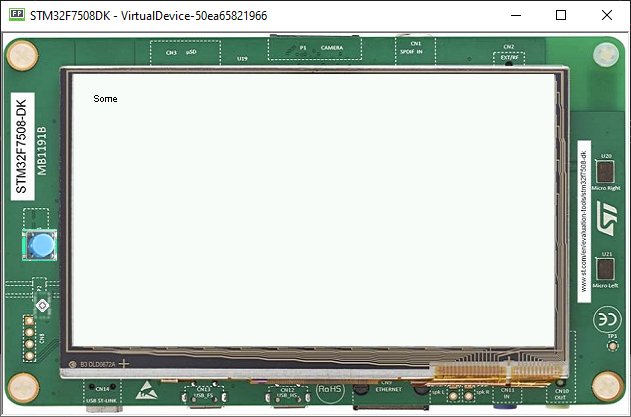

String Bounds Check on a Widget
===============================
The Issue
-------------

When creating an application, it may support multiple languages, some of those languages have words and phrases that may be bigger than first planned when creating an application

Extending a Widget
-------------------
To add a check on the size of the messages, the widgets drawing a String need to be extended or modified.
In this tutorial, the `Label` class will be extended by `MyLabel`.

.. code-block:: java

    public class MyLabel extends Label {

        public MyLabel(String txt) {
            super(txt);
        }

        @Override
        protected void onLaidOut() {

        }
    }

Overriding onLaidOut
--------------------
 
As soon as a widget is laid out (its position and size set) by its parent, its `onLaidOut()` method is called.
So, overriding this method is the best place to check whether or not the text fits.

Inside of the method, get the Font from the Style that the widget is using, and then, get the Font 

.. code-block:: java

    @Override
    protected void onLaidOut() {
        final Font font = getStyle().getFont();
        final String text = getText();
        final int stringWidth = font.stringWidth(text);
        final int contentWidth = getContentBounds().getWidth();
        if (stringWidth > contentWidth) {
            System.err.println("The text size is greater than the widget content width!");
        }
    }

Testing with a Canvas
--------------------
The check can be easily validated by putting the widget in a canvas and setting its bounds manually (a little shorter than the text size).
  
.. code-block:: java

    public static void main(String[] args) {
        MicroUI.start();
        Desktop desktop = new Desktop();
        Canvas canvas = new Canvas();
        canvas.addChild(new MyLabel("Teste"), 15, 0, 15, 10);
        desktop.setWidget(canvas);
        desktop.requestShow();
    }

The console should show this:

.. code-block:: console

    The text size is greater than the Widget content Width!

Improving the Bounds Check
----------------------------

To make the correction process easier, it's possible to indicate where the text is truncated.

.. code-block:: java

    @Override
    protected void onLaidOut() {
        final Font font = getStyle().getFont();
        final String text = getText();
        final int stringWidth = font.stringWidth(text);
        final int labelWidth = this.getContentBounds().getWidth();
        if (stringWidth > labelWidth) {
            for (int i = text.length() - 1; i >= 0; i--) {
                if (font.substringWidth(text, 0, i) <= labelWidth) {
                    System.out.println(text + "\" truncates after \"" + text.substring(0, i) + "\""); //$NON-NLS-1$ //$NON-NLS-2$
                    break;
                }

            }
        }
    }

This block of code can be also extracted to a helper class in order to be used in several Widgets.

.. code-block:: java

    public class LabelBoundsCheck {

    static void fits(final Font font, final String text, final int contentWidth) {
        if (Constants.getBoolean("myapp.debugtextsize")) {
            int stringWidth = font.stringWidth(text);
            if (stringWidth > contentWidth) {
                for (int i = text.length() - 1; i >= 0; i--) {
                    if (font.substringWidth(text, 0, i) <= contentWidth) {
                        System.out.println(text + "\" truncates after \"" + text.substring(0, i) + "\""); //$NON-NLS-1$ //$NON-NLS-2$
                        break;
                    }

                }
            }
        }
    }
    }

