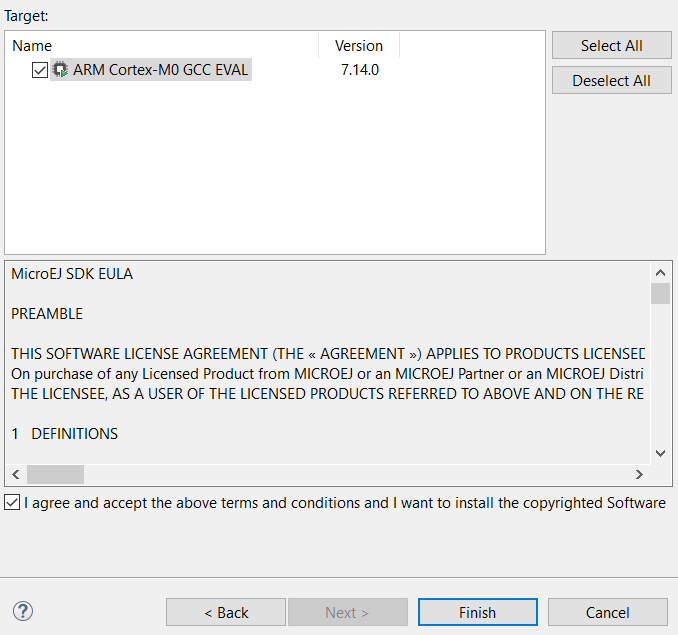
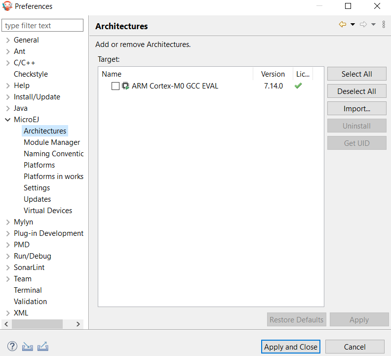

.. _create_firmware_from_scratch:

Create a MicroEJ Firmware From Scratch
======================================

This tutorial explains how to create a MicroEJ Firmware from scratch.
It goes trough the typical steps followed by a Firmware developer
integrating MicroEJ with a C Board Support Package (BSP) for a target
device.

In this tutorial, the target device is a a Luminary Micro Stellaris.
Though this device is no longer available on the market, it has two
advantages:

- The QEMU PC System emulator can emulate the device.
- FreeRTOS provides an official Demo BSP.

Consequently, no board is required to follow this tutorial. Everything
is emulated on the developer's PC.

The tutorial should take 1 hour to complete (excluding the
installation time of MicroEJ SDK and Windows Subsystem Linux (WSL)).

Intended Audience
-----------------

The audience for this document is Firmware engineers who want to
understand how MicroEJ is integrated to a C Board Support Package.

In addition, this tutorial should be of interest to all developers
wishing to familiarize themselves with the low level components of a
MicroEJ Firmware such as: :ref:`MicroEJ
Architecture<architecture_overview>`, :ref:`MicroEJ
Platform<new_platform_creation>`, :ref:`Low Level API<LLAPI-CHAPTER>`
and :ref:`BSP connection<bsp_connection>`.

Introduction
------------

The following steps are usually followed when starting a new project:

#. Pick a target device (that meets the requirements of the project).
#. Setup a RTOS and a toolchain that support the target device.
#. Adapt the RTOS port if needed.
#. Install a :ref:`MicroEJ Architecture<architecture_overview>` that
   matches the target device/RTOS/toolchain.
#. Setup a new :ref:`MicroEJ Platform<new_platform_creation>` connected to
   the Board Support Package (BSP).
#. Implement :ref:`Low Level API<LLAPI-CHAPTER>`.
#. Validate the resulting MicroEJ Platform with the `Platform
   Qualification Tools (PQT)
   <https://github.com/microej/PlatformQualificationTools>`_.
#. Develop the :ref:`MicroEJ Application
   <simulator_execution>`.

This tutorial describes step by step how to go from the FreeRTOS BSP
to a MicroEJ Application that runs on the MicroEJ Platform and prints
the classic ``"Hello, World!"``.

In this tutorial:

* The target device is a Luminary Micro Stellaris which is emulated by
  QEMU (`QEMU Stellaris boards
  <https://www.qemu.org/docs/master/system/arm/stellaris.html>`_).
* The RTOS is FreeRTOS and the toolchain is GNU CC fo ARM.

All modifications to FreeRTOS BSP made for this tutorial are available
at https://github.com/MicroEJ/FreeRTOS/tree/tuto-microej-firmware-from-scratch.

.. note::

  The implementation of the Low Level API and their validation with
  the `Platform Qualification Tools (PQT)
  <https://github.com/microej/PlatformQualificationTools>`_ will be
  the topic of another tutorial.

Prerequisites
-------------

* MicroEJ SDK version 5.1.0 or higher (distribution 19.05). Can be
  downloaded from https://developer.microej.com/ (`direct link
  <https://repository.microej.com/packages/SDK/19.05/MicroEJ-SDK-Installer-Win64-19.05.exe>`_)
* Windows 10 with Windows Subsystem for Linux (WSL). See the
  `installation guide
  <https://docs.microsoft.com/en-us/windows/wsl/install-win10>`_.
* A Linux distribution installed on WSL (Tested on Ubuntu 19.10 eoan
  and Ubuntu 20.04 focal).

    .. note::

      In WSL, use the command ``lsb_release -a`` to print the current Ubuntu version.

A code editor such as Visual Studio Code is also recommended to edit BSP files.

Overview
--------

The next sections describe step by step how to build a MicroEJ
Firmware that runs a HelloWorld MicroEJ Application on the emulated
device.

The steps to follow are:

#. Setup the development environment (assuming the prerequisites are
   satisfied).
#. Get a running BSP
#. Build the MicroEJ Platform
#. Create the HelloWorld MicroEJ Application
#. Implement the minimum Low Level API to run the application

This tutorial goes through trials and errors every Firmware developers
may encounter. It provides a solution after each error rather than
providing the full solution in one go.

Setup the Development Environment
---------------------------------

This section assumes the prerequisites have been properly installed.

In WSL:

#. Update apt's cache: ``sudo apt-get update``
#. Install qemu-system-arm and GNU CC toolchain for ARM: ``sudo
   apt-get install -y qemu-system-arm gcc-arm-none-eabi
   build-essential subversion``
#. The rest of this tutorial will use the folder
   ``src/tuto-from-scratch/`` in the Windows home folder.
#. Create the folder: ``mkdir -p
   /mnt/c/Users/${USER}/src/tuto-from-scratch`` (the ``-p`` option
   ensures all the directories are created).
#. Go into the folder: ``cd
   /mnt/c/Users/${USER}/src/tuto-from-scratch/``
#. Clone FreeRTOS and its submodules: ``git clone -b
   V10.3.1 --recursive https://github.com/FreeRTOS/FreeRTOS.git``
   (this may takes some time)

.. note::

  Use the right-click to paste from the Windows clipboard into WSL
  console. The right-click is also used to copy from the WSL console
  into the Windows clipboard.

Get Running BSP
---------------

This section presents how to get running BSP based on FreeRTOS that
boots on the target device.

#. Go into the target device sub-project: ``cd
   FreeRTOS/FreeRTOS/Demo/CORTEX_LM3S811_GCC``
#. Build the project: ``make``

   Ignoring the warnings, the following error appears during the link:

   .. code-block::

       CC    hw_include/osram96x16.c
       LD    gcc/RTOSDemo.axf
       arm-none-eabi-ld: section .text.startup LMA [0000000000002b24,0000000000002c8f] overlaps section .data LMA [0000000000002b24,0000000000002b27]
       make: *** [makedefs:191: gcc/RTOSDemo.axf] Error 1

   Insert the following fixes in the linker script file named
   ``standalone.ld`` (thanks to
   http://roboticravings.blogspot.com/2018/07/freertos-on-cortex-m3-with-qemu.html).

   .. note::

      WSL can start the editor Visual Studio Code. type ``code .`` in WSL. ``.`` represents the current directory in Unix.
   
   .. code-block:: diff
       :caption: https://github.com/MicroEJ/FreeRTOS/commit/48248eae13baebf7df9638cd8da6fbfe1a735a9c

       diff --git a/FreeRTOS/Demo/CORTEX_LM3S811_GCC/standalone.ld b/FreeRTOS/Demo/CORTEX_LM3S811_GCC/standalone.ld
       --- a/FreeRTOS/Demo/CORTEX_LM3S811_GCC/standalone.ld
       +++ b/FreeRTOS/Demo/CORTEX_LM3S811_GCC/standalone.ld
       @@ -42,7 +42,15 @@ SECTIONS
                _etext = .;
            } > FLASH

       -    .data : AT (ADDR(.text) + SIZEOF(.text))
       +    .ARM.exidx :
       +    {
       +        *(.ARM.exidx*)
       +        *(.gnu.linkonce.armexidx.*)
       +    } > FLASH
       +
       +    _begin_data = .;
       +
       +    .data : AT ( _begin_data )
            {
                _data = .;
                *(vtable)

   This is the output of the ``git diff`` command. Lines starting with
   a ``-`` should be removed. Lines starting with a ``+`` should be
   added.

   .. note::

       The ``patch(1)`` can be used to apply the patch. Assuming WSL shell is in ``FreeRTOS/Demo/CORTEX_LM3S811_GCC`` directory:

       #. Install dos2unix utility: ``sudo apt install dos2unix``
       #. Convert all files to unix line-ending: ``find -type f -exec
          dos2unix {} \;``
       #. Copy the content of the code block in a file named
          ``linker.patch`` (every lines of the code block must be
          copied in the file).
       #. Apply the patch: ``patch -l -p4 < linker.patch``.

       It is also possible to paste the diff directly into the
       console:

       #. In WSL, invoke ``patch -l -p4``. The command starts, waiting
          for input on stdin (the standard input).
       #. Copy the diff and paste it in WSL
       #. Press enter
       #. Press ``Ctrl-d Ctrl-d`` (press the ``Control`` key + the letter ``d`` twice).

#. Run the build again: ``make``
#. Run the emulator with the generated kernel: ``qemu-system-arm -M
   lm3s811evb -nographic -kernel gcc/RTOSDemo.bin``

   The following error appears and then nothing:

   .. code-block::

       ssd0303: error: Unknown command: 0x80
       ssd0303: error: Unexpected byte 0xe3
       ssd0303: error: Unknown command: 0x80
       ssd0303: error: Unexpected byte 0xe3
       ssd0303: error: Unknown command: 0x80
       ssd0303: error: Unexpected byte 0xe3
       ssd0303: error: Unknown command: 0x80
       ssd0303: error: Unexpected byte 0xe3
       ssd0303: error: Unknown command: 0x80
       ssd0303: error: Unexpected byte 0xe3
       ssd0303: error: Unknown command: 0x80
       ssd0303: error: Unexpected byte 0xe3
       ssd0303: error: Unknown command: 0x80
       ssd0303: error: Unexpected byte 0xe3
       ssd0303: error: Unknown command: 0x80
       ssd0303: error: Unexpected byte 0xe3
       ssd0303: error: Unknown command: 0x80
       ssd0303: error: Unexpected byte 0xe3

#. Press ``Ctrl-a x`` (press ``Control`` + the letter ``a``, release,
   press ``x``) to the end the QEMU session. The session ends with
   ``QEMU: Terminated``.

   .. note::

     The errors can be safely ignored. They occur because the OLED
     controller emulated receive incorrect commands.

At this point, the target device is successfully booted with the
FreeRTOS kernel.

FreeRTOS Hello World
--------------------

This section describes how to configure the BSP to print text on the
QEMU console.

The datasheet of the target device (`LM3S811 datasheet
<https://www.ti.com/lit/ds/symlink/lm3s811.pdf>`_) describes how to use
the UART device and an example implementation for QEMU is available
`here
<https://github.com/dwelch67/qemu_arm_samples/blob/master/cortex-m/uart01/notmain.c>`_).

Here is the patch that implements ``putchar(3)`` and ``puts(3)`` and prints
``Hello World``.

.. code-block:: diff
    :caption: https://github.com/MicroEJ/FreeRTOS/commit/d09ec0f5cbdf69ca97a5ac15f8b905538aa4c61e

    diff --git a/FreeRTOS/Demo/CORTEX_LM3S811_GCC/main.c b/FreeRTOS/Demo/CORTEX_LM3S811_GCC/main.c
    --- a/FreeRTOS/Demo/CORTEX_LM3S811_GCC/main.c
    +++ b/FreeRTOS/Demo/CORTEX_LM3S811_GCC/main.c
    @@ -134,9 +134,25 @@ SemaphoreHandle_t xButtonSemaphore;
     QueueHandle_t xPrintQueue;
     
     /*-----------------------------------------------------------*/
    +#define UART0BASE ((volatile int*) 0x4000C000)
    +
    +int putchar (int c){
    +    (*UART0BASE) = c;
    +    return c;
    +}
    +
    +int puts(const char *s) {
    +    while (*s) {
    +        putchar(*s);
    +        s++;
    +    }
    +    return putchar('\n');
    +}
     
     int main( void )
     {
    +    puts("Hello, World! puts function is working.");
    +
     	/* Configure the clocks, UART and GPIO. */
     	prvSetupHardware();

Rebuild and run the newly generated kernel: ``make &&
qemu-system-arm -M lm3s811evb -nographic -kernel gcc/RTOSDemo.bin``
(press ``Ctrl-a x`` to interrupt the emulator).

.. code-block::

    make: Nothing to be done for 'all'.
    Hello, World! puts function is working.
    ssd0303: error: Unknown command: 0x80
    ssd0303: error: Unexpected byte 0xe3
    ssd0303: error: Unknown command: 0x80
    ssd0303: error: Unexpected byte 0xe3
    ssd0303: error: Unknown command: 0x80
    ssd0303: error: Unexpected byte 0xe3
    ssd0303: error: Unknown command: 0x80
    ssd0303: error: Unexpected byte 0xe3
    ssd0303: error: Unknown command: 0x80
    ssd0303: error: Unexpected byte 0xe3
    ssd0303: error: Unknown command: 0x80
    ssd0303: error: Unexpected byte 0xe3
    ssd0303: error: Unknown command: 0x80
    ssd0303: error: Unexpected byte 0xe3
    ssd0303: error: Unknown command: 0x80
    ssd0303: error: Unexpected byte 0xe3
    ssd0303: error: Unknown command: 0x80
    ssd0303: error: Unexpected byte 0xe3
    QEMU: Terminated

With this two functions implemented, ``printf(3)`` is also available.

.. code-block:: diff
    :caption: https://github.com/MicroEJ/FreeRTOS/commit/1f7e7ee014754a4dcb4f6c5a470205e02f6ac3c8

    diff --git a/FreeRTOS/Demo/CORTEX_LM3S811_GCC/main.c b/FreeRTOS/Demo/CORTEX_LM3S811_GCC/main.c
    --- a/FreeRTOS/Demo/CORTEX_LM3S811_GCC/main.c
    +++ b/FreeRTOS/Demo/CORTEX_LM3S811_GCC/main.c
    @@ -149,9 +149,11 @@ int puts(const char *s) {
            return putchar('\n');
     }

    +#include <stdio.h>
    +
     int main( void )
     {
    -       puts("Hello, World! puts function is working.");
    +       printf("Hello, World! printf function is working.\n");

            /* Configure the clocks, UART and GPIO. */
            prvSetupHardware();

At this point, the character output on the UART is implemented in the
FreeRTOS BSP. The next step is to create the MicroEJ Platform
and MicroEJ Application.

Create a MicroEJ Platform
-------------------------

This section describes how to create and configure a MicroEJ Platform
compatible with the FreeRTOS BSP and GCC toolchain.

* A MicroEJ Architecture is a software package that includes the
  :ref:`MicroEJ Runtime<mjvm_javalanguage>` port to a specific target
  Instruction Set Architecture (ISA) and C compiler. It contains a set
  of libraries, tools and C header files. The MicroEJ Architectures
  are provided by MicroEJ SDK.
* A MicroEJ Platform is a port of a MicroEJ Architecture for a custom
  device. It contains the MicroEJ configuration and the BSP (C source
  files).

When selecting a MicroEJ Architecture, special care must be taken to
ensure the compatibility between the toolchain used in the BSP and the
toolchain used to build the MicroEJ Core Engine included in the
MicroEJ Architecture.

The list of MicroEJ Architectures supported is listed at
https://docs.microej.com/en/latest/PlatformDeveloperGuide/appendix/toolchain.html.
MicroEJ Evaluation Architectures provided by MicroEJ Corp. can be
downloaded from `MicroEJ Architectures Repository
<https://repository.microej.com/architectures/com/microej/architecture/>`_.

There is no ``CM3`` in MicroEJ Architectures Repository and the Arm®
Cortex®-M3 MCU is not mentioned in the :ref:`capabilities
matrix<appendix_matrixcapabilities>`. This means that the MicroEJ
Architectures for Arm® Cortex®-M3 MCUs are no longer distributed for
evaluation. Download the latest MicroEJ Architecture for Arm®
Cortex®-M0 instead (the Arm® architectures are binary upward
compatible from Arm®v6-M (Cortex®-M0) to Arm®v7-M (Cortex®-M3)).

Import the MicroEJ Architecture
~~~~~~~~~~~~~~~~~~~~~~~~~~~~~~~

This step describes how to import a :ref:`MicroEJ Architecture
<architecture_import>`.

#. Start MicroEJ SDK on an empty workspace. For example, create an
   empty folder ``workspace`` next to the ``FreeRTOS`` git folder and
   select it.
#. Keep the default MicroEJ Repository
#. Download the latest MicroEJ Architecture for Arm® Cortex®-M0
   instead: https://repository.microej.com/architectures/com/microej/architecture/CM0/CM0_GCC48/flopi0G22/7.14.0/flopi0G22-7.14.0-eval.xpf
#. Import the MicroEJ Architecture in MicroEJ SDK

   #. :guilabel:`File` > :guilabel:`Import` > :guilabel:`MicroEJ` >
      :guilabel:`Architectures`
   #. select the MicroEJ Architecture file downloaded
   #. Accept the license and click on :guilabel:`Finish`

Install an Evaluation License
~~~~~~~~~~~~~~~~~~~~~~~~~~~~~

This step describes how to create and activate an :ref:`Evaluation
License <evaluation_license>` for the MicroEJ
Architecture previously imported.

#. Select the :guilabel:`Window` > :guilabel:`Preferences` >
   :guilabel:`MicroEJ` > :guilabel:`Architectures menu`.
#. Click on the architectures and press :guilabel:`Get UID`.
#. Copy the UID. It will be needed when requesting a license.
#. Go to https://license.microej.com.
#. Click on :guilabel:`Create a new account` link.
#. Create an account with a valid email address. A confirmation email
   will be sent a few minutes after. Click on the confirmation link in
   the email and login with the account.
#. Click on :guilabel:`Activate a License`.
#. Set Product ``P/N:`` to ``9PEVNLDBU6IJ``.
#. Set ``UID:`` to the UID generated before.
#. Click on :guilabel:`Activate`.

   * The license is being activated. An activation mail should be
     received in less than 5 minutes. If not, please contact
     contact :ref:`our support team <get_support>`.
   * Once received by email, save the attached zip file that contains
     the activation key.

#. Go back to Microej SDK.
#. Select the :guilabel:`Window` > :guilabel:`Preferences` >
   :guilabel:`MicroEJ` menu.
#. Press :guilabel:`Add...`.
#. Browse the previously downloaded activation key archive file.
#. Press :guilabel:`OK`. A new license is successfully installed.
#. Go to :guilabel:`Architectures` sub-menu and check that all
   architectures are now activated (green check).
#. Microej SDK is successfully activated.

Create the MicroEJ Platform
~~~~~~~~~~~~~~~~~~~~~~~~~~~

This step describes how to create a new :ref:`MicroEJ Platform
<new_platform_creation>` using the MicroEJ Architecture previously
imported.

#. Select :guilabel:`File` > :guilabel:`New` > :guilabel:`MicroEJ
   Platform Project`.
#. Ensure the :guilabel:`Architecture` selected is the MicroEJ
   Architecture previously imported.
#. Ensure the :guilabel:`Create from a platform reference
   implementation` box is unchecked.
#. Click on :guilabel:`Next` button.
#. Fill the fields:

    * Set ``Device:`` to ``lm3s811evb``
    * Set ``Name:`` to ``Tuto``

Setup the MicroEJ Platform
~~~~~~~~~~~~~~~~~~~~~~~~~~

This step describes how to configure the MicroEJ Platform previously created. 
For more information on this topic, please refer to :ref:`platform_configuration_creation`.

The `Platform Configuration Additions
<https://github.com/MicroEJ/PlatformQualificationTools/tree/master/framework/platform>`_
provide a flexible way to configure the :ref:`BSP connection
<bsp_connection>` between the MicroEJ Platform and MicroEJ Application
to the BSP. In this tutorial, the Partial BSP connection is used. That
is, the MicroEJ SDK will output all MicroEJ files (C headers, MicroEJ
Application ``microejapp.o``, MicroEJ Runtime ``microejruntime.a``,
...) in a location known by the BSP. The BSP is configured to compile
and link with those files.

For this tutorial, that means that the final binary is produced by
invoking ``make`` in the FreeRTOS BSP.

#. Install the Platform Configuration Additions by copying all the
   files within the ``content``
   `folder <https://github.com/MicroEJ/PlatformQualificationTools/tree/master/framework/platform/content>`_
   in the MicroEJ Platform folder.

   .. image:: images/tuto_microej_fw_from_scratch_add_platform_configuration_additions.PNG

   |

   .. note::

     The ``content`` directory contains files that must be installed
     in a MicroEJ Platform configuration directory (the directory that
     contains the ``.platform`` file). It can be automatically
     downloaded using the following command line:

     .. code-block:: console

       svn export --force https://github.com/MicroEJ/PlatformQualificationTools/trunk/framework/platform/content [path_to_platform_configuration_directory]

#. Edit the file ``bsp/bsp.properties`` as follow:

   .. code-block:: properties

     # Specify the MicroEJ Application file ('microejapp.o') parent directory.
     # This is a '/' separated directory relative to 'bsp.root.dir'.
     microejapp.relative.dir=microej/lib

     # Specify the MicroEJ Platform runtime file ('microejruntime.a') parent directory.
     # This is a '/' separated directory relative to 'bsp.root.dir'.
     microejlib.relative.dir=microej/lib

     # Specify MicroEJ Platform header files ('*.h') parent directory.
     # This is a '/' separated directory relative to 'bsp.root.dir'.
     microejinc.relative.dir=microej/inc
	 
#. Edit the file ``modules.ivy`` and add the MicroEJ Architecture as a dependency:

   .. code-block:: XML

	 <dependencies>
		<dependency org="com.microej.architecture.CM0.CM0_GCC48" name="flopi0G22" rev="7.14.0">
			<artifact name="flopi0G22" m:classifier="${com.microej.platformbuilder.architecture.usage}" ext="xpf"/>
		</dependency>
	 </dependencies>
		 
#. Edit the file ``modules.properties`` and set the MicroEJ platform filename:

   .. code-block:: properties

	 # Platform configuration file (relative to this project).
	 com.microej.platformbuilder.platform.filename=Tuto.platform

#. Right-click on the platform project and click on ``Build Module``. 

#. The following message appears in the console:

.. code-block:: none

	module-platform:report:
		 [echo]     ============================================================================================================
		 [echo]     Platform has been built in this directory 'C:\Users\user\src\tuto-from-scratch\workspace/lm3s811evb-Platform-CM0_GCC48-0.0.1'.
		 [echo]     To import this project in your MicroEJ SDK workspace (if not already available):
		 [echo]      - Select 'File' > 'Import...' > 'General' > 'Existing Projects into Workspace' > 'Next'
		 [echo]      - Check 'Select root directory' and browse 'C:\Users\user\src\tuto-from-scratch\workspace/lm3s811evb-Platform-CM0_GCC48-0.0.1' > 'Finish'
		 [echo]     ============================================================================================================

	BUILD SUCCESSFUL

#. Follow the instructions to import the generated platform in the workspace: 

   .. image:: images/tuto_microej_fw_from_scratch_build_platform.png

At this point, the MicroEJ Platform is ready to be used to build
MicroEJ Applications.

Create MicroEJ Application HelloWorld
-------------------------------------

#. Select :guilabel:`File` > :guilabel:`New` > :guilabel:`MicroEJ
   Standalone Application Project`.
#. Set the name to ``HelloWorld`` and click on :guilabel:`Finish`

   .. image:: images/tuto_microej_fw_from_scratch_new_microej_application_project.PNG

#. Run the application in Simulator to ensure it is working properly.
   Right-click on HelloWorld project > :guilabel:`Run as` >
   :guilabel:`MicroEJ Application`

   .. image:: images/tuto_microej_fw_from_scratch_run_as_microej_application.PNG

The following message appears in the console:

.. code-block::

  =============== [ Initialization Stage ] ===============
  =============== [ Launching on Simulator ] ===============
  Hello World!
  =============== [ Completed Successfully ] ===============

  SUCCESS

Configure BSP Connection in MicroEJ Application
-----------------------------------------------

This step describes how to configure the :ref:`BSP
connection<bsp_connection>` for the HelloWorld MicroEJ Application and
how to build the MicroEJ Application that will run on the target
device.

For a MicroEJ Application, the BSP connection is configured in the
``PROJECT-NAME/build/common.properties`` file.

#. Create a file ``HelloWorld/build/emb.properties`` with the
   following content:

   .. code-block:: properties

     core.memory.immortal.size=0
     core.memory.javaheap.size=1024
     core.memory.threads.pool.size=4
     core.memory.threads.size=1
     core.memory.thread.max.size=4
     deploy.bsp.microejapp=true
     deploy.bsp.microejlib=true
     deploy.bsp.microejinc=true
     deploy.bsp.root.dir=[absolute_path] to FreeRTOS\\FreeRTOS\\Demo\\CORTEX_LM3S811_GCC

   .. note::

     Assuming the WSL current directory is
     ``FreeRTOS/FreeRTOS/Demo/CORTEX_LM3S811_GCC``, use the following
     command to find the ``deploy.bsp.root.dir`` path with proper
     escaping:

     .. code-block:: shell

       pwd | sed -e 's|/mnt/c/|C:\\\\|' -e 's|/|\\\\|g'

#. Open :guilabel:`Run` > :guilabel:`Run configurations...`
#. Select the HelloWorld launcher configuration

   .. image:: images/tuto_microej_fw_from_scratch_run_configurations.PNG

#. Select :guilabel:`Execution` tab.
#. Change the execution mode from :guilabel:`Execute on Simulator` to
   :guilabel:`Execute on Device`.
#. Add the file ``build/emb.properties`` to the options files

   .. image:: images/tuto_microej_fw_from_scratch_run_configurations_execute_on_device.PNG

#. Click on :guilabel:`Run`

.. code-block::

  =============== [ Initialization Stage ] ===============
  Platform connected to BSP location 'C:\Users\user\src\tuto-from-scratch\FreeRTOS\FreeRTOS\Demo\CORTEX_LM3S811_GCC' using application option 'deploy.bsp.root.dir'.
  =============== [ Launching SOAR ] ===============
  =============== [ Launching Link ] ===============
  =============== [ Deployment ] ===============
  MicroEJ files for the 3rd-party BSP project are generated to 'C:\Users\user\src\tuto-from-scratch\workspace\HelloWorld\com.mycompany.Main\platform'.
  The MicroEJ application (microejapp.o) has been deployed to: 'C:\Users\user\src\tuto-from-scratch\FreeRTOS\FreeRTOS\Demo\CORTEX_LM3S811_GCC\microej\lib'.
  The MicroEJ platform library (microejruntime.a) has been deployed to: 'C:\Users\user\src\tuto-from-scratch\FreeRTOS\FreeRTOS\Demo\CORTEX_LM3S811_GCC\microej\lib'.
  The MicroEJ platform header files (*.h) have been deployed to: 'C:\Users\user\src\tuto-from-scratch\FreeRTOS\FreeRTOS\Demo\CORTEX_LM3S811_GCC\microej\inc'.
  =============== [ Completed Successfully ] ===============

  SUCCESS

At this point, the HelloWorld MicroEJ Application is built and
deployed in the FreeRTOS BSP.

MicroEJ and FreeRTOS Integration
--------------------------------

This section describes how to finalize the integration between MicroEJ
and FreeRTOS to get a working firmware that runs the HelloWorld
MicroEJ Application built previously.

In the previous section, when the MicroEJ Application was built,
several files were added to a new folder named ``microej/``.

.. code-block::

  $ pwd
  /mnt/c/Users/user/src/tuto-from-scratch/FreeRTOS/FreeRTOS/Demo/CORTEX_LM3S811_GCC
  $ tree microej/
  microej/
  ├── inc
  │   ├── BESTFIT_ALLOCATOR.h
  │   ├── BESTFIT_ALLOCATOR_impl.h
  │   ├── LLBSP_impl.h
  │   ├── LLMJVM.h
  │   ├── LLMJVM_MONITOR_impl.h
  │   ├── LLMJVM_impl.h
  │   ├── LLTRACE_impl.h
  │   ├── MJVM_MONITOR.h
  │   ├── MJVM_MONITOR_types.h
  │   ├── intern
  │   │   ├── BESTFIT_ALLOCATOR.h
  │   │   ├── BESTFIT_ALLOCATOR_impl.h
  │   │   ├── LLBSP_impl.h
  │   │   ├── LLMJVM.h
  │   │   ├── LLMJVM_impl.h
  │   │   └── trace_intern.h
  │   ├── sni.h
  │   └── trace.h
  └── lib
      ├── microejapp.o
      └── microejruntime.a

  3 directories, 19 files

- The ``microej/lib`` folder contains the HelloWorld MicroEJ
  Application object file (``microejapp.o``) and the MicroEJ Runtime.
  The final binary must be linked with these two files.
- The ``microej/inc`` folder contains several C header files used to
  expose MicroEJ Low Level APIs. The functions defined in files ending
  with the ``_impl.h`` suffix should be implemented by the BSP.

To summarize, the following steps remain to complete the integration
between MicroEJ and the FreeRTOS BSP:

- Implement minimal Low Level APIs
- Invoke the MicroEJ Core Engine
- Build and link the firmware with the MicroEJ Runtime and MicroEJ Application

Minimal Low Level APIs
~~~~~~~~~~~~~~~~~~~~~~

The purpose of this tutorial is to demonstrate how to develop a
minimal MicroEJ Architecture, it is not to develop a complete MicroEJ
Architecture. Therefore this tutorial implements only the required
functions and provides stub implementation for unused features. For
example, the following implementation does not support scheduling.

The two headers that must be implemented are ``LLBSP_impl.h`` and
``LLMJVM_impl.h``.

#. In the BSP, create a folder named ``microej/src`` (next to the
   ``microej/lib`` and ``microej/inc`` folders).
#. Implement ``LLBSP_impl.h`` in ``LLBSP.c``:

   .. code-block:: c
     :caption: microej/src/LLBSP.c

     #include "LLBSP_impl.h"

     extern void _etext(void);
     uint8_t LLBSP_IMPL_isInReadOnlyMemory(void* ptr)
     {
       return ptr < &_etext;
     }

     /**
      * Writes the character <code>c</code>, cast to an unsigned char, to stdout stream.
      * This function is used by the default implementation of the Java <code>System.out</code>.
      */
     void LLBSP_IMPL_putchar(int32_t c)
     {
       putchar(c);
     }

   * The implementation of ``LLBSP_IMPL_putchar`` reuses the
     ``putchar`` implemented previously.
   * The ``rodata`` section is defined in the linker script
     ``standalone.ld``. The flash memory starts at 0 and the end of
     the section is stored in the ``_etex`` symbol.

#. Implement ``LLMJVM_impl.h`` in ``LLMJVM_stub.c`` (all functions are
   stubbed with a dummy implementation):

   .. code-block:: c
     :caption: microej/src/LLMJVM_stub.c

     #include "LLMJVM_impl.h"

     int32_t LLMJVM_IMPL_initialize()
     {
             return LLMJVM_OK;
     }

     int32_t LLMJVM_IMPL_vmTaskStarted()
     {
             return LLMJVM_OK;
     }

     int32_t LLMJVM_IMPL_scheduleRequest(int64_t absoluteTime)
     {
             return LLMJVM_OK;
     }

     int32_t LLMJVM_IMPL_idleVM()
     {
             return LLMJVM_OK;
     }

     int32_t LLMJVM_IMPL_wakeupVM()
     {
             return  LLMJVM_OK;
     }

     int32_t LLMJVM_IMPL_ackWakeup()
     {
             return LLMJVM_OK;
     }

     int32_t LLMJVM_IMPL_getCurrentTaskID()
     {
             return (int32_t) 123456;
     }

     void LLMJVM_IMPL_setApplicationTime(int64_t t)
     {

     }

     int64_t LLMJVM_IMPL_getCurrentTime(uint8_t system)
     {
        return 0;
     }

     int64_t LLMJVM_IMPL_getTimeNanos()
     {
             return 0;
     }

     int32_t LLMJVM_IMPL_shutdown(void)
     {
             return LLMJVM_OK;
     }

The ``microej`` folder in the BSP has the following structure:

.. code-block:: shell

  $ pwd
  /mnt/c/Users/user/src/tuto-from-scratch/FreeRTOS/FreeRTOS/Demo/CORTEX_LM3S811_GCC
  $ tree microej/
  microej/
  ├── inc
  │   ├── BESTFIT_ALLOCATOR.h
  │   ├── BESTFIT_ALLOCATOR_impl.h
  │   ├── LLBSP_impl.h
  │   ├── LLMJVM.h
  │   ├── LLMJVM_MONITOR_impl.h
  │   ├── LLMJVM_impl.h
  │   ├── LLTRACE_impl.h
  │   ├── MJVM_MONITOR.h
  │   ├── MJVM_MONITOR_types.h
  │   ├── intern
  │   │   ├── BESTFIT_ALLOCATOR.h
  │   │   ├── BESTFIT_ALLOCATOR_impl.h
  │   │   ├── LLBSP_impl.h
  │   │   ├── LLMJVM.h
  │   │   ├── LLMJVM_impl.h
  │   │   └── trace_intern.h
  │   ├── sni.h
  │   └── trace.h
  ├── lib
  │   ├── microejapp.o
  │   └── microejruntime.a
  └── src
      ├── LLBSP.c
      └── LLMJVM_stub.c
  
  4 directories, 21 files

Invoke MicroEJ Core Engine
~~~~~~~~~~~~~~~~~~~~~~~~~~

The MicroEJ Core Engine is created and initialized with the C function
``SNI_createVM``. Then it is started and executed in the current RTOS
task by calling ``SNI_startVM``. The function ``SNI_startVM`` returns
when the MicroEJ Application exits. Both functions are declared in the
C header ``sni.h``.

.. code-block:: diff
    :caption: https://github.com/MicroEJ/FreeRTOS/commit/7ae8e79f9c811621569ccb90c46b1dcda91da35d

    diff --git a/FreeRTOS/Demo/CORTEX_LM3S811_GCC/main.c b/FreeRTOS/Demo/CORTEX_LM3S811_GCC/main.c
    --- a/FreeRTOS/Demo/CORTEX_LM3S811_GCC/main.c
    +++ b/FreeRTOS/Demo/CORTEX_LM3S811_GCC/main.c
    @@ -150,11 +150,14 @@ int puts(const char *s) {
     }
     
     #include <stdio.h>
    +#include "sni.h"
     
     int main( void )
     {
            printf("Hello, World! printf function is working.\n");
     
    +       SNI_startVM(SNI_createVM(), 0, NULL);
    +
     	/* Configure the clocks, UART and GPIO. */
     	prvSetupHardware();
     

Build and Link the Firmware with the MicroEJ Runtime and MicroEJ Application
~~~~~~~~~~~~~~~~~~~~~~~~~~~~~~~~~~~~~~~~~~~~~~~~~~~~~~~~~~~~~~~~~~~~~~~~~~~~

To build and link the firmware with the MicroEJ Runtime and MicroEJ
Application, the BSP port must be modified to:

#. Use the MicroEJ header files in folder ``microej/inc``
#. Use the source files folder ``microej/src`` that contains the Low
   Level API implementation ``LLBSP.c`` and ``LLMJVM_stub.c``
#. Compile and link ``LLBSP.o`` and ``LLMJVM_stub.o``
#. Link with MicroEJ Application (``microej/lib/microejapp.o``) and
   MicroEJ Runtime (``microej/lib/microejruntime.a``)

The following patch updates the BSP port ``Makefile`` to do it:

.. code-block:: diff
  :caption: https://github.com/FreeRTOS/FreeRTOS/commit/257d9e1d123be0342029e2930c0073dd5a4a2b2d
	
  --- a/FreeRTOS/Demo/CORTEX_LM3S811_GCC/Makefile
  +++ b/FreeRTOS/Demo/CORTEX_LM3S811_GCC/Makefile
  @@ -29,8 +29,10 @@ RTOS_SOURCE_DIR=../../Source
   DEMO_SOURCE_DIR=../Common/Minimal

   CFLAGS+=-I hw_include -I . -I ${RTOS_SOURCE_DIR}/include -I ${RTOS_SOURCE_DIR}/portable/GCC/ARM_CM3 -I ../Common/include -D GCC_ARMCM3_LM3S102 -D inline=
  +CFLAGS+= -I microej/inc

   VPATH=${RTOS_SOURCE_DIR}:${RTOS_SOURCE_DIR}/portable/MemMang:${RTOS_SOURCE_DIR}/portable/GCC/ARM_CM3:${DEMO_SOURCE_DIR}:init:hw_include
  +VPATH+= microej/src

   OBJS=${COMPILER}/main.o        \
            ${COMPILER}/list.o    \
  @@ -44,9 +46,12 @@ OBJS=${COMPILER}/main.o      \
            ${COMPILER}/semtest.o \
            ${COMPILER}/osram96x16.o

  +OBJS+= ${COMPILER}/LLBSP.o ${COMPILER}/LLMJVM_stub.o
  +
   INIT_OBJS= ${COMPILER}/startup.o

   LIBS= hw_include/libdriver.a
  +LIBS+= microej/lib/microejruntime.a microej/lib/microejapp.o

Then build the firmware with ``make``. The following error occurs at
link time.

.. code-block::

    CC    microej/src/LLMJVM_stub.c
    LD    gcc/RTOSDemo.axf                                                                                                                                                                                                                     arm-none-eabi-ld: error: microej/lib/microejruntime.a(sni_vm_startup_greenthread.o) uses VFP register arguments, gcc/RTOSDemo.axf does not
  arm-none-eabi-ld: failed to merge target specific data of file microej/lib/microejruntime.a(sni_vm_startup_greenthread.o)
  arm-none-eabi-ld: gcc/RTOSDemo.axf section `ICETEA_HEAP' will not fit in region `SRAM'
  arm-none-eabi-ld: region `SRAM' overflowed by 4016 bytes
  microej/lib/microejapp.o: In function `_java_internStrings_end':

The RAM requirements of the BSP (with printf), FreeRTOS, the MicroEJ
Application and MicroEJ Runtime do not fit in the 8k of SRAM. It is
possible to link within 8k of RAM by customizing a :ref:`MicroEJ Tiny
Application<core-tiny>` on a baremetal device (without a RTOS) but
this is not the purpose of this tutorial.

Instead, this tutorial will switch to another device, the Luminary
Micro Stellaris LM3S6965EVB. This device is almost identical as the
LM3S811EVB but it has 256k of flash memory and 64k of SRAM. Updating
the values in the linker script ``standalone.ld`` is sufficient to
create a valid BSP port for this device.

Instead of continuing to work with the LM3S811 port, create a copy,
named CORTEX_LM3S6965_GCC:

.. code-block:: shell

  $ cd ..
  $ pwd
  /mnt/c/Users/user/src/tuto-from-scratch/FreeRTOS/FreeRTOS/Demo
  $ cp -r CORTEX_LM3S811_GCC/ CORTEX_LM3S6965_GCC
  $ cd CORTEX_LM3S6965_GCC

The BSP path defined by the property ``deploy.bsp.root.dir`` in the
MicroEJ Application must be updated as well.

The rest of the tutorial assumes that everything is done in the
``CORTEX_LM3S6965_GCC`` folder.

Then update the linker script ``standlone.ld``:

.. code-block:: diff
  :caption: https://github.com/MicroEJ/FreeRTOS/commit/0e2e31d8a510d37178c340051bab636902471eea

  diff --git a/FreeRTOS/Demo/CORTEX_LM3S6965_GCC/standalone.ld b/FreeRTOS/Demo/CORTEX_LM3S6965_GCC/standalone.ld
  --- a/FreeRTOS/Demo/CORTEX_LM3S6965_GCC/standalone.ld
  +++ b/FreeRTOS/Demo/CORTEX_LM3S6965_GCC/standalone.ld
  @@ -28,8 +28,8 @@

   MEMORY
   {
  -    FLASH (rx) : ORIGIN = 0x00000000, LENGTH = 64K
  -    SRAM (rwx) : ORIGIN = 0x20000000, LENGTH = 8K
  +    FLASH (rx) : ORIGIN = 0x00000000, LENGTH = 256K
  +    SRAM (rwx) : ORIGIN = 0x20000000, LENGTH = 64K
   }

   SECTIONS

The new command to run the firmware with QEMU is: ``qemu-system-arm -M
lm3s6965evb -nographic -kernel gcc/RTOSDemo.bin``.

Rebuild the firmware with ``make``. The following error occurs:

.. code-block::

    CC    microej/src/LLMJVM_stub.c
    LD    gcc/RTOSDemo.axf                                                                                                                                                                                                                     microej/lib/microejapp.o: In function `_java_internStrings_end':
  C:\Users\user\src\tuto-from-scratch\workspace\HelloWorld\com.mycompany.Main\SOAR.o:(.text.soar+0x1b3e): undefined reference to `ist_mowana_vm_GenericNativesPool___com_1is2t_1vm_1support_1lang_1SupportNumber_1parseLong'
  C:\Users\user\src\tuto-from-scratch\workspace\HelloWorld\com.mycompany.Main\SOAR.o:(.text.soar+0x1cea): undefined reference to `ist_mowana_vm_GenericNativesPool___com_1is2t_1vm_1support_1lang_1SupportNumber_1toStringLongNative'         C:\Users\user\src\tuto-from-scratch\workspace\HelloWorld\com.mycompany.Main\SOAR.o:(.text.soar+0x1e3e): undefined reference to `ist_mowana_vm_GenericNativesPool___com_1is2t_1vm_1support_1lang_1Systools_1appendInteger'
  C:\Users\user\src\tuto-from-scratch\workspace\HelloWorld\com.mycompany.Main\SOAR.o:(.text.soar+0x1f2a): undefined reference to `ist_mowana_vm_GenericNativesPool___java_1lang_1System_1getMethodClass'
  C:\Users\user\src\tuto-from-scratch\workspace\HelloWorld\com.mycompany.Main\SOAR.o:(.text.soar+0x1e3e): undefined reference to `ist_mowana_vm_GenericNativesPool___com_1is2t_1vm_1support_1lang_1Systools_1appen
  ... skip ...
  C:\Users\user\src\tuto-from-scratch\workspace\HelloWorld\com.mycompany.Main\SOAR.o:(.text.soar+0x31d6): undefined reference to `ist_mowana_vm_GenericNativesPool___java_1lang_1System_1initializeProperties'
  C:\Users\user\src\tuto-from-scratch\workspace\HelloWorld\com.mycompany.Main\SOAR.o:(.text.soar+0x37b6): undefined reference to `ist_mowana_vm_GenericNativesPool___java_1lang_1Thread_1storeException'
  C:\Users\user\src\tuto-from-scratch\workspace\HelloWorld\com.mycompany.Main\SOAR.o:(.text.soar+0x37c8): undefined reference to `ist_microjvm_NativesPool___java_1lang_1Thread_1execClinit'
  microej/lib/microejapp.o: In function `__icetea__getSingleton__com_is2t_microjvm_mowana_VMTask':
  C:\Users\user\src\tuto-from-scratch\workspace\HelloWorld\com.mycompany.Main\SOAR.o:(.text.__icetea__getSingleton__com_is2t_microjvm_mowana_VMTask+0xc): undefined reference to `com_is2t_microjvm_mowana_VMTask___getSingleton'
  microej/lib/microejapp.o: In function `__icetea__getSingleton__com_is2t_microjvm_IGreenThreadMicroJvm':
  ... skip ...
  microej/lib/microejapp.o: In function `TRACE_record_event_u32x3_ptr':
  C:\Users\user\src\tuto-from-scratch\workspace\HelloWorld\com.mycompany.Main\SOAR.o:(.rodata.TRACE_record_event_u32x3_ptr+0x0): undefined reference to `TRACE_default_stub'
  microej/lib/microejapp.o: In function `TRACE_record_event_u32x4_ptr':
  C:\Users\user\src\tuto-from-scratch\workspace\HelloWorld\com.mycompany.Main\SOAR.o:(.rodata.TRACE_record_event_u32x4_ptr+0x0): undefined reference to `TRACE_default_stub'
  microej/lib/microejapp.o:C:\Users\user\src\tuto-from-scratch\workspace\HelloWorld\com.mycompany.Main\SOAR.o:(.rodata.TRACE_record_event_u32x5_ptr+0x0): more undefined references to `TRACE_default_stub' follow
  make: *** [makedefs:196: gcc/RTOSDemo.axf] Error 1

This error occurs because ``microejruntime.a`` refers to symbols in
``microejapp.o`` but is declared after in the linker command line. By
default, the GNU LD linker does not search unresolved symbols into
archive files loaded previously (see ``man ld`` for a description of
the ``start-group`` option). To solve this issue, either invert the
declaration of ``LIBS`` (put ``microejapp.o`` first) or guard the
libraries declaration with ``--start-group`` and ``--end-group`` in
``makedefs``. This tutorial uses the later.

.. code-block:: diff
  :caption: https://github.com/MicroEJ/FreeRTOS/commit/4b23ea2e77112f053368718d299ff8db826ddde1

  diff --git a/FreeRTOS/Demo/CORTEX_LM3S6965_GCC/makedefs b/FreeRTOS/Demo/CORTEX_LM3S6965_GCC/makedefs
  --- a/FreeRTOS/Demo/CORTEX_LM3S6965_GCC/makedefs
  +++ b/FreeRTOS/Demo/CORTEX_LM3S6965_GCC/makedefs
  @@ -196,13 +196,13 @@ ifeq (${COMPILER}, gcc)
               echo ${LD} -T ${SCATTER_${notdir ${@:.axf=}}}    \
                          --entry ${ENTRY_${notdir ${@:.axf=}}} \
                          ${LDFLAGSgcc_${notdir ${@:.axf=}}}    \
  -                       ${LDFLAGS} -o ${@} ${^}               \
  -                       '${LIBC}' '${LIBGCC}';                \
  +                       ${LDFLAGS} -o ${@} --start-group ${^} \
  +                       '${LIBC}' '${LIBGCC}' --end-group;    \
           fi
          @${LD} -T ${SCATTER_${notdir ${@:.axf=}}}    \
                 --entry ${ENTRY_${notdir ${@:.axf=}}} \
                 ${LDFLAGSgcc_${notdir ${@:.axf=}}}    \
  -              ${LDFLAGS} -o ${@} ${^}               \
  -              '${LIBC}' '${LIBGCC}'
  +              ${LDFLAGS} -o ${@} --start-group ${^} \
  +              '${LIBC}' '${LIBGCC}' --end-group
          @${OBJCOPY} -O binary ${@} ${@:.axf=.bin}
   endif

Rebuild with ``make``. The following error occurs:

.. code-block::

   LD    gcc/RTOSDemo.axf
  microej/lib/microejruntime.a(VMCOREMicroJvm__131.o): In function `VMCOREMicroJvm__1131____1_11046':
  _131.c:(.text.VMCOREMicroJvm__1131____1_11046+0x20): undefined reference to `fmodf'
  microej/lib/microejruntime.a(VMCOREMicroJvm__131.o): In function `VMCOREMicroJvm__1131____1_11045':
  _131.c:(.text.VMCOREMicroJvm__1131____1_11045+0x2c): undefined reference to `fmod'
  microej/lib/microejruntime.a(iceTea_lang_Math.o): In function `iceTea_lang_Math___cos':
  Math.c:(.text.iceTea_lang_Math___cos+0x2a): undefined reference to `cos'
  microej/lib/microejruntime.a(iceTea_lang_Math.o): In function `iceTea_lang_Math___sin':
  Math.c:(.text.iceTea_lang_Math___sin+0x2a): undefined reference to `sin'
  microej/lib/microejruntime.a(iceTea_lang_Math.o): In function `iceTea_lang_Math___tan':
  Math.c:(.text.iceTea_lang_Math___tan+0x2a): undefined reference to `tan'
  microej/lib/microejruntime.a(iceTea_lang_Math.o): In function `iceTea_lang_Math___acos__D':
  Math.c:(.text.iceTea_lang_Math___acos__D+0x18): undefined reference to `acos'
  microej/lib/microejruntime.a(iceTea_lang_Math.o): In function `iceTea_lang_Math___acos(void)':
  Math.c:(.text.iceTea_lang_Math___acos__F+0x12): undefined reference to `acosf'
  microej/lib/microejruntime.a(iceTea_lang_Math.o): In function `iceTea_lang_Math___asin':
  Math.c:(.text.iceTea_lang_Math___asin+0x18): undefined reference to `asin'
  microej/lib/microejruntime.a(iceTea_lang_Math.o): In function `iceTea_lang_Math___atan':
  Math.c:(.text.iceTea_lang_Math___atan+0x2): undefined reference to `atan'
  microej/lib/microejruntime.a(iceTea_lang_Math.o): In function `iceTea_lang_Math___atan2':
  Math.c:(.text.iceTea_lang_Math___atan2+0x2): undefined reference to `atan2'
  microej/lib/microejruntime.a(iceTea_lang_Math.o): In function `iceTea_lang_Math___log':
  Math.c:(.text.iceTea_lang_Math___log+0x2): undefined reference to `log'
  microej/lib/microejruntime.a(iceTea_lang_Math.o): In function `iceTea_lang_Math_(...)(long long,  *)':
  Math.c:(.text.iceTea_lang_Math___exp+0x2): undefined reference to `exp'
  microej/lib/microejruntime.a(iceTea_lang_Math.o): In function `iceTea_lang_Math_(char,...)(int, long)':
  Math.c:(.text.iceTea_lang_Math___ceil+0x2): undefined reference to `ceil'
  microej/lib/microejruntime.a(iceTea_lang_Math.o): In function `iceTea_lang_Math___floor':
  ... skip ...

This error occurs because the Math library is missing. The rule for
linking the firmware is defined in the file ``makedefs``. Replicating
how the libc is managed, the following patch finds the ``libm.a``
library and add it at link time:

.. code-block:: diff
  :caption: https://github.com/MicroEJ/FreeRTOS/commit/a202f43948c41b848ebfbc8c53610028c454b66f

  diff --git a/FreeRTOS/Demo/CORTEX_LM3S6965_GCC/makedefs b/FreeRTOS/Demo/CORTEX_LM3S6965_GCC/makedefs
  --- a/FreeRTOS/Demo/CORTEX_LM3S6965_GCC/makedefs
  +++ b/FreeRTOS/Demo/CORTEX_LM3S6965_GCC/makedefs
  @@ -102,6 +102,11 @@ LIBGCC=${shell ${CC} -mthumb -march=armv6t2 -print-libgcc-file-name}
   #
   LIBC=${shell ${CC} -mthumb -march=armv6t2 -print-file-name=libc.a}

  +#
  +# Get the location of libm.a from the GCC front-end.
  +#
  +LIBM=${shell ${CC} -mthumb -march=armv6t2 -print-file-name=libm.a}
  +
   #
   # The command for extracting images from the linked executables.
   #
  @@ -197,12 +202,12 @@ ifeq (${COMPILER}, gcc)
                          --entry ${ENTRY_${notdir ${@:.axf=}}} \
                          ${LDFLAGSgcc_${notdir ${@:.axf=}}}    \
                          ${LDFLAGS} -o ${@} --start-group ${^} \
  -                       '${LIBC}' '${LIBGCC}' --end-group;    \
  +                       '${LIBM}' '${LIBC}' '${LIBGCC}' --end-group; \
           fi
          @${LD} -T ${SCATTER_${notdir ${@:.axf=}}}    \
                 --entry ${ENTRY_${notdir ${@:.axf=}}} \
                 ${LDFLAGSgcc_${notdir ${@:.axf=}}}    \
                 ${LDFLAGS} -o ${@} --start-group ${^} \
  -              '${LIBC}' '${LIBGCC}' --end-group
  +              '${LIBM}' '${LIBC}' '${LIBGCC}' --end-group;
          @${OBJCOPY} -O binary ${@} ${@:.axf=.bin}
   endif

Rebuild with ``make``. The following error occurs:

.. code-block::

    CC    microej/src/LLMJVM_stub.c
    LD    gcc/RTOSDemo.axf
  /usr/lib/gcc/arm-none-eabi/6.3.1/../../../arm-none-eabi/lib/thumb/libc.a(lib_a-sbrkr.o): In function `_sbrk_r':
  /build/newlib-jo3xW1/newlib-2.4.0.20160527/build/arm-none-eabi/thumb/newlib/libc/reent/../../../../../../newlib/libc/reent/sbrkr.c:58: undefined reference to `_sbrk'
  make: *** [makedefs:196: gcc/RTOSDemo.axf] Error 1

Instead of implementing a stub ``_sbrk`` function, this tutorial uses
the ``libnosys.a`` which provides stub implementation for various
functions.

.. code-block:: diff
  :caption: https://github.com/MicroEJ/FreeRTOS/commit/a202f43948c41b848ebfbc8c53610028c454b66f

  diff --git a/FreeRTOS/Demo/CORTEX_LM3S6965_GCC/makedefs b/FreeRTOS/Demo/CORTEX_LM3S6965_GCC/makedefs
  --- a/FreeRTOS/Demo/CORTEX_LM3S6965_GCC/makedefs
  +++ b/FreeRTOS/Demo/CORTEX_LM3S6965_GCC/makedefs
  @@ -107,6 +107,11 @@ LIBC=${shell ${CC} -mthumb -march=armv6t2 -print-file-name=libc.a}
   #
   LIBM=${shell ${CC} -mthumb -march=armv6t2 -print-file-name=libm.a}

  +#
  +# Get the location of libnosys.a from the GCC front-end.
  +#
  +LIBNOSYS=${shell ${CC} -mthumb -march=armv6t2 -print-file-name=libnosys.a}
  +
   #
   # The command for extracting images from the linked executables.
   #
  @@ -202,12 +207,12 @@ ifeq (${COMPILER}, gcc)
                          --entry ${ENTRY_${notdir ${@:.axf=}}} \
                          ${LDFLAGSgcc_${notdir ${@:.axf=}}}    \
                          ${LDFLAGS} -o ${@} --start-group ${^} \
  -                       '${LIBM}' '${LIBC}' '${LIBGCC}' --end-group; \
  +                       '${LIBNOSYS}' '${LIBM}' '${LIBC}' '${LIBGCC}' --end-group; \
           fi
          @${LD} -T ${SCATTER_${notdir ${@:.axf=}}}    \
                 --entry ${ENTRY_${notdir ${@:.axf=}}} \
                 ${LDFLAGSgcc_${notdir ${@:.axf=}}}    \
                 ${LDFLAGS} -o ${@} --start-group ${^} \
  -              '${LIBM}' '${LIBC}' '${LIBGCC}' --end-group;
  +              '${LIBNOSYS}' '${LIBM}' '${LIBC}' '${LIBGCC}' --end-group;
          @${OBJCOPY} -O binary ${@} ${@:.axf=.bin}
   endif

Rebuild with ``make``. The following error occurs:

.. code-block::

    CC    microej/src/LLMJVM_stub.c
    LD    gcc/RTOSDemo.axf
  /usr/lib/gcc/arm-none-eabi/6.3.1/../../../arm-none-eabi/lib/thumb/libnosys.a(sbrk.o): In function `_sbrk':
  /build/newlib-jo3xW1/newlib-2.4.0.20160527/build/arm-none-eabi/thumb/libgloss/libnosys/../../../../../libgloss/libnosys/sbrk.c:21: undefined reference to `end'
  make: *** [makedefs:201: gcc/RTOSDemo.axf] Error 1

The ``_sbrk`` implementation needs the ``end`` symbol to be defined.
Looking at the `implementation <https://chromium.googlesource.com/native_client/nacl-newlib/+/99fc6c167467b41466ec90e8260e9c49cbe3d13c/libgloss/libnosys/sbrk.c>`_,
the ``end`` symbol corresponds to the beginning of the C heap. This
tutorial uses the end of the ``.bss`` segment as the beginning of the
C heap.

.. code-block:: diff
  :caption: https://github.com/MicroEJ/FreeRTOS/commit/898f2e6cd492616b4ccaabc136cafa76ef038690

  diff --git a/FreeRTOS/Demo/CORTEX_LM3S6965_GCC/standalone.ld b/FreeRTOS/Demo/CORTEX_LM3S6965_GCC/standalone.ld
  --- a/FreeRTOS/Demo/CORTEX_LM3S6965_GCC/standalone.ld
  +++ b/FreeRTOS/Demo/CORTEX_LM3S6965_GCC/standalone.ld
  @@ -64,5 +64,6 @@ SECTIONS
           *(.bss)
           *(COMMON)
           _ebss = .;
  +        end = .;
       } > SRAM
   }

Then rebuild with ``make``. There should be no error. Finally, run the
firmware in QEMU with the following command:

.. code-block:: shell

  qemu-system-arm -M lm3s6965evb -nographic -kernel gcc/RTOSDemo.bin

.. code-block:: shell

  Hello, World! printf function is working.
  Hello World!
  QEMU: Terminated // press Ctrl-a x to end the QEMU session

The first ``Hello, World!`` is from the ``main.c`` and the second one
from the MicroEJ Application.

To make this more obvious:

#. Update the MicroEJ Application to print ``Hello World! This is my
   first MicroEJ Application``

   .. image:: images/tuto_microej_fw_from_scratch_hello_world_updated.PNG

#. Rebuild the MicroEJ Application

   .. image:: images/tuto_microej_fw_from_scratch_hello_world_updated_run.PNG

   On success, the following message appears in the console:

   .. code-block::

     =============== [ Initialization Stage ] ===============
     Platform connected to BSP location 'C:\Users\user\src\tuto-from-scratch\FreeRTOS\FreeRTOS\Demo\CORTEX_LM3S6965_GCC' using application option 'deploy.bsp.root.dir'.
     =============== [ Launching SOAR ] ===============
     =============== [ Launching Link ] ===============
     =============== [ Deployment ] ===============
     MicroEJ files for the 3rd-party BSP project are generated to 'C:\Users\user\src\tuto-from-scratch\workspace\HelloWorld\com.mycompany.Main\platform'.
     The MicroEJ application (microejapp.o) has been deployed to: 'C:\Users\user\src\tuto-from-scratch\FreeRTOS\FreeRTOS\Demo\CORTEX_LM3S6965_GCC\microej\lib'.
     The MicroEJ platform library (microejruntime.a) has been deployed to: 'C:\Users\user\src\tuto-from-scratch\FreeRTOS\FreeRTOS\Demo\CORTEX_LM3S6965_GCC\microej\lib'.
     The MicroEJ platform header files (*.h) have been deployed to: 'C:\Users\user\src\tuto-from-scratch\FreeRTOS\FreeRTOS\Demo\CORTEX_LM3S6965_GCC\microej\inc'.
     =============== [ Completed Successfully ] ===============

     SUCCESS

#. Then rebuild and run the firmware:

   .. code-block:: shell

     $ make && qemu-system-arm -M lm3s6965evb -nographic -kernel gcc/RTOSDemo.bin

       LD    gcc/RTOSDemo.axf
     Hello, World! printf function is working.
     Hello World! This is my first MicroEJ Application
     QEMU: Terminated

Congratulations!

At this point of the tutorial:

* The MicroEJ Platform is connected to the BSP (BSP partial
  connection).
* The MicroEJ Application is deployed within a known location of the
  BSP (in ``microej/`` folder).
* The FreeRTOS LM3S6965 port:

  * provides the minimal Low Level API to run the MicroEJ Application
  * compiles and links FreeRTOS with the MicroEJ Application and
    MicroEJ Runtime
  * runs on QEMU

The next steps recommended are:

* Complete the implementation of the Low Level APIs (implement all
  functions in ``LLMJVM_impl.h``).
* Validate the implementation with the `PQT Core
  <https://github.com/MicroEJ/PlatformQualificationTools/tree/master/tests/core>`_.
