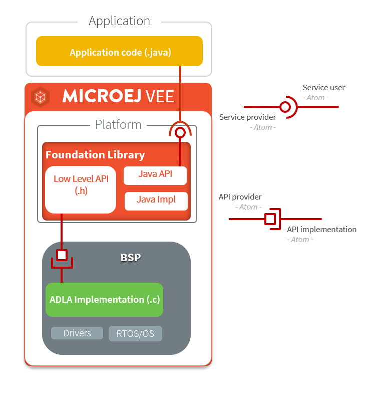
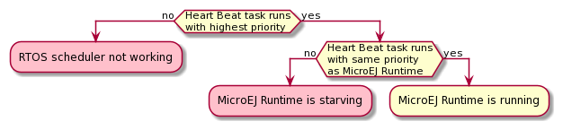

.. _tutorial_discover_embedded_debugging_tools:

Discover Embedded Debugging Tools
=================================

This tutorial describes the available tools provided to developers to debug an application.
It also lists several application uses cases.

Tools
-----

Traces
~~~~~~

When an application has issues, the first step is often to get a better understanding of what is happening inside the system.

- The `Trace Library <https://repository.microej.com/javadoc/microej_5.x/apis/ej/trace/Tracer.html>`__ is a real-time event recording library. Use it to trace the beginning and ending of events.

   .. code-block:: java
      :emphasize-lines: 4,9

      private static final int EVENT_ID = 0;

      public static void switchState(ApplicationState newState) {
         tracer.recordEvent(EVENT_ID);

         previousState = currentState;
         currentState = newState;

         tracer.recordEventEnd(EVENT_ID);
      }

  This API is most useful with the :ref:`SystemView Event tracer<systemview>` to visualize the timeline of events.

   .. figure:: ../PlatformDeveloperGuide/images/STM32F7508-DK-demoWidget-SystemView.png
      :alt: SystemView analysis of DemoWidget on STM32F7508 Platform
      :align: center
      :scale: 75

- The `Message Library <https://repository.microej.com/javadoc/microej_5.x/apis/ej/util/message/basic/BasicMessageLogger.html>`__ is a low RAM/ROM/CPU footprint API to log errors, warnings and misc information.

   .. code-block:: java 
      :emphasize-lines: 9

      private static final String LOG_CATEGORY = "Application";

      private static final int LOG_ID = 2;

      public static void switchState(ApplicationState newState) {
         previousState = currentState;
         currentState = newState;

         BasicMessageLogger.INSTANCE.log(Level.INFO, LOG_CATEGORY, LOG_ID, previousState, currentState);
      }     

- The `Logging Library <https://repository.microej.com/javadoc/microej_5.x/apis/java/util/logging/Logger.html>`__ implements a subset of the standard Java ``java.util.logging``.

   .. code-block:: java
      :emphasize-lines: 5,6,7
     
      public static void switchState(ApplicationState newState) {
         previousState = currentState;
         currentState = newState;

         Logger logger = Logger.getLogger(Main.class.getName());
         logger.log(Level.INFO, "The application state has changed from " + previousState.toString() + " to "
               + currentState.toString() + ".");
      }

Please refer to the tutorial :ref:`tutorial_instrument_java_code_for_logging` for a comparison of these libraries.

- The :ref:`Core engine VM dump<vm_dump>` is a low-level API to display the states of the MicroEJ Runtime.  It displays the state of all MicroEJ threads: name, priority, stack trace, etc. 

   .. code-block::

      =================================== VM Dump ====================================
      Java threads count: 3
      Peak java threads count: 3
      Total created java threads: 3
      Last executed native function: 0x90035E3D
      Last executed external hook function: 0x00000000
      State: running
      --------------------------------------------------------------------------------
      Java Thread[1026]
      name="main" prio=5 state=RUNNING max_java_stack=456 current_java_stack=184
      
      java.lang.MainThread@0xC0083C7C:
          at (native) [0x90003F65]
          at com.microej.demo.widget.main.MainPage.getContentWidget(MainPage.java:95)
              Object References:
                  - com.microej.demo.widget.main.MainPage@0xC00834E0
                  - com.microej.demo.widget.main.MainPage$1@0xC0082184
                  - java.lang.Thread@0xC0082194
                  - java.lang.Thread@0xC0082194
          at com.microej.demo.widget.common.Navigation.createRootWidget(Navigation.java:104)
              Object References:
                  - com.microej.demo.widget.main.MainPage@0xC00834E0
          at com.microej.demo.widget.common.Navigation.createDesktop(Navigation.java:88)
              Object References:
                  - com.microej.demo.widget.main.MainPage@0xC00834E0
                  - ej.mwt.stylesheet.CachedStylesheet@0xC00821DC
          at com.microej.demo.widget.common.Navigation.main(Navigation.java:40)
              Object References:
                  - com.microej.demo.widget.main.MainPage@0xC00834E0
          at java.lang.MainThread.run(Thread.java:855)
              Object References:
                  - java.lang.MainThread@0xC0083C7C
          at java.lang.Thread.runWrapper(Thread.java:464)
              Object References:
                  - java.lang.MainThread@0xC0083C7C
          at java.lang.Thread.callWrapper(Thread.java:449)
      --------------------------------------------------------------------------------
      Java Thread[1281]
      name="UIPump" prio=5 state=WAITING timeout(ms)=INF max_java_stack=120 current_java_stack=117
      external event: status=waiting
      
      java.lang.Thread@0xC0083628:
          at ej.microui.MicroUIPump.read(Unknown Source)
              Object References:
                  - ej.microui.display.DisplayPump@0xC0083640
          at ej.microui.MicroUIPump.run(MicroUIPump.java:176)
              Object References:
                  - ej.microui.display.DisplayPump@0xC0083640
          at java.lang.Thread.run(Thread.java:311)
              Object References:
                  - java.lang.Thread@0xC0083628
          at java.lang.Thread.runWrapper(Thread.java:464)
              Object References:
                  - java.lang.Thread@0xC0083628
          at java.lang.Thread.callWrapper(Thread.java:449)
      --------------------------------------------------------------------------------
      Java Thread[1536]
      name="Thread1" prio=5 state=READY max_java_stack=60 current_java_stack=57
      
      java.lang.Thread@0xC0082194:
          at java.lang.Thread.runWrapper(Unknown Source)
              Object References:
                  - java.lang.Thread@0xC0082194
          at java.lang.Thread.callWrapper(Thread.java:449)
      ================================================================================
      
      ============================== Garbage Collector ===============================
      State: Stopped
      Last analyzed object: null
      Total memory: 15500
      Current allocated memory: 7068
      Current free memory: 8432
      Allocated memory after last GC: 0
      Free memory after last GC: 15500
      ================================================================================
      
      =============================== Native Resources ===============================
      Id         CloseFunc  Owner            Description
      --------------------------------------------------------------------------------
      ================================================================================

- Use the :ref:`stack_trace_reader` to read and to decode the MicroEJ stack traces.

  .. figure:: ../ApplicationDeveloperGuide/images/STR_trace-read.png
     :alt: Stack Trace Reader Console
     :scale: 100%
     :align: center
     
     Stack Trace Reader Console

Troubleshooting Memory Issues
~~~~~~~~~~~~~~~~~~~~~~~~~~~~~

Memory issues such as memory corruptions and memory leaks can be hard to troubleshoot.  The following tools are available to address these issues:

* `LLJVM check integrity <https://forum.microej.com/t/architecture-7-13-check-integrity-utility/769/2>`_ is a low-level API to detect memory corruptions in native functions.
* Use the :ref:`Heap Usage Monitoring Tool <heap_usage_monitoring>` to estimate the heap requirements of an application.
* The :ref:`heapdumper` tools are used to analyze the content of the heap.  It is useful to detect memory leaks and to look for optimization of the heap usage.

   .. figure:: images/HeapAnalyzer-example.png
      :alt: Heap Analyzer Example
      :align: center
      :scale: 75

Debugging GUI Applications
~~~~~~~~~~~~~~~~~~~~~~~~~~

* The Widget Library provides several :ref:`Debug Utilities<widget_library_debug_utilities>` to investigate and assist troubleshooting of GUI applications.
  For example, it is possible to print the type and bounds of each widget in the hierarchy of a widget:

   .. code-block::
   
       Scroll: 0,0 480x272 (absolute: 0,0)
       +--ScrollableList: 0,0 480x272 (absolute: 0,0)
       |  +--Label: 0,0 480x50 (absolute: 0,0)
       |  +--Dock: 0,50 480x50 (absolute: 0,50)
       |  |  +--ImageWidget: 0,0 70x50 (absolute: 0,50)
       |  |  +--Label: 70,0 202x50 (absolute: 70,50)
       |  +--Label: 0,100 480x50 (absolute: 0,100)

* :ref:`MicroUI Event Buffer <section_inputs_eventbuffer>` provides an API to store and dump the events received:

  .. code-block::

     ============================== MicroUI FIFO Dump ===============================
     ---------------------------------- Old Events ----------------------------------
     [27: 0x00000000] garbage
     [28: 0x00000000] garbage
     [...]  
     [99: 0x00000000] garbage
     [00: 0x08000000] Display SHOW Displayable (Displayable index = 0)
     [01: 0x00000008] Command HELP (event generator 0)
     [02: 0x0d000000] Display REPAINT Displayable (Displayable index = 0)
     [03: 0x07030000] Input event: Pointer pressed (event generator 3)
     [04: 0x009f0063]    at 159,99 (absolute)
     [05: 0x07030600] Input event: Pointer moved (event generator 3)
     [06: 0x00aa0064]    at 170,100 (absolute)
     [07: 0x02030700] Pointer dragged (event generator 3)
     [08: 0x0d000000] Display REPAINT Displayable (Displayable index = 0)
     [09: 0x07030600] Input event: Pointer moved (event generator 3)
     [10: 0x00b30066]    at 179,102 (absolute)
     [11: 0x02030700] Pointer dragged (event generator 3)
     [12: 0x0d000000] Display REPAINT Displayable (Displayable index = 0)
     [13: 0x07030600] Input event: Pointer moved (event generator 3)
     [14: 0x00c50067]    at 197,103 (absolute)
     [15: 0x02030700] Pointer dragged (event generator 3)
     [16: 0x0d000000] Display REPAINT Displayable (Displayable index = 0)
     [17: 0x07030600] Input event: Pointer moved (event generator 3)
     [18: 0x00d00066]    at 208,102 (absolute)
     [19: 0x02030700] Pointer dragged (event generator 3)
     [20: 0x0d000000] Display REPAINT Displayable (Displayable index = 0)
     [21: 0x07030100] Input event: Pointer released (event generator 3)
     [22: 0x00000000]    at 0,0 (absolute)
     [23: 0x00000008] Command HELP (event generator 0)
     ---------------------------------- New Events ----------------------------------
     [24: 0x0d000000] Display REPAINT Displayable (Displayable index = 0)
     [25: 0x07030000] Input event: Pointer pressed (event generator 3)
     [26: 0x002a0029]    at 42,41 (absolute)
     --------------------------- New Events' Java objects ---------------------------
     [java/lang/Object[2]@0xC000FD1C
      [0] com/microej/examples/microui/mvc/MVCDisplayable@0xC000BAC0
      [1] null
     ================================================================================

* MicroUI can log several actions that can be viewed in SystemView, please refer to :ref:`microui_traces` for more information.
* Make sure to understand :ref:`MWT Concepts<mwt_concepts>`, especially the relations between the rendering, the lay-out the event dispatch and the states of desktop and widget.
* For UI2 and former versions, please refer to `MicroUI and multithreading <https://forum.microej.com/t/gui-microui-and-multithreading/652>`__ for a description of the threading model.

Static Analysis Tools
~~~~~~~~~~~~~~~~~~~~~

Static analysis tools are helpful allies to prevent several classes of bugs.

* :ref:`SonarQube™<sonar_code_analysis>` provides reports on duplicated code, coding standards, unit tests, code coverage, code complexity, potential bugs, comments, and architecture.
* Use the :ref:`Null Analysis tool<null_analysis>` to detect and to prevent `NullPointerException <https://repository.microej.com/javadoc/microej_5.x/apis/java/lang/NullPointerException.html>`_, one of the most common causes of runtime failure of Java programs.

   .. figure:: ../ApplicationDeveloperGuide/images/null_analysis_example.png
      :alt: Example of Null Analysis Detection

Simulator Debugger
~~~~~~~~~~~~~~~~~~

* :ref:`Debug an application <application_debugger>` on simulator, add breakpoints, inspect stack frame, use step-by-step, etc.

   .. figure:: ../ApplicationDeveloperGuide/images/debug1.png
      :alt: MicroEJ Development Tools Overview of the Debugger
      :align: center
      :scale: 75

* Configure the libraries sources location to :ref:`View library as sources<application_debugger>` in the debugger.

Platform Qualification
~~~~~~~~~~~~~~~~~~~~~~

The Platform Qualification Tools (PQT) project provides the tools required to validate each component of a MicroEJ Platform.
After porting or adding a feature to a MicroEJ Platform, it is necessary to validate its integration.

The project is available on GitHub: https://github.com/MicroEJ/PlatformQualificationTools

   Platform Qualification Overwiew

Please refer to the :ref:`platform_qualification` documentation for more information.

.. _tutorial_debug_use_case_1:

Use Case 1:  Debugging An UI Application Freeze
-----------------------------------------------

When an application User Interface freezes and becomes unresponsive, in most cases, one of the following conditions applies:

- An unrecoverable system failure occurred, like a HardFault, and the RTOS tasks are not scheduled anymore.
- The RTOS task that runs the MicroEJ runtime is never given CPU time (suspended or blocked).
- The RTOS task that runs the MicroEJ runtime is executing never-ending native code (infinite loop in native implementation for example).
- A Java method is executing a long running operation in the MicroUI thread (also called Display Pump thread).
- The application code is unable to receive or process user input events.

The next sections explain how to instrument the code in order to locate the issue when the UI freeze occurs.
The steps followed are:

1. Check if the RTOS Scheduler is properly scheduling the MicroEJ runtime task.
2. Check if the Java Scheduler is properly scheduling all Java threads.
3. Check if the UI thread is properly scheduled.
4. Check if Input Events are properly processed.

Check RTOS Scheduler Liveness
~~~~~~~~~~~~~~~~~~~~~~~~~~~~~

Let's start at low level by figuring out if the RTOS is scheduling the
tasks correctly.  If possible, use a debugger, if not use the heart
beat task described here.

Make one of the RTOS task act like a heart beat: create a dedicated
task and make it report in some way at a regular pace (print a message
on standard output, blink a LED, use SystemView, etc.).

If the heart beat is still running when the UI freeze occurs, we can
go a step further and check whether the MicroEJ runtime is still
scheduling Java threads or not.

If you use task priorities for the RTOS tasks management, ensure that
the priority of the RTOS task is equal or lower than the priority of
the MicroEJ runtime task.

If the RTOS task of the heart beat doesn't run when:

- the priority is the highest than any other tasks, then the RTOS
  scheduler is not scheduling anything.
- the priority is the same as the MicroEJ runtime and other tasks with
  a higher priority exist, then one or more RTOS tasks are causing
  starvation by taking all the resources.

..
   @startuml
   if (Heart Beat task runs\nwith highest priority) then (no)
     #pink:RTOS scheduler not working;
     kill
   else (yes)
     if (Heart Beat task runs\nwith same priority\nas MicroEJ Runtime) then (no)
       #pink:MicroEJ Runtime is starving;
       kill
     else (yes)
       :MicroEJ Runtime is running;
       kill
     endif
   endif
   @enduml  

Check Java Scheduler Liveness
~~~~~~~~~~~~~~~~~~~~~~~~~~~~~

As a reminder, the architecture of the MicroEJ runtime is called green
thread architecture, it defines a multi-threaded environment without
relying on any native RTOS capabilities. Therefore, the whole Java world
runs in one single RTOS task. Read more about this architecture in the
:ref:`Platform Developer Guide <core_engine>`.
A quick way to check if the Java threads are scheduled correctly is, here again, to
make one of the threads print a heart beat message. Copy/paste the
following snippet in the ``main()`` method of the application:

.. code-block:: java

   TimerTask task = new TimerTask() {

       @Override
       public void run() {
           System.out.println("Alive");
       }
   };
   Timer timer = new Timer();
   timer.schedule(task, 10_000, 10_000);

This code creates a new Java thread that will print the message ``Alive``
on the standard output every 10 seconds.

If the ``Alive`` printouts stop when the UI freeze occurs (assuming no one cancelled the ``Timer``), then it means that the MicroEJ Runtime stopped scheduling the Java threads or that one or more threads with a higher priority are preventing the threads with a lower priority to run.

Here are a few suggestions:

- Make sure no Java threads with a high priority are preventing the scheduling of the other threads.
  For example, convert the above example with a dedicated thread with the highest priority:

  .. code-block:: java

     Thread thread = new Thread(new Runnable() {

     	@Override
     	public void run() {
     		while (true) {
     			try {
     				Thread.sleep(10_000);
     				System.out.println("Alive");
     			} catch (InterruptedException e) {
     				e.printStackTrace();
     			}
     		}
     	}
     });
     thread.setPriority(Thread.MAX_PRIORITY);
     thread.start();

- The RTOS task that runs the MicroEJ runtime might be suspended or
  blocked. Check if some API call is suspending the task or if a
  shared resource could be blocking it.

- When a Java native method is called, it calls its C counterpart
  function in the RTOS task that runs the MicroEJ runtime. While the C
  function is running, no other Java methods can run : the Java world
  awaits for the C function to finish. As a consequence, if the C
  function never returns, no Java thread can ever run again. Spot any
  suspect native functions and trace every entry/exit to detect faulty
  code.

Please refer to :ref:`implementation_details` if you encounter issues
to implement the heart beat.

Check UI Thread Liveness
~~~~~~~~~~~~~~~~~~~~~~~~

Now, what if the ``Alive`` heart beat runs while the UI is frozen?
Java threads are getting scheduled but the UI thread (also called
Display Pump thread), does not process display events.

Let's make the heart beat snippet above execute in the UI
thread. Simply wraps the ``System.out.println("Alive")`` with a
``callSerially``:

.. code-block:: java

   TimerTask task = new TimerTask() {

       @Override
       public void run() {
           System.out.println("TimerTask Alive");
           MicroUI.callSerially(new Runnable() {
           
               @Override
               public void run() {
                   System.out.println("UI Alive");
               }
           });
       }
       
       @Override
       public void uncaughtException(Timer timer, Throwable e) {
           // Default implementation of this method would cancel the task. 
           // Let's just ignore uncaught exceptions for debug purposes.
           e.printStackTrace();
       }
   };
   Timer timer = new Timer();
   timer.schedule(task, 10_000, 10_000);

In case this snippet prints ``TimerTask Alive`` but not ``UI alive`` when
the freeze occurs, then there are few options:

-  The application might be processing a long operation in the UI
   thread, for example:

   -  infinite/indeterminate loops
   -  network/database access
   -  heavy computations
   -  ``Thread.sleep()``/``Object.wait()``
   -  ``SNI_suspendCurrentJavaThread()`` in native call

   When doing so, any other UI-related operation will not be processed
   until completion, leading the display to being unresponsive. Any code
   that runs in the UI thread might be responsible. Look for code
   executed as a result of calls to:

   -  ``repaint()``: code in ``renderContent()``
   -  ``revalidate()``/``revalidateSubTree()``: code in
      ``validateContent()`` and ``setBoundsContent()``
   -  ``handleEvent()``
   -  ``callSerially()``: code wrapped in such calls will be executed
      in the UI thread

-  The UI thread has terminated.

As a general rule, avoid running long operations in the UI thread,
follow the general pattern and use a dedicated thread/executor instead:

.. (QUESTION: use a sequence diagram to be more explicit?)

.. code-block:: java

   ExecutorService executorService = ServiceLoaderFactory.getServiceLoader().getService(ExecutorService.class, SingleThreadExecutor.class);
   executorService.execute(new Runnable() {

       @Override
       public void run() {
       
           // (... long non-UI operation ...)
           
           // optional: update the UI upon completion
           Display.getDefaultDisplay().callSerially(new Runnable() {
                       
           @Override
           public void run() {
                       // update display code (will be executed in UI thread)
           }
       });
       }
   });

Check Input Events Processing
~~~~~~~~~~~~~~~~~~~~~~~~~~~~~

Another case that is worth looking at is whether the application is
processing user input events like it should. The UI may look "frozen"
only because it doesn't react to input events. Replace the desktop
instance with the one below to log all user inputs.

.. code-block:: java

   Desktop desktop = new Desktop() {

       @Override
       public EventHandler getController() {
           EventHandler controller = super.getController();
           return new EventHandler() {
           @Override
               public boolean handleEvent(int event) {
               System.out.println("Desktop.handleEvent() received event of type " + Event.getType(event));
               return controller.handleEvent(event);
               }
           };
       }
   };

.. _implementation_details:

Implementation Details
~~~~~~~~~~~~~~~~~~~~~~

Java Threads Creation
+++++++++++++++++++++

The number of threads in the MicroEJ Application must be sufficient to support the creation of additional threads when using ``Timer`` and ``Thread``.
The number of available threads can be updated in the launch configuration of the application (see :ref:`option_number_of_threads`).

If it is not possible to increase the number of available threads (for
example because the memory is full), try to reuse another thread but
not the UI thread.

UART Not Available
++++++++++++++++++

If the UART output is not available, use another method to signal that
the heart beat task is running (e.g. blink a LED, use SystemView).

.. _tutorial_debug_use_case_2:

Use Case 2: Debugging A Hardfault
---------------------------------

When the application crashes it can be the result of an hardfault triggered by the MCU.

The next sections explain:

1. What are exceptions, hardfaults and the exception handler.
2. What to do in case of Memory Corruptions.
3. What to do when a hardfault occurs.

Useful Resources
~~~~~~~~~~~~~~~~

* IAR System : Debugging a HardFault on Cortex-M https://www.iar.com/support/tech-notes/debugger/debugging-a-hardfault-on-cortex-m/
* ARM Documentation Center http://infocenter.arm.com/help/index.jsp
* ESP-IDF Programming Guide : Fatal Errors https://docs.espressif.com/projects/esp-idf/en/latest/esp32/api-guides/fatal-errors.html
* Using Cortex-M3/M4/M7 Fault Exceptions MDK Tutorial http://www.keil.com/appnotes/files/apnt209.pdf

Exceptions, Hardfaults And Exception Handler
~~~~~~~~~~~~~~~~~~~~~~~~~~~~~~~~~~~~~~~~~~~~

*From ARM Architecture Reference Manual*

   An exception causes the processor to suspend program execution to handle an event, such as an externally generated interrupt or an attempt to execute an undefined instruction. Exceptions can be generated by internal and external sources.
   Normally, when an exception is taken the processor state is preserved immediately, before handling the exception.
   This means that, when the event has been handled, the original state can be restored and program execution resumed from the point where the exception was taken.

For example, an *IRQ request* is an exception that can be recovered by handling the hardware request properly.
On the other hand, an *Undefined Instruction* exception suggests a more serious system failure which might not be recoverable.

The exceptions that cannot be recovered are named **hardfaults**.

*From ARM Architecture Reference Manual*

   When an exception is taken, processor execution is forced to an address that corresponds to the type of exception.
   This address is called the **exception vector** for that exception.

The code pointed by the exception vector is named **exception handler**.
This means that for all exceptions, including hardfaults, a dedicated exception handler can be configured.

Possible exceptions can be:

* Data Abort exception (access to unknown address)
* Undefined Instruction exception (execute code that is not valid)
* ...

Check the hardware documentation for the complete list of exceptions.

What To Do In Exception Handlers?
~~~~~~~~~~~~~~~~~~~~~~~~~~~~~~~~~

For all hardfault handlers, the following information are available and must be printed:

* Name and value of all registers available
* Name of the handler
* Address of the failing instruction

Optionally:

* Content of the stack
* Call function ``LLMJVM_dump`` (from ``LLMJVM.h``) to display the VM state (see :ref:`vm_dump`)

Refer to the architecture documentation for how to configure the exception interrupt vector.

Memory Protection Unit (MPU)
~~~~~~~~~~~~~~~~~~~~~~~~~~~~

A Memory Protection Unit (MPU) is a hardware unit that provides memory protection.
A MPU allows a privilegied software to define memory regions and a policy for each memory region. The policy defines who can access the memory.

For example, the heap and stack of a task can be configured to be accessible from this task only. If another task, or a device driver attempts to access the memory region, an exception is generated.

If applicable, the MPU should be configured to protect the application.

* Check the RTOS documentation if it supports MPU. 

  For example FreeRTOS includes FreeRTOS-MPU https://www.freertos.org/FreeRTOS-MPU-memory-protection-unit.html.

* Configure the MPU to configure the access to the JVM heap and stack to prevent any other native threads from altering this area.
  Refer to :ref:`this section<core_engine_link>` for the list of section names defined by the MicroEJ Core Engine.

Memory Corruption
~~~~~~~~~~~~~~~~~

The symptoms of a memory corruption can be:

* the address of the failing instruction is in a data section
* the trace is incomplete or obviously incorrect
* the address of the failing instruction is located in the Garbage Collector (GC)

The cause(s) of a memory corruption can be:

* A native (C) function has a bug and write to an incorrect memory location
* A native stackoverflow
* A native heap overflow
* A device mis-initialized or mis-configured.
* ...

When the hardfault occurs in the MicroJVM task, the VM task heap or stack may be corrupted.
Add ``LLMJVM_checkIntegrity`` call in checkpoints of the BSP code to identify the timeslot of the memory corruption.
Typically, you can check a native with:

.. code-block:: java

   void Java_com_mycompany_MyClass_myNativeFunction(void) {
   	int32_t crcBefore = LLMJVM_checkIntegrity();
   	myNativeFunctionDo();
   	int32_t crcAfter = LLMJVM_checkIntegrity();
   	if(crcBefore != crcAfter){
   		// Corrupted memory in MicroJVM virtual machine internal structures
   		while(1);
   	}
   }

Investigation
~~~~~~~~~~~~~

Determine which memory regions are affected and then determine which components are responsible for the corruption.

* List all memory available and their specifics

    * Access mode (addressable, DMA, ...)
    * Cache mechanism? L1, L2

* Is low-power enabled for CPU and peripherals? Is the memory disabled/changed to save power?
* Get the memory layout of the project

    * What are the code sections for BSP and Java
    * Where are the BSP stack and heap, what about the Application stack and heap?
    * Where are the Java immortals heap?
    * Where are the Java strings?
    * Where is the MicroEJ UI buffer?
    * Besides the Java immortals, what are the other intersection point between the Java and the BSP? (e.g. a temporary RAM buffer for JPEG decoder).
    * Please refer to the :ref:`Core Engine Link section <core_engine_link>` to locate the Application sections and to the :ref:`application_options` for their sizes.

* Implement a CRC of the *hot sections* when entering/leaving all natives. *Hot Sections* are memory sections used by both the Java and native code (e.g. C or ASM).

* Move the C stack at the beginning of the memory so that it crashes when it overflows (instead of corrupting the memory).

When A Hardfault Occurs
~~~~~~~~~~~~~~~~~~~~~~~

Extract Information And Coredump
++++++++++++++++++++++++++++++++

Attach an embedded debugger and get the following information:

* stack traces and registers information for each stack frame
* core dump / memory information

    * the whole memory if possible
    * otherwise, get the *hot sections* 

        * BSP and Java heap and stack
        * UI buffer
        * immortals heap
        * sections where the Java and BSP are working together

* Check which function is located at the address inside the PC register

  * it can be done either in Debug mode or by searching inside the generated .map file.

Memory Dump Analysis
~~~~~~~~~~~~~~~~~~~~

* Run the Heap Dumper to check the application heap has not been corrupted
* Make sure the native stack is not full (usually there shall have the remaining initialization patterns in memory on top of stack such as ``0xDEADBEEF``)

Trigger A VM Dump
~~~~~~~~~~~~~~~~~

``LLMJVM_dump`` function is provided by ``LLMJVM.h``.
This function prints the VM state.
Information printed in the VM state are:

* List of Java threads
* Stack trace for each thread

See :ref:`this section<vm_dump>` to learn more about ``LLMJVM_dump``.
