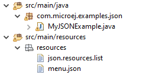

Evaluate Data Serialization Formats
'''''''''''''''''''''''''''''''''''

This tutorial highlights some data serialization formats that are provided on MicroEJ Central Repository and their usage through basic code samples.

Intended Audience
=================

The audience for this document is Application engineers who want to implement data serialization.
In addition, this tutorial should be of interest to software architects how are looking for a suitable data format for their use case.

XML
===

`XML (EXtensible Markup Language) <https://en.wikipedia.org/wiki/XML>`_ is used to describe data and text. It allows flexible development of user-defined document types. The format is robust, non-proprietary, persistent and is verifiable for storage and transmission. To parse this data format, several XML Pull parsers are available, such as `KXmlParser <http://kxml.org/>`_ from the Java community, which has been integrated to MicroEJ as a MMM dependency.

XML Parser Use In MicroEJ SDK
-----------------------------

The `XML API Module <https://repository.microej.com/artifacts/org/kxml2/kxml2/>`_ must be added to the :ref:`module.ivy <mmm_module_description>` of the MicroEJ 
Application project in order to allow access to the Device library.

::

	<dependency org="org.kxml2" name="kxml2" rev="2.3.2"/>

Example Of Use
--------------

This MicroEJ project presents how to use XML data exchange for your Java application developed with MicroEJ. It details how to use the `KXmlParser <http://kxml.org/>`_ module.

The example parses a short poem written in XML and prints the result on the system out. The MicroEJ project runs on all built-in MicroEJ Java platforms (simulator and evaluation kits).

All source code is available on `MicroEJ GitHub <https://github.com/MicroEJ/Example-XML>`_ and you can find a free trial version of MicroEJ SDK `here <https://developer.microej.com/get-started/>`_. 

::

	<?xml version="1.0" encoding="UTF-8"?>
	<!--
		XML
		
		Copyright 2014-2020 MicroEJ Corp. All rights reserved.
		Use of this source code is governed by a BSD-style license that can be found with this software.
	-->
	<poem xmlns="http://www.megginson.com/ns/exp/poetry">
		<title>Roses are Red</title>
		<l>Roses are red,</l>
		<l>Violets are blue;</l>
		<l>Sugar is sweet,</l>
		<l>And I love you.</l>
	</poem>

JSON
====

As described on the `JSON official site <http://json.org/>`_, JSON (JavaScript Object Notation) is a lightweight data-interchange format. It is widely used in many fields for example as a mean of data serialization in lightweight web services such as REST, for server interrogation in Ajax for dynamic webpage building, or even databases.

Due to its lightweight nature and its simplified syntax compared to XML, it is quite natural to use it in embedded systems. JSON is easily readable by humans but what about computers? That is where the official JSON page comes in handy by providing a rather impressive list of JSON parsers. For our convenience a Java mobile edition (ME) of a JSON parser is available.

JSON Parser Use In MicroEJ SDK
------------------------------

The `JSON API Module <https://repository.microej.com/artifacts/org/json/me/json/>`_ must be added to the :ref:`module.ivy <mmm_module_description>` of the MicroEJ 
Application project in order to allow access to the Device library.

::

	<dependency org="org.json.me" name="json" rev="1.3.0"/>

The instantiation and use of the parser is pretty straightforward. First you need to get the JSON content as a ``String``,  and then create a ``org.json.me.JSONObject`` instance with the string. If the string content is a valid JSON content, you should have an workable ``JSONObject`` to browse.

Example Of Use
--------------

In the following example we will parse this JSON file that represents a simple abstraction of a file menu:

.. code:: JSON

	{
		"menu": {
			"id": "file",
			"value": "File",
			"popup": {
				"menuitem": [
					{"value": "New", "onclick": "CreateNewDoc()"},
					{"value": "Open", "onclick": "OpenDoc()"},
					{"value": "Close", "onclick": "CloseDoc()"}
				]
			}
		}
	}

First, we need to include this file in our project by adding it to the ``src/main/resources`` folder and creating a ``.resources.list`` properties file to declare this resource for our application to be able to retrieve it (see :ref:`section.classpath.elements.resources` for more details). 

This ``.resources.list`` file (here named ``json.resources.list``) should contain the path to our JSON file as such :

.. code::

	resources/menu.json

The example below will parse the file, browse the resulting data structure (``org.json.me.JSONObject``) and print the value of the ``menuitem`` JSON array.

.. code:: Java

	/*
	 * Java
	 *
	 * Copyright 2014-2020 MicroEJ Corp. All rights reserved.
	 */
	package com.microej.examples.json;

	import java.io.DataInputStream;
	import java.io.IOException;

	import org.json.me.JSONArray;
	import org.json.me.JSONException;
	import org.json.me.JSONObject;

	/**
	* This example uses the org.json.me parser provided by json.org to parse and
	* browse a JSON content.
	* 
	* The JSON content is simple abstraction of a file menu as provided here:
	* http://www.json.org/example.html
	* 
	* The example then tries to list all the 'menuitem's available in the popup
	* menu. It is assumed the user knows the menu JSON file structure.
	* 
	*/
	public class MyJSONExample {

		public static void main(String[] args) {

			// get back an input stream from the resource that represents the JSON
			// content
			DataInputStream dis = new DataInputStream(
					MyJSONExample.class.getResourceAsStream("/resources/menu.json"));

			byte[] bytes = null;

			try {

				// assume the available returns the whole content of the resource
				bytes = new byte[dis.available()];

				dis.readFully(bytes);

			} catch (IOException e1) {
				// something went wrong
				e1.printStackTrace();
				return;
			}

			try {

				// create the data structure to exploit the content
				// the string is created assuming default encoding
				JSONObject jsono = new JSONObject(new String(bytes));

				// get the JSONObject named "menu" from the root JSONObject
				JSONObject o = jsono.getJSONObject("menu");

				o = o.getJSONObject("popup");

				JSONArray a = o.getJSONArray("menuitem");

				System.out.println("The menuitem content of popup menu is:");
				System.out.println(a.toString());

			} catch (JSONException e) {
				// a getJSONObject() or a getJSONArray() failed
				// or the parsing failed
				e.printStackTrace();
			}

		}

	}

The execution of this example on the simulated Java platform should print the following trace:

::

	=============== [ Initialization Stage ] ===============
	=============== [ Launching SimJPF ] ===============
	The menuitem content of popup menu is:
	[{"value":"New","onclick":"CreateNewDoc()"},{"value":"Open","onclick":"OpenDoc()"},{"value":"Close","onclick":"CloseDoc()"}]
	=============== [ Completed Successfully ] ===============

	SUCCESS

CBOR
====

The `CBOR (Concise Binary Object Representation) <https://cbor.io/>`_ binary data serialization format is a lightweight data-interchange format similar to JSON but with a smaller footprint, making it very practical for embedded applications, though its messages are often less easily readable by humans.

CBOR Parser Use In MicroEJ SDK
------------------------------

The `CBOR API Module <https://repository.microej.com/artifacts/ej/library/iot/cbor/>`_ must be added to the :ref:`module.ivy <mmm_module_description>` of the MicroEJ 
Application project in order to allow access to the Device library.

::

	<dependency org="ej.library.iot" name="cbor" rev="1.1.0"/>

Example Of Use
--------------

Protocol Buffers
================

..
   | Copyright 2008-2020, MicroEJ Corp. Content in this space is free 
   for read and redistribute. Except if otherwise stated, modification 
   is subject to MicroEJ Corp prior approval.
   | MicroEJ is a trademark of MicroEJ Corp. All other trademarks and 
   copyrights are the property of their respective owners.
