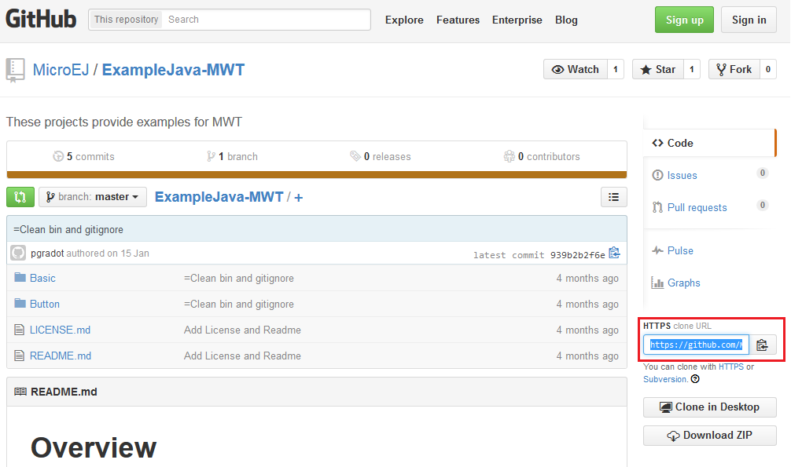
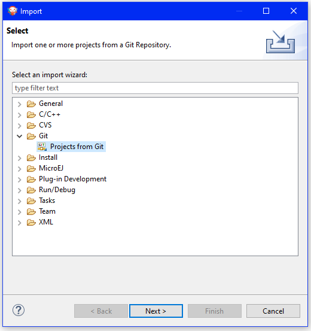
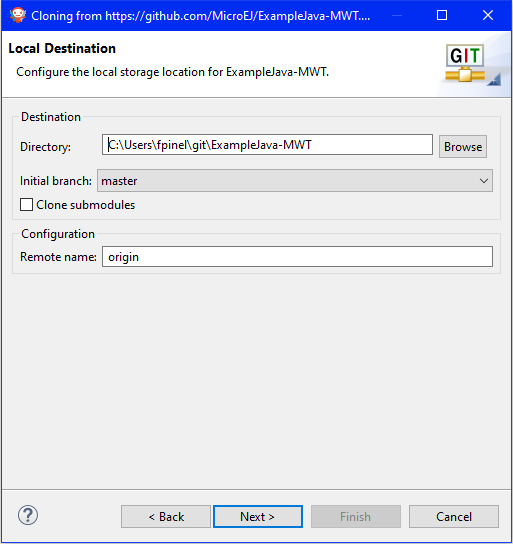
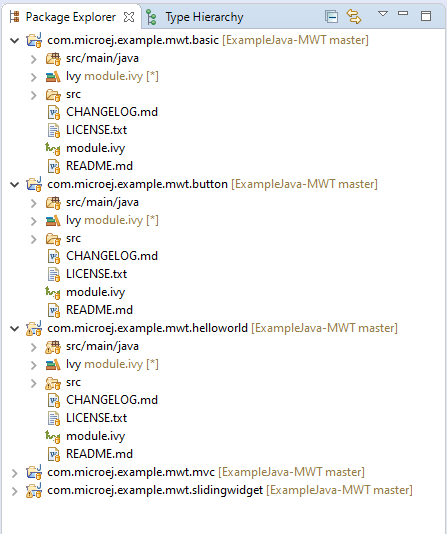

MicroEJ and Github
==================

You may know that MicroEJ has an `account on Github <https://github.com/MicroEJ>`_. There, we share examples (like `examples for MWT <https://github.com/MicroEJ/ExampleJava-MWT>`_) libraries, tools and demos. In this article, we will explain how you can connect repositories from Gitub inside MicroEJ.

Both the MicroEJ Studio and MicroEJ SDK come with the EGit plugin built-in, so you can easily clone an existing repository. Here, we use the MWT Examples repository. From the Github page, you can copy the HTTP address of this repository from the dedicated field in the right menu (highlighted in red):

In MicroEJ SDK, to clone and import the project from the remote Git repository into the MicroEJ workspace, go to File / Import / Git / Projects from Git.

Click Next, select “Clone URI”, click Next, enter the address of the remote repository in the URI field. For this repository, the address is `<https://github.com/MicroEJ/ExampleJava-MWT.git>`_. If have already copied the HTTP address, the fields are filed automatically. 

.. figure:: images/2-location-to-clone.png
   :alt: Location to clone
   :align: center
   :width: 512px
   :height: 544px

Click Next, select the master branch, click Next and accept the proposed “Local Destination” by clicking Next once again.

Click Next once more and finally Finish. The “Package Explorer” view now contains the projects!

If you want to import projects from another Github repository, you simply have to do the same procedure for the desired repository.

..
   | Copyright 2008-2020, MicroEJ Corp. Content in this space is free 
   for read and redistribute. Except if otherwise stated, modification 
   is subject to MicroEJ Corp prior approval.
   | MicroEJ is a trademark of MicroEJ Corp. All other trademarks and 
   copyrights are the property of their respective owners.
