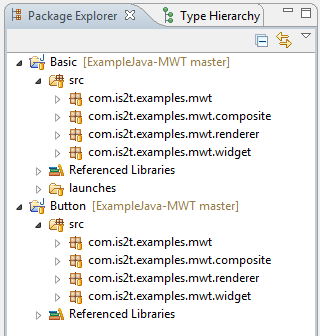

MicroEJ and Github
==================

In a previous article, we explained how you can use Git in MicroEJ to manage your source code. You may also know that MicroEJ has an `account on Github <https://github.com/MicroEJ>`_. There, we share examples (like `examples for MWT <http://ardyu9v96nsae1p2.microej.com/mwt-examples-github/>`_) libraries, tools and demos. In this article, we will explain how you can connect repositories from Gitub inside MicroEJ.

Assuming that you have installed EGit properly, you can clone an existing repository. Here, we use the MWT Examples repository. From the Github page, you can copy the HTTP address of this repository from the dedicated field in the right menu (highlighted in red):

For this repository, the address is `<https://github.com/MicroEJ/ExampleJava-MWT.git>`_. In MicroEJ, open the Git perspective and select “Clone a Git repository” in the “Git Repositories” view. If have already copied the HTTP address, the fields are filed automatically:

.. figure:: images/1-location-to-clone.png
   :alt: Location to clone
   :align: center

Click Next, select the master branch, click Next and finally accept the proposed “Local Destination” by clicking Finish.

.. figure:: images/2-local-destination.png
   :alt: Local destination
   :align: center

You can now see the details of the repository in the “Git Repositories” view.

.. figure:: images/3-details-after-clone.png
   :alt: Details after clone
   :align: center

If you go back to the MicroEJ perspective and have a look at the “Package Explorer” view, you may be disappointed: there is no project! That’s normal because cloning a repository is just copying files from the remote repository to your local repository It has no effect on your MicroEJ workspace, only on your Git repository. You now have to import the project from the local Git repository into the MicroEJ workspace. To do so, go to File / Import / Git / Projects from Git.

Click Next, select “Existing local repository”, click Next, select the Git repository to clone (in our example, its name is “ExampleJava-MWT”), click Next twice and finally Finish. “Package Explorer” view now contains the projects!

If you want to import projects from another Github repository, you simply have to do the same procedure for the desired repository.

