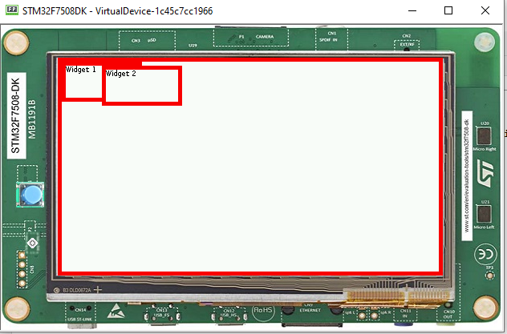
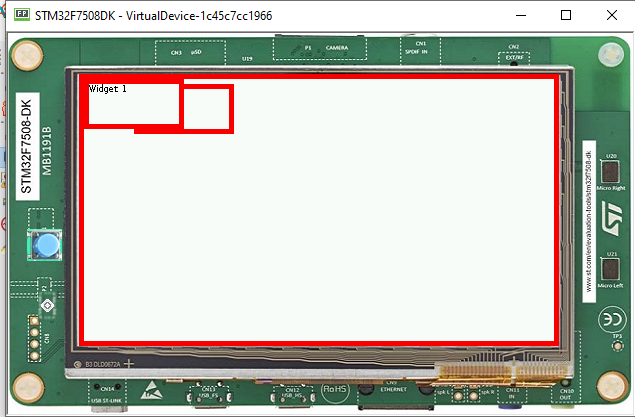
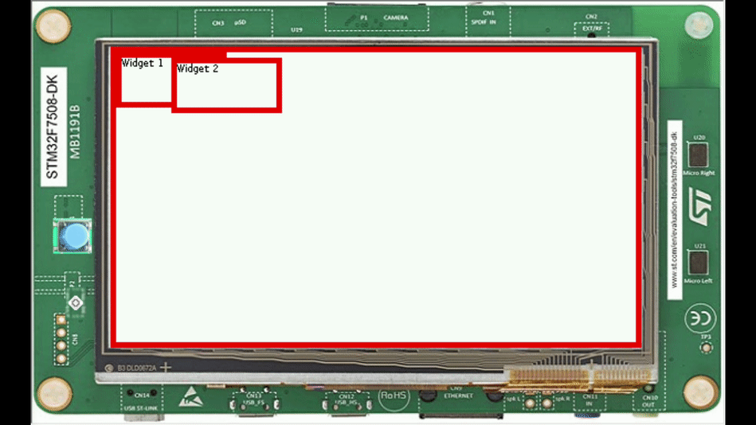

Overlap Render Policy
======================
Introduction
-------------
A render policy is a strategy that MWT uses in order to repaint the entire desktop or to repaint a specific widget. 

The most naive render policy would be to render the whole hierarchy of the desktop whenever a widget has changed.

The DefaultRenderPolicy, repaints the Widget and its ancestors if the widget is transparent

The OverlapRenderPolicy, repaints the Widget that was changed but also the ones that are overlapped by it

Overlapping widget
-------------------

- Here's a snippet of two widgets

.. code-block:: java

    public class Main {

    public static void main(String[] args) {
            MicroUI.start();

            Desktop desktop = new Desktop();

            // Simple style to show the border of the two widgets.
            CascadingStylesheet stylesheet = new CascadingStylesheet();
            EditableStyle style = stylesheet.getDefaultStyle();
            style.setBorder(new RectangularBorder(Colors.RED, 5));
            desktop.setStylesheet(stylesheet);

            // Use a Canvas to overlap two widgets.
            Canvas root = new Canvas();
            Label widget1 = new Label("Widget 1");
            Label widget2 = new Label("Widget 2");

            // Widget 2 is added after Widget 1
            root.addChild(widget1, 0, 0, 100, 50);
            root.addChild(widget2, 50, 5, 100, 50);

            desktop.setWidget(root);
            Display.getDisplay().requestShow(desktop);
        }
    }

- Here's the result

- Adding widget 1 after widget 2

.. code-block:: java
        
    root.addChild(widget2, 50, 5, 100, 50);
    root.addChild(widget1, 0, 0, 100, 50);

- So far, the renderPolicy was not changed

Using OverlapRenderPolicy
--------------------------
- Adding a small loop to alternate between requesting render on each widget, usually done when the widget was updated(for example: the text was changed)

.. code-block:: java

    while (true) {
        try {
            Thread.sleep(1000);
        } catch (InterruptedException e) {
        }
        System.out.println("Render Widget 1");
        widget1.requestRender();

        try {
            Thread.sleep(1000);
        } catch (InterruptedException e) {

        }
        System.out.println("Render Widget 2");
        widget2.requestRender();
    }

- The widgets should alternate as shown below 

- When a widget rendering is requested, the widget is rendered on top of the other widget, regardless of their order in the widget hierachy.
- To avoid this, it's possible to change the render policy as follows
  
.. code-block:: java

    Desktop desktop = new Desktop() {
        @Override
        protected RenderPolicy createRenderPolicy() {
            return new OverlapRenderPolicy(this);
        }
    };

Since widget1 was added after widget2, the hierarchy should be respected and the shown like this

