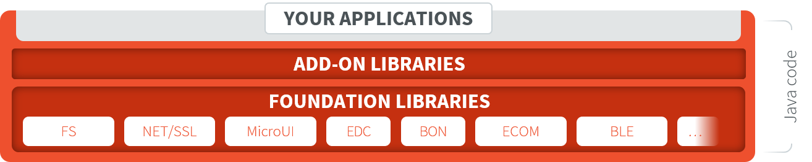
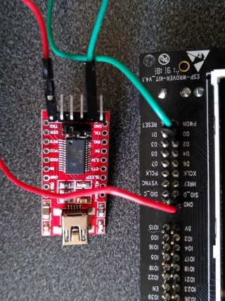
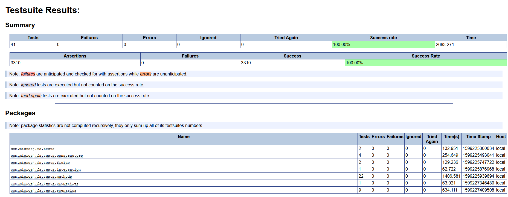

Run a Testsuite on a Device
===========================

This tutorial describes all the steps to configure and run a
:ref:`platform_testsuite` on a device using the `Platform
Qualification Tools
<https://github.com/MicroEJ/PlatformQualificationTools>`_.

In this tutorial, the target device is the Espressif ESP32-WROVER-KIT
V4.1 board and the File System (:ref:`FS <platform_fs>`) testsuite
will be used as an example.

The tutorial should take 1 hour to complete (excluding the Platform
Getting Started setup).

Intended Audience and Scope
---------------------------

The audience for this document is software engineers who want to
validate an abstraction layer implementation or understand how to automatically
run a MicroEJ Testsuite on their device.

The following topics are out of the scope of this tutorial:

- How to write test cases and package a Testsuite module. See
  :ref:`application_testsuite` for this topic.
- How to create a new Foundation Library. See the `Foundation Library
  Getting Started
  <https://github.com/MicroEJ/How-To/tree/1.8.3/FoundationLibrary-Get-Started>`_
  to learn more about creating custom Foundation Library.

Prerequisites
-------------

This tutorial assumes the following:

- Good knowledge of the :ref:`chapter-glossary`.

- Tutorial :ref:`tutorialUnderstandMicroEJFirmwareBuild` has been followed.

- MicroEJ SDK distribution 20.07 or more (see :ref:`get_sdk_version`).

- The WROVER Platform has been properly setup (i.e., it can be used to
  generate a MicroEJ Mono-Sandbox Firmware).

The explanation can be adapted to run the testsuite on any other
MicroEJ Platform providing:

- An implementation of :ref:`LLFS-API-SECTION` version 1.0.2 in
  ``com.microej.pack#fs-4.0.3``.
- A partial or full :ref:`bsp_connection`.

.. note::

   This tutorial can also be adapted to run other testsuites in addition to the
   FS testsuite presented here.

Introduction
------------

This tutorial presents a local setup of the :ref:`platform_testsuite`
for the FS Foundation Library on a concrete device (not on simulator).

In essence, a Foundation Library provides an API to be used by a
MicroEJ Application or an Add-on Library.

   MicroEJ Foundation Libraries, Add-On Libraries and MicroEJ Application

For example, the Java file system API ``java.io.File`` is provided by
the MicroEJ Foundation Library named ``FS``. The Abstraction Layer of
each Foundation API must be implemented in C in the Board Support
Package.  The Testsuite is used to validate the C code implementation
of the Abstraction Layer.

Import the Testsuite
--------------------

Follow these steps to import the Testsuite FS into the workspace from the `Platform Qualification Tools
<https://github.com/MicroEJ/PlatformQualificationTools/blob/2.3.0/tests/fs>`__:

- Clone or download the `Platform Qualitification Tools project 2.3.0
  <https://github.com/MicroEJ/PlatformQualificationTools/releases/tag/2.3.0>`__.
- Select :guilabel:`File` > :guilabel:`Import...`.
- Select :guilabel:`Existing Projects into Workspace`.
- Set :guilabel:`Select the root directory` to the directory
  ``tests/fs`` in the Platform Qualification Tools fetched in the
  previous step.
- Ensure :guilabel:`Copy projects into workspace` is checked.
- Click on :guilabel:`Finish`.

The project ``java-testsuite-fs`` should now be available in the
workspace.

Configure the Testsuite
-----------------------

Configure the Platform BSP Connection
~~~~~~~~~~~~~~~~~~~~~~~~~~~~~~~~~~~~~

Several properties must be defined depending on the type of BSP
Connection used by the MicroEJ Platform.

For a MicroEJ Application, these properties are set using the launcher
of the application.  For a Testsuite, the properties are defined in a
file named ``config.properties`` in the root folder of the Testsuite.
For example, see this `config.properties
<https://github.com/MicroEJ/PlatformQualificationTools/blob/2.3.0/tests/fs/java/java-testsuite-fs/config.properties>`__
file.

See :ref:`bsp_connection` for an explanation of the properties.  See
the comments in the file for a details description of each properties.
The ``microej.testsuite.properties.deploy.*`` and
``target.platform.dir`` properties are required.

Configure Execution Trace Redirection
~~~~~~~~~~~~~~~~~~~~~~~~~~~~~~~~~~~~~

When the Testsuite is executed, the Testsuite Engine must read the
trace to determine the result of the execution.  To do that, we will
use the :ref:`tool_serial_to_socket` tool to redirect the execution
traces dumped to a COM port.

The WROVER platform used in this tutorial is particular because
the UART port is already used to flash the device. Thus, a separate
UART port must be used for the trace output.

This platform defines the option
``microej.testsuite.properties.debug.traces.uart`` to redirect traces
from standard input to UART.

See the WROVER Platform documentation for more details.

Start Serial To Socket
~~~~~~~~~~~~~~~~~~~~~~

The :ref:`tool_serial_to_socket` tool can be configured to listen on a
particular COM port and redirect the output on a local socket.  The
properties ``microej.testsuite.properties.testsuite.trace.ip`` and
``microej.testsuite.properties.testsuite.trace.port`` must be
configured.

Follow these steps to create a launcher for Serial To Socket
Transmitter:

- Select :guilabel:`Run` > :guilabel:`Run Configurations...`.

- Right-click on :guilabel:`MicroEJ Tool` > :guilabel:`New`.

- In the :guilabel:`Execution` tab:

  - Set :guilabel:`Name` to ``Serial To Socket Transmitter``.

  - Select a MicroEJ Platform available in the workspace in
    :guilabel:`Target` > :guilabel:`Platform`.

  - Select ``Serial To Socket Transmitter`` in :guilabel:`Execution` >
    :guilabel:`Settings`.

  - Set the :guilabel:`Output folder` to the workspace.

- In the :guilabel:`Configuration` tab:

  - Set the correct COM port and baudrate for the device in
    :guilabel:`Serial Options`.

  - Set a valid port number in :guilabel:`Server Options` >
    :guilabel:`Port`.  This port is the same as the one set in
    ``config.properties`` as
    ``microej.testsuite.properties.testsuite.trace.port``.

Configure the Testsuite Specific Options
~~~~~~~~~~~~~~~~~~~~~~~~~~~~~~~~~~~~~~~~

Depending on the Testsuite and the specificities of the device,
various properties may be required and adjusted.  See the file
``validation/microej-testsuite-common.properties`` (for example
https://github.com/MicroEJ/PlatformQualificationTools/blob/2.3.0/tests/fs/java/java-testsuite-fs/validation/microej-testsuite-common.properties)
and the README of the Testsuite for a description of each property.

On the WROVER Platform, the configuration files ``config.properties``
and ``microej-testsuite-common.properties`` are provided in
``{PLATFORM}-configuration/testsuites/fs/``.

In ``config.properties``, the property ``target.platform.dir`` must be
set to the absolute path to the platform.  For example
``C:/P0065_ESP32-WROVER-Platform/ESP32-WROVER-Xtensa-FreeRTOS-platform/source``.

Run the Testsuite
----------------------

To run the Testsuite, right click on the Testsuite module and select
``Build Module``.

Configure the Tests to Run
----------------------------

It is possible to exclude some tests from being executed by the Test
Suite Engine.

To speed-up the execution, let's configure it to run only a small set
of tests.  In the following example, only the classes that match
``TestFilePermission`` are executed.  This configuration goes into the
file ``config.properties`` in the folder of the testsuite.

.. code:: properties

          # Comma separated list of patterns of files that must be included	
          # test.run.includes.pattern=**/Test*.class
          test.run.includes.pattern=**/TestFilePermission*.class
          # Comma separated list of patterns of files that must be excluded (defaults to inner classes)
          test.run.excludes.pattern=**/*$*.class

Several reasons might explain why to exclude some tests:

- **Iterative development**. Test only the Abstraction Layer that is
  currently being developed.  The full Testsuite must still be executed to
  validate the complete implementation.

- **Known bugs in the Foundation Library**. The latest version of the Test
  Suite for a given Foundation Library might contain regression
  tests or tests for new features.  If the MicroEJ Platform doesn't
  use the latest Foundation Library, then it can be necessary to exclude
  the new tests.

- **Known bugs in the Foundation Library implementation**. The project
  might have specific requirements that prevent a fully compliant
  implementation of the Foundation Library.

Examine the Testsuite Report
----------------------------

Once the Testsuite is completed, open the HTML :ref:`Testsuite Report
<testsuite_report>` stored in
``java-testsuite-fs/target~/test/html/test/junit-noframes.html``.

At the beginning of the file, a summary is displayed.  Below, all
execution traces for each test executed are available.

If necessary, the binaries produced and ran on the device by the Test
Suite Engine are available in
``target~/test/xml/<TIMESTAMP>/bin/<FULLY-QUALIFIED-CLASSNAME>/application.out``.

The following image shows the testsuite report fully passed:

