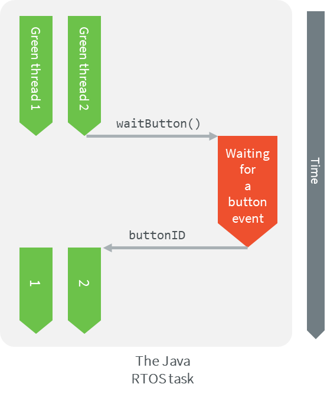
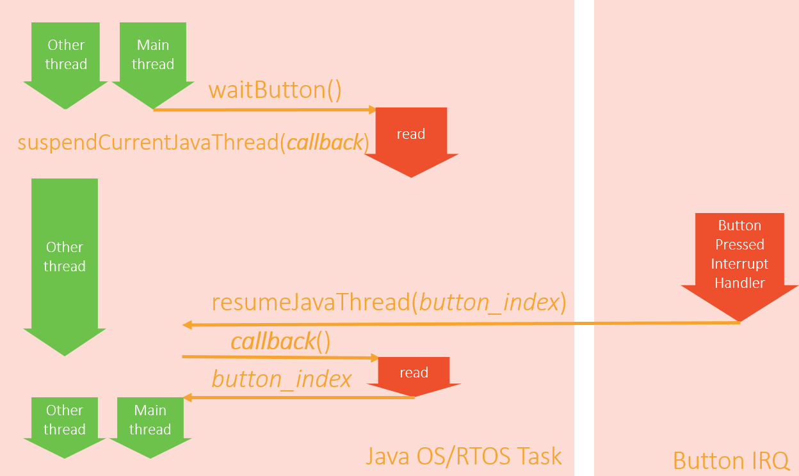

.. _tutorial_sni_non_blocking_call:

================================================
Implement a Blocking Java Native Method with SNI
================================================

This tutorial describes the good practices to follow when implementing a blocking native method in C.
A native method is a method declared in Java with the ``native`` keyword and implemented in C using the
:ref:`Simple Native Interface (SNI) <sni>`.

Intended Audience
=================

The audience for this document is Platform developers who want to implement abstraction layer interfaces.

Prerequisites
=============

The following document assumes the reader already has a setup ready to run a MicroEJ application on a target device.

The following document also assumes the reader is familiar with the :ref:`Simple Native Interface (SNI) <sni>` mechanism.
If not, the `CallingCFromJava <https://github.com/MicroEJ/Example-Standalone-Java-C-Interface/tree/master/CallingCFromJava/>`_ 
GitHub example shows the minimum steps required to create a Java program that makes a call to a C function via SNI.

Overview
========

The MicroEJ Core Engine implements a green thread architecture with all the Java threads executed within one single
RTOS/OS task. Thus, it embeds its own scheduler that controls the execution of the Java threads. 
With such an architecture, the MicroEJ Core Engine cannot preempt a Java thread that executes a native method.
Therefore a blocking native method will prevent the execution of other Java threads.
To mitigate the contention, a native method must explicitly yield its current use of the processor.

This tutorial will explain how to use SNI to implement a blocking Java native method without blocking the
execution of other Java threads.

Requirements
============

A MicroEJ Platform with (at least):

- EDC-1.3.
- SNI-1.4.

Example code
============

Let's start with a MicroEJ Application that calls a blocking Java method implemented in C.

The following example waits for a button event and prints the index of the pressed button.

The MicroEJ Application code:

.. code:: java

    package example;

    public class NativeCCallExample {

        public static void main(String[] args) {

            while (true) {
                System.out.println("Waiting for a button event...");
                int buttonIndex = waitButton();
                System.out.println("Button pressed: " + buttonIndex);
            }
        }

        public static native int waitButton();
    }

The C implementation of the ``waitButton()`` native has been written in pseudo-code.
It should be adapted according to the BSP of the target board.

.. code:: C

    #include "semaphore.h"    
    #include "sni.h"

    static int pressed_button_index;
    static Semaphore button_semaphore;

    void button_init(){
        button_semaphore = SemaphoreCreateBinary();
    }

    jint Java_example_NativeCCallExample_waitButton(){
        // Wait for a button event
        semaphoreTake(button_semaphore);
        return pressed_button_index;
    }

    /** Interrupt request handler called when a button is pressed. */
    int buttonIRQ(int button_index){
        pressed_button_index = button_index;
        semaphoreGiveFromISR(button_semaphore);
    }

Application behavior
--------------------

In this example, the execution of the ``waitButton()`` native method will block until a button is pressed. 
In other words, while ``Java_example_NativeCCallExample_waitButton()`` has not returned, no other Java thread can
be scheduled.

This is because the native function is called in the same RTOS/OS task as the Java application.

This schematic explains what is going on:

Implement a non-blocking method
===============================

This section will explain how to update the example code to make a non-blocking method.

Here is a summary of what will be done in C:
  
- Signal the MicroEJ Core Engine to suspend the current thread when the native function returns.
- Remove the blocking operations from the native function so that it returns immediately.
- Implement a callback function that returns the index of the pressed button.
- Register this callback function in the MicroEJ Core Engine to call it when the Java thread is resumed.
- Resume the Java thread when a button is pressed.

This schematic summarizes the steps described above:

Update the C native function implementation
-------------------------------------------

Step 1: Update the C native function
~~~~~~~~~~~~~~~~~~~~~~~~~~~~~~~~~~~~

The ``Java_example_NativeCCallExample_waitButton()`` function will now suspend the current Java thread. It will also
store the information required to resume it and return the index of the pressed button.

- Store the ID of the Java thread that called the function. This ID should be stored in a global variable.
  It is used to resume the Java thread when a button is pressed.

  .. code-block:: C
  
      java_thread_id = SNI_getCurrentJavaThreadID();

- Signal the MicroEJ Core Engine to suspend the current Java thread and specify the callback function to be called when
  the thread is resumed.
  Let's call the callback function ``waitButton_callback()``.
    
  .. code-block:: C
  
      SNI_suspendCurrentJavaThreadWithCallback(0, (SNI_callback*)waitButton_callback, NULL);

The function ``SNI_suspendCurrentJavaThreadWithCallback()`` returns immediately. The current thread is actually 
suspended when the native function returns. 

The value returned by the ``Java_example_NativeCCallExample_waitButton()`` doesn't matter anymore.
The callback function will be in charge of returning the value. 

The updated ``Java_example_NativeCCallExample_waitButton()`` function should look like this:

.. code:: C

    static int32_t java_thread_id;

    jint Java_example_NativeCCallExample_waitButton(){
        
        java_thread_id = SNI_getCurrentJavaThreadID();

        SNI_suspendCurrentJavaThreadWithCallback(0, (SNI_callback*)waitButton_callback, NULL);

        return SNI_IGNORED_RETURNED_VALUE; // Returned value not used
    }

Step 2: Update the Button interrupt function
~~~~~~~~~~~~~~~~~~~~~~~~~~~~~~~~~~~~~~~~~~~~

The role of the button interrupt is now to resume the Java thread when a button event occurs.
Update it this way:

.. code:: C

    int buttonIRQ(int button_index){    
        SNI_resumeJavaThreadWithArg(java_thread_id, button_index);
    }

The button's index is passed to the function ``SNI_resumeJavaThreadWithArg()`` so that the callback retrieves it
when the thread is resumed.

Step 3: Implement the callback function
~~~~~~~~~~~~~~~~~~~~~~~~~~~~~~~~~~~~~~~

The callback function must have the same signature as the SNI native (same parameters and return type):
``jint waitButton_callback()``.

The callback function is automatically called by the Java thread when it is resumed.
Use the ``SNI_getCallbackArgs()`` function to retrieve the arguments that was previously given to
the ``SNI_suspendCurrentJavaThreadWithCallback()`` or ``SNI_resumeJavaThreadWithArg()`` functions.

.. code:: C

    jint waitButton_callback()
    {
        int button_index;
        SNI_getCallbackArgs(NULL, (void*)&button_index);
        return (jint)button_index; // Actual value returned to Java
    }

Application behavior
--------------------

In this configuration, calling the  native method ``waitButton()`` will still return only when a button is pressed, 
but it will not prevent other Java threads from being scheduled.

..
   | Copyright 2021, MicroEJ Corp. Content in this space is free 
   for read and redistribute. Except if otherwise stated, modification 
   is subject to MicroEJ Corp prior approval.
   | MicroEJ is a trademark of MicroEJ Corp. All other trademarks and 
   copyrights are the property of their respective owners.
