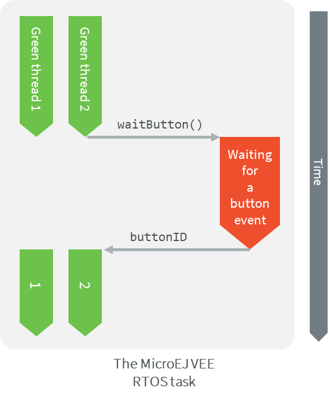
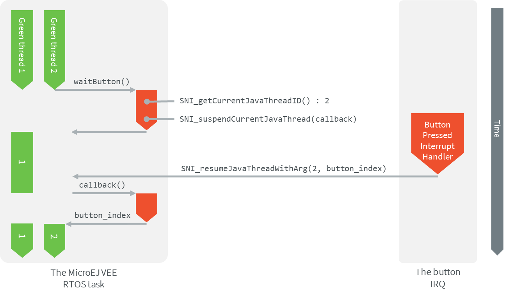

.. _tutorial_sni_non_blocking_call:

==========================================================
Make a Non-Blocking Call to a Java Native Method using SNI 
==========================================================

This tutorial describes all the steps to perform a non-blocking call to a Java method
implemented in C using the :ref:`Simple Native Interface (SNI) <sni>` mechanism.

Intended Audience
=================

The audience for this document is Platform engineers who want to
implement Low Level APIs for the Java Developers.

Prerequisites
=============

The following document assumes the reader already has a setup ready to run a MicroEJ application on a target device.

The following document also assumes the reader is familiar with the :ref:`Simple Native Interface (SNI) <sni>` mechanism.
If not, the `CallingCFromJava <https://github.com/MicroEJ/Example-Standalone-Java-C-Interface/tree/master/CallingCFromJava/>`_ 
GitHub example shows the minimum steps required to create a
Java program that makes a blocking call to a C function via the SNI interface.

Overview
========

This tutorial will show the minimum steps required to create a
Java program that makes a non-blocking call to a Java method
implemented in C, using the SNI interface.

Requirements
============

A MicroEJ Platform with (at least):

- EDC-1.3
- SNI-1.4

Example code
============

Let's start from a MicroEJ Application that makes a blocking call to a Java method
implemented in C.

The following example application waits for a button event and prints the event received.

The MicroEJ Application code:

.. code:: java

    package example;

    public class NativeCCallExample {

        public static void main(String[] args) {

            while (true) {
                System.out.println("Waiting for a button event..");
                int event = waitButton();
                System.out.println("New event received: " + event);
            }
        }

        public static native int waitButton();
    }

The C implementation of the ``waitButton()`` native has been written in pseudo code.
It should be adapted according to the BSP of the target board.

.. code:: C

    #include "semaphore.h"    
    #include "sni.h"

    int pressed_button;
    Semaphore button_semaphore;

    void button_init(){
        // Configure the GPIOs and the interrupts 
        button_semaphore = SemaphoreCreateBinary();
    }

    jint Java_example_NativeCCallExample_waitButton(){
        semaphoreTake(button_semaphore);
        return pressed_button;
    }

    int buttonIRQ(int button){
        pressed_button = button;
        semaphoreGiveFromISR(button_semaphore);
    }

Application behavior
--------------------

In this configuration, calling the ``waitButton()`` native function in the Java application will
block its execution as long as there are no button events. In other words, while the 
``Java_example_NativeCCallExample_waitButton()`` does not return.

This is because the native function is called in the same RTOS task that the Java application.

This schematic explains what is going on:

Implement a non-blocking call
=============================

This section will explain how to update the example code, in order to
make a non-blocking call.

Here is a summary of what will be done: 

- In the C implementation of the of the Java native method:
  
  - Suspend the Java thread that called the Java native method (the other threads will still run).
  - Remove all the blocking operations from it so that it returns directly.
  - Perform the blocking operations outside the Java task (ex: create a new RTOS task)

- Resume the Java thread when the blocking operations are done.
- Implement a callback function to return the computed value in the Java world.

This schematic summarizes the steps described above:

Update the C native function implementation
-------------------------------------------

Step 1: Update the C native function
~~~~~~~~~~~~~~~~~~~~~~~~~~~~~~~~~~~~

The role of the ``Java_example_NativeCCallExample_waitButton()`` function is now to delegate
the processing to an other function executed in an other RTOS task.

- Store the ID of the Java thread that called the function. This ID should be stored in a global variable.
  It will be used to resume this Java thread after the execution of the native function:

  .. code-block:: C
  
      java_thread_id = SNI_getCurrentJavaThreadID();

- Suspend the calling Java thread and add a callback function.
  Let's call the callback function ``waitButton_callback()``.
  It will be called when the Java thread will be resumed:
    
  .. code-block:: C
  
      SNI_suspendCurrentJavaThreadWithCallback(0, (SNI_callback*)waitButton_callback, NULL);

The value returned by the ``Java_example_NativeCCallExample_waitButton()`` doesn't matter anymore.
The callback function will be in charge to return the value. 

The updated ``Java_example_NativeCCallExample_waitButton()`` function should look like this:

.. code:: C

    int32_t java_thread_id;

    jint Java_example_NativeCCallExample_waitButton(){
        
        java_thread_id = SNI_getCurrentJavaThreadID();

        SNI_suspendCurrentJavaThreadWithCallback(0, (SNI_callback*)waitButton_callback, NULL);

        return SNI_IGNORED_RETURNED_VALUE;
    }

Step 2 : Update the Button interrupt function
~~~~~~~~~~~~~~~~~~~~~~~~~~~~~~~~~~~~~~~~~~~~~

The role of the button interrupt is now to wake up the Java thread when a button event occurs.
Update it this way:

.. code:: C

    int buttonIRQ(int button){    
        SNI_resumeJavaThreadWithArg(java_thread_id, button);
    }

Step 3 : Implement the callback function
~~~~~~~~~~~~~~~~~~~~~~~~~~~~~~~~~~~~~~~~

The callback function must have the same signature that the SNI native, in this case:
``jint waitButton_callback()``.

The callback function is automatically called by the Java thread when it is resumed.
Use the ``SNI_getCallbackArgs()`` function to retrieve the arguments given to an SNI callback
with the ``SNI_suspendCurrentJavaThreadWithCallback()`` function.

.. code:: C

    jint waitButton_callback()
    {
        int button;
        SNI_getCallbackArgs(NULL, (void*)&button);
        return (jint)button;
    }

Application behavior
--------------------

In this configuration, calling the ``waitButton()`` native function will only block the Java thread that called
the function as long as there are no button events. The other threads will still run.

..
   | Copyright 2021, MicroEJ Corp. Content in this space is free 
   for read and redistribute. Except if otherwise stated, modification 
   is subject to MicroEJ Corp prior approval.
   | MicroEJ is a trademark of MicroEJ Corp. All other trademarks and 
   copyrights are the property of their respective owners.
