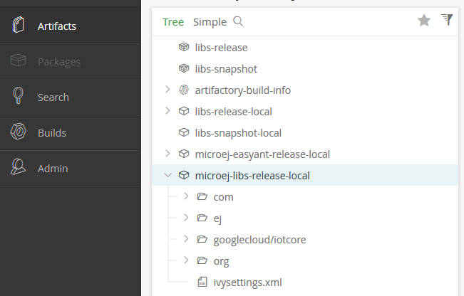

Build and deployment automation using Jenkins and Artifactory
=============================================================

This tutorial details the creation of an environment for automating build and deployment of MicroEJ modules.
Using Jenkins for build automation and Artifactory for artifacts repository management, this environment improves productivity across your development ecosystem.
Among other benefits, it will ease building modules when sources change, saving build results,
reproducing builds, or archiving binaries.

Requirements
------------

*  MicroEJ SDK ``4.1.5`` or higher.
*  Git ``2.x`` installed, with Git executable in path. We recommend installing Git Bash if your operating system is Windows (`<https://git-for-windows.github.io/>`_).
*  Apache Ant ``1.9.x`` installed (`<https://ant.apache.org/bindownload.cgi>`_).
*  Java Development Kit (JDK) ``1.8.x``.

Set JDK location
----------------

#. Locate your JDK installation directory (typically something like ``C:\Program Files\Java\jdk1.8.0_[version]`` on Windows).
#. Set the environment variable ``JAVA_HOME`` to point to the ``bin`` directory (for exemple ``C:\Program Files\Java\jdk1.8.0_[version]\bin``).
#. Set the environment variable ``JRE_HOME`` to point to the ``jre`` directory (for exemple ``C:\Program Files\Java\jdk1.8.0_[version]\jre``).

.. _get-microej-cli-toolkit:

Get MicroEJ CLI toolkit
-----------------------

The MicroEJ CLI toolkit contains the Easyant entrypoints for building MicroEJ modules from the command line.
Get it by cloning the git repository `<https://gitlab.cross/M0090_IDE/M0090_SDK-CLI>`_ (:guilabel:`TODO` change with github ref when available)

.. code-block:: sh
   
   git clone --recursive -b feature/M0090IDE-3367_build_from_command_line  https://gitlab.cross/M0090_IDE/M0090_SDK-CLI.git
   /!\ TODO change with github ref when available /!\

.. _extract-microej-build-repository: 

Extract MicroEJ Build Kit
-------------------------

MicroEJ SDK comes with its own toolkit for building modules. Depending on your MicroEJ SDK version, extracting the build kit from the SDK will differ.

Determine your MicroEJ SDK version
~~~~~~~~~~~~~~~~~~~~~~~~~~~~~~~~~~

- Start MicroEJ SDK.
- Go to :guilabel:`Help` > :guilabel:`About MicroEJ SDK`.

In case of MicroEJ SDK ``4.1.x``, the MicroEJ SDK version is directly displayed, such as ``4.1.5``.

In case of MicroEJ SDK ``5.x``, the value displayed is the MicroEJ SDK distribution, such as ``19.05`` or ``20.07``.
Then proceed with the following steps:

- Click on the :guilabel:`Installation Details` button.
- Click on the :guilabel:`Installed Software` tab.
- Retrieve the version of entry named :guilabel:`MicroEJ SDK`.

MicroEJ 5.2 or later
~~~~~~~~~~~~~~~~~~~~
 
#. Go to the root directory of the MicroEJ CLI toolkit.
#. Create a directory named ``buildKit``.
#. In the SDK, go to :guilabel:`Window` > :guilabel:`Preferences` > :guilabel:`MicroEJ` > :guilabel:`Module Manager`.
#. In subsection :guilabel:`Build repository`, click on :guilabel:`Export Build Kit`.
#. As :guilabel:`Target directory`, choose the ``buildKit`` directory.

MicroEJ 5.1 or earlier
~~~~~~~~~~~~~~~~~~~~~~

#. Go to the root directory of the MicroEJ CLI toolkit.
#. Create a directory named ``buildKit``.
#. Create a sub-directory named ``ant`` in the ``buildKit`` directory.
#. Locate your SDK installation directory (by default, on Windows: ``C:/Program Files/MicroEJ/MicroEJ SDK-[version]``).
#. Within the SDK installation directory, go to the bundled RCP plugins directory (``/rcp/plugins/``).
#. Extract the toolkit runtime:
    #. Open the file ``com.is2t.eclipse.plugin.easyant4e_[version].jar`` with an archive manager.
    #. Extract the directory ``lib`` to the ``buildKit/ant/`` directory.
#. Extract the toolkit repositories:
    #. Open the file ``com.is2t.eclipse.plugin.easyant4e.offlinerepo_[version].jar`` with an archive manager
    #. Navigate to directory ``repositories``
    #. Extract the file ``microej-build-repository.zip`` (or ``is2t_repo.zip`` for MicroEJ SDK 4.1.x) to the ``buildKit`` directory.

.. note::
   At this point, the content of the directory ``buildKit`` should look like the following:
   ::

    buildKit
    ├── ant
    │   └── lib
    │        ├── ant.jar
    │        ├── ant-launcher.jar
    │        └── ...
    └── microej-build-repository.zip (or is2t_repo.zip)

.. _get-microej-central-repository:

Get MicroEJ Central Repository
------------------------------

In the following, we will use the MicroEJ Central Repository, which is the Module Repository used by MicroEJ SDK to fetch dependencies when starting an empty workspace.
It bundles Foundation Library APIs and numerous Add-On Libraries to start working in a MicroEJ development environment.

To get more information about Module Repositories, please refer to the `Application Developer Guide <https://docs.microej.com/en/latest/ApplicationDeveloperGuide/repository.html>`_.

Next step is to import a local copy of this repository:

#. Visit the `Central Repository <https://developer.microej.com/central-repository/>`_ on the MicroEJ Developer website.
#. Navigate to the :guilabel:`Working Offline` section.
#. Click on the :guilabel:`offline repository` link. This will download the Central Repository as a zip file.

Setup Artifactory
-----------------

Installation and first start
~~~~~~~~~~~~~~~~~~~~~~~~~~~~

#. Download Artifactory here: `<https://api.bintray.com/content/jfrog/artifactory/jfrog-artifactory-oss-$latest.zip;bt_package=jfrog-artifactory-oss-zip>`_.
#. Unzip downloaded archive, then navigate to ``bin`` directory (by default
   ``artifactory-oss-[version]/bin``).
#. Run ``artifactory.bat`` or ``artifactory.sh`` depending on your operating system. After initialization, the terminal should print the message :guilabel:`Artifactory successfully started`. 
   In case an error occurs, check that ``JAVA_HOME`` and ``JRE_HOME`` environment variables are correct.
#. Go to `<http://localhost:8081/>`_.
#. Login to Artifactory for the first time using the default ``admin`` account (Username: ``admin``, Password: ``password``).
#. On the :guilabel:`Welcome` wizard, set the administrator password, then click :guilabel:`Next`,
#. Configure proxy server (if any) then click :guilabel:`Next`, or click :guilabel:`Skip`.
#. On :guilabel:`Create Repositories` page, select :guilabel:`Maven` then click on :guilabel:`Create`.
#. Click on :guilabel:`Finish`. 

Artifactory is up and running.

General configuration
~~~~~~~~~~~~~~~~~~~~~

For demonstration purposes we will allow anonymous users to deploy modules in the repositories.

#. Go to :guilabel:`Admin` > :guilabel:`Security` > :guilabel:`Security Configuration`.
#. In the :guilabel:`General Security Settings` section, check :guilabel:`Allow Anonymous Access`. Click :guilabel:`Save`.
#. Go to :guilabel:`Admin` > :guilabel:`Security` > :guilabel:`Permissions`.
#. Click on :guilabel:`Anything` entry (do not check the line), then go to :guilabel:`Users` tab, click on :guilabel:`Anonymous` and check :guilabel:`Deploy/Cache` permission. Click :guilabel:`Save and finish`.

Next steps will involve uploading large files, so we'll set the file upload maximum size accordingly:

#. Go to :guilabel:`Admin` > :guilabel:`General Configuration`.
#. In the :guilabel:`General Settings` section, change the value of :guilabel:`File Upload Max Size (MB)` to ``500`` then click on :guilabel:`Save`.

Manage repositories
~~~~~~~~~~~~~~~~~~~

First step is to configure pre-defined repositories.

#. Go to :guilabel:`Admin` > :guilabel:`Repositories` > :guilabel:`Local`.
#. Click on ``libs-snapshot-local`` repository, then check :guilabel:`Handle Releases` and uncheck :guilabel:`Handle Snapshots`. Click :guilabel:`Save and finish`.

Next step is to create the repositories that will hold the MicroEJ modules.

#. Go to :guilabel:`Admin` > :guilabel:`Repositories` > :guilabel:`Local`.
#. Click on :guilabel:`New`, and select :guilabel:`Maven`.
#. Set :guilabel:`Repository Key` field to ``microej-libs-release-local``, then uncheck :guilabel:`Handle Snapshots`. Click on :guilabel:`Save and finish`.
#. Click on :guilabel:`New`, and select :guilabel:`Maven`.
#. Set :guilabel:`Repository Key` field to ``microej-easyant-release-local``, then uncheck :guilabel:`Handle Snapshots`. Click on :guilabel:`Save and finish`.
#. Make these two repositories fetchable:
    #. Go to :guilabel:`Admin` > :guilabel:`Security` > :guilabel:`Permissions`. 
    #. Click on :guilabel:`Anything` entry (do not check the line)
    #. On the :guilabel:`Resources` tab, drag repositories ``microej-libs-release-local`` and ``microej-easyant-release-local`` from the :guilabel:`Available repositories` area to :guilabel:`Included Repositories` area.
    #. Click on :guilabel:`Save & Finish`.

Import MicroEJ modules
~~~~~~~~~~~~~~~~~~~~~~

In this section, we'll import MicroEJ modules into Artifactory to make them available to the build server.

#. Go to :guilabel:`Admin` > :guilabel:`Import & Export` > :guilabel:`Repositories`.
#. Scroll to the :guilabel:`Import Repository from Zip` section.
#. Import the MicroEJ Central Repository:
    #. As :guilabel:`Target Local Repository`, select ``microej-libs-release-local`` in the list.
    #. As :guilabel:`Repository Zip File`, select MicroEJ Central Repository zip file (``microej-[MicroEJ version]-[version].zip``) that you downloaded earlier (please refer to section :ref:`get-microej-central-repository`).
    #. Click :guilabel:`Upload`. At the end of upload, click on :guilabel:`Import`. Upload and import may take some time.

#. Import the MicroEJ Build Repository:
    #. As :guilabel:`Target Local Repository`, select ``microej-easyant-release-local`` in the list.
    #. As :guilabel:`Repository Zip File`, select MicroEJ Build Repository zip file (``microej-build-repository.zip`` or ``is2t_repo.zip``) that you extracted earlier (please refer to section :ref:`extract-microej-build-repository`).
    #. Click :guilabel:`Upload`. At the end of upload, click on :guilabel:`Import`. Upload and import may take some time.

Artifactory is now hosting required MicroEJ modules. 
Go to :guilabel:`Artifacts` and check that repositories ``microej-libs-release-local`` and ``microej-easyant-release-local`` do contain modules as shown in the figure below.

      

Setup Jenkins
-------------

Installation
~~~~~~~~~~~~

#. Download Jenkins WAR (Web Archive) here: `<http://mirrors.jenkins.io/war-stable/latest/jenkins.war>`_
#. Open a terminal and type the following command: ``java -jar [path/to/downloaded/jenkinswar]/jenkins.war``. 
   After initialization, the terminal will print out :guilabel:`Jenkins is fully up and running`.
#. Go to `<http://localhost:8080/>`_.
#. To unlock Jenkins, copy/paste the generated password that has been written in the terminal log. Click on :guilabel:`Continue`.
#. Select option :guilabel:`Install suggested plugins` and wait for plugin
   installation.
#. Fill in the :guilabel:`Create First Admin User` form. Click :guilabel:`Save and continue`.
#. Click on :guilabel:`Save and finish`, then on :guilabel:`Start using Jenkins`.

Configuration
~~~~~~~~~~~~~

First step is to configure JDK and Ant installations:

#. Go to :guilabel:`Manage Jenkins` > :guilabel:`Global Tool Configuration`.
#. Add JDK installation:
    #. Scroll to :guilabel:`JDK` section.
    #. Click on :guilabel:`Add JDK`.
    #. Set :guilabel:`Name` to ``JDK [jdk_version]`` (for example ``JDK 1.8``).
    #. Uncheck :guilabel:`Install automatically`.
    #. Set :guilabel:`JAVA_HOME` to ``path/to/jdk[jdk_version]`` (for example ``C:\Program Files\Java\jdk1.8.0_[version]`` on Windows).
#. Add Ant installation:
    #. Scroll to :guilabel:`Ant` section.
    #. Click on :guilabel:`Add Ant`.
    #. Set :guilabel:`Name` to ``Ant 1.9``.
    #. Uncheck :guilabel:`Install automatically`.
    #. Set :guilabel:`ANT_HOME` to ``path/to/apache-ant-1.9.[version]``.
#. Click on :guilabel:`Save`.

Next step is to configure  environment variables:

#. Go to :guilabel:`Manage Jenkins` > :guilabel:`Configure System`.
#. Scroll to :guilabel:`Global properties` section.
#. Check :guilabel:`Environment variables`.
#. Add variable ``MICROEJ_BUILD_TOOLS_HOME``:
    #. Click :guilabel:`Add`.
    #. Set :guilabel:`Name` to ``MICROEJ_BUILD_TOOLS_HOME``.
    #. Set :guilabel:`Value` to be the path to the MicroEJ CLI toolkit directory (as defined in :ref:`get-microej-cli-toolkit`)
#. Add variable ``EASYANT_HOME``:
    #. Click :guilabel:`Add`.
    #. Set :guilabel:`Name` to ``EASYANT_HOME``.
    #. Set :guilabel:`Value` to be the path to the ``ant`` directory of the ``buildKit`` directory (as defined in :ref:`extract-microej-build-repository`).
#. For Windows users, scroll to :guilabel:`Shell` section and set the path to the :guilabel:`Shell executable` (for example ``C:\Program Files\Git\bin\sh.exe``).
#. Click on :guilabel:`Save`.

Create a job template
~~~~~~~~~~~~~~~~~~~~~

The main advantage of using EasyAnt is to move build logic into build-types, which are equivalent of Maven archetypes. 
It allows to define a generic job in Jenkins that will handle all EasyAnt builds.

#. Go to Jenkins dashboard.
#. Click on :guilabel:`New item` to create a job template.
#. Set item name to ``Template - EasyAnt from Git``.
#. Select :guilabel:`Freestyle project`.
#. Click on :guilabel:`Ok`. 
    
Jenkins jobs are highly configurable, following options and values are recommended by MicroEJ, but they can be customized at your convenience.

In :guilabel:`General` tab:

#. Check :guilabel:`Discard old builds` and set :guilabel:`Max # of builds to keep`` value to ``15``.
#. Check :guilabel:`This project is parametrized` and add :guilabel:`String parameter` named ``easyant.module.dir`` with default value to ``$WORKSPACE/TO_REPLACE``. This will later point to the module sources.
#. Click on :guilabel:`Advanced` button, and check :guilabel:`Block build when upstream project is building`.

In :guilabel:`Source Code Management` tab:

#. Select :guilabel:`Git` source control:
#. Set :guilabel:`Repository URL` value to ``TO_REPLACE``,
#. Set :guilabel:`Branch Specifier` value to ``origin/master``,
#. In :guilabel:`Additional Behaviours`, click on :guilabel:`Add`, select :guilabel:`Advanced sub-modules behaviors`, then check :guilabel:`Recursively update submodules`.

In :guilabel:`Build triggers` tab:
 
#. Check :guilabel:`Poll SCM`, and set a CRON-like value (for example ``H/30 * * * *`` to poll SCM for changes every 30 minutes).

In :guilabel:`Build Environment` tab:
    
#. Check :guilabel:`Delete workspace before build starts`.
#. Check :guilabel:`Add timestamps to the Console Output`.

In :guilabel:`Build` tab:

#. Add build step :guilabel:`Execute shell` and set command to ``git clone $MICROEJ_BUILD_TOOLS_HOME -b feature/M0090IDE-3367_build_from_command_line build-tools``. (:guilabel:`TODO` replace this temp branch name with ``master`` when git repo is published)
#. Add build step :guilabel:`Invoke Ant`:
    * As :guilabel:`Ant version`, select ``Ant 1.9``.
    * Set :guilabel:`Targets` to value ``-lib ${EASYANT_HOME}/lib``.
    * In :guilabel:`Advanced`, set :guilabel:`Build file` to value ``$WORKSPACE/build-tools/easyant/build-module.ant``.
    * In :guilabel:`Advanced`, expand :guilabel:`Properties` text field then add the following Ant properties:

    ::

     personalBuild=false
     jenkins.build.id=$BUILD_ID
     jenkins.node.name=$NODE_NAME
     is2t.ivysettings.file=$MICROEJ_BUILD_TOOLS_HOME/ivy/ivysettings-artifactory.xml

In :guilabel:`Post-build actions` tab:
    
#. Add post-build action :guilabel:`Publish JUnit test result report`:
#. Set :guilabel:`Test report XMLs` to ``**/target~/test/xml/**/test-report.xml, **/target~/test/xml/**/*Test.xml``.
#. Check :guilabel:`Retain long standard output/error`.
#. Check :guilabel:`Do not fail the build on empty test results`

Finally, click on :guilabel:`Save`.

Build a module
--------------

Since your environment is now setup, it is time to build your first module using EasyAnt, Jenkins and Artifactory. 
Let’s build an "Hello World" Sandboxed Application project.

Create a new MicroEJ module
~~~~~~~~~~~~~~~~~~~~~~~~~~~

In this example, we will create a very simple module using the Sandbox Application buildtype (``build-application``) that we'll push to a Git repository.

.. note::
   For demonstration purposes, we'll create a new project and share it on a local Git bare repository.
   You can adapt the following sections to use an existing MicroEJ project and your own Git repository.

#. Start MicroEJ SDK. 
#. Go to :guilabel:`File` > :guilabel:`New` > :guilabel:`MicroEJ Sandboxed Application Project`.
#. Fill in the template fields, set :guilabel:`Project name` to ``com.example.hello-world``.
       
    .. image:: images/tuto_microej_cli_hello_world.PNG
        :align: center

#. Click :guilabel:`Finish`. This will create the project files and structure.
#. Right-click on source folder ``src/main/java`` and select :guilabel:`New` > :guilabel:`Package`. Set a name to the package and click :guilabel:`Finish`.
#. Right-click on the new package and select :guilabel:`New` > :guilabel:`Class`. Set a name to the class and check ``public static void main(String[] args)``, then click :guilabel:`Finish`.
#. Locate the project files
    #. In the :guilabel:`Package Explorer` view, right-click on the project then click on :guilabel:`Properties`.
    #. Select :guilabel:`Resource` menu.
    #. Click on the arrow button on line :guilabel:`Location` to show the project in the system explorer.
#. Open a terminal from this directory and type the following commands:

.. code-block:: sh

   git init --bare ~/hello_world.git
   git init
   git remote add origin ~/hello_world.git
   git add com.example.hello-world
   git commit -m "Add Hello World application"
   git push --set-upstream origin master

.. note::
   For more details about MicroEJ applications development, refer to the `Application Developer Guide <https://docs.microej.com/en/latest/ApplicationDeveloperGuide/index.html>`_.

Create an new instance of the template job
~~~~~~~~~~~~~~~~~~~~~~~~~~~~~~~~~~~~~~~~~~

Start by creating a new job, from the job template, for building our application.

#. Go to Jenkins dashboard.
#. Click on :guilabel:`New Item`.
#. Set item name to ``Hello World``.
#. In :guilabel:`Copy from` field, type ``Template - EasyAnt from Git`` (autocomplete enabled).
#. Validate with :guilabel:`Ok` button.

The job configuration page opens, let's replace all the ``TO_REPLACE`` placeholders from the job template with correct values:

#. In :guilabel:`General` tab, set ``easyant.module.dir`` to value ``$WORKSPACE/com.example.hello-world``.
#. In :guilabel:`Source Code Management`, edit :guilabel:`Repository URL` to ``~/hello_world.git``.
#. Click on :guilabel:`Save`.

Build the "Hello World" application
~~~~~~~~~~~~~~~~~~~~~~~~~~~~~~~~~~~

Let's run the job!

In Jenkins' ``Hello World`` dashboard, click on :guilabel:`Build with Parameters`, then click on :guilabel:`Build`. 

.. note::
   You can check the build progress by clicking on the build progress bar and showing the :guilabel:`Console Output`.

At the end of the build, the module is published to `<http://localhost:8081/artifactory/list/libs-snapshot-local/com/example/hello-world/>`_.

Congratulations!

At this point of the tutorial:

* Artifactory is hosting your module builds and MicroEJ modules. 
* Jenkins automates the build process using EasyAnt.

The next steps recommended are:

* Adapt Jenkins/Artifactory/EasyAnt configuration to your development ecosystem.

Appendix
--------

This section discusses some of the customization options.

Add a custom certificate
~~~~~~~~~~~~~~~~~~~~~~~~

In case your Artifactory instance uses a custom SSL certificate, you might fall into this error when fetching dependencies:

.. code-block::

   HttpClientHandler: sun.security.validator.ValidatorException: PKIX path building failed: sun.security.provider.certpath.SunCertPathBuilderException: unable to find valid certification path to requested target url=[artifactory address]

This is because the authority is unknown from a Java perspective. To make it trusted, you have to edit the trust store of the JRE/JDK that is running your builds.

#. Install `Keystore Explorer <http://keystore-explorer.org/downloads.html>`_.
#. Start Keystore Explorer, and open file ``[JDK home]/jre/lib/security/cacerts`` with the password ``changeit``. You may not have the right to modify this file. Edit rights if needed before opening it.
#. Click on :guilabel:`Tools`, then :guilabel:`Import Trusted Certificate`.
#. Select your certificate.
#. Save the ``cacerts`` file.
