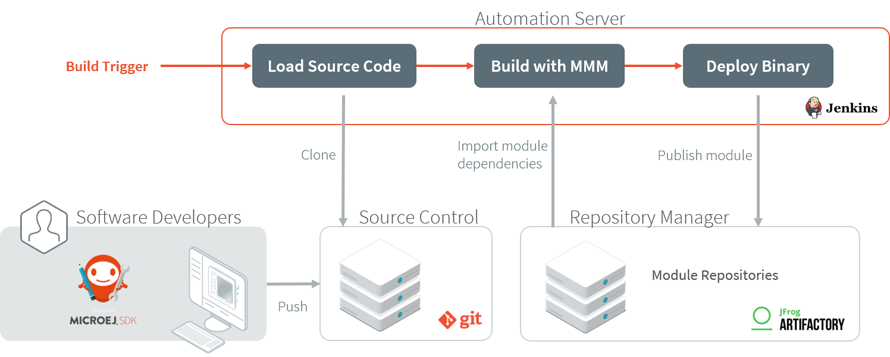
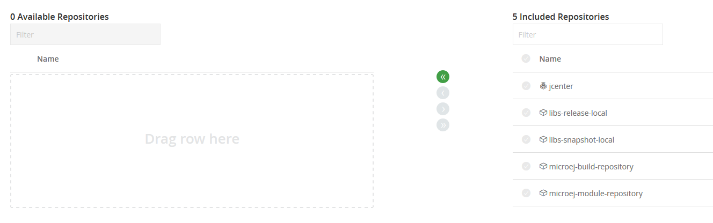
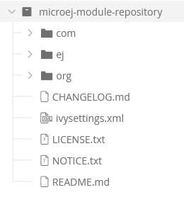

.. _tutorial_setup_automated_build_using_jenkins_and_artifactory:

Setup an Automated Build using Jenkins and Artifactory
======================================================

This tutorial explains how to setup an environment for automating :ref:`MicroEJ Module build <mmm>` and deployment using `Jenkins <https://www.jenkins.io/>`_
and `JFrog Artifactory <https://jfrog.com/artifactory/>`_.

Such environment setup facilitates continuous integration (CI) and continuous delivery (CD), which improves productivity across your development ecosystem,
by automatically:

* building modules when source code changes
* saving build results
* reproducing builds
* archiving binary modules

The tutorial should take 2 hours to complete.

Intended Audience
-----------------

The audience for this document is engineers who are in charge of integrating
:ref:`MicroEJ Module Manager (MMM) <mmm>` to their continuous integration environment.

In addition, this tutorial should be of interest to all developers
wishing to understand how MicroEJ works with headless module builds.

For those who are only interested by command line module build, consider using the :ref:`MMM Command Line Interface <mmm_cli>`.

Introduction
------------

The overall build and deployment flow of a module can be summarized as follows:

#. Some event triggers the build process (i.e module source changed, user action, scheduled routine, etc.)
#. The module source code is retrieved from the Source Control System
#. The module dependencies are imported from the Repository Manager
#. The Automation Server then proceeds to building the module
#. If the build is successful, the module binary is deployed to the Repository Manager

Prerequisites
-------------

*  `MicroEJ SDK <https://developer.microej.com/get-started/>`_ ``5.4.0`` or higher.
*  Git ``2.x`` installed, with Git executable in path. We recommend installing Git Bash if your operating system is Windows (`<https://git-for-windows.github.io/>`_).
*  Java Development Kit (JDK) ``1.8.x``.

This tutorial was tested with Jenkins ``2.277.4`` and Artifactory ``6.23.13``.

.. note::
    For SDK versions before 5.4.0, please refer to this `MicroEJ Documentation Archive <https://docs.microej.com/_/downloads/en/20201009/pdf/>`_.

Overview
--------

The next sections describe step by step how to setup the build environment and build your first MicroEJ module.

The steps to follow are:

#. Install and setup MicroEJ build tools, Jenkins and Artifactory
#. Create a Jenkins job template for MMM builds
#. Create a simple MicroEJ module (Hello World)
#. Create a new Jenkins job for the Hello World module
#. Build the module

In order to simplify the steps, this tutorial will be performed locally on a single machine.

Artifactory will host MicroEJ modules in 2 repositories:

- ``microej-module-repository``: repository initialized with pre-built MicroEJ modules, a mirror of the :ref:`Central Repository <central_repository>`
- ``libs-snapshot-local``: repository where custom modules will be published

Install the Build Tools
-----------------------

This section assumes the prerequisites have been properly installed.

#. Locate your JDK installation directory (typically something like ``C:\Program Files\Java\jdk1.8.0_[version]`` on Windows).
#. Set the environment variable ``JAVA_HOME`` to point to this directory.
#. Set the environment variable ``JRE_HOME`` to point to the ``jre`` directory (for example ``C:\Program Files\Java\jdk1.8.0_[version]\jre``).
#. Create a directory named ``buildKit``.
#. Export the MicroEJ build kit from your MicroEJ SDK version to the ``buildKit`` directory, by following the steps described :ref:`here <mmm_build_kit>`.
#. Edit the file ``buildKit/microej-module-repository/ivysettings.xml`` and replace its content by:

.. literalinclude:: resources/ivysettings-artifactory.xml
    :language: xml

This file configures MicroEJ Module Manager to import and publish modules from the Artifactory repositories described in this tutorial. Please refer to :ref:`mmm_settings_file` section for more details.

.. note::
   At this point, the content of the directory ``buildKit`` should look like the following:
   ::
    
    buildKit
    ├── bin
    │   ├── mmm
    │   └── mmm.bat
    ├── conf
    │   └── easyant-conf.xml
    ├── lib
    │   ├── ant.jar
    │   └── ...
    ├── microej-build-repository
    │   ├── ant-contrib
    │   ├── be
    │   └── ...
    ├── microej-module-repository
    │   └── ivysettings.xml
    └── release.properties

.. _get_microej_module_repository:

Get a Module Repository
-----------------------

A Module Repository is a portable ZIP file that bundles a set of modules for extending the MicroEJ development environment.
Please consult the :ref:`Module Repository <module_repository>` section for more information.

This tutorial uses the MicroEJ Central Repository, which is the Module Repository used by MicroEJ SDK to fetch dependencies when starting an empty workspace. 
It bundles Foundation Library APIs and numerous Add-On Libraries.

Next step is to download a local copy of this repository:

#. Visit the `Central Repository <https://developer.microej.com/central-repository/>`_ on the MicroEJ Developer website.
#. Navigate to the :guilabel:`Working Offline` section.
#. Click on the :guilabel:`offline repository` link. This will download the Central Repository as a ZIP file.

Setup Artifactory
-----------------

Install and Start Artifactory
~~~~~~~~~~~~~~~~~~~~~~~~~~~~~

#. Download Artifactory here: `<https://api.bintray.com/content/jfrog/artifactory/jfrog-artifactory-oss-$latest.zip;bt_package=jfrog-artifactory-oss-zip>`_.
#. Unzip downloaded archive, then navigate to ``bin`` directory (by default
   ``artifactory-oss-[version]/bin``).
#. Run ``artifactory.bat`` or ``artifactory.sh`` depending on your operating system. After initialization, the terminal should print the message :guilabel:`Artifactory successfully started`. 
   In case an error occurs, check that ``JAVA_HOME`` and ``JRE_HOME`` environment variables are correct.
#. Go to ``http://localhost:8081/``.
#. Login to Artifactory for the first time using the default ``admin`` account (Username: ``admin``, Password: ``password``).
#. On the :guilabel:`Welcome` wizard, set the administrator password, then click :guilabel:`Next`,
#. Configure proxy server (if any) then click :guilabel:`Next`, or click :guilabel:`Skip`.
#. On :guilabel:`Create Repositories` page, select :guilabel:`Maven` then click on :guilabel:`Create`.
#. Click on :guilabel:`Finish`. 

Artifactory is up and running.

Configure Artifactory
~~~~~~~~~~~~~~~~~~~~~

For demonstration purposes we will allow anonymous users to deploy modules in the repositories.

#. Go to :guilabel:`Admin` > :guilabel:`Security` > :guilabel:`Security Configuration`.
#. In the :guilabel:`General Security Settings` section, check :guilabel:`Allow Anonymous Access`. Click :guilabel:`Save`.
#. Go to :guilabel:`Admin` > :guilabel:`Security` > :guilabel:`Permissions`.
#. Click on :guilabel:`Anything` entry (do not check the line), then go to :guilabel:`Users` tab, click on :guilabel:`Anonymous` and check :guilabel:`Deploy/Cache` permission. Click :guilabel:`Save and finish`.

Next steps will involve uploading large files, so we have to augment the file upload maximum size accordingly:

#. Go to :guilabel:`Admin` > :guilabel:`General Configuration`.
#. In the :guilabel:`General Settings` section, change the value of :guilabel:`File Upload Max Size (MB)` to ``1024`` then click on :guilabel:`Save`.

Configure Repositories
~~~~~~~~~~~~~~~~~~~~~~

We will now create and configure the repositories.
First step is to configure to pre-defined repository for the future snapshot modules built.

#. Go to :guilabel:`Admin` > :guilabel:`Repositories` > :guilabel:`Local`.
#. Click on ``libs-snapshot-local`` repository, then check :guilabel:`Handle Releases` and uncheck :guilabel:`Handle Snapshots`. Click :guilabel:`Save and finish`.

Next step is to create the repositories that will hold the MicroEJ modules.

#. Go to :guilabel:`Admin` > :guilabel:`Repositories` > :guilabel:`Local`.
#. Click on :guilabel:`New`, and select :guilabel:`Maven`.
#. Set :guilabel:`Repository Key` field to ``microej-module-repository``, then uncheck :guilabel:`Handle Snapshots`. Click on :guilabel:`Save and finish`.
#. Make this repository accessible by default:
    #. Go to :guilabel:`Admin` > :guilabel:`Security` > :guilabel:`Permissions`. 
    #. Click on :guilabel:`Anything` entry (do not check the line)
    #. On the :guilabel:`Resources` tab, drag repository ``microej-module-repository`` from the :guilabel:`Available repositories` area to the :guilabel:`Included Repositories` area.
    #. Click on :guilabel:`Save & Finish`.

Import MicroEJ Repositories
~~~~~~~~~~~~~~~~~~~~~~~~~~~

In this section, we will import MicroEJ repositories into Artifactory repositories to make them available to the build server.

#. Go to :guilabel:`Admin` > :guilabel:`Import & Export` > :guilabel:`Repositories`.
#. Scroll to the :guilabel:`Import Repository from Zip` section.
#. Import the MicroEJ Module Repository:
    #. As :guilabel:`Target Local Repository`, select ``microej-module-repository`` in the list.
    #. As :guilabel:`Repository Zip File`, select MicroEJ module repository zip file (``microej-[MicroEJ version]-[version].zip``) that you downloaded earlier (please refer to section :ref:`get_microej_module_repository`).
    #. Click :guilabel:`Upload`. At the end of upload, click on :guilabel:`Import`. Upload and import may take some time.

Artifactory is now hosting all required MicroEJ modules. 
Go to :guilabel:`Artifacts` and check that the repository ``microej-module-repository`` does contain modules as shown in the figure below.

      
Setup Jenkins
-------------

Install Jenkins
~~~~~~~~~~~~~~~

#. Download Jenkins here: `<https://www.jenkins.io/download/>`_. In this tutorial we will use the WAR (Web Archive), but you can use any other installation package (Docker, Ubuntu/Debian, ...).
#. Open a terminal and type the following command: ``java -jar [path/to/downloaded/jenkinswar]/jenkins.war``. 
   After initialization, the terminal will print out :guilabel:`Jenkins is fully up and running`.
#. Go to ``http://localhost:8080/``.
#. To unlock Jenkins, copy/paste the generated password that has been written in the terminal log. Click on :guilabel:`Continue`.
#. Select option :guilabel:`Install suggested plugins` and wait for plugins
   installation.
#. Fill in the :guilabel:`Create First Admin User` form. Click :guilabel:`Save and continue`.
#. Click on :guilabel:`Save and finish`, then on :guilabel:`Start using Jenkins`.

Configure Jenkins
~~~~~~~~~~~~~~~~~

First step is to configure the JDK and MMM paths:

#. Go to :guilabel:`Manage Jenkins` > :guilabel:`Global Tool Configuration`.
#. Add JDK installation:
    #. Scroll to :guilabel:`JDK` section.
    #. Click on :guilabel:`Add JDK`.
    #. Set :guilabel:`Name` to ``JDK [jdk_version]`` (for example ``JDK 1.8``).
    #. Uncheck :guilabel:`Install automatically`.
    #. Set :guilabel:`JAVA_HOME` to the absolute path of your JDK installation (for example ``C:\Program Files\Java\jdk1.8.0_[version]`` on Windows).
#. Click on :guilabel:`Save`.
#. Go to :guilabel:`Manage Jenkins` > :guilabel:`Configure System`.
    #. Scroll to :guilabel:`Global properties` section.
    #. Check :guilabel:`Environment variables`.
    #. Click on :guilabel:`Add`.
    #. Set :guilabel:`Name` to ``MICROEJ_BUILD_KIT_HOME``.
    #. Set :guilabel:`Value` to the absolute path of the ``buildKit`` folder.
#. Click on :guilabel:`Save`.

Create a Job Template
~~~~~~~~~~~~~~~~~~~~~

#. Go to Jenkins dashboard.
#. Click on :guilabel:`New item` to create a job template.
#. Set item name to ``Template - MMM from Git``.
#. Select :guilabel:`Freestyle project`.
#. Click on :guilabel:`Ok`. 

In :guilabel:`General` tab:

#. Check :guilabel:`This project is parameterized` and add :guilabel:`String parameter` named ``easyant.module.dir`` with default value to ``$WORKSPACE/TO_REPLACE``. This will later point to the module sources.

In :guilabel:`Source Code Management` tab:

#. Select :guilabel:`Git` source control:
#. Set :guilabel:`Repository URL` value to ``TO_REPLACE``,
#. Set :guilabel:`Branch Specifier` value to ``origin/master``,
#. In :guilabel:`Additional Behaviours`, click on :guilabel:`Add`, select :guilabel:`Advanced sub-modules behaviors`, then check :guilabel:`Recursively update submodules`.

In :guilabel:`Build` tab:

* For Windows, add build step :guilabel:`Execute Windows batch command`:

    * In :guilabel:`Command`, set the following content:

    ::

     cd "%easyant.module.dir%"
     "%MICROEJ_BUILD_KIT_HOME%\\bin\\mmm.bat" publish shared"

* For Linux, add build step :guilabel:`Execute shell`:

    * In :guilabel:`Command`, set the following content:

    ::

     cd "${easyant.module.dir}"
     "${MICROEJ_BUILD_KIT_HOME}/bin/mmm" publish shared"

Finally, click on :guilabel:`Save`.

Build a new Module using Jenkins
--------------------------------

Since your environment is now setup, it is time to build your first module from Jenkins and check it has been published to Artifactory. 
Let’s build an "Hello World" Sandboxed Application project.

Create a new MicroEJ Module
~~~~~~~~~~~~~~~~~~~~~~~~~~~

In this example, we will create a very simple module using the Sandbox Application buildtype (``build-application``) that we'll push to a Git repository.

.. note::
   For demonstration purposes, we'll create a new project and share it on a local Git bare repository.
   You can adapt the following sections to use an existing MicroEJ project and your own Git repository.

#. Start MicroEJ SDK. 
#. Go to :guilabel:`File` > :guilabel:`New` > :guilabel:`Sandboxed Application Project`.
#. Fill in the template fields, set :guilabel:`Project name` to ``com.example.hello-world``.
       
    .. image:: images/tuto_microej_cli_module_creation.PNG
        :align: center

#. Click :guilabel:`Finish`. This will create the project files and structure.
#. Right-click on source folder ``src/main/java`` and select :guilabel:`New` > :guilabel:`Package`. Set a name to the package and click :guilabel:`Finish`.
#. Right-click on the new package and select :guilabel:`New` > :guilabel:`Class`. Set a name to the class and check ``public static void main(String[] args)``, then click :guilabel:`Finish`.

    .. image:: images/tuto_microej_cli_module_files.PNG
        :align: center

#. Locate the project files
    #. In the :guilabel:`Package Explorer` view, right-click on the project then click on :guilabel:`Properties`.
    #. Select :guilabel:`Resource` menu.
    #. Click on the arrow button on line :guilabel:`Location` to show the project in the system explorer.

    .. image:: images/tuto_microej_cli_module_location.PNG
        :align: center

#. Open a terminal from this directory and type the following commands:

   .. code-block:: sh
   
      git init --bare ~/hello_world.git
      git init
      git remote add origin ~/hello_world.git
      git add com.example.hello-world
      git commit -m "Add Hello World application"
      git push --set-upstream origin master

.. note::
   For more details about MicroEJ Applications development, refer to the :ref:`Application Developer Guide <application-developer-guide>`.

Create a New Jenkins Job
~~~~~~~~~~~~~~~~~~~~~~~~

Start by creating a new job, from the job template, for building our application.

#. Go to Jenkins dashboard.
#. Click on :guilabel:`New Item`.
#. Set item name to ``Hello World``.
#. In :guilabel:`Copy from` field, type ``Template - MMM from Git`` (autocomplete enabled).
#. Validate with :guilabel:`Ok` button.

The job configuration page opens, let's replace all the ``TO_REPLACE`` placeholders from the job template with correct values:

#. In :guilabel:`General` tab, set ``easyant.module.dir`` to value ``$WORKSPACE/com.example.hello-world``.

    .. image:: images/tuto_microej_cli_jenkins_parameter.PNG
        :align: center

#. In :guilabel:`Source Code Management`, edit :guilabel:`Repository URL` to ``~/hello_world.git``.

    .. image:: images/tuto_microej_cli_jenkins_git_hello.PNG
        :align: center

#. Click on :guilabel:`Save`.

Build the "Hello World" Application
~~~~~~~~~~~~~~~~~~~~~~~~~~~~~~~~~~~

Let's run the job!

In Jenkins' ``Hello World`` dashboard, click on :guilabel:`Build with Parameters`, then click on :guilabel:`Build`. 

.. note::
   You can check the build progress by clicking on the build progress bar and showing the :guilabel:`Console Output`.

At the end of the build, the module is published to ``http://localhost:8081/artifactory/list/libs-snapshot-local/com/example/hello-world/``.

Congratulations!

At this point of the tutorial:

* Artifactory is hosting your module builds and MicroEJ modules. 
* Jenkins automates the build process using :ref:`MicroEJ Module Manager <mmm>`.

The next recommended step is to adapt MMM/Jenkins/Artifactory configuration to your ecosystem and development flow.

Appendix
--------

This section discusses some of the customization options.

Customize Jenkins
~~~~~~~~~~~~~~~~~

Jenkins jobs are highly configurable, following options and values are recommended by MicroEJ, but they can be customized at your convenience.

In :guilabel:`General` tab:

#. Check :guilabel:`Discard old builds` and set :guilabel:`Max # of builds to keep` value to ``15``.
#. Click on :guilabel:`Advanced` button, and check :guilabel:`Block build when upstream project is building`.

In :guilabel:`Build triggers` tab:
 
#. Check :guilabel:`Poll SCM`, and set a CRON-like value (for example ``H/30 * * * *`` to poll SCM for changes every 30 minutes).

In :guilabel:`Post-build actions` tab:
    
1. Add post-build action :guilabel:`Publish JUnit test result report`:
2. Set :guilabel:`Test report XMLs` to ``**/target~/test/xml/**/test-report.xml, **/target~/test/xml/**/*Test.xml``.

.. note::
    The error message ``‘**/target~/test/xml/**/test-report.xml’ doesn’t match anything: ‘**’ exists but not ‘**/target~/test/xml/**/test-report.xml’``
    will be displayed since no build has been executed yet. These folders will be generated during the build.

3. Check :guilabel:`Retain long standard output/error`.
4. Check :guilabel:`Do not fail the build on empty test results`

Customize ``target~`` path
~~~~~~~~~~~~~~~~~~~~~~~~~~

Some systems and toolchains don't handle long path properly.  A
workaround for this issue is to move the build directory (that is, the
``target~`` directory) closer to the root directory.

To change the ``target~`` directory path, set the
:ref:`build option <mmm_build_options>` ``target``.

In :guilabel:`Advanced`, expand :guilabel:`Properties` text field and
set the ``target`` property to the path of your choice.  For example:

.. code-block:: properties

   target=C:/tmp/
