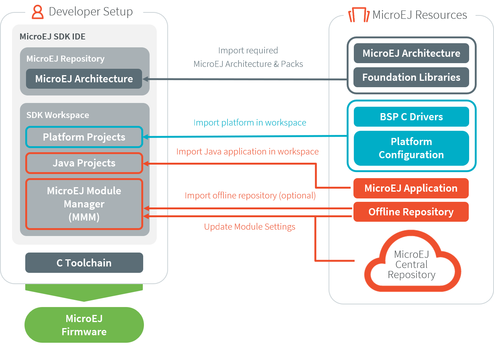
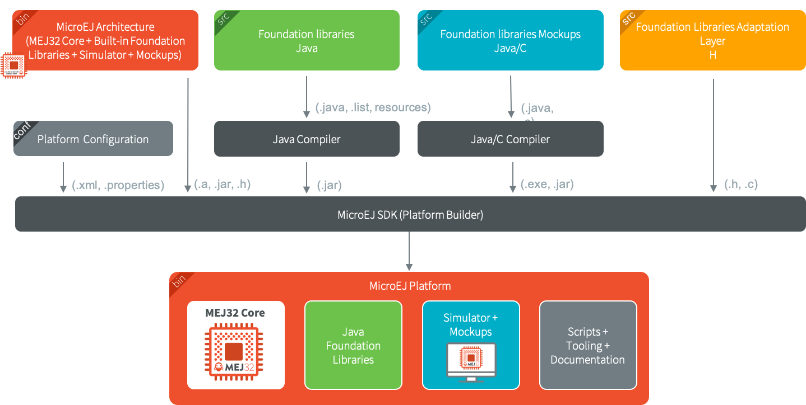

.. _tutorialUnderstandMicroEJFirmwareBuild:

Understand How to Build a Firmware and its Dependencies
=======================================================

A Firmware is built from several input resources and tools.
Each component has dependencies and requirements that must be
carefully respected in order to build a Firmware.

This document describes the components, their dependencies and the
process involved in the build of a Firmware.

Good knowledge of the :ref:`chapter-glossary` is required.

The Components
--------------

As depicted in the following image, several resources and tools are
used to build a Firmware.

Architecture
~~~~~~~~~~~~

A :ref:`MicroEJ Architecture <architecture_overview>` contains the runtime port to a target
instruction set (ISA), a C compiler (CC) and Foundation Libraries.

The Architectures are distributed in two versions:

* :ref:`Evaluation Architectures <evaluation_license>`: license with runtime limitations (explained in the :ref:`Application Developer Guide <limitations>`).

* :ref:`Production Architectures <production_license>`: license suitable for production.

A selection of supported embedded architectures can be found here:
`<https://developer.microej.com/mej32-embedded-runtime-architectures/>`_

The Architecture is either provided from:

* :ref:`MicroEJ Central Repository <central_repository>`, for Evaluation Architectures only.

* :ref:`MicroEJ Support team <get_support>` or your MicroEJ sales representative, for Production Architectures only.

.. note::
  
  Ask MicroEJ sales or support team if the requested architecture is not listed as available.

Platform Sources
~~~~~~~~~~~~~~~~

A :ref:`Platform <platform_overview>` includes development tools and a runtime environment:

* the Architecture and :ref:`pack_overview`,
* the Abstraction Layers implementations,
* the Simulator and its associated Mocks,
* a C Board Support Package (BSP) with C drivers and an optional RTOS.

The Platform sources contains the following projects:

* ``<platform>-configuration``: The Platform Configuration project.
* ``<platform>-bsp``: The C code for the board-specific files
  (drivers).
* ``<platform>-fp``: Front Panel mockup for the simulator.

See :ref:`platform_import` to learn how to import an existing Platform, and :ref:`new_platform_creation` 
to learn how to create a Platform.

Depending on the project's requirements, the Platform can
be connected in various ways to the BSP; see :ref:`bsp_connection` for
more information on how to do it.

Application
~~~~~~~~~~~

An Application is a Java project that can be configured (in the
:guilabel:`Run configurations ...` properties):

1. to either run on:

  * the Simulator (computer desktop),
  * a device (actual embedded hardware).

2. to setup:

  * memory (example: Java heap, Java stack),
  * Foundation Libraries,
  * etc.

To run on a device, the application is compiled and optimized for a
specific Platform.  It generates a ``microejapp.o`` (native
object code) linked with the ``<platform>-bsp`` project.

To import an existing Application as a zipped project in the SDK:

* Go to :guilabel:`File` > :guilabel:`Import…` > :guilabel:`General` >
  :guilabel:`Existing Projects into Workspace` > :guilabel:`Select
  archive file` > :guilabel:`Browse…`.
* Select the zip file of the project.
* And select :guilabel:`Finish` import.

See :ref:`simulator_execution` for more information on how to
create, configure, and develop a Standalone Application.

C Toolchain (GCC, KEIL, IAR, …)
~~~~~~~~~~~~~~~~~~~~~~~~~~~~~~~

Used to compile and link the following files into the final executable
(binary, hex, elf, … that will be programmed on the hardware):

  * the ``microejapp.o`` (application),
  * the ``microejruntime.lib`` or ``microejruntime.a`` (Platform runtime),
  * the BSP C files (C application files and Board Support Package).

Module Repository
~~~~~~~~~~~~~~~~~

A Module Repository provides the modules required to build
Platforms and Applications.

* The MicroEJ Central Repository is an online repository of software
  modules (libraries, tools, etc.), see
  https://repository.microej.com/. This repository can also be used as an offline repository, see https://developer.microej.com/central-repository/.

* (Optional) It can be extended with an offline repository (``.zip``)
  that can be imported in the workspace (see
  :ref:`repository_offline`):

See :ref:`module_repository` for more information.

Dependencies Between Components
~~~~~~~~~~~~~~~~~~~~~~~~~~~~~~~

* An Architecture targets a specific instruction set (ISA) and
  a specific C compiler (CC).

  * The C toolchain used for the Architecture must be the same
    as the one used to compile and link the BSP project.

* A Platform consists of the aggregation of both an Architecture and a BSP with a C toolchain.

  * Changing either the Architecture or the C toolchain
    results in a change of the Platform.

* An Application is independent of the Architecture.

  * It can run on any Platform as long the Platform provides the required APIs.

  * To run an Application on a new device, create a new
    Platform for this device with the exact
    same features. The Application will not require any change.

How to Build
------------

The process of building a Firmware is two-fold:

1. Build a Platform,
2. Compile/link the application and BSP using the C toolchain.

.. note::

   The Application will also run on the Simulator using the mocks provided by the Platform.

Build a Platform
~~~~~~~~~~~~~~~~

The next schema presents the components and process to build a Platform.

Build a Firmware
~~~~~~~~~~~~~~~~

The next schema presents the build flow of a Mono-Sandbox
Firmware (previously known as a MicroEJ Single-app Firmware). The steps
are:

1. Build the Application using the SDK (generates a ``microejapp.o`` file).

2. Compile the BSP C sources using the C toolchain (generates ``.o`` files).

3. Link the BSP files (``.o``), the Application (``microejapp.o``) and
   the Platform runtime library (``microejruntime.a``) using the C toolchain to produce the
   final executable (ELF or binary, for example ``application.out``).

.. image:: images/build_microej_mono_sandbox_firmware_numbered.PNG
    :scale: 80
    :align: center

See :ref:`bsp_connection` for more information on how to connect a Platform to a BSP.

Dependencies Between Processes
~~~~~~~~~~~~~~~~~~~~~~~~~~~~~~

* Rebuild the Platform:

  * When the Architecture (``.xpf``) changes.

  * When a :ref:`Pack <pack_overview>` provided by MicroEJ (``.xpfp``) changes.

  * When a Foundation Library changes, either when

    * The public API (``.java`` or ``.h``) changes.

    * The front-panel or mock implementation (``.java``) changes.

* Rebuild of the Platform is not required:

  * When the implementation (``.c``) of a Foundation Library changes.

  * When the BSP (``.c``) changes.

  * When the Application changes.

* Rebuild the Application:

  * When its code changes.

  * When the Platform changes.

* Rebuild the BSP:

  * When its code changes.

  * When the Platform changes.

* Rebuild the Firmware:

  * When the Application (``microejapp.o``) changes.

  * When the BSP (``*.o``) changes.

  * When the Platform (``microejruntime.a``) changes.

..
   | Copyright 2021-2022, MicroEJ Corp. Content in this space is free 
   for read and redistribute. Except if otherwise stated, modification 
   is subject to MicroEJ Corp prior approval.
   | MicroEJ is a trademark of MicroEJ Corp. All other trademarks and 
   copyrights are the property of their respective owners.