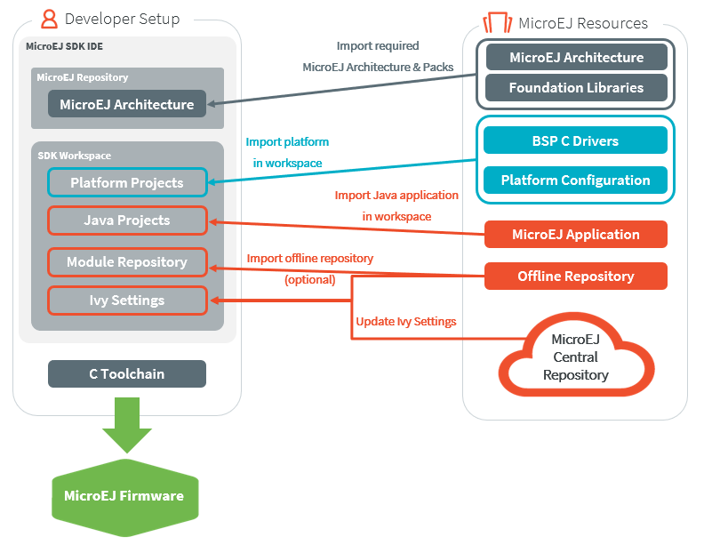
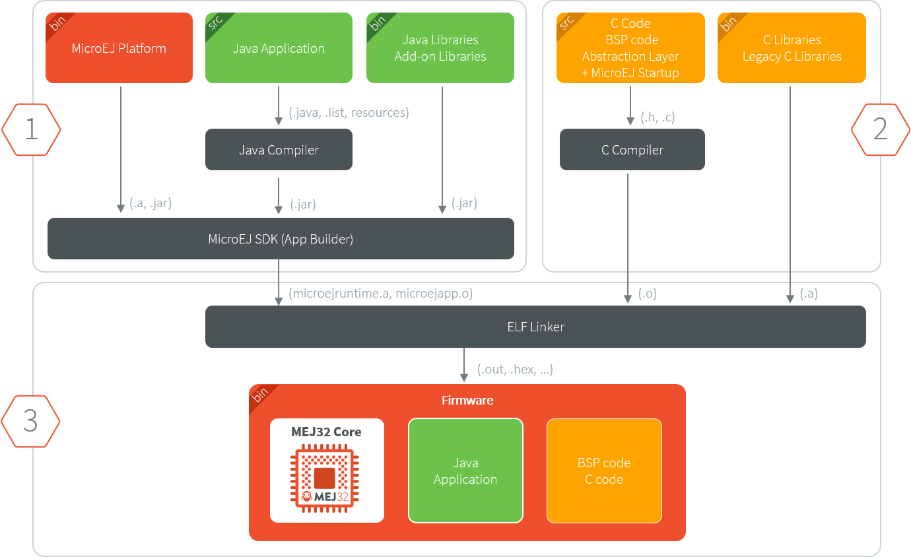

Understand how to build a MicroEJ Firmware and its dependencies
===============================================================

A MicroEJ Firmware is built from several input resources and tools.
Each component has a specific version that must be carefully respected
in order to build a firmware.

This document describes the components and the process involved in the
build of a MicroEJ Firmware.

Good knowledge of the :ref:`chapter-glossary` is required.

The Components
--------------

As depicted in the following image, several resources and tools are
used to build a MicroEJ Firmware.

MicroEJ Architecture (.xpf, .xpfp)
~~~~~~~~~~~~~~~~~~~~~~~~~~~~~~~~~~

A MicroEJ Architecture contains the runtime port to a target
instruction set (ISA) and a C compiler (CC) and MicroEJ Foundation
Libraries.

The MicroEJ Architectures are distributed into 2 formats:

* EVAL: evaluation license with runtime limitations (explained in SDK
  developer guide).
* DEV: production license (only MicroEJ sales & Customer Care team distribute this version).

The list of supported MicroEJ Architectures can be found here
https://developer.microej.com/mej32-embedded-runtime-architectures/#arch

The MicroEJ Architecture is either provided from:

* For EVAL license only: the MicroEJ Repository at https://repository.microej.com/architectures/
* For DEV license only: SDK license site https://license.microej.com/
  (:guilabel:`MyProduct` > :guilabel:`Download additional products`
  will list the downloads available).  See
  :ref:`gettingstarted-installlicensesdev` for help with DEV license.
* MicroEJ sales or customer care team if the requested architecture is not listed as available.

See :ref:`architecture_import` for a description on how to import a
MicroEJ Architecture.

MicroEJ Platform Source (.zip)
~~~~~~~~~~~~~~~~~~~~~~~~~~~~~~

This package includes:

* a C Board Support Package (BSP) with C drivers and an optional RTOS
* a MEJ32 Architecture
* the abstraction layers implementation of the platform architecture and foundations libraries
* the MicroEJ Simulator and its associated MicroEJ Mocks

The platform .zip files contain:

* ``<platform>-configuration``: The configuration of the MicroEJ
  Platform
* ``<platform>-bsp``: The C code for the board-specific files
  (drivers).
* ``<platform>-fp``: Front panel mockup for the simulator.

See :ref:`new_platform_creation` to learn how to create a MicroEJ
Platform using a MicroEJ Platform Source project.

Depending on the requirements of the project, the MicroEJ Platform can
be connected in various ways to the BSP, see :ref:`bsp_connection` for
more information on how to do it.

MicroEJ Application
~~~~~~~~~~~~~~~~~~~

A MicroEJ Application is a Java project that can be configured (in the
:guilabel:`Run configurations ...` properties):

1. to either run on:

  * a simulator (computer desktop),
  * a device (actual embedded hardware).

2. to setup:

  * memory (example: Java heap, Java stack),
  * foundation libraries,
  * etc…

To run on a device, the application is compiled and optimized for a
specific MicroEJ Platform.  It generates a ``microejapp.o`` (native
object code) that is linked with the
``<platform>-bsp`` project.

To import an existing MicroEJ Application as zip project in the SDK:

* Go to :guilabel:`File` > :guilabel:`Import…` > :guilabel:`General` >
  :guilabel:`Existing Projects into Workspace` > :guilabel:`Select
  archive file` > :guilabel:`Browse…`.
* Select the zip of the project (e.g. ``x.zip``).
* And select :guilabel:`Finish` import.

See :ref:`microej.sample.applications` for more information on how to
create, configure, and develop a MicroEJ Application.

C Toolchain (GCC, KEIL, IAR, …)
~~~~~~~~~~~~~~~~~~~~~~~~~~~~~~~

Used to compile and link the following files into the final firmware
(binary, hex, elf, … that will be programmed on the hardware):

  * the ``microejapp.o`` (application),
  * the ``microejruntime.lib`` or ``microejruntime.a`` (platform),
  * the BSP C files (drivers).

Module (Ivy) repository
~~~~~~~~~~~~~~~~~~~~~~~

A module (Ivy) repository provides the modules required to build
MicroEJ Platforms and MicroEJ Applications.

* The MicroEJ Central Repository is an online repository of software
  artifacts (libraries, tools, etc.), see
  https://repository.microej.com/. This repository can also be used as an offline repository, see https://developer.microej.com/central-repository/.

* (Optional) It can be extended with an offline repository (``.zip``)
  that can be imported in the workspace (see
  :ref:`repository_offline`):

See :ref:`module_repository` for more information.

Dependencies Between Components
~~~~~~~~~~~~~~~~~~~~~~~~~~~~~~~

* A MicroEJ Architecture targets a specific instruction set (ISA) and
  a specific C compiler (CC).

  * The C toolchain used for the MicroEJ Architecture must be the same
    as the one used to compile and link the BSP project and the
    MicroEJ Firmware.

* A MicroEJ Platform consists of the aggregation of both a MicroEJ
  Architecture and a BSP with a C toolchain.

  * Changing either the MicroEJ Architecture or the C toolchain
    results in a change of the MicroEJ Platform.

* A MicroEJ Application is independent of the MicroEJ Architecture.

  * It can run on any MicroEJ Platform as long the platform provides the required APIs.

  * To run a MicroEJ Application on a new device, create a new
    MicroEJ Platform for this device with the exact
    same features.  The MicroEJ Application will not require any change.

How to build
------------

The process to build a MicroEJ Firmware is two-fold:

1. Build a MicroEJ Platform
2. Build a MicroEJ Application into a MicroEJ Firmware

The MicroEJ Application is compiled against the MicroEJ Platform to
produce the MicroEJ Firmware that will be deployed on the target
device.

.. note::

   The MicroEJ Application runs onto
   the MicroEJ Simulator using the mocks provided by the MicroEJ
   Platform.

The next schema presents the steps to build a MicroEJ Mono-Sandbox
Firmware (previously known as MicroEJ Single-app Firmware).  The steps
are:

1. Build the MicroEJ Platform using MicroEJ SDK

2. Build the MicroEJ Application into a ``microejapp.o`` using MicroEJ SDK

3. Compile the BSP C sources into ``.o`` using the C toolchain

4. the BSP (``.o``) and the MicroEJ Application (``microejapp.o``) and
   the MicroEJ Platform (``microejruntime.a``) are linked by the C toolchain to produce a
   final ELF or binary called MicroEJ Firmware (e.g. ``application.out``).

See :ref:`bsp_connection` for more information on how to connect the
MicroEJ Platform to the BSP.

Dependencies Between Processes
~~~~~~~~~~~~~~~~~~~~~~~~~~~~~~

* Rebuild the MicroEJ Platform in the following cases:

  * When the MicroEJ Architecture (``.xpf``) changes.

  * When a MicroEJ Foundation Library (``.xpfp``) changes.

  * When a Foundation Library changes, either when

    * The public API (``.java`` or ``.h``) change.

    * The front-panel or mock implementation (``.java``) changes.

* Rebuilding the MicroEJ Platform is not necessary in the following cases:

  * When the implementation (``.c``) of a Foundation Library changes.

  * When the BSP (``.c``) changes.

  * When the MicroEJ Application changes.

* The MicroEJ Application must be rebuilt when it changes or when the
  MicroEJ Platform changes.

* The BSP must be rebuilt when it changes or when the MicroEJ Platform
  changes.

* The MicroEJ Firmware must be rebuilt (i.e. linked) when:

  * MicroEJ Application (``microejapp.o``) changes.

  * The BSP (``*.o``) changes.

  * The MicroEJ Platform (``microejruntime.a``) changes.

Get Support
-----------

If any questions, feel free to contact our support team with the
following information (the table below is an example):

.. list-table::
   :widths: 15 30

   * - Delivery
     - Name
   * - MicroEJ SDK
     - 20.07
   * - MEJ32 XPF
     - ARM Cortex-M4 / IAR DEV
   * - Platform
     - 1.0.0
   * - Application
     - 1.2.4
   * - Ivy Repository
     - https://repository.microej.com/packages/repository/2.5.0/microej-5_0-2.5.0.zip
   * - C compiler
     - KEIL 5.25
