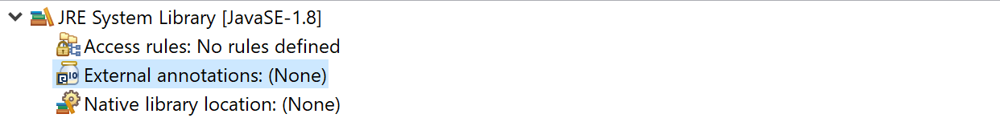
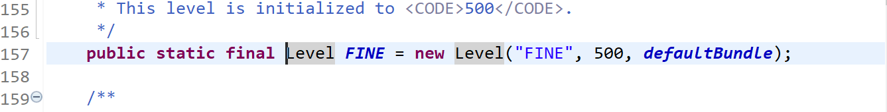
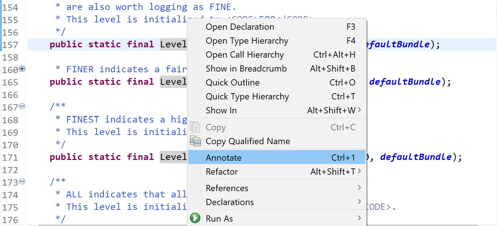
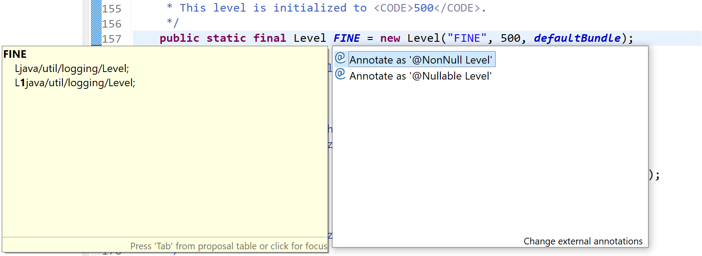

..
	Copyright 2021 MicroEJ Corp. All rights reserved.
	This library is provided in source code for use, modification and test, subject to license terms.
	Any modification of the source code will break MicroEJ Corp. warranties on the whole library.

Tutorial to use null annotations in JAVA 8+
===========================================

Eclipse documentation : 

https://wiki.eclipse.org/JDT_Core/Null_Analysis/External_Annotations

Eclipse change note about the introduction of external annotations : 

https://www.eclipse.org/eclipse/news/4.5/M6/#external-annotations

Breaking changes
----------------

Null annotations can be placed before every part of a variable type.

For instance when you could only annotate String [] as :

+ **@Nullable String []**  a nullable array

You can now annotate the variable as :

+ **@Nullable String []** a non-null array of nullable Strings
+ **String @Nullable []** a nullable array of non-null Strings
+ **@Nullable String @Nullable []** a nullable array of nullable Strings

This change introduce a break between versions as an annotation on an array will now be placed before the brackets:

+ **@NonNull String [] -> String @NonNull []**

External null annotations
-------------------------

Automatic annotation
~~~~~~~~~~~~~~~~~~~~

**~ For Eclipse IDE and it's derivatives ~**

To enable automatic annotations you first need to link an annotation folder in your IDE:

Then you have to link a source to the library you want to annotate if needed. If you don't have access to the source of a library go to `Manual annotation`_.

You can now select a return or parameter type...

...and use the shorcut ``ctrl+1`` or right click and select *Annotate*.

You can now choose to set an annotation for the selected type:

Manual annotation
~~~~~~~~~~~~~~~~~

eea file creation
^^^^^^^^^^^^^^^^^

eea files follow the same construction rules as class files.

from your external annotations root folder
create a folder hierarchy corresponding to the package hierarchy of the class :

**java.lang.String -> /java/lang/String.eea**

for inner classes ,this information is reflected on the file name, inner classes have a proper eea file :

**org.tool.a$1 -> /example/org/tool/a$1.eea**

eea header
^^^^^^^^^^

*class <filepath but extention>*

example for file /example/org/tool/a$1.eea:

.. code-block:: text

    class /example/org/tool/a$1

eea type/method
^^^^^^^^^^^^^^^

The construction is done as such:

.. code-block:: text

    <type/method name>
    <>
    <1 space><method descriptor>

*replace(char, char)* method of java/lang/String class :

.. code-block:: text

    class java/lang/String
    replace
     (CC)Ljava/lang/String;
     (CC)L1java/lang/String;

Placing the annotation
^^^^^^^^^^^^^^^^^^^^^^

0 represents the **@Nullable** annotation, and 1 represents the **@NonNull** annotation.
eea files are mostly based on jvm specs: https://docs.oracle.com/javase/specs/jvms/se7/html/jvms-4.html , 
you can refer to these specs for types descriptors.

Descriptors:
^^^^^^^^^^^^

+ Basic types are replaced by the corresponding character **int -> I**
+ Object types are replaced by *L<typePath>;* **String -> Ljava/lang/String;**
+ Array types are replaced by *[<typeDescriptor>* **int [] -> [I**
+ **ArrayList<String> -> Ljava/util/ArrayList<Ljava/lang/String;>**
+ Parameterized types are replaced by *T<typeDescriptor>;* **T -> TT;**
+ Method descriptors are written *<returnTypeDescriptor>(<parametersTypeDescriptors>)* **int lastIndexOf(String str, int fromIndex) -> (Ljava/lang/String;I)I**
+ Everything is written in row without spaces  **[] [] ArrayList<String> -> [[Ljava/lang/ArrayList<Ljava/lang/String;>;**
+ Generic types input are replaced by *<typeDescriptor>* :

  In the following cases, nullable annotated descriptors are used as example.

  - **List<?> -> Ljava/util/List<*>; -> L0java/util/List<0*>;**
  - **List<? extends A> -> Ljava/util/List<+TA;>; -> L0java/util/List<+T0A;>;**
  - **List<? super A> -> Ljava/util/List<-TA;>; -> L0java/util/List<-T0A;>;**
  - **List<T> -> Ljava/util/List<TT;> -> L0java/util/List<T0T;>**
  - (ArrayList's to Array method) **public <T> T[] toArray(T[] a) -> <T:Ljava/lang/Object;>([TT;)[TT; -> <0T:Ljava/lang/Object;>([0T0T;)[0T0T;**

Update changes
~~~~~~~~~~~~~~

When editing eea files manually you may have to clean your project **Project->Clean** for the changes to take place.
If your changes still aren't taken into account, restart the IDE.

It's also worth the try with automatic annotations if you encounter a problem.