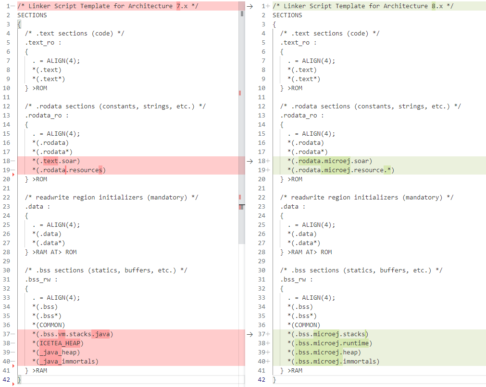
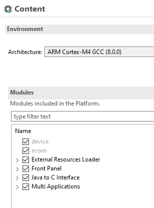

.. _architecture7_migration:

Architecture 7.x Migration
==========================

This chapter describes the steps to migrate a VEE Port from Architecture ``7.x`` to Architecture ``8.0.0``.

As a reminder, refer to the :ref:`Architecture 8.0.0 Changelog <changelog-8.0.0>` section for the complete list of changes and updates.

Update Platform Configuration Additions
---------------------------------------

Architecture ``8.0.0`` now directly integrates the :ref:`bsp_connection` mechanism.
The Platform Configuration Additions must be updated accordingly. 
Contact `our support team <https://www.microej.com/contact/#form_2>`_ to get detailed instructions. 

Update BSP with new Sections Names
----------------------------------

The Core Engine sections have been renamed to respect the standard ELF convention. See :ref:`Core Engine Link <core_engine_link>` section for further details.

All references to section names in your BSP must be updated. 
This is usually only used in your linker script file, but section names are sometimes also hardcoded in the C Code.
Here is an example of a GNU LD script highlighting the typical changes that must be made:

   Example of LD Script File Migration

Remove LLBSP_IMPL_isInReadOnlyMemory
------------------------------------

The ``LLBSP_IMPL_isInReadOnlyMemory`` function has been removed since it is no more called by the Core Engine. You can simply remove your implementation function.

Migrate Built-in Modules
------------------------

The following built-in legacy modules have been removed from the Architecture:

- Device
- ECOM-COMM

In the Platform Editor, these modules now appear in gray with Architecture ``8.x``:

To remove these modules, open the ``.platform`` file using a text editor and remove the following XML elements:

.. code-block:: xml

    <group name="device"/>
    <group name="ecom"/>

.. _architecture7_migration_device:

Migrate Device Module
~~~~~~~~~~~~~~~~~~~~~

The latest `Device Pack`_ available on the :ref:`central_repository` is backward compatible with the built-in Architecture module.

.. _Device Pack: https://repository.microej.com/modules/com/microej/pack/device/device-pack/

The following dependency must be added to the :ref:`module.ivy <mmm_module_description>` of the VEE Port configuration project:
      
  .. code:: xml
      
     <dependency org="com.microej.pack.device" name="device-pack" rev="1.1.1" />

.. _architecture7_migration_ecom:

Migrate ECOM-COMM Module
~~~~~~~~~~~~~~~~~~~~~~~~

There are two options:
  
- either migrate to the latest ECOM-COMM Pack,
- or integrate the legacy ECOM-COMM Pack files as-is into your VEE Port ``dropins`` folder.

Contact `our support team <https://www.microej.com/contact/#form_2>`_ to get the best migration strategy and detailed instructions. 

Migrate Your LLKERNEL Implementation
------------------------------------

The following code is a ``LLKERNEL_impl.c`` template for migrating your current implementation of Feature installation in RAM.
This is now called :ref:`In-Place Installation <feature_inplace_installation>`. 
Your code logic for managing allocated blocks does not need to be changed.
:ref:`Custom Installation <feature_custom_installation>` is disabled, so most of the new functions do not need to be implemented.

.. code-block:: c

   #include "LLKERNEL_impl.h"

   void* LLKERNEL_IMPL_allocateWorkingBuffer(int32_t size) {
      // Paste here the code of your former 'LLKERNEL_IMPL_allocate' function
   }

   void LLKERNEL_IMPL_freeWorkingBuffer(void* chunk_address) {
      // Paste here the code of your former 'LLKERNEL_IMPL_free' function
   }

   int32_t LLKERNEL_IMPL_allocateFeature(int32_t size_ROM, int32_t size_RAM) {
      return 0;
   }

   int32_t LLKERNEL_IMPL_getAllocatedFeaturesCount(void) {
      return 0;
   }

   void LLKERNEL_IMPL_freeFeature(int32_t handle) {
      // Paste here your implementation of 'ASSERT(0)'
   }

   int32_t LLKERNEL_IMPL_getFeatureHandle(int32_t allocation_index) {
      // Paste here your implementation of 'ASSERT(0)'
      return 0;
   }

   void* LLKERNEL_IMPL_getFeatureAddressRAM(int32_t handle) {
      // Paste here your implementation of 'ASSERT(0)'
      return 0;
   }

   void* LLKERNEL_IMPL_getFeatureAddressROM(int32_t handle) {
      // Paste here your implementation of 'ASSERT(0)'
      return 0;
   }

   int32_t LLKERNEL_IMPL_copyToROM(void* dest_address_ROM, void* src_address, int32_t size) {
      // Paste here your implementation of 'ASSERT(0)'
      return 0;
   }

   int32_t LLKERNEL_IMPL_flushCopyToROM(void) {
      // Paste here your implementation of 'ASSERT(0)'
      return 0;
   }

   int32_t LLKERNEL_IMPL_onFeatureInitializationError(int32_t handle, int32_t error_code) {
      // Paste here your implementation of 'ASSERT(0)'
      return 0;
   }

Migrate Trace C Library Usage
-----------------------------

In Architecture ``8.0.0``, the ``Trace`` C library's version has been updated from ``1.0.0`` to ``2.0.0``.
This new version introduces the following backward incompatible changes:

- C header file ``trace.h`` has been renamed into ``LLTRACE.h``.
- The functions declared in this header have been renamed from ``TRACE_xxx`` to ``LLTRACE_xxx``.

If you have included ``trace.h`` in a C file, the compilation will fail with an error message similar 
to one of the following messages:

- ``fatal error: trace.h: No such file or directory``
- ``Fatal Error[Pe1696]: cannot open source file "trace.h"``

To fix this issue, you can either migrate to version ``2.0.0`` of the ``Trace`` library or 
provide a backward compatibility layer.

To migrate to version ``2.0.0``, you need to make the following changes:

- Replace the directives ``#include "trace.h"`` with ``#include "LLTRACE.h"``.
- Replace any references to the ``TRACE_xxx`` functions (e.g., ``TRACE_record_event_void``)
  with references to the corresponding ``LLTRACE_xxx`` function (e.g., ``LLTRACE_record_event_void``).

If you decide not to modify existing code, you can create and add to your project a ``trace.h`` file with 
the following content:

.. code-block:: c

	#ifndef TRACE_H
	#define TRACE_H

	/**
	 * Trace library API backward compatibility layer.
	 * Allows to use Trace API 1.0.0 (Architecture 7.x) in a VEE Port 
	 * that includes Trace API 2.0.0 (Architecture 8.x).
	 */

	#include "LLTRACE.h"

	#ifdef __cplusplus
		extern "C" {
	#endif

	#define TRACE_start LLTRACE_start
	#define TRACE_start LLTRACE_start
	#define TRACE_stop LLTRACE_stop
	#define TRACE_is_started LLTRACE_is_started
	#define TRACE_declare_event_group LLTRACE_declare_event_group
	#define TRACE_record_event_void LLTRACE_record_event_void
	#define TRACE_record_event_u32 LLTRACE_record_event_u32
	#define TRACE_record_event_u32x2 LLTRACE_record_event_u32x2
	#define TRACE_record_event_u32x3 LLTRACE_record_event_u32x3
	#define TRACE_record_event_u32x4 LLTRACE_record_event_u32x4
	#define TRACE_record_event_u32x5 LLTRACE_record_event_u32x5
	#define TRACE_record_event_u32x6 LLTRACE_record_event_u32x6
	#define TRACE_record_event_u32x7 LLTRACE_record_event_u32x7
	#define TRACE_record_event_u32x8 LLTRACE_record_event_u32x8
	#define TRACE_record_event_u32x9 LLTRACE_record_event_u32x9
	#define TRACE_record_event_u32x10 LLTRACE_record_event_u32x10
	#define TRACE_record_event_end LLTRACE_record_event_end
	#define TRACE_record_event_end_u32 LLTRACE_record_event_end_u32

	#ifdef __cplusplus
		}
	#endif

	#endif //TRACE_H

..
   | Copyright 2023, MicroEJ Corp. Content in this space is free 
   for read and redistribute. Except if otherwise stated, modification 
   is subject to MicroEJ Corp prior approval.
   | MicroEJ is a trademark of MicroEJ Corp. All other trademarks and 
   copyrights are the property of their respective owners.
