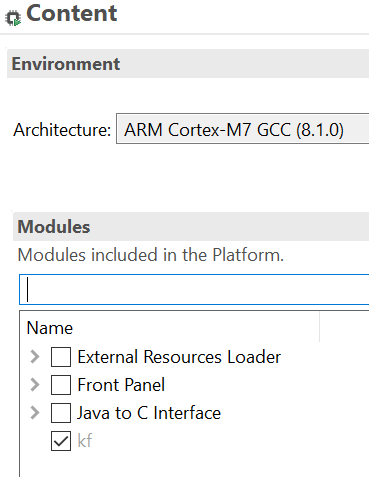

.. _architecture8_migration:

Architecture 8.0.0 Migration
============================

This chapter describes the steps to migrate a VEE Port from Architecture ``8.0.0`` to Architecture ``8.1.0``.

As a reminder, refer to the :ref:`Architecture 8.1.0 Changelog <changelog-8.1.0>` section for the complete list of changes and updates.

.. _architecture8_migration_capability:

Migrate Core Engine Capability Configuration
--------------------------------------------

The selection of the :ref:`Core Engine capability <core_engine_capabilities>` is now done via the property ``com.microej.runtime.capability``. 
Refer to one of the sections below depending on your desired capability.

If you use the property ``com.microej.platformbuilder.module.multi.enabled``, update your `Platform Configuration Additions <https://github.com/MicroEJ/VEEPortQualificationTools/blob/master/framework/platform/>`_ to the version ``2.1.0`` or higher.
It is also recommended to delete the property ``com.microej.platformbuilder.module.multi.enabled`` and to use the property ``com.microej.runtime.capability`` instead.

Mono-Sandbox
````````````

Mono-Sandbox remains the default capability and no changes are required to your VEE Port configuration.

Multi-Sandbox
`````````````

In the Platform Editor, the ``Multi Applications`` (``kf``) module now appears in gray:



Unselect the ``kf`` module and follow the instructions from the :ref:`Multi-Sandbox installation <multisandbox_installation>` section.

Tiny-Sandbox
````````````

The property ``mjvm.standalone.configuration`` used to select the Tiny-Sandbox capability is now deprecated.
It is recommended to remove the definition of this property from the ``configuration.xml`` file and follow the instructions from the :ref:`Tiny-Sandbox installation <tinysandbox_installation>` section.

.. _architecture8_migration_llkernel:

Migrate Your LLKERNEL Implementation
------------------------------------

This section only applies if your LLKERNEL was based on legacy :ref:`In-Place Installation mode <feature_inplace_installation>`. 
The Kernel Working Buffer no longer exists.
The functions ``LLKERNEL_IMPL_allocateWorkingBuffer()`` and ``LLKERNEL_IMPL_freeWorkingBuffer()`` are no more called and can be simply removed from your implementation.

Memory allocation for the Features will now use the function ``LLKERNEL_IMPL_allocateFeature()``. 
The following code is a ``LLKERNEL_impl.c`` template for migrating your current implementation using this API.
The code logic based on a ``malloc/free`` implementation does not need to be changed.

.. code-block:: c

   #include <stdlib.h>
   #include <string.h>

   #include "LLKERNEL_impl.h"

   // Your implementation of malloc()
   #define KERNEL_MALLOC(size) malloc((size_t)(size))

   // Your implementation of free()
   #define KERNEL_FREE(addr) free((void*)(addr))

   // Your implementation of 'ASSERT(0)'
   #define KERNEL_ASSERT_FAIL() while(1)

   // Utility macros for allocating RAM and ROM areas with required alignment constraints
   #define KERNEL_AREA_GET_MAX_SIZE(size, alignment) ((size)+((alignment)-1))
   #define KERNEL_AREA_GET_START_ADDRESS(addr, alignment) ((void*)((((int32_t)(addr))+(alignment)-1)&~((alignment)-1)))

   struct installed_feature{
      void* ROM_area;
      void* RAM_area;
   };

   int32_t LLKERNEL_IMPL_allocateFeature(int32_t size_ROM, int32_t size_RAM) {
      int32_t ret = 0;
      int total_size = sizeof(struct installed_feature);
      total_size += KERNEL_AREA_GET_MAX_SIZE(size_ROM, LLKERNEL_ROM_AREA_ALIGNMENT);
      total_size += KERNEL_AREA_GET_MAX_SIZE(size_RAM, LLKERNEL_RAM_AREA_ALIGNMENT);

      void* total_area = KERNEL_MALLOC(total_size);
      if(NULL != total_area){
         struct installed_feature* f = (struct installed_feature*)total_area;
         f->ROM_area = KERNEL_AREA_GET_START_ADDRESS((void*)(((int32_t)f)+((int32_t)sizeof(struct installed_feature))), LLKERNEL_ROM_AREA_ALIGNMENT);
         f->RAM_area = KERNEL_AREA_GET_START_ADDRESS((void*)(((int32_t)f->ROM_area)+size_ROM), LLKERNEL_RAM_AREA_ALIGNMENT);
         ret = (int32_t)f;
      } // else out of memory

      return ret;
   }

   void LLKERNEL_IMPL_freeFeature(int32_t handle) {
      KERNEL_FREE(handle);
   }

   int32_t LLKERNEL_IMPL_getAllocatedFeaturesCount(void) {
      // No persistency support
      return 0;
   }

   int32_t LLKERNEL_IMPL_getFeatureHandle(int32_t allocation_index) {
      // No persistency support
      KERNEL_ASSERT_FAIL();
   }

   void* LLKERNEL_IMPL_getFeatureAddressRAM(int32_t handle) {
      return ((struct installed_feature*)handle)->RAM_area;
   }

   void* LLKERNEL_IMPL_getFeatureAddressROM(int32_t handle) {
      return ((struct installed_feature*)handle)->ROM_area;
   }

   int32_t LLKERNEL_IMPL_copyToROM(void* dest_address_ROM, void* src_address, int32_t size) {
      memcpy(dest_address_ROM, src_address, size);
      return LLKERNEL_OK;
   }

   int32_t LLKERNEL_IMPL_flushCopyToROM(void) {
      return LLKERNEL_OK;
   }

   int32_t LLKERNEL_IMPL_onFeatureInitializationError(int32_t handle, int32_t error_code) {
      // No persistency support
      KERNEL_ASSERT_FAIL();
      return 0;
   }


..
   | Copyright 2023-2024, MicroEJ Corp. Content in this space is free 
   for read and redistribute. Except if otherwise stated, modification 
   is subject to MicroEJ Corp prior approval.
   | MicroEJ is a trademark of MicroEJ Corp. All other trademarks and 
   copyrights are the property of their respective owners.
