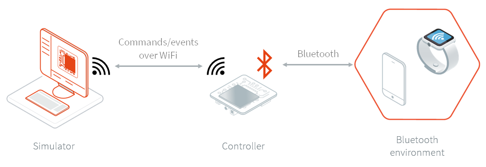
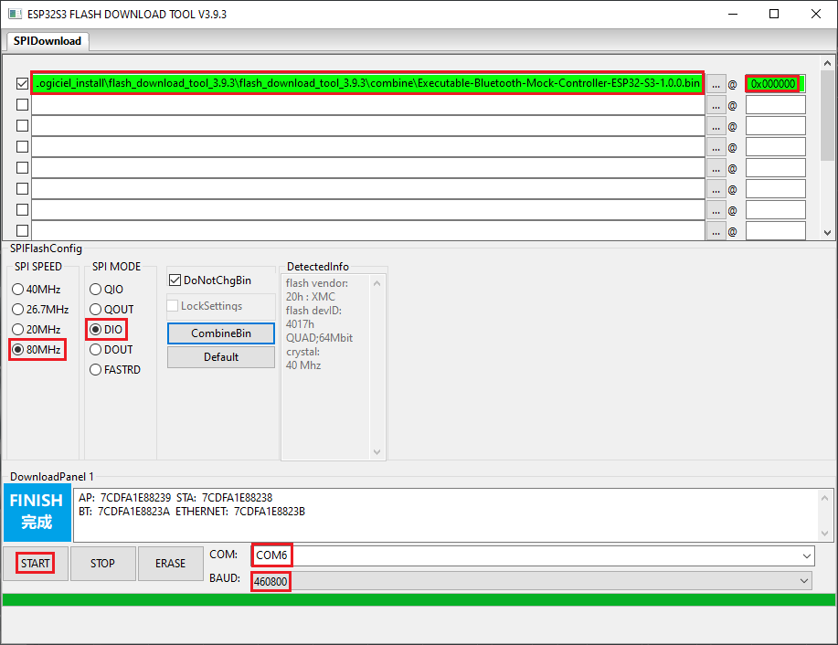
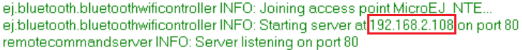
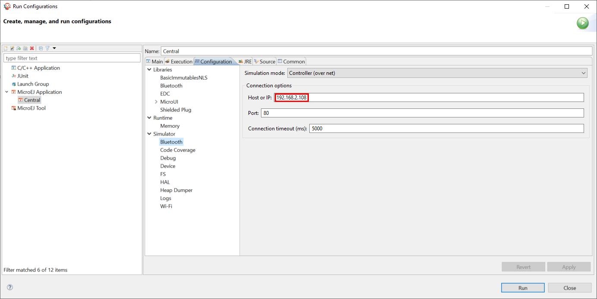

.. _blemock:

Bluetooth LE Mock
=================

Overview
--------

To run a MicroEJ Application that uses the Bluetooth LE Foundation Library (`ej.api.bluetooth`_) 
on MicroEJ Simulator, a Bluetooth LE mock controller must be set up first:

The Bluetooth LE mock controller is a hardware mock of the Bluetooth LE library. It
means the Simulator uses a real Bluetooth LE device to scan other devices,
advertise, discover services, connect, pair, etc... This design enables
testing of apps in a real-world environment.

The Bluetooth LE mock controller implementation is provided for the `ESP32-S3-DevKitC-1
board reference <https://docs.espressif.com/projects/esp-idf/en/latest/esp32s3/hw-reference/esp32s3/user-guide-devkitc-1.html>`__.
Other implementations or sources can be provided on request.

.. _ej.api.bluetooth: https://repository.microej.com/modules/ej/api/bluetooth/

Requirements
------------

- A ESP32-S3-DevKitC-1 board.
- A Bluetooth LE mock controller firmware_ (this Bluetooth controller executable only works with Bluetooth pack v2).
- A tool to flash the firmware like
  https://www.espressif.com/en/support/download/other-tools.

Usage
-----

To simulate a Bluetooth LE application, follow these three steps:

- Set up the controller
- Set up the network configuration
- Run the application on the Simulator

If your are facing any issues, check the :ref:`Troubleshooting <blemock-troubleshooting>` section.

Controller Setup
~~~~~~~~~~~~~~~~

Unzip ``Executable-Bluetooth-Mock-Controller-ESP32-S3-1.0.0.zip``. 
Inside it you will find the firmware file: ``Executable-Bluetooth-Mock-Controller-ESP32-S3-1.0.0.bin``. 

To set up the controller, follow these steps:

- Plug-in the ESP32-S3-DevKitC-1 board to your computer,
- Find the associated COM port,
- In the flash tool:

  - select the chip "ESP32-S3"
  - browse for the firmware file
  - set the offset to 0x000000
  - set the SPI speed to 80 Mhz
  - set the SPI mode to DIO
  - set the COM port
  - set the baudrate to 460 800
  - start the flash download

With the flash download tool from Espressif, you should end with something similar to this :

   Bluetooth LE Flash Download Tool Configuration

Network Setup
~~~~~~~~~~~~~

To configure the network:

#. Connect your computer to the Wi-Fi network "BLE-Mock-Controller-[hexa device id]" mounted by the controller.
#. Open a browser and connect to ``http://192.168.4.1/`` to access the Wi-Fi setup
   interface :

   .. image:: images/blemock-wifi-setup-interface.png
      :align: center

#. Select the desired network and provide the required information if asked.
   If an error occurs during the connection, retry this step.
#. In case the device is successfully connected to the desired network, the
   web page should looks like this:

   .. image:: images/blemock-wifi-setup-last-screen.png
      :align: center

   Additionally, the serial output of the device shows connection status.
#. Connect your computer back to this network: your computer and the
   controller must be in the same network.
#. Reboot the ESP32-S3-DevKitC-1 board. 

Simulation
~~~~~~~~~~

It is possible to run the Simulator as many times as necessary using the same
setup. Also, rebooting the controller will automatically set up the network with
the saved configuration.

The IP address of the controller is available in the logs :

Before running your Bluetooth LE application on the Simulator, in the
:ref:`Run configuration <concepts-microejlaunches>` panel, set the simulation mode
to "Controller (over net)" and configure the Bluetooth LE mock settings.

   Bluetooth LE Mock Configuration

Launching the application on the Simulator will restore the controller to its
initial state (the BLE adapter is disabled).

.. _blemock-troubleshooting:

Troubleshooting
---------------

Network Setup Errors
~~~~~~~~~~~~~~~~~~~~

I can't find the "BLE-Mock-Controller-[hexa device id]" access point
^^^^^^^^^^^^^^^^^^^^^^^^^^^^^^^^^^^^^^^^^^^^^^^^^^^^^^^^^^^^^^^^^^^^

The signal of this Wi-Fi access point may be weaker than the surrounding access 
points. Try to reduce the distance between the controller and your computer; and
rescan. If it's not possible, try using a smartphone instead (only a browser
will be required to set up the network configuration).

I want to override the network configuration
^^^^^^^^^^^^^^^^^^^^^^^^^^^^^^^^^^^^^^^^^^^^

If the Wi-Fi credentials are not valid anymore, the controller restarts the
network setup phase. Yet, in case the credentials are valid but you want to
change them, erase the flash and reflash the firmware.

"Invalid parameter type: 0x47 expected 0x53" error
^^^^^^^^^^^^^^^^^^^^^^^^^^^^^^^^^^^^^^^^^^^^^^^^^^

Reboot the ESP32-S3-DevKitC-1 board. The controller restarts and connects to the Wi-Fi.

Simulation Errors
~~~~~~~~~~~~~~~~~

Error during the simulation: mock could not connect to controller
^^^^^^^^^^^^^^^^^^^^^^^^^^^^^^^^^^^^^^^^^^^^^^^^^^^^^^^^^^^^^^^^^

This error means the mock process (Simulator) could not initialize the connection
with the controller. Please check that the device is connected to the network
(see logs in the serial port output) and that your computer is in the same
network.

.. _developer.microej.com: https://developer.microej.com/getting-started-sdk-esp32-wrover-5.html
.. _firmware: https://repository.microej.com/packages/ble-mock/Executable-Bluetooth-Mock-Controller-ESP32-S3-1.0.0.zip

..
   | Copyright 2008-2022, MicroEJ Corp. Content in this space is free 
   for read and redistribute. Except if otherwise stated, modification 
   is subject to MicroEJ Corp prior approval.
   | MicroEJ is a trademark of MicroEJ Corp. All other trademarks and 
   copyrights are the property of their respective owners.