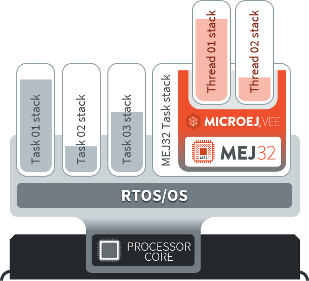

===========
Description
===========

Link Flow
=========

:ref:`The following diagram <fig_mjvm_flow2>` shows the overall build flow. 
Application development is performed within MICROEJ SDK.
The remaining steps are performed within the C third-party IDE.

.. _fig_mjvm_flow2:
.. figure:: images/mjvm_flow2.*
   :alt: Core Engine Flow
   :align: center
   :scale: 80%

   Core Engine Flow

1. Step 1 consists in writing an Application against a set of
   Foundation Libraries available in the VEE Port.

2. Step 2 consists in compiling the Application code and the
   required libraries in an ELF library, using the SOAR.

3. Step 3 consists in linking the previous ELF file with the 
   Core Engine library and a third-party BSP (OS, drivers, etc.). This
   step requires a third-party linker provided by a C toolchain.

Architecture
============

The Core Engine and its components have been compiled for one
specific CPU architecture and for use with a specific C compiler.

The Core Engine implements a :ref:`green thread architecture <runtime_gt>`. It runs in a single task. 

Green threads are threads that are internally managed by the Core Engine
instead of being natively managed by the underlying
OS/RTOS scheduler. 
The Core Engine defines a multi-threaded environment without relying on
any native OS capabilities.

Therefore, the whole Java world runs in one single task, within
which the Core Engine re-creates a layer of (green) threads.
One immediate advantage is that the Java-world CPU consumption is fully
controlled by the task it is running in, allowing embedded
engineers to easily arbitrate between the different parts of their
application. In particular in an open-to-third-parties framework, the
maximum CPU time given to the Java world is fully under control at no
risk, whatever the number and/or the activities of the Java threads.

The next illustration shows 4 tasks, with the last one running the Core Engine with 2 threads. 
When the last task is scheduled by the underlying OS, the Core Engine executes and schedules the threads.

   A Green Threads Architecture Example

The activity of the Core Engine is defined by the Application. When
the Application is blocked (i.e., when all the MicroEJ threads
sleep), the task running the Core Engine sleeps.

Generic Output
==============

The `System.err`_ stream is connected to the `System.out`_ print
stream. See below for how to configure the destination of these streams.

.. _System.err: https://repository.microej.com/javadoc/microej_5.x/apis/java/lang/System.html#err
.. _System.out: https://repository.microej.com/javadoc/microej_5.x/apis/java/lang/System.html#out

.. _core_engine_link:

Link
====

Several sections are defined by the Core Engine. Each section must be linked by the third-party linker.
Read-Only (RO) sections can be placed in writable memories. 
In such cases, it is the responsibility of the BSP to prevent these sections from being written.

Starting from :ref:`Architecture 8.0.0 <changelog-8.0.0>`, sections have been renamed to follow the standard ELF naming convention.

.. tabs::

    .. tab:: Linker Sections (Architecture ``8.x``)

        .. table:: 
            :widths: 15 30 5 5
        
            +--------------------------------+-----------------------------------+-------------+------------+
            | Section name                   | Aim                               | Location    | Alignment  |
            |                                |                                   |             | (in bytes) |
            +================================+===================================+=============+============+
            | ``.bss.microej.heap``          | Application heap                  | RW          | 4          |
            +--------------------------------+-----------------------------------+-------------+------------+
            | ``.bss.microej.immortals``     | Application immortal heap         | RW          | 4          |
            |                                |                                   |             |            |
            +--------------------------------+-----------------------------------+-------------+------------+
            | ``.bss.microej.stacks``        | Application threads stack         | RW [1]_     | 8          |
            |                                | blocks                            |             |            |
            +--------------------------------+-----------------------------------+-------------+------------+
            | ``.bss.microej.statics``       | Application static fields         | RW          | 8          |
            +--------------------------------+-----------------------------------+-------------+------------+
            | ``.rodata.microej.resource.*`` | Application resources             | RO          | 16         |
            |                                | (one section per resource)        |             |            |
            +--------------------------------+-----------------------------------+-------------+------------+
            | ``.rodata.microej.soar``       | Application and library           | RO          | 16         |
            |                                | code                              |             |            |
            +--------------------------------+-----------------------------------+-------------+------------+
            | ``.bss.microej.runtime``       | Core Engine                       | RW [1]_     | 8          |
            |                                | internal structures               |             |            |
            +--------------------------------+-----------------------------------+-------------+------------+
            | ``.text.__icetea__*``          | Core Engine                       | RX          | ISA        |
            |                                | generated code                    |             | Specific   |
            +--------------------------------+-----------------------------------+-------------+------------+
            | ``.bss.microej.kernel``        | Core Engine Multi-Sandbox section |             |            |
            |                                | (Feature code chunk)              | RW          | 4          |
            +--------------------------------+-----------------------------------+-------------+------------+
   
        .. note::
            
            During its startup, the Core Engine automatically zero-initializes the sections ``.bss.microej.runtime``, ``.bss.microej.heap``, and ``.bss.microej.immortals``. 

    .. tab:: Linker Sections (Architecture ``7.x``)

        .. table:: 
            :widths: 15 30 5 5
                
            +-----------------------------+-----------------------------+-------------+------------+
            | Section name                | Aim                         | Location    | Alignment  |
            |                             |                             |             | (in bytes) |
            +=============================+=============================+=============+============+
            | ``_java_heap``              | Application heap            | RW          | 4          |
            +-----------------------------+-----------------------------+-------------+------------+
            | ``_java_immortals``         | Application immortal heap   | RW          | 4          |
            |                             |                             |             |            |
            +-----------------------------+-----------------------------+-------------+------------+
            | ``.bss.vm.stacks.java``     | Application threads stack   | RW [1]_     | 8          |
            |                             | blocks                      |             |            |
            +-----------------------------+-----------------------------+-------------+------------+
            | ``.bss.soar``               | Application static fields   | RW          | 8          |
            +-----------------------------+-----------------------------+-------------+------------+
            | ``.rodata.resources``       | Application resources       | RO          | 16         |
            |                             |                             |             |            |
            +-----------------------------+-----------------------------+-------------+------------+
            | ``.text.soar``              | Application and library     | RO          | 16         |
            |                             | code                        |             |            |
            +-----------------------------+-----------------------------+-------------+------------+
            | ``ICETEA_HEAP``             | Core Engine                 | RW [1]_     | 8          |
            |                             | internal structures         |             |            |
            +-----------------------------+-----------------------------+-------------+------------+
            | ``.text.__icetea__*``       | Core Engine                 | RX          | ISA        |
            |                             | generated code              |             | Specific   |
            +-----------------------------+-----------------------------+-------------+------------+

        .. note::
            
            During its startup, the Core Engine automatically zero-initializes the sections ``ICETEA_HEAP``, ``_java_heap``, and ``_java_immortals``. 

.. [1]
   Among all RW sections, those should be always placed into internal RAM for performance purpose.

.. _memory-considerations:

Memory Considerations
=====================

The memory consumption of main Core Engine runtime elements are described in :ref:`the table below <table-memory>`. 

.. _table-memory:
.. table:: Memory Considerations

   +-----------+-----------+-----------------+-----------------+-----------------+
   | Runtime   | Memory    | Size in bytes   | Size in bytes   | Size in bytes   |
   | element   |           | (Mono-sandbox)  | (Multi-Sandbox) | (Tiny-Sandbox)  |
   +===========+===========+=================+=================+=================+
   | Object    | RW        | 4               | 8 (+4)          | 4               |
   | Header    |           |                 |                 |                 |
   +-----------+-----------+-----------------+-----------------+-----------------+
   | Thread    | RW        | 168             | 192 (+24)       | 168             |
   +-----------+-----------+-----------------+-----------------+-----------------+
   | Stack     | RW        | 12              | 20 (+8)         | 12              |
   | Frame     |           |                 |                 |                 |
   | Header    |           |                 |                 |                 |
   +-----------+-----------+-----------------+-----------------+-----------------+
   | Class     | RO        | 32              | 36 (+4)         | 32              |
   | Type      |           |                 |                 |                 |
   +-----------+-----------+-----------------+-----------------+-----------------+
   | Interface | RO        | 16              | 24 (+8)         | 16              |
   | Type      |           |                 |                 |                 |
   +-----------+-----------+-----------------+-----------------+-----------------+

.. note::
	To get the full size of an Object, search for the type in the :ref:`SOAR Information File <soar_info_file>` and read the attribute ``instancesize`` (this includes the Object header). 

.. note::
	To get the full size of a Stack Frame, search for the method in the :ref:`SOAR Information File <soar_info_file>` and read the attribute ``stacksize`` (this includes the Stack Frame header). 

..
   | Copyright 2025, MicroEJ Corp. Content in this space is free 
   for read and redistribute. Except if otherwise stated, modification 
   is subject to MicroEJ Corp prior approval.
   | MicroEJ is a trademark of MicroEJ Corp. All other trademarks and 
   copyrights are the property of their respective owners.
