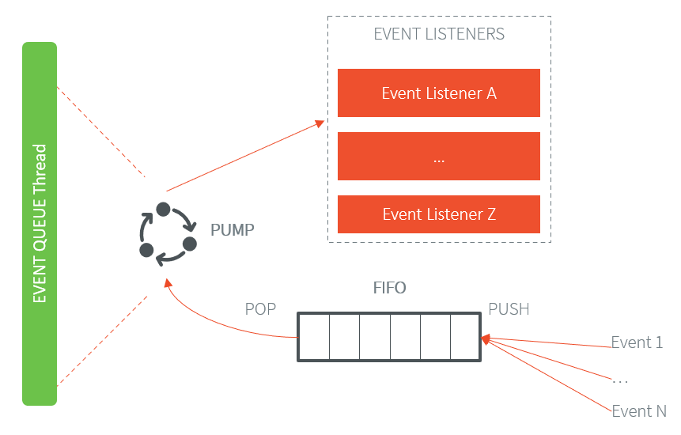

.. _pack_event:

===========
Event Queue
===========

Principle
=========

The Event Queue module provides an asynchronous communication interface between the native world and the Java world based on events.

Functional Description
======================

Overview
--------

The Event Queue Foundation Library allows the user to send events from the native world to the Java world. It is composed of a Java API that provides mechanisms to register to specific events notifications and a native API that allows to send events in the queue.

   Event Queue Overview

A FIFO mechanism is implemented in the native side and is system specific. The user can offer events to this FIFO by using the native API. 

Events notifications are handled using event listeners (Observer design pattern). Application code has to register event listeners to event handler (provided by the Foundation Library) to be notified when new events are coming.

Then the pump is in charge of retrieving new events pushed in the FIFO and notify the application and the event listeners. 

Architecture
------------

The Event Queue Foundation Library use a dedicated Java thread to forward and process events. Application event listeners calls are done in the context of the Event Queue thread. 

.. figure:: images/event-queue-architecture.png
   :alt: Event Queue Architecture
   :align: center
   :scale: 65%

   Event Queue Architecture

Events reading operations are done using SNI mechanism. Event Queue Java thread is suspended if an event read is called and the events FIFO is empty. Event Queue Java thread resume is done by native part when a new event is sent if the events FIFO was previously empty.

.. figure:: images/event-queue-synchronization.png
   :alt: Event Queue Task Synchronization
   :align: center
   :scale: 65%

   Event Queue Task Synchronization

Event format
------------
Only integers (4 bytes) are sent through the FIFO, so there is two kind of events that can be sent over the Event Queue:

- Non-extended event: event that fits on 4 bytes.
- Extended event: event that do not fit on 4 bytes. 

.. code-block:: java

    +--------------+----------+---------------------------------------------------+
    | Extended (1) | Type (7) | Data (if Extended=0), Length (if Extended=1) (24) |
    +--------------+----------+---------------------------------------------------+
    ...
    +-----------------------------------------------------------------------------+
    |                  Extended Data for extended events (32)                     | (x integers)
    +-----------------------------------------------------------------------------+

Format explanation:

- `Extended`: extended event flag, give the kind of event sent. (1 bit) 
- `Type`: event type that allows to find the corresponding event listener. (7 bits)
- `Length`: length of the data in bytes, only if it is an extended event. (24 bits)
- `Data`: data for non-extended events. (24 bits)
- `Extended data`: data for extended events. (Length bytes)

Dependencies
============

-  ``LLEVENT_impl.h`` and ``microej_event.h`` implementations (see
   :ref:`LLEVENT-API-SECTION`).

Installation
============

The Event Queue :ref:`Pack <pack_overview>` module must be installed in your VEE Port.

In the Platform configuration project, (``-configuration`` suffix), add
the following dependency to the :ref:`module.ivy <mmm_module_description>` file:

::

	<dependency org="com.microej.pack.event" name="event-pack" rev="1.0.0" />

The Platform project must be rebuilt (:ref:`platform_build`).

Use
===

The `Event Queue API Module`_ must be added to the :ref:`module.ivy <mmm_module_description>` of the MicroEJ 
Application project to use the Event Queue Foundation Library.

.. code-block:: xml

   <dependency org="ej.api" name="event" rev="1.0.0"/>

.. _Event Queue API Module: https://repository.microej.com/modules/ej/api/
..
   | Copyright 2008-2023, MicroEJ Corp. Content in this space is free 
   for read and redistribute. Except if otherwise stated, modification 
   is subject to MicroEJ Corp prior approval.
   | MicroEJ is a trademark of MicroEJ Corp. All other trademarks and 
   copyrights are the property of their respective owners.
