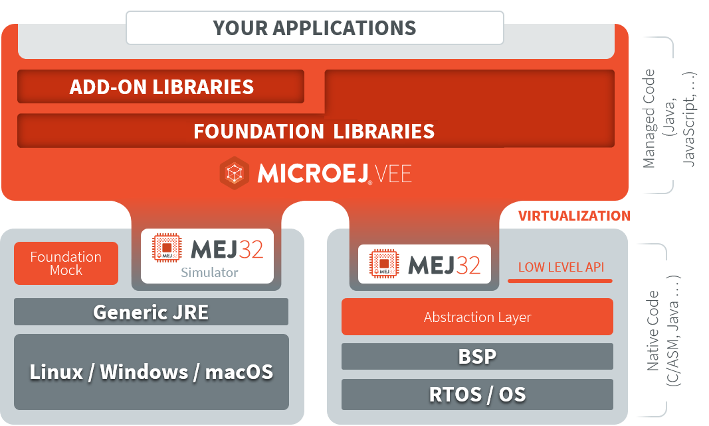

.. _foundation_libraries:

====================
Foundation Libraries
====================

Foundation Libraries are MicroEJ Core libraries that provide core runtime APIs or hardware-dependent functionalities.
They allow Managed code to call native code.

   MicroEJ Foundation Libraries and Add-On Libraries

.. note::

    In SDK 5, A Foundation library is divided into an API and an implementation. 
    A Foundation library API is composed of a name and a 2 digits version (e.g. ``EDC-1.3``) 
    and follows the semantic versioning (`<http://semver.org>`_) specification. 
    A Foundation Library API only contains prototypes without code. 
    Foundation Library implementations are provided by VEE Ports.
    From a MicroEJ Classpath, Foundation Library APIs dependencies are automatically mapped 
    to the associated implementations provided by the VEE Port or the Virtual Device on which 
    the application is being executed.

    In SDK 6, a Foundation Library is a single JAR, containing the implementation.
    The API is composed of all the public classes and methods of the Library.

MicroEJ provides a large set of :ref:`Foundation Libraries <libraries>`, such as UI, Network, Audio, ... 
You can also create your own Foundation Library by going through the following steps described in the next sections:

#. Create the Library project
#. Create the Java class
#. Include header files
#. Install the Library in the VEE Port
#. Implement native code
#. Create the mock

Create the Library Project
--------------------------

To create a Foundation Library, follow the instructions of the :ref:`sdk_6_create_project` page. 
Choose the ``Library`` type in the Project Wizards or the ``Library Project Template`` with the Command Line.

In order to test the Library, it is recommended to also create an Application which calls the Sensor Library.
The Application project must declare the Library as a dependency in its ``build.gradle.kts`` file::

    dependencies {
        implementation("com.mycompany:my-library:1.0.0")
    }

Then the main method of the Application must called the ``Sensor`` API:

.. code-block:: java

    package com.mycompany;

    public class Main {

        public static void main(String[] args) {
            System.out.println("Sensor value: " + Sensor.getValue());
        }

    }

Create the Java Class
---------------------

Once the Library project is created, you can now create a Java class which calls native code.
Create the Java class ``Sensor`` in the ``src/main/java/com/mycompany`` folder of the Library project, with the following content:

.. code-block:: java

    package com.mycompany;

    import java.io.IOException;

    /**
     * Class providing a native method to access sensor value.
     * This method will be executed out of the Core Engine.
     */
    public class Sensor {

        public static final int ERROR = -1;

        public static int getValue() throws IOException {
            int value = getSensorValue();
            if (value == ERROR) {
                throw new IOException("Unsupported sensor");
            }
            return value;
        }

        public static native int getSensorValue();
    }

This class contains a native method ``getSensorValue`` which will be implemented by native code.

Include Header Files
--------------------

The header files define the prototype of the C methods. 
They must be added in the ``src/main/include`` folder of the Library project.

The C method name must respect the following pattern to be mapped to the Java method: ``Java_<FQN>_<methodName>``, 
where ``<FQN>`` is the fully qualified name of the Java class with all ``.`` are replaced by ``_``, and ``methodName`` is name of the Java method.
Therefore, for the ``getSensorValue`` Java method of the ``com.mycompany.Sensor`` class, the C method must be called ``Java_com_mycompany_Sensor_getSensorValue``.

Here is the content of the header file ``LLMYLIB_impl.h`` to create in the ``src/main/include`` folder of the Library project:

.. code-block:: c

    #ifndef LLMYLIB_IMPL
    #define LLMYLIB_IMPL

    /**
    * @file
    * @brief MicroEJ Sensor Low Level API
    * @author My Company
    * @version 1.0.0
    */

    #include <stdint.h>

    #ifdef __cplusplus
    extern "C" {
    #endif

    #define LLMYLIB_IMPL_getSensorValue Java_com_mycompany_Sensor_getSensorValue

    /*
    * Returns the factorial
    */
    uint32_t LLMYLIB_IMPL_getSensorValue();

    #ifdef __cplusplus
    }
    #endif
    #endif

The ``#define`` statement allows to separate the Java part and the C part. 
This is called the Low Level API of the Foundation Library. 
If the fully qualified name of the Java native method is updated, the C implementation code do not need to be updated.

At this stage, the Library project structure should look like::

   |- src/
   |    |- main/
   |    |    |- java/
   |    |    |    |- com/
   |    |    |    |    |- mycompany/
   |    |    |    |    |    |- Sensor.java
   |    |    |- include/
   |    |    |    |- LLMYLIB_impl.h
   |- build.gradle.kts

Install the Library in the VEE Port
-----------------------------------

Once the Library project is done, it must be installed in the VEE Port by adding it as dependency in the ``build.gradle.kts`` file of the VEE Port project::

    dependencies {
        api("com.mycompany:my-library:1.0.0")
    }

Implement Native Code
---------------------

- In the C project, create a new File called ``LLMYLIB_impl.c``.
- Add the C file to the compilation objects by adding it to the C Project configuration.
- Copy and paste the following code to the file:

.. code-block:: c

    #include "LLMYLIB_impl.h"
    #include "sni.h"

    /**
    * @file
    * @brief MicroEJ Sensor low level API
    * @author My Company
    * @version 1.0.0
    */
    uint32_t LLMYLIB_IMPL_getSensorValue()
    {
        return 42;
    }

This file defines a basic C implementation of the ``getSensorValue`` function.

You can now build and deploy the Application on your device.
The following trace shall appear on the standard output::

    VM START
    Sensor value: 42
    VM END (exit code = 0)

Create the Mock
---------------

If you need to use the Library in the Simulator, a Mock must be implemented.
A Mock is a component which implements the native method in Java to use the Library in the Simulator.
Refer to the :ref:`mock` page to create the Mock for ``Sensor`` Library.

Once the Mock is created, it must be declared as a dependency of the Library, in the ``build.gradle.kts``::

    dependencies {
        microejMock("com.mycompany:my-mock:1.0.0")
    }

Then you can run the Application with the Simulator thanks to the ``ruOnSimulator`` Gradle task::

    ./gradlew runOnSimulator

The following trace shall appear on the standard output::

    =============== [ Initialization Stage ] ===============
    =============== [ Launching on Simulator ] ===============
    Sensor value: 42
    =============== [ Completed Successfully ] ===============

..
   | Copyright 2008-2025, MicroEJ Corp. Content in this space is free 
   for read and redistribute. Except if otherwise stated, modification 
   is subject to MicroEJ Corp prior approval.
   | MicroEJ is a trademark of MicroEJ Corp. All other trademarks and 
   copyrights are the property of their respective owners.