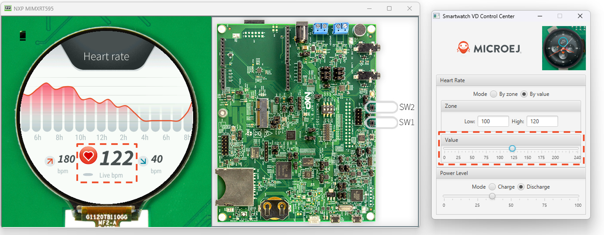

.. _mock:

====
Mock
====

Principle
=========

The HIL engine is a Java standard-based engine that runs Mocks. A Mock
is a jar file containing some Java classes that simulate natives for the
Simulator. Mocks allow applications to be run unchanged in the Virtual Device
while still appearing to interact with native code.

Functional Description
======================

As with :ref:`SNI <runtime_sni>`, HIL is responsible for finding the method to execute as a
replacement for the native Java method that the MicroEJ Simulator tries
to run. Following the SNI specification philosophy, the matching algorithm uses a
naming convention. When a native method is called in the MicroEJ
Simulator, it requests that the HIL engine execute it. The corresponding
Mock executes the method and provides the result back to the MicroEJ
Simulator.

.. figure:: images/hil3.*
   :alt: The MicroEJ Simulator Executes a Native Java Method ``foo()``.
   :align: center
   :scale: 75 %

   The MicroEJ Simulator Executes a Native Java Method ``foo()``.

Example
=======

.. code:: java

   package example;

   import java.io.IOException;

   /**
    * Abstract class providing a native method to access sensor value.
    * This method will be executed out of virtual machine.
    */
   public abstract class Sensor {

       public static final int ERROR = -1;

       public int getValue() throws IOException {
           int sensorID = getSensorID();
           int value = getSensorValue(sensorID);
           if (value == ERROR) {
               throw new IOException("Unsupported sensor");
           }
           return value;
       }

       protected abstract int getSensorID();

       public static native int getSensorValue(int sensorID);
   }

   class Potentiometer extends Sensor {
       
       protected int getSensorID() {
           return Constants.POTENTIOMETER_ID; // POTENTIOMETER_ID is a static final
       }
   }

To implement the native method ``getSensorValue(int sensorID)``, you
need to create a MicroEJ mock project containing the same ``Sensor``
class on the same ``example`` package.

To create a new MicroEJ mock project:

.. tabs::

   .. tab:: SDK 6

      Follow the steps described in :ref:`SDK 6 User Guide - Create a Project <sdk_6_create_project>` depending on your IDE.

   .. tab:: SDK 5

      - Select :guilabel:`File` > :guilabel:`New` > :guilabel:`Module Project`,
      - Fill the module information (project name, module organization, name and revision),
      - Select the :guilabel:`microej-mock` skeleton,
      - Click on :guilabel:`Finish`.

The following code is the required ``Sensor`` class of the created Mock
project:

.. code:: java

   package example;

   import java.util.Random;

   /**
    * Java standard class included in a Mock jar file.
    * It implements the native method using a Java method.
    */
   public class Sensor {

       /**
        * Constants
        */
       private static final int SENSOR_ERROR = -1;
       private static final int POTENTIOMETER_ID = 3;
       
       private static final Random RANDOM = new Random();
       
       /**
        * Implementation of native method "getSensorValue()"
        * 
        * @param sensorID Sensor ID
        * @return Simulated sensor value
        */
       public static int getSensorValue(int sensorID) {
           if( sensorID == POTENTIOMETER_ID ) {
               // For the simulation, Mock returns a random value
               return RANDOM.nextInt();
           }
           return SENSOR_ERROR;
       }
       
   }

.. note::

   The visibility of the native method implemented in the mock must be ``public`` regardless of the visibility of the native method in the application.
   Otherwise the following exception is raised: ``java.lang.UnsatisfiedLinkError: No such method in remote class``.

Mocks Design Support
====================

Interface
---------

The MicroEJ Simulator interface is defined by static methods on the Java
class ``com.is2t.hil.NativeInterface``.

Array Type Arguments
--------------------

Both :ref:`[SNI] <runtime_sni>` and HIL allow arguments that are arrays of base types. By
default the contents of an array are NOT sent over to the Mock. An
"empty copy" is sent by the HIL engine, and the contents of the array
must be explicitly fetched by the Mock. The array within the Mock can be
modified using a regular assignment. Then to apply these changes in the
MicroEJ Simulator, the modifications must be flushed back. There are two
methods provided to support fetch and flush between the MicroEJ
Simulator and the HIL:

-  ``refreshContent``: initializes the array argument from the contents
   of its MicroEJ Simulator counterpart.

-  ``flushContent``: propagates (to the MicroEJ Simulator) the contents
   of the array that is used within the HIL engine.

.. figure:: images/hil4.*
   :alt: An Array and Its Counterpart in the HIL Engine.
   :align: center
   :scale: 75 %

   An Array and Its Counterpart in the HIL Engine.

Below is a typical usage.

::

   public static void foo(char[] chars, int offset, int length){
           NativeInterface ni = HIL.getInstance();
           //inside the Mock
           ni.refreshContent(chars, offset, length);
           chars[offset] = 'A';
           ni.flushContent(chars, offset, 1);
   }

Blocking Native Methods
-----------------------

Some native methods block until an event has arrived :ref:`[SNI] <runtime_sni>`. Such
behavior is implemented in native using the following three functions:

-  ``int32_t SNI_suspendCurrentJavaThread(int64_t timeout)``
-  ``int32_t SNI_getCurrentJavaThreadID(void)``
-  ``int32_t SNI_resumeJavaThread(int32_t id)``

This behavior is implemented in a Mock using the following methods on a ``lock`` object:

- `Object.wait(long timeout)`_: Causes the current thread to wait
  until another thread invokes the `notify()`_ method or the
  `notifyAll()`_ method for this object.

- `Object.notifyAll()`_: Wakes up all the threads that are waiting on
  this object's monitor.

- ``NativeInterface.notifySuspendStart()``: Notifies the Simulator that the current native is suspended so it can schedule a thread with a lower priority.

- ``NativeInterface.notifySuspendEnd()``: Notifies the Simulator that the current native is no more suspended. Lower priority threads in the Simulator will not be scheduled anymore.

.. code:: java

   public static byte[] data = new byte[BUFFER_SIZE];
   public static int dataLength = 0;
   private static Object lock = new Object();

	// Mock native method
	public static void waitForData() {
		NativeInterface ni = HIL.getInstance();
		// inside the Mock
		// wait until the data is received
		synchronized (lock) {
			while (dataLength == 0) {
				try {
					ni.notifySuspendStart();
					lock.wait(); // equivalent to lock.wait(0)
				} catch (InterruptedException e) {
					// Use the error code specific to your library
					throw new NativeException(-1, "InterruptedException", e);
				} finally {
					ni.notifySuspendEnd();
				}
			}
		}
	}

   // Mock data reader thread
   public static void notifyDataReception() {
         synchronized (lock) {
               dataLength = readFromInputStream(data);
               lock.notifyAll();
         }
   }

.. _Object.wait(long timeout): https://repository.microej.com/javadoc/microej_5.x/apis/java/lang/Object.html#wait-long-
.. _notify(): https://repository.microej.com/javadoc/microej_5.x/apis/java/lang/Object.html#notify--
.. _notifyAll(): https://repository.microej.com/javadoc/microej_5.x/apis/java/lang/Object.html#notifyAll--
.. _Object.notifyAll(): https://repository.microej.com/javadoc/microej_5.x/apis/java/lang/Object.html#notifyAll--

Resource Management
-------------------

In Java, every class can play the role of a small read-only file system
root: The stored files are called "Java resources" and are accessible
using a path as a String.

The MicroEJ Simulator interface allows the retrieval of any resource
from the original Java world, using the ``getResourceContent`` method.

::

   public static void bar(byte[] path, int offset, int length) {
         NativeInterface ni = HIL.getInstance();
         ni.refreshContent(path, offset, length);
         String pathStr = new String(path, offset, length);
         byte[] data = ni.getResourceContent(pathStr);
         ...
   }

Synchronous Terminations
------------------------

To terminate the whole simulation (MicroEJ Simulator and HIL), use the
stop() method.

::

   public static void windowClosed() {
         HIL.getInstance().stop();
   }

Dependencies
============

.. tabs::

   .. tab:: SDK 6

      - Copy the ``HILEngine.jar`` from the VEE Port into a project folder, for example in ``libs``.
      - Add a dependency to this local library in the ``build.gradle.kts`` file:

         .. code-block:: kotlin

            implementation(files("libs/HILEngine.jar"))

   .. tab:: SDK 5

      The HIL Engine API is automatically provided by the ``microej-mock`` project skeleton.

Installation
============

.. tabs::

   .. tab:: SDK 6

      - :ref:`Create a J2SE Library project <sdk_6_create_project_configure_project>`,
      - In the ``build.gradle.kts`` file, change the ``com.microej.gradle.j2se-library`` plugin to ``com.microej.gradle.mock``.
      - Build and publish the Mock by executing the Gradle ``publish`` task.

      Once the module is built, the mock can be installed in a VEE Port in one of the two ways:

      - by adding the mock module as a regular VEE Port :ref:`module dependency <mmm_module_dependencies>` (if your VEE Port configuration project contains a ``module.ivy`` file), 
      - or by manually copying the JAR file ``[mock_project]/build/libs/[mock_name]-[mock_version].jar`` to the :ref:`VEE Port configuration <platform_configuration_creation>` mock dropins folder ``dropins/mocks/dropins/``.

   .. tab:: SDK 5

      First create a new :ref:`module project <mmm_module_skeleton>` using the ``microej-mock`` skeleton.

      .. figure:: images/mock-skeleton.png
         :alt: Mock Project Structure
         :align: center

      Once implemented, right-click on the repository project and select ``Build Module``.

      Once the module is built, the mock can be installed in a VEE Port in one of the two ways:

      - by adding the mock module as a regular VEE Port :ref:`module dependency <mmm_module_dependencies>` (if your VEE Port configuration project contains a ``module.ivy`` file), 
      - or by manually copying the JAR file ``[mock_project]/target~/rip/mocks/[mock_name].jar`` to the :ref:`VEE Port configuration <platform_configuration_creation>` mock dropins folder ``dropins/mocks/dropins/``.

      Make sure the option :ref:`resolve_foundation_libraries_in_workspace` is enabled to use the mock without having to install it after each modification during development.

Use
===

Once installed, a Mock is used automatically by the Simulator when the
MicroEJ Application calls a native method which is implemented into the
Mock.

JavaFX
=======

`JavaFX <https://openjfx.io/>`_ is an open-source library for creating modern Java user interfaces that is highly portable. It can be used to quickly create graphical Mocks for your VEE Port.

- If your SDK is running on JDK 8, the Oracle JDK contains JavaFX, so this version allows you to use it right now in your project.

- If your SDK is running on JDK 11, JavaFX must be added as an additional dependency to your Mock and VEE Port project. 
  For that, MicroEJ Corp. provides a ready-to-use packaged module for all supported OS versions.

::

    <dependency org="com.microej.tool" name="javafx" rev="1.2.0" />

The Module serves two purposes, depending on whether it is added to a Mock or a VEE Port project:

- In a Mock project, JavaFX is added as a compile-time dependency, its content is not included in the Mock.
- If your VEE Port contains at least one Mock, JavaFX must be added to the VEE Port project in order to embed its content in the VEE Port.  

Mock Framework
==============

The Mock Framework is a framework, based on JavaFX, that aims to ease the development of mock UIs.

The Mock Framework provides a set of widgets. It allows to automatically generate the native method implementation
of an application and link it with the widgets of the mock UI.

   Mock Framework used to mock Heart Rate sensor on Wearable Demo.

Usage
-----

The following steps should be followed to create a mock using Mock Framework:

- Create a Mock Framework Property to bind the native method to mock to the mock UI,
- Create a Dashboard, 
- Add widgets.

Mock Framework Property
~~~~~~~~~~~~~~~~~~~~~~~

The Mock Framework uses a property system to bind widgets to the native methods.
A property holds a value and can trigger listeners when updated.

A property must extend ``MockProperty`` and be annotated with ``@Property``:

.. code-block:: java

    @Property
    public class MyProperty extends MockProperty {
        ...
    }

The annotation is used by the framework to find any property declared in the mock project. 
The property can then be retrieved from its class:

.. code-block:: java

    MyProperty property = MockupApplication.getProperty(MyProperty.class);

There are ready to use implementations of ``MockProperty``:

- ``BooleanProperty``
- ``IntegerProperty``
- ``LongProperty``
- ``FloatProperty``
- ``DoubleProperty``
- ``NumberProperty``
- ``StringProperty``
- ``FileProperty``

Getter and Setter Attributes
^^^^^^^^^^^^^^^^^^^^^^^^^^^^

Let's consider the following application code that defines getter and setter native methods:

.. code-block:: java

   package com.microej.example;

   public class RandomService {

      private RandomService() {
      }

      /**
      * Gets the service state.
      *
      * @return true if the service is enabled, false otherwise.
      */
      public static native boolean getEnable();

      /**
      * Sets the service state.
      *
      * @param enable
      *            enables or disables the service.
      */
      public static native void setEnable(boolean enable);

      ...

The native method implementation code can be generated using the following attributes in the Property annotation:

- ``getter="<method name>"`` for the native method that retrieves a value from the mock.
- ``setter="<method name>"`` for the native method that sets a value in the mock.

.. code-block:: java

    @Property(getter = "com.microej.example.RandomService.getEnable")
    public class MyProperty extends BooleanProperty {
        ...
    }

or

.. code-block:: java

    @Property(getter = "com.microej.example.RandomService.getEnable", setter = "com.microej.example.RandomService.setEnable")
    public class MyProperty extends BooleanProperty {
        ...
    }

These attributes are optional. When not specified, the corresponding code will not be generated. 

The ``<method name>`` is the fully qualified name of the method, 
it must contain the package, the name of the class in which the native is implemented, and the native method name. 
It must not contain parenthesis and arguments.

Note that the class containing the ``getter`` and the ``setter`` can be different.

Property values can be changed from the mock code with ``getValue()`` and ``setValue()`` methods:

.. code-block:: java

   /* Get MyProperty value */
   boolean state = MockupApplication.getProperty(MyProperty.class).getValue();
   
   /* Set MyProperty value */
   MockupApplication.getProperty(MyProperty.class).setValue(!state);

Mock Framework Widgets
~~~~~~~~~~~~~~~~~~~~~~

The Mock Framework provides some widgets to manipulate properties.

Interacting with the widget modifies the underlying property,
and in the contrary, updating the property value modifies the state of the widget.

- ``CheckBox``: sets the value of a ``BooleanProperty``. The property is set to ``true`` when the box is checked, and ``false`` otherwise.
- ``NumberSlider``: sets a value of a ``NumberProperty`` between the bounds defined by the property. The bounds and the position of the slider are automatically updated with the property.
- ``BoundsSetter``: displays the upper and lower bounds defined in the ``NumberProperty``. This class is abstract and needs to be used as a specialized subclass, such as ``IntegerBoundsSetter`` for integer values.
- ``Container``: widget that contains other Mock Framework Widgets. By default, it displays contained widgets vertically.
- ``Choice``: widget container providing a radio button list for each contained widget. Only the selected widget will be enabled and the other disabled (not clickable).
- ``FileChooser``: displays a button that opens a standard platform file dialog for selecting a file. Once the file is selected, the property is updated with the corresponding file object.
- ``TitledWidget``: decorator to add a title to a widget. 
- ``ImageSwapWidget``: stores two images and shows one of them based on a boolean property.
- ``JavaFxWidget``: abstract class that can be extended to create custom widgets using JavaFX components.

Mock Framework Dashboard
~~~~~~~~~~~~~~~~~~~~~~~~

The Mock Framework Dashboard represents the window that is opened at Application startup on Simulator. It holds the Mock widgets.

Mock widgets can be bound to Mock properties by passing the property class as an argument of the Mock widget.

A Dashboard must extend ``AbstractDashboard`` and be annotated with ``@DashBoard`` annotation.

.. code-block:: java

   @DashBoard(title = "My Mock DashBoard")
   public class MockDashBoard extends AbstractDashboard {

      public MockDashBoard() {
         addWidget(new CheckBox("Enable RandomService", MyProperty.class));
      }
   }

``@DashBoard`` attributes are optional, find below the list of available ones:

- ``title``: sets the title of the mock window, default title is *VD Control Center*. 
- ``icon``: sets the icon of the mock window, the path is relative to the ``src/main/resources`` folder of the mock project (e.g. ``icon="images/myIcon.png"``).
- ``width``: sets the width of the mock window. The default value is negative. When not specified, the system sets the mock window size automatically.
- ``height``: sets the height of the mock window. The default value is negative. When not specified, the system sets the mock window size automatically.

Examples
--------

- `Mock Framework Examples <TODO>`__ demonstrate the use of the Mock Framework.

Installation
------------

.. tabs::

   .. tab:: SDK 5

      - Add the Mock Framework dependency to your Mock project:

         .. code-block:: xml

            <dependency org="com.microej.library.mock" name="mock-framework" rev="1.0.1" />

      - Add the JavaFX dependency to your Mock project which is required to compile the mock:

         .. code-block:: xml

            <dependency org="com.microej.tool" name="javafx" rev="1.2.0" />

   .. tab:: SDK6

      - Add the Mock Framework dependency to your Mock project:

         .. code-block:: kotlin

            implementation("com.microej.library.mock:mock-framework:1.0.1")

      - Add the JavaFX dependency to your Mock project which is required to compile the mock:

         .. code-block:: kotlin

            compileOnly(group="com.microej.tool", name="javafx", version="1.2.0", configuration="provided")

      - Add the Mock Framework and JavaFX annotation processors dependencies to your Mock project:

         .. code-block:: kotlin

            annotationProcessor("com.microej.library.mock:mock-framework:1.0.1")
            annotationProcessor(group="com.microej.tool", name="javafx", version="1.2.0", configuration="provided")

..
   | Copyright 2008-2024, MicroEJ Corp. Content in this space is free 
   for read and redistribute. Except if otherwise stated, modification 
   is subject to MicroEJ Corp prior approval.
   | MicroEJ is a trademark of MicroEJ Corp. All other trademarks and 
   copyrights are the property of their respective owners.
