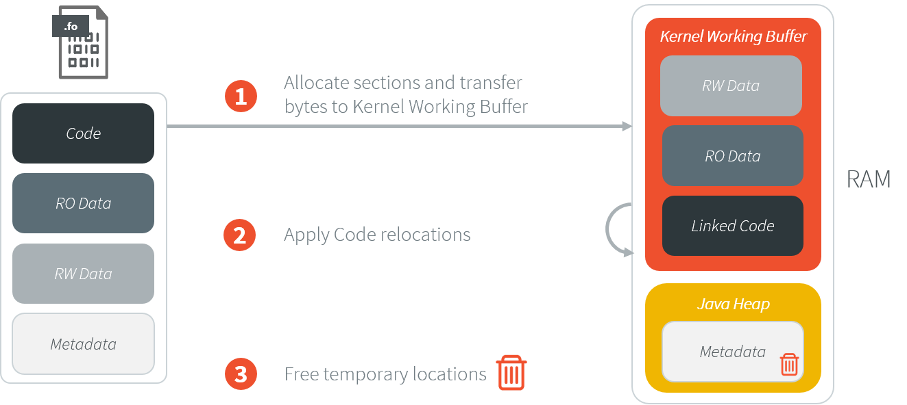
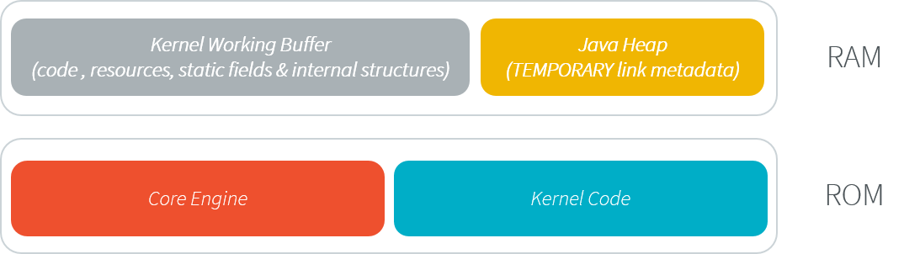
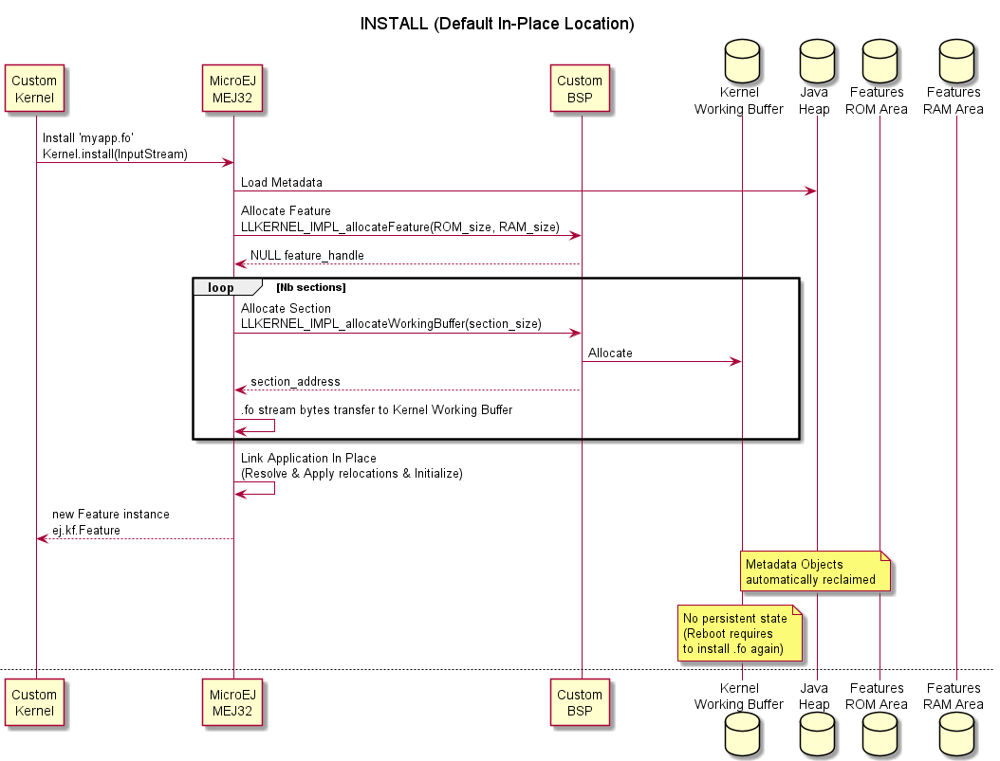
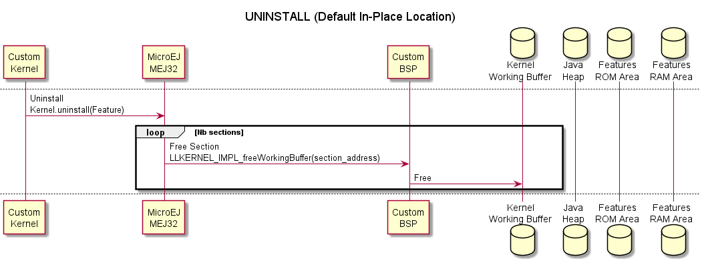
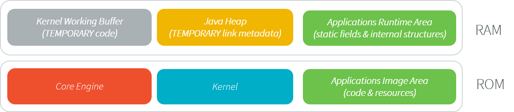
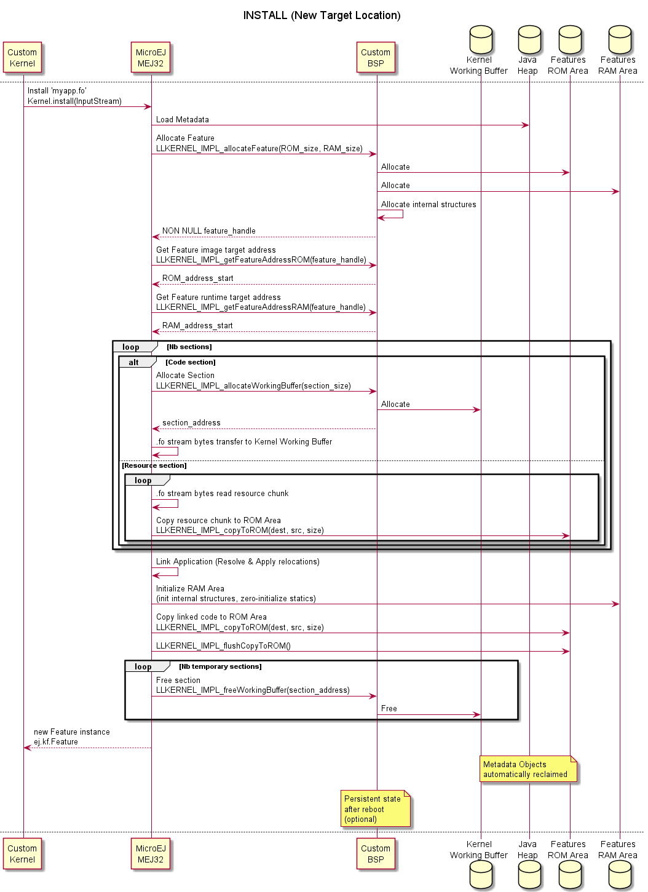
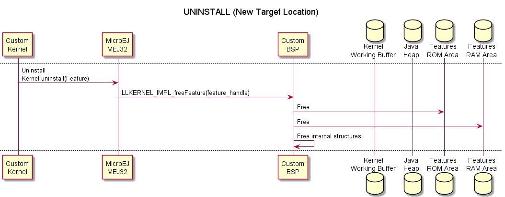
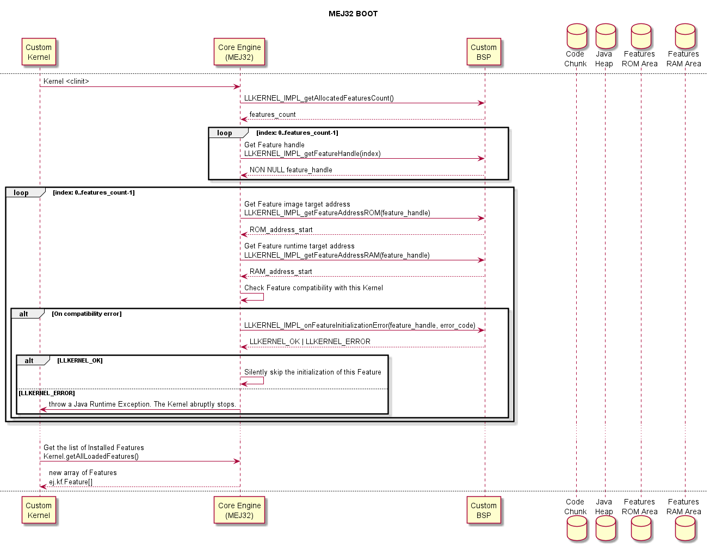

.. _multisandbox:

=============
Multi-Sandbox
=============

Principle
=========

The Multi-Sandbox capability of the MicroEJ Core Engine allows a
main application (called Standalone Application) to install and execute
at runtime additional applications (called Sandboxed Applications).

The MicroEJ Core Engine implements the :ref:`[KF] specification <kf_specification>`. A Kernel is a
Standalone Application generated on a Multi-Sandbox-enabled
platform. A Feature is a Sandboxed Application generated against a specific Kernel.

A Sandboxed Application may be dynamically downloaded at runtime or
integrated at build-time within the executable application.

Functional Description
======================

The Multi-Sandbox process extends the overall process described in
:ref:`the overview of the platform process <build_process_overview>`.

.. figure:: images/process-multiapp-overview.*
   :alt: Multi-Sandbox Process
   :align: center
   :scale: 80%

   Multi-Sandbox Process

Once a Kernel has been generated, additional Sandboxed Application code
(Feature) can be built against the Kernel . 
The binary application file produced (``application.fo``) is compatible only
for the Kernel on which it was generated. Generating a new Kernel
requires that you generate the Features again on this Kernel.

For more details on the build flow, please refer to :ref:`Multi-Sandbox Kernel link <kernel_link>` and :ref:`Sandboxed Application link <application_link>` sections.

Memory Considerations
=====================

Multi-Sandbox memory overhead of Core Engine runtime
elements are described in :ref:`Memory Considerations table <memory-considerations>`.

Dependencies
============

-  ``LLKERNEL_impl.h`` implementation (see :ref:`feature_memory_installation` section).

Installation
============

Multi-Sandbox capability is an additional Core Engine module, disabled by default.

To enable the Multi-Sandbox capability of the MicroEJ Core Engine, in the platform
configuration file, check :guilabel:`Multi Applications`.

Use
===

The `KF API Module`_ must be added to the :ref:`module.ivy <mmm_module_description>` of the MicroEJ 
Application project to use :ref:`[KF] <kf_specification>` library.

::

   <dependency org="ej.api" name="kf" rev="1.4.4"/>

This library provides a set of options. Refer to the chapter
:ref:`application_options` which lists all available options.

.. _KF API Module: https://repository.microej.com/modules/ej/api/kf/

.. _feature_memory_installation:

Feature Installation
====================

Feature installation is the process of linking a ``.fo`` file in memory.
It is triggered by a call to the `Kernel.install(InputStream)`_ method. It consists of:

- transferring the Feature content (code and resources) to the target memory location,
- applying relocations to code (e.g., resolving final addresses in instructions such as method call, static field access, ...).

The ``LLKERNEL_impl.h`` Abstraction Layer interface provides Low Level APIs for allocating and transferring Feature content in different memory areas.

There are two kinds of installation:

- In-place installation: The Feature content is allocated in RAM.
- Custom installation: The Feature content is copied to any byte-addressable memory, including ROM.

Both installation modes require a certain amount of RAM:

- code relocations are allocated in the Java heap,
- the rest is allocated in a memory area called the Kernel Working Buffer (see below).

In-Place Installation
---------------------

This is the fastest way to go with Feature installation since it only requires connecting a ``malloc/free`` implementation.

   In-Place Feature Installation Steps

In-Place Feature installation only applies in RAM: the whole Feature content (code and resources) is allocated in the Kernel Working Buffer. 
When the Core Engine or the device restarts, the Kernel Working Buffer is reset; thus there is no persistent Feature. 

   In-Place Feature Installation Memory Map

The In-Place installation flow is described in the following sequence diagram:

   In-Place Feature Installation Flow

The In-Place uninstallation flow is described in the following sequence diagram:

   In-Place Feature Uninstallation Flow

Custom Installation
-------------------

Custom Feature Installation allows to install a Feature in any byte-addressable memory. 
The Abstraction Layer implementation is responsible for providing the following elements:

- the address location where the Feature will be installed,
- the implementation to copy a chunk of bytes to the target location.

.. figure:: images/multisandbox-link-custom-overview.png
   :alt: Custome Feature Installation Steps
   :align: center
   :scale: 70%

   Custom Feature Installation Steps

   Custom Feature Installation Memory Map

The custom installation flow is described in the following sequence diagram:

   Custom Feature Installation Flow

The custom uninstallation flow is described in the following sequence diagram:

   Custom Feature Uninstallation Flow   

Feature Persistency
-------------------

If the Abstraction Layer implementation installs a Feature in a Read-Only memory, it will be available after the Core Engine or the device restarts.

   Feature Installation Boot Flow

Advanced Options
----------------

InputStream Buffer Size
~~~~~~~~~~~~~~~~~~~~~~~

Feature ``.fo`` InputStream is read in a temporary byte array allocated in the Java Heap. 
The buffer size can be configured with the following option:

**Option Name**: ``com.microej.runtime.kf.link.transferbuffer.size``

**Default Value**: ``512`` (bytes)

Relocation Process Yield
~~~~~~~~~~~~~~~~~~~~~~~~

When a Feature file has a large amount of code, it may appear that the Core Engine blocks while applying relocations during the Feature installation.
The number of relocations to apply in batch can be configured with the following option:
 
**Option Name**: ``com.microej.runtime.kf.link.chunk.relocations.count``

**Default Value**: ``128``

Once the Core Engine has processed the given number of relocations, the thread that called the `Kernel.install(InputStream)`_ method yields the execution to other threads.
A small number will give more smooth execution for threads but a slowest installation execution. A large number will make the Core Engine block for applying relocations but a faster installation execution.

.. _Kernel.install(InputStream): https://repository.microej.com/javadoc/microej_5.x/apis/ej/kf/Kernel.html#install-java.io.InputStream-

Determining the Amount of Required Memory
-----------------------------------------

The amount of memory required for installing a ``.fo`` file is determined by analyzing the sizes of the ELF sections.

Sections can be dumped using the standard binutils ``readelf`` tool:

.. code:: console

   readelf -WS application.fo
   There are 8 section headers, starting at offset 0x34:

   Section Headers:
   [Nr] Name              Type            Addr     Off    Size   ES Flg Lk Inf Al
   [ 0]                   NULL            00000000 000000 000000 00      0   0  0
   [ 1] .soar.rel         LOPROC+0        00000000 000174 000bcc 00      6   0  4
   [ 2] .strtab           STRTAB          00000000 000d40 000063 00      0   0  1
   [ 3] .symtab           SYMTAB          00000000 000da4 000050 10      2   1  4
   [ 4] .bss.soar.feature NOBITS          00000000 000df4 000050 00   A  0   0  4
   [ 5] .rodata.microej.resources PROGBITS        00000000 000e00 079080 00   A  0   0 64
   [ 6] .rodata           PROGBITS        00000000 079e80 001974 00   A  0   0 16
   [ 7] .shstrtab         STRTAB          00000000 07b7f4 000059 00      0   0  1

The following table summarizes the sections and their content:

.. list-table::
   :widths: 30 30 30 30

   * - **Section**
     - **Description**
     - **Temporary Memory Location**
     - **Target Memory Location**
   * - ``.soar.rel``
     - Metadata
     - Java Heap
     - None
   * - ``.strtab``
     - Metadata
     - Java Heap
     - None
   * - ``.symbtab``
     - Metadata
     - Java Heap
     - None
   * - ``.bss.soar.feature``
     - Static fields,
       internal structures
     - None
     - RAM area
   * - ``.rodata.microej.resources``
     - Application Resources
     - None
     - ROM area
   * - ``.rodata``
     - Application Code
     - Kernel Working Buffer
     - ROM area
   * - ``.shstrtab``
     - Metadata
     - Java Heap
     - None

..
   | Copyright 2008-2023, MicroEJ Corp. Content in this space is free 
   for read and redistribute. Except if otherwise stated, modification 
   is subject to MicroEJ Corp prior approval.
   | MicroEJ is a trademark of MicroEJ Corp. All other trademarks and 
   copyrights are the property of their respective owners.
