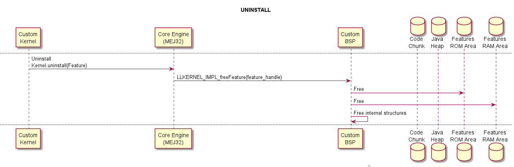

.. _multisandbox:

=============
Multi-Sandbox
=============

Principle
=========

The Multi-Sandbox capability of the Core Engine allows a
main application (called Standalone Application) to install and execute
at runtime additional applications (called Sandboxed Applications).

The Core Engine implements the :ref:`[KF] specification <kf_specification>`. A Kernel is a
Standalone Application generated on a Multi-Sandbox-enabled
VEE Port. A Feature is a Sandboxed Application generated against a specific Kernel.

Functional Description
======================

The Multi-Sandbox process extends the overall process described in
:ref:`the overview of the platform process <build_process_overview>`.

.. figure:: images/process-multiapp-overview.*
   :alt: Multi-Sandbox Process
   :align: center
   :scale: 80%

   Multi-Sandbox Process

Once a Kernel has been generated, additional Sandboxed Application code
(Feature) can be built against the Kernel. 
The binary file produced (the ``.fo`` file) can be installed on the Kernel on which it was generated.

For more details on the build flow, please refer to :ref:`Multi-Sandbox Kernel link <kernel_link>` and :ref:`Sandboxed Application link <application_link>` sections.

Memory Considerations
=====================

Multi-Sandbox memory overhead of Core Engine runtime
elements are described in :ref:`Memory Considerations table <memory-considerations>`.

Dependencies
============

-  ``LLKERNEL_impl.h`` implementation (see :ref:`feature_memory_installation` section).

Installation
============

Multi-Sandbox capability is an additional Core Engine module, disabled by default.

To enable the Multi-Sandbox capability of the Core Engine, in the platform
configuration file, check :guilabel:`Multi Applications`.

Use
===

The `KF API Module`_ must be added to the :ref:`module.ivy <mmm_module_description>` of the 
Application project to use :ref:`[KF] <kf_specification>` library.

::

   <dependency org="ej.api" name="kf" rev="1.4.4"/>

This library provides a set of options. Refer to the chapter
:ref:`application_options` which lists all available options.

.. _KF API Module: https://repository.microej.com/modules/ej/api/kf/

.. _feature_memory_installation:

Feature Installation
====================

Introduction
------------

Feature installation is triggered by a call to the `Kernel.install(InputStream)`_ method. It consists of the following steps:

- loading Feature's content from ``.fo`` file,
- linking Feature's code with the Kernel,
- storing Feature's content into the target memory.

A Feature ``.fo`` file is composed of the following elements:

- Code: Application code (methods, types, ...) as well as built-in objects (strings and immutables),
- RO Data: :ref:`Application Resources <chapter.microej.applicationResources>` that do not require content modification,
- RW Data: Reserved memory for Feature execution (Application static fields and Feature internal structures),
- Metadata: Temporary information required during the installation phase, such as code relocations.

   Feature ``.fo`` File Content

Feature installation flow allows to install Features in any byte-addressable memory mapped to the CPU's address space.
The Feature content is read chunk-by-chunk from the InputStream and progressively transferred to the target memory.
Only a small amount of RAM is required.
The ``LLKERNEL_impl.h`` Abstraction Layer interface provides Low Level APIs for allocating and transferring Feature content in different memory areas, including ROM.

Installation Flow
-----------------

The RO Data (Application Resources) is directly transferred to the target location.
The Code is divided into chunks. Each chunk is temporarily copied to RAM to be relocated. Then it is transferred to the target location.

A minimum amount of RAM is required:

- A temporary buffer is allocated in the Java heap for reading bytes from the InputStream,
- Metadata is allocated in the Java heap,
- Code chunk is temporarily copied in a memory area to be relocated (see more details below).

   Feature Installation Steps

The Abstraction Layer implementation is responsible for providing the following elements:

- the location where the Feature will be installed,
- the implementation to copy a chunk of bytes to the target location.

The detailed installation flow is described in the following sequence diagram:

   Feature Installation Flow

The detailed uninstallation flow is described in the following sequence diagram:

   Feature Uninstallation Flow   

.. _feature_persistency:

Feature Persistency
-------------------

Feature Persistency is the ability of the Core Engine to gather installed Features from prior executions of the Kernel upon start up.
This means that the Kernel will boot with a set of available Features that were already installed.
To ensure that the Features remain available even after the device restarts, you will have to implement an Abstraction Layer that stores the Features into a Read-Only memory.

   Feature Installation Boot Flow

.. note::

   Features are available in the :ref:`INSTALLED <kernel_application_lifecycle>` state.
   It is the responsibility of the Kernel to manually start the desired Features.

Advanced Options
----------------

.. _feature_code_chunk_size:

Code Chunk Size
~~~~~~~~~~~~~~~

Feature ``.fo`` Code section is divided into chunks that are temporary copied to RAM to be relocated. 
The Code chunk size can be configured with the following option:

**Option Name**: ``com.microej.soar.kernel.featurecodechunk.size``

**Default Value**: ``65536`` (bytes)

A small number will reduce the RAM consumption but will increase the ``.fo`` size and will affect the installation time. 

InputStream Buffer Size
~~~~~~~~~~~~~~~~~~~~~~~

Feature ``.fo`` InputStream is read in a temporary byte array allocated in the Java Heap. 
The buffer size can be configured with the following option:

**Option Name**: ``com.microej.runtime.kf.link.transferbuffer.size``

**Default Value**: ``512`` (bytes)

Relocation Process Yield
~~~~~~~~~~~~~~~~~~~~~~~~

When a Feature file has a large amount of code, it may appear that the Core Engine blocks while applying relocations during the Feature installation.
The number of relocations to apply in batch can be configured with the following option:
 
**Option Name**: ``com.microej.runtime.kf.link.chunk.relocations.count``

**Default Value**: ``128``

Once the Core Engine has processed the given number of relocations, the thread that called the `Kernel.install(InputStream)`_ method yields the execution to other threads.
A small number will give more smooth execution for threads but a slowest installation execution. A large number will make the Core Engine block for applying relocations but a faster installation execution.

.. _Kernel.install(InputStream): https://repository.microej.com/javadoc/microej_5.x/apis/ej/kf/Kernel.html#install-java.io.InputStream-

Determining the Amount of Required Memory
-----------------------------------------

The amount of memory required for installing a ``.fo`` file is determined by analyzing the sizes of the ELF sections.

Sections can be dumped using the standard binutils ``readelf`` tool:

.. code:: console

   readelf -WS application.fo
   There are 8 section headers, starting at offset 0x34:

   Section Headers:
   [Nr] Name              Type            Addr     Off    Size   ES Flg Lk Inf Al
   [ 0]                   NULL            00000000 000000 000000 00      0   0  0
   [ 1] .soar.rel         LOPROC+0        00000000 000174 000bcc 00      6   0  4
   [ 2] .strtab           STRTAB          00000000 000d40 000063 00      0   0  1
   [ 3] .symtab           SYMTAB          00000000 000da4 000050 10      2   1  4
   [ 4] .bss.soar.feature NOBITS          00000000 000df4 000050 00   A  0   0  4
   [ 5] .rodata.microej.resources PROGBITS        00000000 000e00 079080 00   A  0   0 64
   [ 6] .rodata           PROGBITS        00000000 079e80 001974 00   A  0   0 16
   [ 7] .shstrtab         STRTAB          00000000 07b7f4 000059 00      0   0  1

The following table summarizes the sections and their content:

.. list-table::
   :widths: 30 30 30 30

   * - **Section**
     - **Description**
     - **Temporary Memory Location**
     - **Target Memory Location**
   * - ``.soar.rel``
     - Metadata
     - Java Heap
     - None
   * - ``.strtab``
     - Metadata
     - Java Heap
     - None
   * - ``.symbtab``
     - Metadata
     - Java Heap
     - None
   * - ``.bss.soar.feature``
     - RW Data
     - None
     - Features RAM area
   * - ``.rodata.microej.resources``
     - RO Data
     - None
     - Features ROM area
   * - ``.rodata``
     - Code chunk
     - RAM
     - Features ROM area
   * - ``.shstrtab``
     - Metadata
     - Java Heap
     - None

.. _feature_inplace_installation:

In-Place Installation
---------------------

.. note:: 

   This section describes the legacy Feature installation flow, based on a ``malloc/free`` implementation in RAM.
   It is deprecated and available up to :ref:`Architecture 8.0.0 <changelog-8.0.0>`.  
   
   See :ref:`architecture8_migration_llkernel` for migrating to the latest installation flow.

Feature content is installed in RAM. The required memory is allocated in the Kernel Working Buffer. 
This includes code, resources, static fields, and internal structures.
When the Feature is uninstalled, allocated memory is reclaimed. 
When the Core Engine or the device restarts, the Kernel Working Buffer is reset; thus there is no persistent Feature. 

   In-Place Feature Installation Overview

The In-Place installation flow is described in the following sequence diagram:

   In-Place Feature Installation Flow

The In-Place uninstallation flow is described in the following sequence diagram:

   In-Place Feature Uninstallation Flow

.. _multisandbox_ram_control:

RAM Control
===========

.. note::

   This feature requires Architecture :ref:`8.1.0 <changelog-8.1.0>` or higher.

In a Multi-Sandbox environment, RAM Control automatically stops less critical Features when a more critical Feature cannot allocate new objects. 
See the `RAM Control: Feature Criticality` section of the :ref:`kf_specification` for more details.

By default, RAM Control is disabled in the Core Engine. 
To enable it, set the property ``com.microej.runtime.kf.ramcontrol.enabled`` to ``true`` when building the VEE Port. 
This can be done by defining this property in the file ``mjvm/mjvm.properties`` of your VEE Port configuration project:

.. code-block::

  com.microej.runtime.kf.ramcontrol.enabled=true

When RAM Control is enabled, all Foundation Libraries must declare their native resources using SNI (see ``sni.h`` header file).

..
   | Copyright 2008-2023, MicroEJ Corp. Content in this space is free 
   for read and redistribute. Except if otherwise stated, modification 
   is subject to MicroEJ Corp prior approval.
   | MicroEJ is a trademark of MicroEJ Corp. All other trademarks and 
   copyrights are the property of their respective owners.
