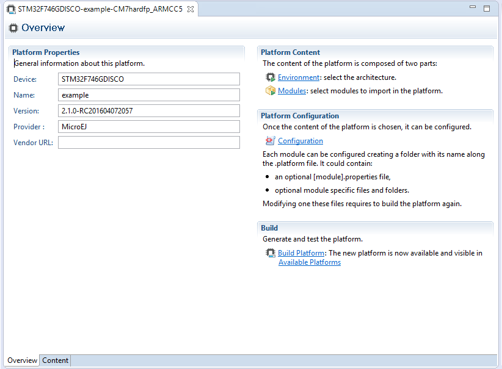
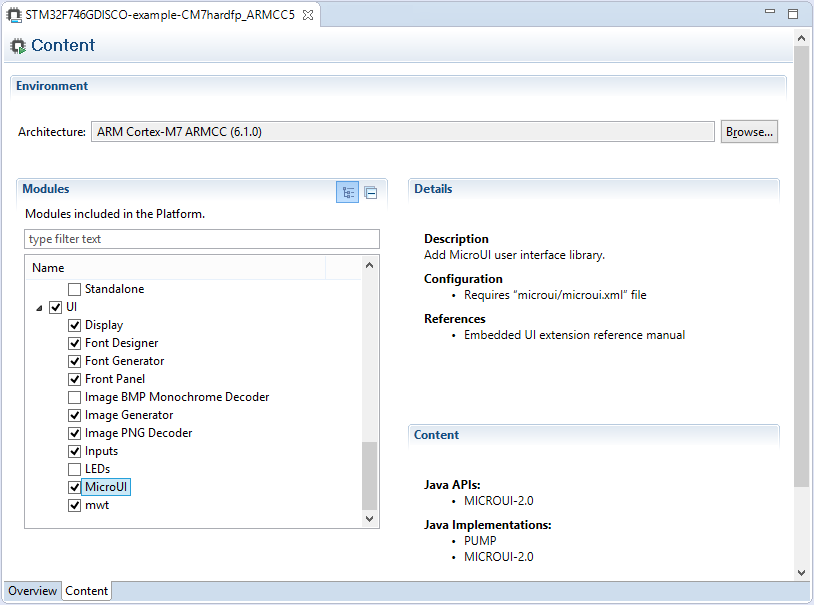

.. _concepts-jpf:

Concepts
========

MicroEJ Platform Configuration
------------------------------

A MicroEJ Platform is described by a ``.platform`` file. This file is
usually called ``[name].platform``, and is stored at the root of a
MicroEJ Platform configuration project called ``[name]-configuration``.

The configuration file is recognized by the MicroEJ Platform builder.
The MicroEJ Platform builder offers a visualization with two tabs:

   MicroEJ Platform Configuration Overview Tab

This tab groups the basic platform information used to identify it: its
name, its version, etc. These tags can be updated at any time.

   MicroEJ Platform Configuration Content Tab

This tab shows all additional modules (see :ref:`jpf_modules`)
which can be installed into the platform in order to augment its
features. The modules are sorted by groups and by functionality. When a
module is checked, it will be installed into the platform during the
platform creation.

.. _jpf_modules:

Modules
-------

The primary mechanism for augmenting the capabilities of a Platform is to add modules to it.

A MicroEJ module is a group of related files (Foundation Libraries,
scripts, link files, C libraries, Simulator, tools, etc.) that together
provide all or part of a platform capability. Generally, these files
serve a common purpose. For example, providing an API, or providing a
library implementation with its associated tools.

The list of modules is in the second tab of the platform configuration
tab. A module may require a configuration step to be installed into the
platform. The :guilabel:`Modules Detail` view indicates if a configuration file
is required.

..
   | Copyright 2008-2024, MicroEJ Corp. Content in this space is free 
   for read and redistribute. Except if otherwise stated, modification 
   is subject to MicroEJ Corp prior approval.
   | MicroEJ is a trademark of MicroEJ Corp. All other trademarks and 
   copyrights are the property of their respective owners.
