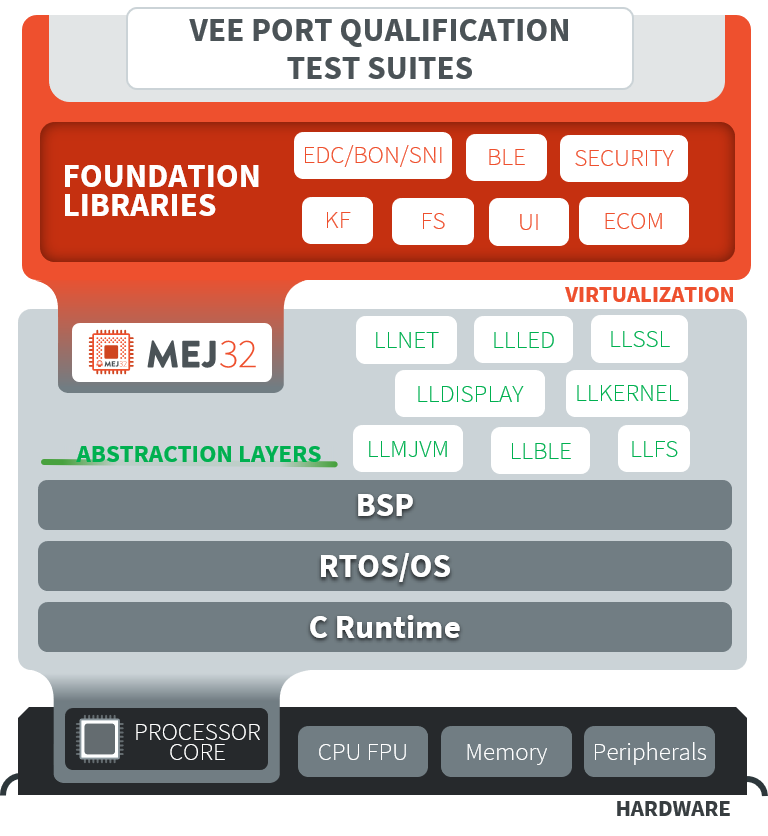
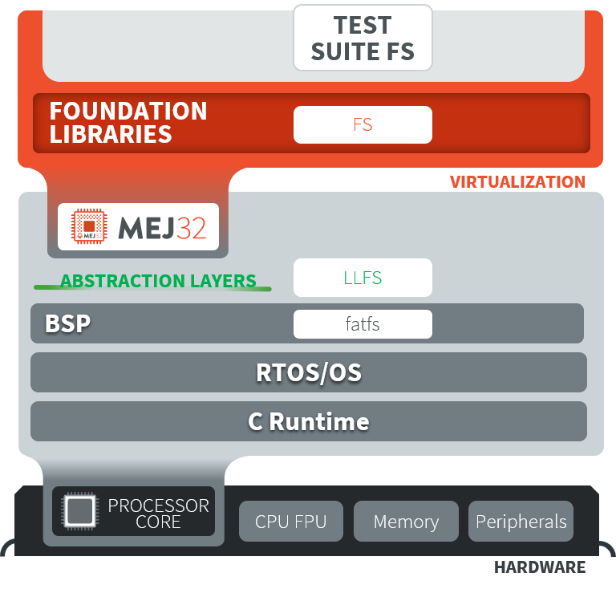
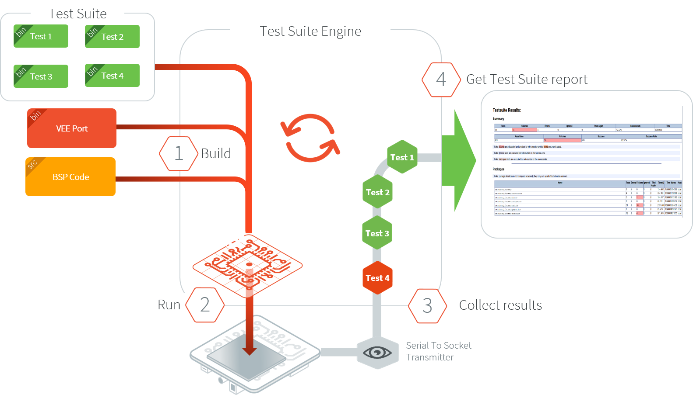

.. _veeport_qualification:

======================
VEE Port Qualification
======================

Introduction
============

A VEE Port integrates one or more Foundation Libraries with their
respective Abstraction Layers.

VEE Port Qualification is the process of validating the conformance of the Abstraction
Layer that implements the :ref:`Low Level APIs <low_level_api>` of a Foundation Library.

   VEE Port Qualification Overwiew

For each Low Level API, an Abstraction Layer implementation is
required.  The validation of the Abstraction Layer implementation is
performed by running tests at two-levels:

- In C, by calling Low Level APIs (usually manually).
- In Java, by calling Foundation Library APIs (usually automatically using :ref:`vee_port_testsuite`).

The following figure depicts an example for the FS Pack:

   VEE Port Qualification Example for FS Pack

MicroEJ provides a set of tools and pre-defined projects aimed at
simplifying the steps for validating VEE Ports in the form of the
`VEE Port Qualification Tools (PQT)
<https://github.com/MicroEJ/VEEPortQualificationTools>`__.

.. _pqt_overview:

VEE Port Qualification Tools Overview
=====================================

The VEE Port Qualification Tools provide the following components:

- Platform Configuration Additions (PCA):

  - Used to:

    - Manage Architecture, Packs dependencies and the VEE Port
      build with the MicroEJ Module Manager.
    - Configure the BSP connection to call the build and run scripts.

  - Added when creating a VEE Port (see :ref:`new_platform_creation`
    or check the tutorial :ref:`tutorial_create_firmware_from_scratch`).

- Build and Run Scripts examples:

  - Used to generate and deploy an Executable on a device by
    invoking a third-party toolchain for the BSP.
  - Added when integrating the BSP to the VEE Port (see
    :ref:`bsp_connection_build_script` and
    :ref:`bsp_connection_run_script` or check the tutorial :ref:`tutorial_create_platform_build_and_run_scripts`).

- C and Java Test Suites:

  - Used to validate the Low Level APIs implementations.
  - Validated during the BSP development and whenever an Abstraction
    Layer implementation is added or changed (see
    :ref:`vee_port_testsuite` or check the tutorial
    :ref:`tutorial_run_test_suite_on_device`).

Please refer to the `VEE Port Qualification Tools README
<https://github.com/MicroEJ/VEEPortQualificationTools>`__ for more
details and the location of the components.

.. _vee_port_testsuite:

VEE Port Test Suite
===================

The purpose of a VEE Port Test Suite is to validate the
Abstraction Layer that implements the :ref:`Low Level APIs
<low_level_api>` of a Foundation Libraries by automatically running
Java tests on the device.

The :ref:`testsuite_engine` is used for building,
running a Test Suite, and providing a report.

A Test Suite contains one or more tests. For each test, the Test Suite Engine will:

1. Build an Executable for the test.

2. Run the Executable onto the device.

3. Retrieve the execution traces.

4. Analyze the traces to determine whether the test has ``PASSED`` or ``FAILED``.

5. Append the result to the Test Report.

6. Repeat until all tests of the Test Suite have been executed.

   VEE Port Test Suite on Device Overview

.. _create_junit_vee_port_testsuite:

Create a VEE Port Test Suite
============================

A VEE Port Test Suite is composed of two projects:

- the Test Suite module: the project that contains test cases. Test cases are written in :ref:`Junit <application_testsuite>`.
  When this project is built, it produces a versionned library. See :ref:`test_suite_versioning` for available Test Suite modules for the most common Packs provided by MicroEJ Corp.
- the Test Suite runner: the project that contains the configuration for its execution on a VEE Port. 
  When this project is built, it runs the Test Suite on a Device and generates the Test Suite report.

.. note:: 
  
   Creating a VEE Port Test Suite requires SDK ``5.6.0`` or higher.

Create the Test Suite Module
----------------------------

The Test Suite module implements the tests of the module to be tested.

Create the Test Suite Skeleton
~~~~~~~~~~~~~~~~~~~~~~~~~~~~~~

A new Test Suite module can be created using the ``microej-javaimpl`` Skeleton (see :ref:`module_natures.foundation_lib_impl`).

To create the Test Suite module, click on: :guilabel:`File` > :guilabel:`New` > :guilabel:`Project...` then select :guilabel:`MicroEJ` > :guilabel:`Module Project`

Fill up the following fields of the form:

- Project name (e.g: ``myFoundationLib-testsuite``)
- Organization (e.g: ``com.mycompany``)
- Module (e.g: ``myFoundationLib-testsuite``)
- Revision (version of your Test Suite module)
- Select the Skeleton: ``microej-javaimpl``

Then, create two test source folders, right-click on your project and click on: :guilabel:`New` > :guilabel:`Source Folder`.

Fill up the ``Folder name`` field of the form with: ``src/test/java`` and for the second folder: ``src/test/resources`` 

You should get a Foundation Library Test Suite project that looks like:

   .. figure:: images/foundation-library-testsuite-skeleton.png
      :alt: Foundation Library Test Suite Project Skeleton
      :align: center

      Foundation Library Test Suite Project Skeleton
      
Your skeleton project is created and ready to be setup.

Configure the Test Suite Module Project
~~~~~~~~~~~~~~~~~~~~~~~~~~~~~~~~~~~~~~~

Open the ``module.ivy`` file and follow steps below:

- Edit the module ``ivy-module > info > ea:build`` node to update ``rip.printableName``:
  
  .. code-block:: XML
  
		<ea:build organisation="com.is2t.easyant.buildtypes" module="build-microej-javaimpl" microej.lib.name="myFoundationLib-testsuite-1.0" rip.printableName="myFoundationLib Test Suite Impl" revision="5.2.+">
  
- Add the following properties in the ``ivy-module > info`` node:
  
  .. code-block:: XML

		<ea:property name="skip.test" value="set"/>
		<ea:property name="target.main.classes" value="${basedir}/target~/test/classes"/>
		<ea:property name="addon-processor.src.test.java.path.ref.name" value="src.java.path"/>
  
- Update the JUnit dependency to: 

  .. code-block:: XML

		<dependency org="ej.library.test" name="junit" rev="1.7.1" conf="default;test->*"/>

- Add a ``module.ant`` file at the root of the Test Suite project with the following content:

  .. code-block:: XML

		<project>
			<target name="BuildTestTarget" extensionOf="abstract-compile:compile-ready" depends="resources-std:copy-test-resources">
				<augment id="src.java.path">
					<path location="${basedir}/src/test/java" />
					<path location="${target}/adpgenerated/src-adpgenerated/junit/java"/>
				</augment>
			</target>
		</project>

.. note:: An error on ``module.ant`` file can occurred with message ``Target resources-std:copy-test-resources does not exist in this project``. Please ignore it. 

Create a New Test Case
~~~~~~~~~~~~~~~~~~~~~~

Right click on ``src/test/java``, then click on :guilabel:`New` > :guilabel:`Class`. Fill ``Name:`` with the ``MyTest`` 
and then click on ``Finish``. Copy/paste the following example in ``MyTest.java`` file:

.. code-block:: java

        import org.junit.Assert;
        import org.junit.Test;

        public class MyTest {

        	@Test
                public static void Test() {
        		Assert.assertTrue(true);
                }
        }

The console output on VEE Port simulator for this test should be:

:: 

        =============== [ Initialization Stage ] ===============
        =============== [ Launching on Simulator ] ===============
        OK: Test
        PASSED: 1
        =============== [ Completed Successfully ] ===============

        SUCCESS

.. note:: See next sections to get more details on how to package and launch the Test Suite on a VEE Port.

Generate Test Suite Module
~~~~~~~~~~~~~~~~~~~~~~~~~~

- Right-click on the project and select ``Build module``
- Check the content of the generated archive ``target~\test-rips\javaLibs\myFoundationLib-testsuite-X.X.jar``
- If it worked, you can see ``.class`` files inside the archive

Create the Test Suite Runner
----------------------------

The Test Suite runner project is responsible for running tests of a Test Suite module.

Create the Test Suite Runner Project
~~~~~~~~~~~~~~~~~~~~~~~~~~~~~~~~~~~~

- To create the Test Suite runner project, click on: :guilabel:`File` > :guilabel:`New` > :guilabel:`Other...` > :guilabel:`MicroEJ` > :guilabel:`Module Project`.

- Fill up the following fields of the form:

  - Project name
  - Organization
  - Module
  - Revision (version of your Test Suite Module)
  - Select the Skeleton: ``microej-testsuite``

- Inside ``module.ivy`` file, add the Test Suite dependency to the Test Suite runner project:
  
  .. code-block:: XML
        
        <dependency org="com.mycompany" name="myFoundationLib-testsuite" rev="0.1.0" conf="test->default;provided->provided"/>

- Add the following target to the ``module.ant`` at the root of the Test Suite project with the following content:
  
  .. code-block:: XML

        <target name="tracefile:init" extensionOf="abstract-test:test-ready">
        	<!-- Set the launch.test.trace.file when the testsuite.trace.ip properties is not set -->
        	<condition property="microej.testsuite.properties.launch.test.trace.file">
        		<not>
        			<isset property="microej.testsuite.properties.testsuite.trace.ip" />
        		</not>
        	</condition>
        </target>

- Create the file ``override.module.ant`` at the root of the project. Add the following content:
  
  .. code-block:: XML
  
        <project name="myFoundationlib.testsuite.override" xmlns:ac="antlib:net.sf.antcontrib">
                <!-- Load options from 'local.properties' beside this file -->
                <ac:if>
                        <available file="local.properties" type="file"/>
                        <ac:then>
                                <property file="local.properties"/>
                        </ac:then>
                </ac:if>
                <!-- Load options from 'config.properties' beside this file -->
                <property file="config.properties"/>
        </project>

- Create the following ``.properties`` files:

  - ``{PROJECT_LOC}/validation/microej-testsuite-common.properties``: see `microej-testsuite-common.properties template <https://github.com/MicroEJ/VEEPortQualificationTools/blob/2.9.0/tests/core/java-testsuite-runner-core/validation/microej-testsuite-common.properties>`_.
  - ``{PROJECT_LOC}/config.properties``: see `config.properties template <https://github.com/MicroEJ/VEEPortQualificationTools/blob/2.9.0/tests/core/java-testsuite-runner-core/config.properties.tpl>`_.

.. note:: ``{PROJECT_LOC}`` refers here to the location of your Test Suite runner project.

Configure and Run the Test Suite
~~~~~~~~~~~~~~~~~~~~~~~~~~~~~~~~

- Follow these steps to configure the property files and run the Test Suite using the Test Suite runner project:
  https://docs.microej.com/en/latest/Tutorials/tutorialRunATestSuiteOnDevice.html

.. _test_suite_versioning:

Test Suite Versioning
=====================

Foundation Libraries are integrated in a VEE Port using Packs (see :ref:`pack_import`).
Use the Test Suite version compliant with the API version provided by the Foundation Library to validate the Abstraction Layer implementation.
For example, the `Test Suite FS module 3.0.3`_ should be used to validate the Abstraction Layer implementation of the :ref:`Low Level API FS <LLFS-API-SECTION>` provided by the `FS Pack 5.1.2`_.

.. note:: A Pack can provide several Foundation Libraries.

.. _test_suite_versioning_core:

Core Engine
-----------

.. list-table:: Core Engine Validation
   :widths: 20 20

   * - Architecture
     - Test Suite
   * - 7.0.0 or higher
     - `Core Engine Test Suite <https://github.com/MicroEJ/VEEPortQualificationTools/tree/master/tests/core>`__

.. _Test Suite FS module 3.0.3: https://repository.microej.com/modules/com/microej/pack/fs/fs-testsuite/3.0.3/
.. _FS Pack 5.1.2: https://repository.microej.com/modules/com/microej/pack/fs/5.1.2/

.. _test_suite_versioning_ui:

UI Pack
-------

.. list-table:: UI Validation
   :widths: 20 20

   * - UI Pack
     - C Test Suite
   * - 13.0.0 or higher (UI3)
     - `Graphical User Interface Test Suite <https://github.com/MicroEJ/VEEPortQualificationTools/blob/master/tests/ui/ui3>`__
   * - [6.0.0-12.1.5] (UI2)
     - `Graphical User Interface Test Suite <https://github.com/MicroEJ/VEEPortQualificationTools/blob/master/tests/ui/ui2>`__

.. _test_suite_versioning_fs:

FS Pack
-------

.. list-table:: FS API Implementation and Validation
   :widths: 20 10 10

   * - FS Pack
     - FS API
     - Java Test Suite
   * - [5.1.2-5.2.0[
     - `2.0.6 <https://repository.microej.com/modules/ej/api/fs/2.0.6/>`__
     - `3.0.3 <https://repository.microej.com/modules/com/microej/pack/fs/fs-testsuite/3.0.3/>`__
   * - [4.0.0-4.1.0[
     - `2.0.6 <https://repository.microej.com/modules/ej/api/fs/2.0.6/>`__
     - On demand [1]_

.. _test_suite_versioning_bluetooth:

BLUETOOTH Pack
--------------

.. list-table:: BLUETOOTH API Implementation and Validation
   :widths: 20 10 10

   * - BLUETOOTH Pack
     - BLUETOOTH API
     - Java Test Suite
   * - 2.1.0
     - `2.1.0 <https://repository.microej.com/modules/ej/api/bluetooth/2.1.0/>`__
     - `2.0.0 <https://repository.microej.com/modules/com/microej/pack/bluetooth/bluetooth-testsuite/2.0.0/>`__
   * - 2.0.1
     - `2.0.0 <https://repository.microej.com/modules/ej/api/bluetooth/2.0.0/>`__
     - `2.0.0 <https://repository.microej.com/modules/com/microej/pack/bluetooth/bluetooth-testsuite/2.0.0/>`__

NET Pack
--------

On demand [1]_.

.. list-table:: NET, SSL and SECURITY APIs Implementations and Validations
   :widths: 15 10 10 10 15 15 15

   * - NET Pack
     - NET API
     - SSL API
     - SECURITY API
     - NET Java Test Suite
     - SSL Java Test Suite
     - SECURITY Java Test Suite
   * - [8.1.2-8.2.0]
     - `1.1.0 <https://repository.microej.com/modules/ej/api/net/1.1.0/>`__
     - `2.1.0 <https://repository.microej.com/modules/ej/api/ssl/2.1.0/>`__
     - N/A
     - 3.4.0 (On demand [1]_)
     - 3.0.1 (On demand [1]_)
     - N/A
   * - 9.0.0
     - `1.1.0 <https://repository.microej.com/modules/ej/api/net/1.1.0/>`__
     - `2.2.0 <https://repository.microej.com/modules/ej/api/ssl/2.2.0/>`__
     - `1.3.1 <https://repository.microej.com/modules/ej/api/security/1.3.1/>`__
     - 3.4.0 (On demand [1]_)
     - 3.1.4 (On demand [1]_)
     - 1.1.0 (On demand [1]_)
   * - [9.0.1-9.4.1]
     - `1.1.1 <https://repository.microej.com/modules/ej/api/net/1.1.1/>`__
     - `2.2.0 <https://repository.microej.com/modules/ej/api/ssl/2.2.0/>`__
     - `1.3.1 <https://repository.microej.com/modules/ej/api/security/1.3.1/>`__
     - 3.5.2 (On demand [1]_)
     - 3.1.4 (On demand [1]_)
     - 1.1.0 (On demand [1]_)
   * - 10.0.0
     - `1.1.2 <https://repository.microej.com/modules/ej/api/net/1.1.2/>`__
     - `2.2.1 <https://repository.microej.com/modules/ej/api/ssl/2.2.1/>`__
     - 1.4.0 (On demand [1]_)
     - 3.5.2 (On demand [1]_)
     - 3.1.4 (On demand [1]_)
     - 1.2.0 (On demand [1]_)

.. [1] Test Suite available on demand, please contact :ref:`MicroEJ Support<get_support>`.

..
   | Copyright 2008-2023, MicroEJ Corp. Content in this space is free
   for read and redistribute. Except if otherwise stated, modification
   is subject to MicroEJ Corp prior approval.
   | MicroEJ is a trademark of MicroEJ Corp. All other trademarks and
   copyrights are the property of their respective owners.
