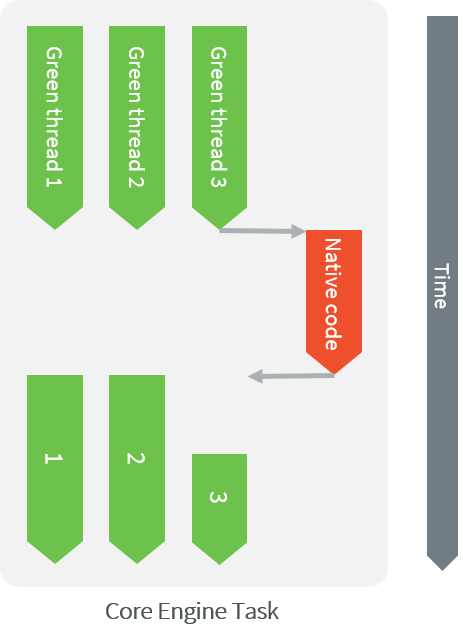

.. _sni_specification:

===========================================
Simple Native Interface Specification (SNI)
===========================================

Introduction
============

The Simple Native Interface specification (SNI) defines how to cross the barrier between the Managed world and the
native world:

-  Call a C function from Java code.

-  Pass parameters to the C function.

-  Return a value from the C world to the Managed world.

-  Manipulate (read & write) shared memory both in Java and C code: the
   immortal space.

.. note::

   In the following explanations, the term `task` refers to native tasks scheduled by the underlying OS or RTOS,
   while `thread` refers to MicroEJ threads scheduled by the Core Engine.

The sections below also mention some functions from the SNI native API.
See here for the complete SNI Native API reference: :ref:`section.reference.api.sni.native`.

Specification Summary
---------------------

.. include:: ../ApplicationDeveloperGuide/sni_spec_summary.rst

Comments
--------

Your comments about this specification are welcome. Please contact :ref:`our support team <get_support>` with "SNI" as subject.

First Example
=============

This first example shows how to declare and implement a Java native
method using SNI. First the method has to be declared ``native`` in Java code:
this states that the method is written in another language.

.. code-block:: java
   :emphasize-lines: 24

   package example;

   import java.io.IOException;

   /**
    * Abstract class providing a native method to access sensor value.
    * This method will be executed out of the Core Engine.
    */
   public abstract class Sensor {

       public static final int ERROR = -1;

       public int getValue() throws IOException {
           int sensorID = getSensorID();
           int value = getSensorValue(sensorID);
           if (value == ERROR) {
               throw new IOException("Unsupported sensor");
           }
           return value;
       }

       protected abstract int getSensorID();

       public static native int getSensorValue(int sensorID);
   }

   class Potentiometer extends Sensor {

       protected int getSensorID() {
           return Constants.POTENTIOMETER_ID; // POTENTIOMETER_ID is a static final
       }
   }

Then, the implementation of the method is written in C language.

.. code-block:: c
   :emphasize-lines: 8

      // File providing an implementation of native method using a C function
      #include <sni.h>
      #include <potentiometer.h>

      #define SENSOR_ERROR (-1)
      #define POTENTIOMETER_ID (3)

      jint Java_example_Sensor_getSensorValue(jint sensor_id){

          if (sensor_id == POTENTIOMETER_ID)
          {
              return get_potentiometer_value();
          }
          return SENSOR_ERROR;
      }

Java code and C Execution Sequence
==================================

Calling C from Java
-------------------

When a Java native method executes, it executes its C counterpart
function. This is done using the CPU budget of the task that has
started the Core Engine. While the C function executes, no other Java methods executes
and the Core Engine cannot schedule other threads.
The Managed world “waits” for the C function to finish.

The following illustration shows the execution a the Core Engine task.
``Green thread 3`` has called a native method that executes in C.
All Java activities is suspended until the C execution has finished.

   Execution of Threads by the Core Engine Task

Synchronization
---------------

SNI defines C functions that provide controls for the threads activities:

-  ``int32_t SNI_suspendCurrentJavaThread(int64_t timeout)``: Suspends the
   execution of the thread that initiated the current C call. This
   function does not block the C execution. The suspension is effective
   only at the end of the native method call (when the C call returns).
   The thread is suspended until either an task calls
   ``SNI_resumeJavaThread``, or the specified number of milliseconds has
   elapsed.

-  ``int32_t SNI_getCurrentJavaThreadID(void)``: Permits retrieval of the ID
   of the current thread within the C function (assuming it is a
   "native Java to C call"). This ID must be given to the
   ``SNI_resumeJavaThread`` function in order to resume execution of the
   thread.

-  ``int32_t SNI_resumeJavaThread(int32_t id)``: Resumes the thread
   with the given ID. If the thread is not suspended, the resume stays
   pending.

The following illustration shows ``Green thread 3`` which has called
a native method that executes in C. The C code suspends the thread after
having provisioned its ID (e.g. 3). Another task may later resume the thread.

.. figure:: images/sni_sync.*
   :alt: Green Threads and Task Synchronization
   :scale: 70%
   :align: center

   Green Threads and Task Synchronization

Java And Native Separation
--------------------------

The following illustration shows both Java code and C code
accesses to shared objects in the immortal space, while also accessing
their respective memory.
In C code, non-immortal arrays can only be accessed within the local scope of a
native function.

.. _fig_sni-flow:
.. figure:: images/sni_flow.*
   :alt: SNI Processing
   :scale: 75%
   :align: center

   Java code and C shared objects

Managed World to C World
========================

C Function Call From Managed World
----------------------------------

The SNI specification allows the invocation of methods from Java to C: these
methods must be declared ``static`` ``native`` methods, and the parameters must be
base types or array of base types.
These native methods are used in Java code as standard Java methods.

Example:

.. code-block:: java

   package example;
   public class Foo{

      public void bar(){
         int times = 3;
         print(times);
      }

      public static native void print(int times);
   }

.. code-block:: c

   #include <sni.h>
   #include <stdio.h>

   void Java_example_Foo_print(jint times){
      while (--times >= 0){
         printf("Hello world!\n");
      }
   }

Java Types And C Types
----------------------

Base Types
^^^^^^^^^^

Types may have different representations depending on the language. The
file ``sni.h`` defines the C types that represent exactly the Java types.

.. list-table:: Java types to C types
   :header-rows: 1
   :widths: 4 6 5
   :align: center

   -
      - Java Type
      - Specification
      - C type
   -
      - void
      - No returned type
      - ``void``
   -
      - boolean
      - unsigned 8 bits
      - ``jboolean``
   -
      - byte
      - signed 8 bits
      - ``jbyte``
   -
      - char
      - unsigned 16 bits
      - ``jchar``
   -
      - short
      - signed 16 bits
      - ``jshort``
   -
      - int
      - signed 32 bits
      - ``jint``
   -
      - long
      - signed 64 bits
      - ``jlong``
   -
      - float
      - IEEE 754 single precision 32 bits
      - ``jfloat``
   -
      - double
      - IEEE 754 double precision 64 bits
      - ``jdouble``

Java Array
^^^^^^^^^^

The Java arrays (of base types) are represented in C functions as C
arrays: the array is a pointer on the first element of the array, all
the elements in line within the memory.

SNI allows to get a Java array length in a C function.

.. code-block:: c

   int32_t SNI_getArrayLength(void* array);

Strings
^^^^^^^

Strings are typically represented quite differently between C & Java code.
In C, strings are represented with C ``char`` (8-bit) array with a
``'\0'`` as last character. In Java code, strings are ``jchar`` (16-bit) array, not
terminated by ``'\0'``.

To help with the conversion, the `SNI Java API <https://repository.microej.com/javadoc/microej_5.x/apis/ej/sni/SNI.html>`_
provides utility methods to convert between the two representations.

Example:

.. code-block:: java

   package example;
   public class Foo {

       private static final int MAX_STRING_SIZE = 42; // including the '\0' character

       public void pushString(String str) {
           pushString(SNI.toCString(str));
       }

       public String pullString() {
           byte[] buffer = new byte[MAX_STRING_SIZE];
           pullString(buffer);
           return SNI.toJavaString(buffer);
       }

       private static native void pushString(byte[] str);
       private static native void pullString(byte[] buffer);

   }

.. code-block:: c

   #include <sni.h>
   #include <string.h>

   #define MAX_STRING_SIZE 42

   static char gStr[MAX_STRING_SIZE];

   void Java_example_Foo_pushString(jbyte *str) {
       strncpy(gStr, (char*) str, MAX_STRING_SIZE);
   }

   void Java_example_Foo_pullString(jbyte *buffer) {
       strncpy((char*) buffer, gStr, MAX_STRING_SIZE);
   }

.. note::

   The string conversions use the :ref:`default platform encoding <section.encoding>`.
   To use a different encoding, refer to the `String API <https://repository.microej.com/javadoc/microej_5.x/apis/java/lang/String.html>`__.

Naming Convention
-----------------

SNI uses a naming convention to name-match the Java native method with its C
counterpart function.

The C function name is the concatenation of the following components:

-  the prefix “ ``Java_`` ”.
-  the package name of the class, each sub packages is separated with “\ ``_``\ ”.
-  the separator “\ ``_``\ ”.
-  the class name.
-  the separator “\ ``_``\ ”.
-  the method name.

If the method is overloaded by another method, native or not (the two
methods have the same name with different arguments), the function name
must be followed by the arguments descriptor, obtained with the
following components (except if the method has no arguments):

-  the separator “\ ``__``\ ” (two underscores)
-  the name of each argument type, without separator, preceded by
   “\ ``_3``\ “ if it is an array.

The following table gives the descriptors of the Java types for arguments.

.. list-table:: SNI Java types descriptors in arguments
   :header-rows: 1
   :widths: 1 1
   :align: center

   -
      - Java type
      - SNI name
   -
      - boolean
      - Z
   -
      - byte
      - B
   -
      - char
      - C
   -
      - short
      - S
   -
      - int
      - I
   -
      - long
      - J
   -
      - float
      - F
   -
      - double
      - D

The character underscore (“\ ``_``\ ”) is used as a separator in the
name. If this character is used within the Java name (either in package,
class name or method name), it is replaced with “\ ``_1``\ ”. Because the
Java names cannot start with a number, the characters “\ ``_1``\ ” cannot
be confused with separator character.

Examples of Java native methods and their counterpart C functions:

.. code-block:: java

   package example.sni.impl;

   class Hello {

       public static native void nativ01(int i);
       public static native void nativ02(boolean b, int[] i);
       public static native void nativ_03();
       public static native void nativ04();
       public static native void nativ04(long l, double d);
       public static native void nativ04(int[] ia, int ib, char[] ca);

   }

.. code-block:: c

   void Java_example_sni_impl_Hello_nativ01(jint i);
   void Java_example_sni_impl_Hello_nativ02(jboolean b, jint* i);
   void Java_example_sni_impl_Hello_nativ_103();
   void Java_example_sni_impl_Hello_nativ04();
   void Java_example_sni_impl_Hello_nativ04__JD(jlong l, jdouble d);
   void Java_example_sni_impl_Hello_nativ04___3II_3C(jint* ia, jint ib, jchar* ca);

Parameters Constraints
----------------------

There are strong constraints on arguments given by Java methods to
native functions:

-  Only base types and array of base types are allowed in the parameters.
   No other objects can be passed: the native functions cannot access
   Java objects field nor methods.
-  When base type arrays are passed in parameters, they must have only one dimension.
   No multi dimension array are allowed (``int[][]`` is forbidden for example).
-  Only base types are allowed as return type.

This constraints are checked at link-time to ensure that they are respected.

.. _section.sni.lifecycle:

Startup
=======

The Core Engine needs first to be initialized, and
then started. It is the programmer responsibility to create a task
and to start the Core Engine within this task.

SNI defines C functions to create a Managed world, to start it and to free it:

-  ``void SNI_createVM(void)``: creates and initializes the Core Engine context.
-  ``int32_t SNI_startVM(void,int32_t,char)``: starts the Core Engine.
   This function returns when the Java application ends.
-  ``int32_t SNI_getExitCode(void vm)``: gets the Java application
   exit code, after ``SNI_startVM`` has successfully returned. This is
   the value passed by the application to `System.exit()`_ method.
-  ``void SNI_destroyVM(void vm)``: does nothing if the Core Engine is still running.
   This function must be called in the task that created the Core Engine.

The following illustration shows a typical example of Core Engine startup code.

.. code-block:: c
   :caption: Example of Core Engine startup code in C

   void microej_main(int argc, char **argv) {
      void* vm;
      int core_engine_error_code = -1;
      int32_t app_exit_code = 0;

      vm = SNI_createVM();
      if (vm == NULL) {
         printf("MicroEJ initialization error.\n");
      } else {
         core_engine_error_code = (int)SNI_startVM(vm, argc, argv);
         if (core_engine_error_code < 0) {
            printf("MicroEJ execution error (err = %d).\n", (int) core_engine_error_code);
         } else {
            app_exit_code = SNI_getExitCode(vm);
            printf("MicroEJ END (exit code = %d)\n", (int) app_exit_code);
         }
         SNI_destroyVM(vm);
      }
   }

Resources
=========

SNI also provides a mechanism to register native resources.

This binds the native resource to the calling application so that the native resource is closed if the application is terminated.
In the case of a Standalone Application (or if calling from the Kernel context in a Multi-Sandbox setup), this is when the Application (or Kernel) exits,
before the Core Engine returns from ``SNI_startVM()`` (see :ref:`section.sni.lifecycle`).
In the case of a Sandboxed Application, this is when the Application is being stopped (or when the Kernel exits).

.. note::

   The :ref:`Core Engine state dump <vm_dump>` lists the registered native resources.

There is nothing to do on the native method declaration side (Managed Code) and this can therefore depend of a specific Abstraction Layer Implementation.
In most cases, the library will also provide a "close" API (implemented with a "close" native method) so that the Application can explicitly close the native resource.
Typically, the API will provide a class reifying this native resource which would implement ``AutoCloseable``.

It is also possible to bind a native resource to a Managed object (typically a Java object) using `NativeResource.closeOnGC()`_. In this case,
the native resource will also be closed when the bound object is Garbage-Collected (useful when the API does not expose any close function).

See the API reference for :c:func:`SNI_registerResource()` and :c:func:`SNI_unregisterResource()`.

Scoped Resources
----------------

SNI also provides scoped resources. In this case, the scope of the resource is the native call.
It can be used to share a resource between a native function implementation and a callback (see :c:func:`SNI_suspendCurrentJavaThreadWithCallback()`).
The resource will be closed when the native call returns (after the native function and the potential successive suspend/resume callbacks returns), or after
the calling Application is terminated (before the suspended native call is completed).

See the API reference for :c:func:`SNI_registerScopedResource()` and :c:func:`SNI_unregisterScopedResource()`.

.. note::

   Only 1 scoped resource registered at a time is supported per native call.

Typical use cases
=================

A typical SNI use case is for the Managed Code to maintain a reference to a C object (typically a pointer to a struct).

For example, here is a struct:

.. code-block:: c

   typedef struct point {
       int id;
       char[MAX_NAME_LENGTH] name;
       int[2] coordinates;
   } point_t;

To keep a reference to an instance of the struct, we typically use a handle: a 32-bit pointer stored as a ``jint``.
Then, the handle is passed as an argument to the different native methods that will use the object, either to manipulate directly the struct,
or pass it as an argument to another C (library) function.

.. code-block:: java

   package example.sni;

   import ej.bon.Constants;
   import ej.sni.SNI;

   class Point implements AutoCloseable {

       private final int handle;

       Point() {
           this.handle = PointNatives.createPoint();
       }

       int getId() {
           return PointNatives.getPointId(this.handle);
       }

       void setId(int id) {
           PointNatives.setPointId(this.handle, id);
       }

       String getName() {
           byte[] buffer = new byte[PointNatives.MAX_NAME_LENGTH];
           PointNatives.getPointName(this.handle, buffer);
           return SNI.toJavaString(buffer);
       }

       void setName(String name) {
           if (name.length() > PointNatives.MAX_NAME_LENGTH) {
               throw new IllegalArgumentException();
           }
           PointNatives.setPointName(this.handle, SNI.toCString(name));
       }

       int[] getCoordinates() {
           int[] coordinates = new int[2];
           coordinates[0] = PointNatives.getCoordinate(this.handle, 0);
           coordinates[1] = PointNatives.getCoordinate(this.handle, 1);
           return coordinates;
       }

       void setCoordinates(int[] coordinates) {
           PointNatives.setCoordinate(this.handle, 0, coordinates[0]);
           PointNatives.setCoordinate(this.handle, 1, coordinates[1]);
       }

       @Override
       public void close() {
           PointNatives.deletePoint(this.handle);
       }

   }

   class PointNatives {

       static final int MAX_NAME_LENGTH = Constants.getInt("example.sni.point.name.max.length");

       static native int createPoint();

       static native void deletePoint(int handle);

       // point->id

       static native int getPointId(int handle);

       static native void setPointId(int handle, int id);

       // point->name

       static native void getPointName(int handle, byte[] buffer); // buffer size: maximum name length, implementation must
                                                                   // fill buffer with a null-terminated string (or full
                                                                   // buffer)

       static native void setPointName(int handle, byte[] name);

       // point->coordinates

       static native int getCoordinate(int handle, int index);

       static native void setCoordinate(int handle, int index, int value);

   }

.. code-block:: c

       #define point_create            Java_example_sni_PointNatives_createPoint
       #define point_delete            Java_example_sni_PointNatives_deletePoint
       #define point_get_id            Java_example_sni_PointNatives_getPointId
       #define point_set_id            Java_example_sni_PointNatives_setPointId
       #define point_get_name          Java_example_sni_PointNatives_getPointName
       #define point_set_name          Java_example_sni_PointNatives_setPointName
       #define point_get_coordinate    Java_example_sni_PointNatives_getCoordinate
       #define point_set_coordinate    Java_example_sni_PointNatives_setCoordinate

       static void point_close(void* point) {
           free(point);
       }

       jint point_create() {
           point_t* point = malloc(sizeof(point_t));
           SNI_registerResource((void*) point, (SNI_closeFunction) point_close, NULL);
           return (jint) point;
       }
       void point_delete(jint handle) {
           void* point = (void*) handle;
           SNI_unregisterResource(point, (SNI_closeFunction) point_close);
           point_close(point);
       }
       jint point_get_id(jint handle) {
           point_t *point = (point_t*) handle;
           return (jint) point->id;
       }
       void point_set_id(jint handle, jint id) {
           point_t *point = (point_t*) handle;
           point->id = (int) id;
       }
       void point_get_name(jint handle, jbyte* buffer) {
           point_t *point = (point_t*) handle;
           strncpy((char*) buffer, point->name, SNI_getArrayLength(buffer));
       }
       void point_set_name(jint handle, jbyte* name) {
           point_t *point = (point_t*) handle;
           if (SNI_getArrayLength(name) > MAX_NAME_LENGTH) {
               SNI_throwNativeException(-1, "given name exceeds maximum length");
           }
           strncpy(point->name, (char*) name, MAX_NAME_LENGTH);
       }
       jint point_get_coordinate(jint handle, jint index){
           point_t *point = (point_t*) handle;
           return (jint) point->coordinates[(size_t)index];
       }
       void point_set_coordinate(jint handle, jint index, jint value) {
           point_t *point = (point_t*) handle;
           point->coordinates[(size_t)index] = (int) value;
       }

.. note::

   For simplicity, this example does not include the usual error handling that real use cases will require.

.. _IllegalArgumentException: https://repository.microej.com/javadoc/microej_5.x/apis/java/lang/IllegalArgumentException.html
.. _Immortals.setImmortal(): https://repository.microej.com/javadoc/microej_5.x/apis/ej/bon/Immortals.html#setImmortal-T-
.. _System.exit(): https://repository.microej.com/javadoc/microej_5.x/apis/java/lang/System.html#exit-int-
.. _NativeResource.closeOnGC(): https://repository.microej.com/javadoc/microej_5.x/apis/ej/sni/NativeResource.html#closeOnGC-long-long-java.lang.Object-

..
   | Copyright 2008-2025, MicroEJ Corp. Content in this space is free 
   for read and redistribute. Except if otherwise stated, modification 
   is subject to MicroEJ Corp prior approval.
   | MicroEJ is a trademark of MicroEJ Corp. All other trademarks and 
   copyrights are the property of their respective owners.
