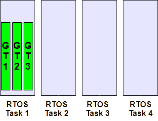
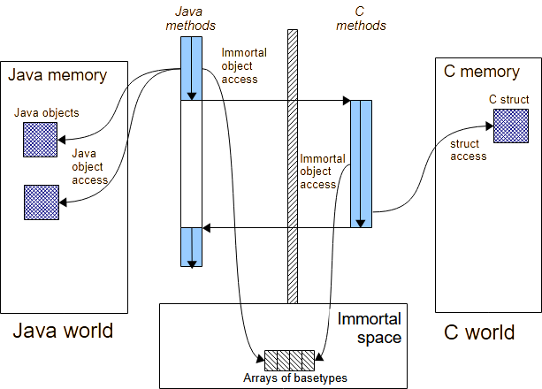
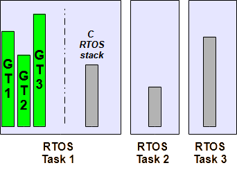
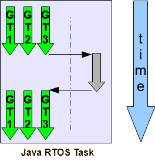
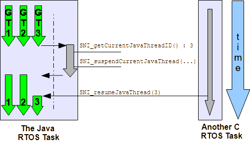

Preface to Profile SNI-GT 1.2, ESR 
==================================

This document defines the *SNI-GT 1.2* profile, targeting Java 2 Platforms that are
“green threads” based platforms.

Who Should Use this Specification
---------------------------------

This specification targets the following audiences:

-  Individuals who want to build an implementation that complies to the
   SNI-GT profile specification;
-  Application developers who want to design a software application
   using SNI-GT in the context of a “green threads” Java virtual machine.

How This Specification is Organized
-----------------------------------

This specification is organized as follow:

-  **Introduction** is a short chapter explaining what SNI-GT is, why it has
   been designed, and its main assets.
-  **Specification** describes the concepts required to understand how
   to write an application using SNI-GT.
-  **SNI-GT API Documentation** lists the APIs as javadoc.

Comments
--------

Your comments about SNI-GT are welcome. Please send them by electronic mail to
the following address: ``contact@microej.com``, with SNI-GT in your subject line.

Related literature
------------------

[B-ON] Beyond: ESR001, ``http://www.microej.com``

Document Conventions
--------------------

In this document, references to methods of a Java class are written as
``ClassName.methodName(args)``. This applies to both static and instance
methods. Where the method is static this will be made clear in the
accompanying text.

Definition
----------

native
~~~~~~

Java allows to write parts of the application in languages other than in
the Java syntax. Such parts are said to be “native” parts. Therefore the
Java programmer uses the keyword **native** to refer to such non-Java
implementations.

static 
~~~~~~

Java is an Object Oriented language. An application is made of objects
that communicate using message sends: an S object sends a message to an
R object called the receiver. The message is implemented either in Java
by a Java method [1]_, or in another language if the code is implemented
using a Java native method.

Some methods are global to the application and do not refer to a
specific object. They are said to be static: they do not rely on a
receiver. Therefore the Java programmer uses the keyword **static** to
refer to such global methods.

Implementation Notes
--------------------

The SNI-GT specification does not include any implementation details.
SNI-GT implementors are free to use whatever techniques they deem appropriate
to implement the specification, with (or without) collaboration of any
Java virtual machine provider. SNI-GT experts have taken great care not to
mention any special Java virtual machines, nor any of their special
features, in order to encourage fair competing implementations.

Introduction
============

Architecture
------------

Purpose
~~~~~~~

The *Simple Native Interface Specification*, named SNI-GT, is intended for implementing native Java methods in C
language.

SNI-GT allows to:

-  call a C function from a Java method.
-  access an Immortal array in a C function (see *[B-ON]* specification
   to learn about immortal objects).

SNI-GT does not allow to:

-  access or create a Java object in a C function.
-  access Java static variables in a C function.
-  call Java methods from a C function.

Green Threads Context
~~~~~~~~~~~~~~~~~~~~~

Green threads are threads that are internally managed by the Java
virtual machine instead of being natively managed by the underlying
Real-Time Operating System (RTOS), if any provided. A green threads Java
virtual machine defines a multi-threaded environment without relying on
any native RTOS capabilities.

Therefore, the whole Java world runs in one single RTOS task, within
which the Java virtual machine re-creates a layer of (green) threads.
One immediate advantage is that the Java-world CPU consumption is fully
controlled by the RTOS task it is running in, allowing embedded
engineers to easily arbitrate between the different parts of their
application. In particular in an open-to-third-parties framework, the
maximum CPU time given to the Java world is fully under control at no
risk, whatever the number and/or the activities of the Java green
threads.

.. _illustration-II-1:

  Illustration II-1: A green threads architecture example

:ref:`illustration-II-1` shows 4 RTOS tasks, with the first one embedding 3 green threads. When
the Task 1 is scheduled by the RTOS, the Java virtual machine executes.
Therefore the Java virtual machine schedules the green threads.

First Example
-------------

This first example shows how to declare and implement a Java ``native``
method using SNI-GT. First the method has to be declared ``native`` in Java:
this states that the method is written in another language. Then, the
implementation of the method is written in C language.

.. code-block:: java
    
   package examples;
   public class Hello{

      public static void main(String[] args){
         printHelloNbTimes(args.length);
      }

      public static native void printHelloNbTimes(int times);

   }

The C source file declares a function
``Java_examples_Hello_printHelloNbTimes``. It prints the message ``Hello
world!`` several times by invoking the ``printf()`` function.

.. code-block:: c

   #include <sni.h>
   #include <stdio.h>
   void Java_examples_Hello_printHelloNbTimes(jint times){ 
      while (--times >= 0){ 
         printf("Hello world!\n"); 
      } 
   } 

Java And Native Separation
--------------------------

SNI-GT defines how to cross the barrier between Java world and native world:

-  Call a C function from Java.
-  Pass parameters to the C function.
-  Return a value from the C world to the Java world.
-  Manipulate (read & write) shared memory both in Java and C : the
   immortal space.

.. _illustration-II-2:

  Illustration II-2: Java to C calling sequence

:ref:`illustration-II-2` shows both Java and C code accesses to shared objects in the immortal
space, while also accessing their respective memory.

Starting the “Java world” 
--------------------------

Start-up
~~~~~~~~

SNI-GT defines the Java virtual machine start-up process: the Java is under the
control of the C world that initiated its launch as one RTOS task.

Without RTOS
~~~~~~~~~~~~

When no RTOS is in use, the ``main`` function is viewed as the single RTOS
task. It uses the whole CPU budget, except the time used by interrupts.
The system is viewed throughout this specification has having just one
RTOS task, which runs the Java world.

Java World to C World
=====================

C Function Call From Java world 
-------------------------------

The SNI-GT specification allows the invocation of methods from Java to C: these
methods must be ``static`` ``native`` methods, and the parameters must be
base types or immortal array of base types (cf ``[B-ON]``). These native
methods are used in Java as standard Java methods.

Example:

.. code-block:: java

   package example; 
   public class Foo{

      public void bar(){
         int times = 3;
         print(times);
      }

      public static native void print(int times);
   }

.. code-block:: c

   #include <sni.h>
   #include <stdio.h>

   void Java_example_Foo_print(jint times){
      while (--times >= 0){
         printf("Hello world!\n");
      }
   }

Java Types And C Types
----------------------

Base Types
~~~~~~~~~~

Types may have different representations depending on the language. The
file ``sni.h`` defines the C types that represent exactly the Java types.

.. list-table:: Table III-1: Java types to C types
   :header-rows: 1
   :widths: 4 6 5
   :align: center

   - 
      - Java Type
      - Specification
      - C type
   - 
      - void
      - No returned type
      - ``void``
   - 
      - boolean
      - unsigned 8 bits
      - ``jboolean``
   - 
      - byte
      - signed 8 bits
      - ``jbyte``
   - 
      - char
      - unsigned 16 bits
      - ``jchar``
   - 
      - short
      - signed 16 bits
      - ``jshort``
   - 
      - int
      - signed 32 bits
      - ``jint``
   - 
      - long
      - signed 64 bits
      - ``jlong``
   - 
      - float
      - IEEE 754 single precision 32 bits
      - ``jfloat``
   - 
      - double
      - IEEE 754 double precision 64 bits
      - ``jdouble``

Java Array
~~~~~~~~~~

The Java arrays (of base types) are represented in C functions as C
arrays: the array is a pointer on the first element of the array, all
the elements in line within the memory.

Note that in C, strings are represented with C ``char`` [2]_ array with a
``'\0'`` as last character. In Java, strings are ``jchar`` array, not
terminated by ``'\0'``.

SNI-GT allows to get a Java array length in a C function.

.. code-block:: c

   int32_t SNI_getArrayLength(void* array);

Naming Convention
-----------------

SNI-GT uses a naming convention to name-match the Java native method with its C
counterpart function.

The C function name is the concatenation of the following components:

-  the prefix “ ``Java_`` ”.
-  the package name of the class, each sub packages is separated with “\ ``_``\ ”.
-  the separator “\ ``_``\ ”.
-  the class name.
-  the separator “\ ``_``\ ”.
-  the method name.

If the method is overloaded by another method, native or not (the two
methods have the same name with different arguments), the function name
must be followed by the arguments descriptor, obtained with the
following components (except if the method has no arguments):

-  the separator “\ ``__``\ ” (two underscores)
-  the name of each argument type, without separator, preceded by
   “\ ``_3``\ “ if it is an array.

:ref:`table-III-2` gives the descriptors of the Java types for arguments.

.. _table-III-2:
.. list-table:: Table III-2: SNI-GT Java types descriptors in arguments
   :header-rows: 1
   :widths: 1 1
   :align: center

   - 
      - Java type
      - SNI-GT name
   - 
      - boolean
      - Z
   - 
      - byte
      - B
   - 
      - char
      - C
   - 
      - short
      - S
   - 
      - int
      - I
   - 
      - long
      - J
   - 
      - float
      - F
   - 
      - double
      - D

The character underscore (“\ ``_``\ ”) is used as a separator in the
name. If this character is used within the Java name (either in package,
class name or method name), it is replaced with “\ ``_1``\ ”. Because the
Java names cannot start with a number, the characters “\ ``_1``\ ” cannot
be confused with separator character.

Examples of Java native methods and their counterpart C functions:

.. code-block:: java

   package example.sni.impl;

   class Hello {

   public static native void nativ01(int i);
   public static native void nativ02(boolean b, int[] i);
   public static native void nativ_03();
   public static native void nativ04();
   public static native void nativ04(long l, double d);
   public static native void nativ04(int[] ia, int ib, char[] ca);
   }

.. code-block:: c

   void Java_example_sni_impl_Hello_nativ01( jint i); 
   void Java_example_sni_impl_Hello_nativ02( jboolean b, jint* i); 
   void Java_example_sni_impl_Hello_nativ_103(); 
   void Java_example_sni_impl_Hello_nativ04(); 
   void Java_example_sni_impl_Hello_nativ04__JD( jlong l, jdouble d); 
   void Java_example_sni_impl_Hello_nativ04___3II_3C( jint* ia, jint ib, jchar* ca); 

Parameters Constraints
----------------------

There are strong constraints on arguments given by Java methods to
native functions:

-  Only base types, array of base types are allowed in the parameters.
   No other objects can be passed: the native functions cannot access
   Java objects field nor methods.
-  When base type arrays are passed in parameters,

   #. they must have only one dimension. No multi dimension array are
      allowed (``int[][]`` is forbidden for example).

   #. they must be immortal arrays (see `[B-ON 1.2] <http://www.e-s-r.net/>`_). Use the method
      ``Immortals.setImmortal()`` to transform an array into an
      immortal array.
-  Only base types are allowed as return type

This constraints are checked at link-time to ensure that they are
respected, except for the immortal arrays constraint (at link-time,
compiler cannot figure out if an array reference is immortal or not). If
an array used in an argument is not immortal, a
``java.lang.IllegalArgumentException`` is thrown at runtime when the
native method is called.

Mixing Java and C execution sequence
------------------------------------

Java natives: calling C from Java
~~~~~~~~~~~~~~~~~~~~~~~~~~~~~~~~~

When a Java native method executes, it executes its C counterpart
function. This is done using the CPU budget of the RTOS task that has
embedded the Java world.

While the C function executes, no other Java methods executes: the Java
world “waits” for the C function to finish. Enough stack memory must be
given to the C function in order for it to execute.

.. _illustration-III-1:

  Illustration III-1: Green threads and native stacks

:ref:`illustration-III-1` shows that green threads share the same native stack: the stack of the
RTOS task that is running the Java virtual machine.

.. _illustration-III-2:

  Illustration III-2: A green threads Java virtual machine RTOS task activity

:ref:`illustration-III-2` shows a green threads Java virtual machine RTOS task. Green thread GT3
has called a native method that executes in C. All Java activities is
suspended until the C execution has finished.

Synchronization between Java threads and C RTOS tasks
~~~~~~~~~~~~~~~~~~~~~~~~~~~~~~~~~~~~~~~~~~~~~~~~~~~~~

SNI-GT defines C functions that provide controls upon the green threads
activities:

-  ``int32_t SNI_suspendCurrentJavaThread(int64_t timeout)``: suspends
   the execution of the Java thread that has initiated the current C
   call. This function does not block the C execution. The suspension
   is effective only at the end of the native method call (when the C
   call returns). The green thread is suspended until either a RTOS
   task calls ``SNI_resumeJavaThread`` or if the specified amount of
   milliseconds has elapsed.
-  ``int32_t SNI_getCurrentJavaThreadID(void)``: permits to retrieve
   the ID of the current Java thread within the C function (assuming
   it is a “native Java to C call”). This ID must be given to the
   ``SNI_resumeJavaThread`` function in order to resume the green
   thread execution.
-  ``int32_t SNI_resumeJavaThread(int32_t id)``: resumes the green
   thread with given ID. If the thread is not suspended, the resume
   stays pending.

.. _illustration-III-3:

  Illustration III-3: Green threads and RTOS task synchronization

:ref:`illustration-III-3` shows a green thread (GT3) which has called a native method that
executes in C. The C code suspends it, after having provisioning its ID
(e.g. 3). Another RTOS task may later resume the Java green thread.

Java Virtual Machine Startup
============================

A green threads Java virtual machine needs first to be initialized, and
then started. It is the programmer responsibility to create an RTOS task
and to start the Java virtual machine within this task.

SNI-GT defines C functions to create a Java world, to start it and to free it:

-  ``void SNI_createVM(void)``: creates and initializes the Java
   virtual machine context.
-  ``int32_t SNI_startVM(void,int32_t,char)``: starts the Java
   virtual machine. This function returns when the Java application
   ends.
-  ``int32_t SNI_getExitCode(void vm)``: gets the Java application
   exit code, after ``SNI_startVM`` has successfully returned. This is
   the value passed by the application to ``System.exit()`` method.
-  ``void SNI_destroyVM(void vm)``: does nothing if the Java virtual
   machine is still running. This function must be called in the RTOS
   task that created the Java virtual machine.

:ref:`illustration-IV-1` shows a typical example of Java virtual machine startup code.

.. _illustration-IV-1:
.. code-block:: c
   :caption: Illustration IV-1: Example of Java virtual machine startup code in C

   void javaWorldTask() {   
      int32_t err;
      int32_t exitCode;
      void* myVM;

      myVM = SNI_createVM();
      if (myVM == NULL) {
         printf("Failed to create the Java world\n");
      }
      else {      
         err = SNI_startVM(myVM, 0, NULL);
         if(err < 0) {
            printf("VM ends with error (%d)\n", err);
         }
         else {
            exitCode = SNI_getExitCode(myVM);
            printf("Java exit code = %d\n", exitCode);
         }
         SNI_destroyVM(myVM);
      }
   }

SNI-GT APIs
===========

.. [1]
   The term “method” is used in Java whereas “function” is used in C.

.. [2]
   sizeof(char) is 1 whereas sizeof(jchar) is 2

..
   | Copyright 2024, MicroEJ Corp. Content in this space is free 
   for read and redistribute. Except if otherwise stated, modification 
   is subject to MicroEJ Corp prior approval.
   | MicroEJ is a trademark of MicroEJ Corp. All other trademarks and 
   copyrights are the property of their respective owners.