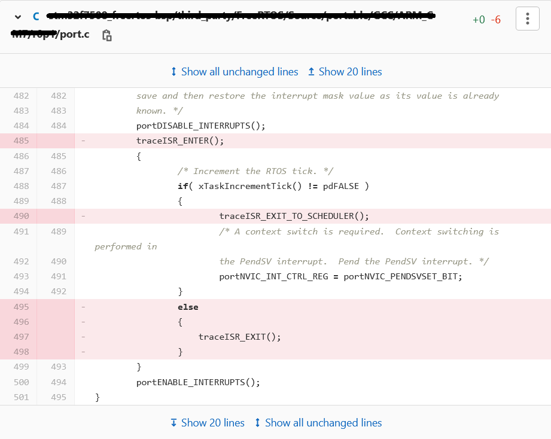

.. _systemview:

==========
SystemView
==========

Principle
=========

SystemView is a real-time recording and visualization tool for embedded systems that reveals the actual runtime behavior of an application,
going far deeper than the system insights provided by debuggers. This is particularly effective when developing and working with complex
embedded systems comprising multiple threads and interrupts.

A specific SystemView extension made by MicroEJ allows to trace the OS tasks and the MicroEJ Java threads at the same time.
This chapter explains how to add the SystemView feature to a VEE Port and set it up.

.. note:: SystemView support for MicroEJ is compatible with FreeRTOS 9 and FreeRTOS 10. 

.. note:: This SystemView section has been written for SystemView version V2.52a. Later versions may or may not work, and may need modification to the following steps.

.. note:: 
   SystemView provides implementations for several combinations of toolchain and CPU architectures.
   If your target does not match a default configuration, please read the section :ref:`section_non_default_cpu_setup`
   in order to know how to implement the required functions.

Here is an example when analyzing the `Demo Widget <https://github.com/MicroEJ/Demo-Widget>`__ running on
the `STM32F7508-DK VEE Port <https://github.com/MicroEJ/Platform-STMicroelectronics-STM32F7508-DK>`__.

References
==========

* https://www.segger.com/products/development-tools/systemview/
* https://www.segger.com/downloads/jlink/UM08027

Installation
============

SystemView installation consists of adding several items in the BSP. The following steps describe them, and they must be performed in the right order.
If SystemView support is already available in the BSP, apply only modifications made by MicroEJ on SystemView files and SystemView for
FreeRTOS files to enable MicroEJ Java threads monitoring.

1. Download and install SystemView V2.52a: http://segger.com/downloads/systemview/.
2. Apply SystemView for FreeRTOS patch as described in the documentation (https://www.segger.com/downloads/jlink/UM08027);the patch is available in the installation folder ``SEGGER/SystemView/Src/Sample/FreeRTOSVxx``.

.. note:: If you are using FreeRTOS V10.2.0, use the patch located here: https://forum.segger.com/index.php/Thread/6158-SOLVED-SystemView-Kernelpatch-for-FreeRTOS-10-2-0/?s=add3b0f6a33159b9c4b602da0082475afeceb89a

.. note:: 
   If the RTOS version of your system is more recent than the ones provided in the SystemView V2.52a install
   directory ``SEGGER/SystemView_V252a/Src/Sample``, consider to use a newer version of SystemView and follow the updated documentation.

3. Check if the patch disabled SystemView systick events in ``port.c``, if not remove these lines manually:

4. Add ``SEGGER/SystemView/Src/Sample/FreeRTOSVxx/Config/SEGGER_SYSVIEW_Config_FreeRTOS.c`` in your BSP.

This file can be modified to fit your system configuration:
   
   * Update ``SYSVIEW_APP_NAME``, ``SYSVIEW_DEVICE_NAME``, and ``SYSVIEW_RAM_BASE`` defines to fit your system information.
   * To add MicroEJ Java threads management in SystemView tasks initialization:
  
      * Add these includes ``#include "task.h"``, ``#include "LLMJVM_MONITOR_SYSVIEW.h"``, ``#include "LLTRACE_SYSVIEW_configuration.h"``, ``#include "SEGGER_SYSVIEW_configuration.h"``
        and the include that declares the external variable ``pvMEJCoreEngineTask``. ``pvMEJCoreEngineTask`` must be the FreeRTOS task handle
        used to create the MicroEJ Core Engine task. Initializes this variable at ``NULL`` before the call of the FreeRTOS scheduler.
      * In function ``_cbSendSystemDesc(void)``, add this instruction: ``SEGGER_SYSVIEW_SendSysDesc("N="SYSVIEW_APP_NAME",D="SYSVIEW_DEVICE_NAME",O=FreeRTOS");`` before ``SEGGER_SYSVIEW_SendSysDesc("I#15=SysTick");``.
      * Replace the ``Global function`` section with this code:

      .. code-block:: C

         /*********************************************************************
         *
         *       Global functions
         *
         **********************************************************************
         */

         SEGGER_SYSVIEW_OS_API SYSVIEW_MICROEJ_X_OS_TraceAPI;

         static void SYSVIEW_MICROEJ_X_OS_SendTaskList(void){
            SYSVIEW_X_OS_TraceAPI.pfSendTaskList();

         // The strategy to send tasks info is different in post mortem and live analysis.
         #if (1 == SEGGER_SYSVIEW_POST_MORTEM_MODE)
            /**
            * POST MORTEM analysis
            *
            * Using the post mortem analysis, FreeRTOS tasks regularly call the SYSVIEW_MICROEJ_X_OS_SendTaskList() function when
            * a packet (systemview event) is sent to the SEGGER circular buffer. It is necessary because the information of tasks
            * must be regularly uploaded in the circular buffer in order to provide a valid analysis at any moment.
            * Consequently, we only allow to call LLMJVM_MONITOR_SYSTEMVIEW_send_task_list() when the current task is the MicroEJ Core Engine.
            */

            /* Obtain the handle of the current task. */
            TaskHandle_t xHandle = xTaskGetCurrentTaskHandle();
            configASSERT( xHandle ); // Check the handle is not NULL.

            // Check if the current task handle is the MicroEJ Core Engine task handle. pvMEJCoreEngineTask is an external variable.
            if( xHandle == pvMEJCoreEngineTask){
               // Launched by the MicroEJ Core Engine, we execute LLMJVM_MONITOR_SYSTEMVIEW_send_task_list()
               LLMJVM_MONITOR_SYSTEMVIEW_send_task_list();
            }
         #else
            /**
            * LIVE analysis
            *
            * Using the live analysis, the call of SYSVIEW_MICROEJ_X_OS_SendTaskList() is triggered by
            * the SystemView Software through the J-Link probe. Consequently, the MicroEJ Core Engine task will never call
            * the function LLMJVM_MONITOR_SYSTEMVIEW_send_task_list(). However, if the MicroEJ Core Engine task is created,
            * the function must be called LLMJVM_MONITOR_SYSTEMVIEW_send_task_list().
            */
            // Check if the MicroEJ Core Engine task handle is not NULL. pvMEJCoreEngineTask is an external variable.
            if( NULL != pvMEJCoreEngineTask){
               // The MicroEJ Core Engine task is running, we execute LLMJVM_MONITOR_SYSTEMVIEW_send_task_list()
               LLMJVM_MONITOR_SYSTEMVIEW_send_task_list();
            }
         #endif
         }

         void SEGGER_SYSVIEW_Conf(void) {
            SYSVIEW_MICROEJ_X_OS_TraceAPI.pfGetTime = SYSVIEW_X_OS_TraceAPI.pfGetTime;
            SYSVIEW_MICROEJ_X_OS_TraceAPI.pfSendTaskList = SYSVIEW_MICROEJ_X_OS_SendTaskList;

            SEGGER_SYSVIEW_Init(SYSVIEW_TIMESTAMP_FREQ, SYSVIEW_CPU_FREQ, &SYSVIEW_MICROEJ_X_OS_TraceAPI, _cbSendSystemDesc);
            SEGGER_SYSVIEW_SetRAMBase(SYSVIEW_RAM_BASE);
         }

5. Add in your BSP the MicroEJ C module files for SystemView: `com.microej.clibrary.thirdparty#systemview`_ (or check the differences between pre-installed SystemView and C files provided by this module)
6. Add in your BSP the MicroEJ C module files for SystemView FreeRTOS support (or check the differences between pre-installed SystemView and C files provided by this module)
   
   * FreeRTOS 10: `com.microej.clibrary.thirdparty#systemview-freertos10`_ 
   * FreeRTOS 9: please contact :ref:`our support team <get_support>` to get the latest maintenance version of ``com.microej.clibrary.thirdparty#systemview-freertos9`` module.

7. Install the Abstraction Layer implementation of the :ref:`Java Trace API <trace_implementations>` for SystemView by adding C module files in your BSP: `com.microej.clibrary.llimpl#trace-systemview`_
8. Make FreeRTOS compatible with SystemView: open  ``FreeRTOSConfig.h`` and:

   * add ``#define INCLUDE_xTaskGetIdleTaskHandle 1``
   * add ``#define INCLUDE_pxTaskGetStackStart 1``
   * add ``#define INCLUDE_uxTaskPriorityGet 1``
   * comment the line ``#define traceTASK_SWITCHED_OUT()`` if defined 
   * comment the line ``#define traceTASK_SWITCHED_IN()`` if defined 
   * add ``#include "SEGGER_SYSVIEW_FreeRTOS.h"`` at the end of the file

9. Enable SystemView on startup (before creating the first OS task): call ``SEGGER_SYSVIEW_Conf();``. The following include directive is required: ``#include "SEGGER_SYSVIEW.h"``.
10. Print the RTT block address to the serial port on startup: ``printf("SEGGER_RTT block address: %p\n", &(_SEGGER_RTT));``. The following include directive is required: ``#include "SEGGER_RTT.h"``.

.. note::
   
   This is useful if SystemView does not automatically find the RTT block address.
   See section :ref:`systemview_no_rtt_block` for more details.

.. note::

   You may also find the RTT block address in RAM by searching ``_SEGGER_RTT`` in the .map file generated with the firmware binary.

11. Add a call to ``SEGGER_SYSVIEW_setMicroJVMTask((U32)pvCreatedTask);`` just after creating the OS task to register the MicroEJ Core Engine OS task. The handler to give is the one filled by the ``xTaskCreate`` function.

12. Copy the file ``/YourPlatformProject-bsp/projects/microej/trace/systemview/SYSVIEW_MicroEJ.txt`` to the SystemView installation path, such as ``SEGGER/SystemView_V252a/Description/``. If you use MicroUI traces, you can also copy the file in the section :ref:`microui_traces`

.. _com.microej.clibrary.thirdparty#systemview: https://repository.microej.com/modules/com/microej/clibrary/thirdparty/systemview/1.3.1/
.. _com.microej.clibrary.thirdparty#systemview-freertos10: https://repository.microej.com/modules/com/microej/clibrary/thirdparty/systemview-freertos10/1.1.1/
.. _com.microej.clibrary.llimpl#trace-systemview: https://repository.microej.com/modules/com/microej/clibrary/llimpl/trace-systemview/3.1.0/

.. _section_non_default_cpu_setup:

Non default CPU recommendations
===============================

As mentioned in the SEGGER documentation, SystemView can be used on any CPU. In the case of a CPU not supported by
default, the following macros that redirect to 4 functions must be implemented:

* ``SEGGER_SYSVIEW_GET_TIMESTAMP()``
* ``SEGGER_SYSVIEW_GET_INTERRUPT_ID()``
* ``SEGGER_SYSVIEW_LOCK()``
* ``SEGGER_SYSVIEW_UNLOCK()``

These 4 macros are defined by default in the file ``SEGGER_SYSVIEW_ConfDefaults.h`` and should be re-defined in the
file ``SEGGER_SYSVIEW_configuration.h`` when it is necessary.

The function macro ``SEGGER_SYSVIEW_GET_TIMESTAMP()`` retrieves the system timestamp for SystemView events. On most
devices the system timestamp must be generated by a timer. With the default configuration, the system timestamp is
retrieved from the user-provided function ``SEGGER_SYSVIEW_X_GetTimestamp()``. The recommended minimum accuracy for
this is on the order of magnitude of microseconds.

The function macro ``SEGGER_SYSVIEW_GET_INTERRUPT_ID()`` returns the currently active interrupt. On Cortex-M devices the
active vector can be read from the ICSR register. On other devices, the active interrupt can either be retrieved from the
interrupt controller directly, can be saved in a variable in the generic interrupt handler, or has to be assigned
manually in each interrupt routine.

The function macro ``SEGGER_SYSVIEW_LOCK()`` recursively locks SystemView transfers from being interrupted, by disabling the
interrupts. Recording a SystemView event must not be interrupted by recording another event. By default, this
function is implemented with the function macro ``SEGGER_RTT_LOCK()``. However, this definition may be empty for your system.
In this case, implement the function to disable interrupt and context switching.

The function macro ``SEGGER_SYSVIEW_UNLOCK()`` recursively unlocks SystemView transfers from being interrupted, by retoring
the previous interrupt state. Follow the same recommendations as for the function macro ``SEGGER_SYSVIEW_LOCK()``.

.. warning::
   Empty implementations of ``SEGGER_RTT_LOCK()`` and ``SEGGER_RTT_LOCK()`` will not cause
   an error at link time, so check the implementation of these two function macros carefully.

.. note:: If the target is not connected to a J-Link probe, post mortem analysis is still possible.

Post Mortem analysis data extraction
------------------------------------

First of all, in the file ``SEGGER_SYSVIEW_configuration.h``, be sure that the macro ``SEGGER_SYSVIEW_POST_MORTEM_MODE`` is set to 1 and increase the size of the
``SEGGER_SYSVIEW_RTT_BUFFER_SIZE``. Then, start manually the SystemView recording by calling
``SEGGER_SYSVIEW_Start()`` at runtime.

1. When the system crashed or all tests are done, attach with a debugger to the system and halt it.

2. Get the SystemView RTT buffer (Usually ``_SEGGER_RTT.aUp[1].pBuffer``).

When using a debugger, the SEGGER_RTT buffer can be located using the ``Expressions`` tab by adding the tracking of the expression ``_SEGGER_RTT`` symbol.

3. Save the data from pBuffer + WrOff until the end of the buffer to a file.

4. Append the data from pBuffer until pBuffer + RdOff - 1 to the file.

5. Save the file as \*.SVdat or \*.bin.

   The append step and the step 5 can be done in one cat instruction as shown below:

   .. code-block::

      cat sysview_dump_1_wroff.bin sysview_dump_1_rdoff.bin > concat_dump_1.bin

The file generated can now be read by the SystemView software.

.. note:: 
   Instructions on how to retrieve the right SEGGER RTT buffer are also available on the
   `SEGGER website <https://www.segger.com/products/development-tools/systemview/technology/post-mortem-mode>`__.

MicroEJ Core Engine OS Task
===========================

The :ref:`MicroEJ Core Engine <core_engine>` task is the OS task that executes MicroEJ Java threads. 
Once it is :ref:`started <core_engine_implementation>` (by calling ``SNI_startVM``), it executes the initialization code and rapidly starts to execute the MicroEJ Application main thread.
At that time, the events produced by this OS task (context switch, semaphores, etc.) are dispatched to the current MicroEJ Java thread.
Consequently, this OS task is useless when the MicroEJ Application is running.

SystemView for MicroEJ disables the visibility of this OS task when the MicroEJ Application is running. It simplifies the SystemView client debugging.

OS Tasks and Java Threads Names
===============================

To make a distinction between the OS tasks and the MicroEJ Java threads, a prefix is added to the OS tasks names (``[OS]``) and the Java threads names (``[MEJ]``).

.. _fig_sv_names:
.. figure:: images/sv_names.*
   :alt: OS and Thread Names
   :align: center

   OS Tasks and Java Threads Names

.. note:: 

   SystemView limits the number of characters to 32. The prefix length is included in these 32 characters; consequently, the end of the original OS task or Java thread name can be cropped.

OS Tasks and Java Threads Priorities
====================================

SystemView lists the OS tasks and Java threads according to their priorities. 
However, the priority notion does not have the same signification when talking about OS tasks or Java threads: a Java thread priority depends on the MicroEJ Core Engine OS task priority.

As a consequence, a Java thread with the priority ``5`` may not appear between an OS task with the priority ``4`` and another OS task with priority ``6``:

* if the MicroEJ Core Engine OS task priority is ``3``, the Java thread must appear below an OS task with priority ``4``. 
* if the MicroEJ Core Engine OS task priority is ``7``, the Java thread must appear above an OS task with priority ``6``. 

To keep a consistent line ordering in SystemView, the priorities sent to the SystemView client respect the following rules:

* OS task: ``priority_sent = task_priority * 100``.
* MicroEJ Java thread: ``priority_sent = MicroJvm_task_priority * 100 + thread_priority``.

Use
===

MicroEJ Architecture can generate specific events that allow monitoring of current Java thread, Java exceptions, Java allocations, ... as well as custom application events.
Please refer to the :ref:`event-tracing` section.

To enable events recording, refer to the :ref:`event_enable_recording` section to configure the required :ref:`Application Options <application_options>`.

Add custom events to the SystemView analysis
============================================

The first step is to add logs in the Java application using a dedicated ``Tracer``. Please read the documentation
page :ref:`codeInstrumentationForLogging`. Below is an example of ``Tracer`` usage:

.. code-block:: java

   Tracer tracer = new Tracer("MyGroup", 10);

   if (Constants.getBoolean(Tracer.TRACE_ENABLED_CONSTANT_PROPERTY)) {
      // This code is not embedded if TRACE_ENABLED_CONSTANT_PROPERTY is set to false.
      tracer.recordEvent(0);
   }

   // Do some actions HERE...
   
   if (Constants.getBoolean(Tracer.TRACE_ENABLED_CONSTANT_PROPERTY)) {
      // This code is not embedded if TRACE_ENABLED_CONSTANT_PROPERTY is set to false.
      tracer.recordEventEnd(0);
   }

Run this application on the target with traces enabled and record the SystemView analysis. Then, search for the event
in the SystemView logs with the timeline. In this example, the new event type is ``function #512``, see the screenshot below:

Now, it is necessary to indicate to SystemView how to decode this new event. To do that, you can either edit the file
``SYSVIEW_MicroEJ.txt`` or add a new text file in the SystemView install folder ``SEGGER/SystemView_VXXX/Description``.
In the chosen file, add the line as shown below:

.. code-block::
   
   512        Thread1_Print   Thread1 compute the time to print to the UART (512)

Finally, reload your analysis with SystemView and this time the new event should be decoded.

You can add more information if you use the versions of the Tracer API with more parameters. Then, if you want these
parameters to appear in the SystemView timeline view, use the modifiers below:

* ``%b`` - Display parameter as binary.
* ``%B`` - Display parameter as hexadecimal string (e.g. 00 AA FF …).
* ``%d`` - Display parameter as signed decimal integer.
* ``%D`` - Display parameter as time value.
* ``%I`` - Display parameter as a resource name if the resource id is known to SystemView.
* ``%p`` - Display parameter as 4 byte hexadecimal integer (e.g. 0xAABBCCDD).
* ``%s`` - Display parameter as string.
* ``%t`` - Display parameter as a task name if the task id is known to SystemView.
* ``%u`` - Display parameter as unsigned decimal integer.
* ``%x`` - Display parameter as hexadecimal integer.

Check the other text files provided by SEGGER for more examples in the install directory ``SEGGER/SystemView_VXXX/Description``.

Troubleshooting
===============

SystemView doesn't see any activity in MicroEJ Tasks
----------------------------------------------------

You have to enable runtime traces of your Java application. 

* In :guilabel:`Run` > :guilabel:`Run configuration`, select your Java application launcher.
* Then, go to :guilabel:`Configuration tab` > :guilabel:`Runtime` > :guilabel:`Trace`.
* Finally, check checkboxes :guilabel:`Enable execution traces` and :guilabel:`Start execution traces automatically` as shown in the picture below.
* Rebuild your firmware with the new Java application version, which should fix the issue.

You may only check the first checkbox when you know when you want to start the trace recording. 
For more information, please refer to the :ref:`event_enable_recording` section to configure the required :ref:`Application Options <application_options>`.

OVERFLOW Events in SystemView
-----------------------------

Depending on the application, OVERFLOW events can be seen in System View. To mitigate this problem, the default `SEGGER_SYSVIEW_RTT_BUFFER_SIZE` can be increased
from the default 1kB to a more appropriate size of 4kB. Still, if OVERFLOW events are still visible, the user can further increase this configuration found in
``/YourPlatformProject-bsp/projects/microej/thirdparty/systemview/inc/SEGGER_SYSVIEW_configuration.h``.

.. _systemview_no_rtt_block:

RTT Control Block Not Found
---------------------------

* Get the RTT block address from the standard output by resetting the board (it is printed at the beginning of the firmware program),
* In SystemView, select :guilabel:`Target` > :guilabel:`Start recording`,
* In :guilabel:`RTT Control Block Detection`, select :guilabel:`Address` and put the address retrieved.
  You can also try with :guilabel:`Search Range` option.

RTT block found by SystemView but no traces displayed
-----------------------------------------------------

* Be sure that your MCU is running. The BSP may use semi-hosting traces that
  block the MCU execution if the application is running out of a Debug session.
* You can check the state of the MCU using J-Link tools such as ``J-Link Commander`` and ``Ozone`` to start a Debug session.

Bus hardfault when running SystemView without Java Virtual Machine (JVM)
------------------------------------------------------------------------

The function  ``LLMJVM_MONITOR_SYSTEMVIEW_send_task_list();`` triggers  a  ``Bus Hardfault`` when no JVM is launched.
To solve this issue, comment this function call out in ``SEGGER_SYSVIEW_Config_FreeRTOS.c`` when you run SystemView without launching the JVM.

Partial or wrong analysis with warning messages in the logs 
-----------------------------------------------------------

It may happen that logs are not recorded well, with the following messages displayed in the log window:

.. code-block::

   Warning: Decoding 32-bit value failed. Bit 5 has continuation set
   Warning: Error during file analysis.

The cause of this issue can be a wrong implementation of the locking function macros ``SEGGER_SYSVIEW_LOCK()`` and ``SEGGER_SYSVIEW_UNLOCK()``.
This problem may occur on a system target that is not supported by default in SystemView sources. 

This issue has been discussed in the SEGGER forum topic here: https://forum.segger.com/index.php/Thread/8336-SOLVED-SystemView-stops-working-with-Error-140-and-141/

SystemView for STM32 ST-Link Probe
----------------------------------

SystemView software requires a J-Link probe. 
If your target board uses an ST-Link probe, it is possible to re-flash the ST-LINK on board with a J-Link firmware.
See instructions provided by SEGGER Microcontroller https://www.segger.com/products/debug-probes/j-link/models/other-j-links/st-link-on-board/ for more details.

If you cannot flash a firmware for an STM32 device after replacing the J-Link firmware with the ST-Link original one:

* Use ST_Link utility program to update the ST_Link firmware, go to :guilabel:`ST-LINK` > :guilabel:`Firmware update`.
* Then, try to flash again.

..
   | Copyright 2020-2025, MicroEJ Corp. Content in this space is free 
   for read and redistribute. Except if otherwise stated, modification 
   is subject to MicroEJ Corp prior approval.
   | MicroEJ is a trademark of MicroEJ Corp. All other trademarks and 
   copyrights are the property of their respective owners.
