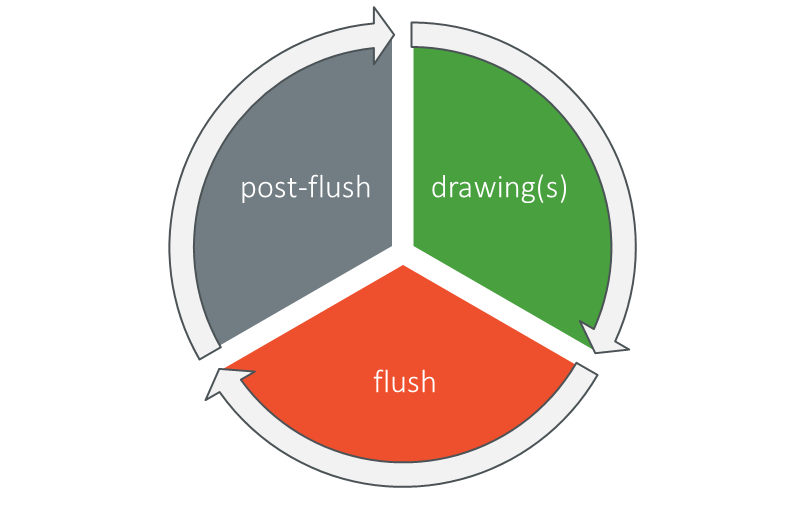
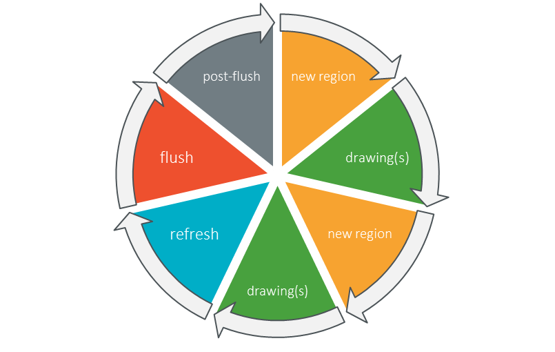

.. include:: uiReplaces.rst

.. _section_brs:

=======================
Buffer Refresh Strategy
=======================

Overview
========

The Buffer Refresh Strategy (BRS) ensures that the front buffer contains all the drawings before letting the display driver to flush this buffer to the display panel.
The drawings are the drawings made since last *flush* **and** the *past*.
The *past* symbolizes the drawings made before the last *flush*  and that has not been altered by the new drawings.

.. list-table:: Automatic Refresh
   :widths: 40 30 30
   :header-rows: 1

   * - Drawing Steps
     - Back Buffer  
     - Front Buffer 
   * - Startup
     - .. image:: images/ui_brs0.png
     - .. image:: images/ui_brs0.png 
   * - Draw "background"
     - .. image:: images/ui_brs1.png
     - .. image:: images/ui_brs0.png 
   * - Draw "A"
     - .. image:: images/ui_brs2.png
     - .. image:: images/ui_brs0.png 
   * - Flush (swap)
     - .. image:: images/ui_brs0.png
     - .. image:: images/ui_brs2.png 
   * -  Draw "B"
     - .. image:: images/ui_brs3.png
     - .. image:: images/ui_brs2.png 
   * - Refresh the past 
     - .. image:: images/ui_brs4.png
     - .. image:: images/ui_brs2.png 
   * - Flush (swap)
     - .. image:: images/ui_brs2.png
     - .. image:: images/ui_brs4.png 

This refreshing avoids running again all drawings algorithms (and layout) to fill the back buffer (here: the entire background, the "A" green background and the "A").
Without this refreshing, the display will show the incomplete frame *Draw "B"*:  

.. list-table:: Missing Refresh
   :widths: 40 30 30
   :header-rows: 1

   * - Drawing Steps
     - Back Buffer  
     - Front Buffer 
   * - Startup
     - .. image:: images/ui_brs0.png
     - .. image:: images/ui_brs0.png 
   * - Draw "background"
     - .. image:: images/ui_brs1.png
     - .. image:: images/ui_brs0.png 
   * - Draw "A"
     - .. image:: images/ui_brs2.png
     - .. image:: images/ui_brs0.png 
   * - Flush (swap)
     - .. image:: images/ui_brs0.png
     - .. image:: images/ui_brs2.png 
   * -  Draw "B"
     - .. image:: images/ui_brs3.png
     - .. image:: images/ui_brs2.png 
   * - Flush (swap)
     - .. image:: images/ui_brs2.png
     - .. image:: images/ui_brs3.png 
  

When the new drawings overlap the *past*, it is useless to refresh the past:

.. list-table:: Useless Refresh
   :widths: 40 30 30
   :header-rows: 1

   * - Drawing Steps
     - Back Buffer  
     - Front Buffer 
   * - 
     - .. image:: images/ui_brs2.png
     - .. image:: images/ui_brs4.png 
   * - Draw "C"
     - .. image:: images/ui_brs5.png
     - .. image:: images/ui_brs4.png 
   * - Flush (swap)
     - .. image:: images/ui_brs4.png
     - .. image:: images/ui_brs5.png 
   * -  Draw "D"
     - .. image:: images/ui_brs6.png
     - .. image:: images/ui_brs5.png 
   * - Flush (swap)
     - .. image:: images/ui_brs5.png
     - .. image:: images/ui_brs6.png 
  
Timeline
========

Basic Principle
---------------

The basic principle of the Graphics Engine's timeline can be symbolized by this illustration:

* *drawing(s)* symbolizes one or several drawings in the back buffer.
* *flush* symbolizes the call to the LLAPI ``LLUI_DISPLAY_IMPL_flush()`` that allows the display driver to update the display panel content according to the :ref:`display connection<section_display_connection>` (serial or parallel).
* *post-flush* symbolizes the moment between the end of flush (end of swap, send or copy) and the unlocking of the Graphics Engine (the call to ``LLUI_DISPLAY_setDrawingBuffer()``). Before this call, the Graphics Engine is not allowed to draw in the buffer. 

.. note:: The time between the *post-flush* and *drawing(s)* depends on the application: the first drawing after a *flush* can occur immediately after the *post-flush* or later.

Additional Hooks
----------------

The Graphics Engine provides some hooks (through dedicated LLAPI) to be notified of further details:

* *new region* symbolizes that the following drawing(s) will draw in another region than the previous drawings.
* *refresh* symbolizes that the last drawing has been done and a call to ``LLUI_DISPLAY_IMPL_flush()`` will be performed just after.

During these two new steps, the implementation can render into the back buffer (to restore the past), prepare the next flush (store the regions to flush), etc.

Implicit Region
---------------

A *region* is considered as a *new implicit region* as soon as the MicroUI clip is updated **and** a drawing is performed.
As soon as a clip is considered as an *implicit* region, a call to the LLAPI ``LLUI_DISPLAY_IMPL_newDrawingRegion(...)`` is performed.
The following sequence illustrates when the LLAPI is called:

.. list-table:: 
   :widths: 10 45 45
   :header-rows: 1

   * - 
     - Application Calls
     - LLAPI
   * - **1**
     - ``gc.setClip(...)``
     - 
   * - **2** [1]_
     - ``Painter.drawXX(...)``
     - | ``LLUI_DISPLAY_IMPL_newDrawingRegion(..., true)`` 
       | ``LLUI_PAINTER_IMPL_drawXX(...)``
   * - **3** [2]_
     - ``Painter.drawYY(...)``
     - ``LLUI_PAINTER_IMPL_drawYY(...)``
   * - **4** [3]_
     - ``gc.setClip(...)``
     - 
   * - **5**
     - ``gc.setClip(...)``
     - 
   * - **6**
     - ``Painter.drawZZ(...)``
     - | ``LLUI_DISPLAY_IMPL_newDrawingRegion(..., true)`` 
       | ``LLUI_PAINTER_IMPL_drawZZ(...)``

.. [1] The LLAPI argument ``drawing_now`` is valued to ``true``: this means a call to a drawing action will be call just after (*implicit* region).
.. [2] The second drawing uses the same region as first one: the region is not notified again.
.. [3] The clip is not recognized as an **implicit** region because no drawing is performed just after.

.. note:: The very first drawing's region after a *flush* is systematically considered as *implicit*.

Explicit Region
---------------

The application can *explicitly* call the LLAPI ``LLUI_DISPLAY_IMPL_newDrawingRegion(...)`` by calling the API ``GraphicsContext.notifyDrawingRegion()``. 
The LLAPI parameters are:

  * the region is the current MicroUI clip,
  * the argument ``drawing_now`` is valued to ``false``: this means no drawing will follow this call (*explicit* region).

Declaring explicit regions is mainly useful when it is performed before the very first drawing. It indicates to the BRS that several regions will be altered before the next flush. These regions don't need to be restored with the past (their content will change).

.. list-table:: 
   :widths: 10 45 45
   :header-rows: 1

   * - 
     - Application Calls
     - LLAPI
   * - **1**
     - ``gc.setClip(...)``
     - 
   * - **2** [4]_
     - ``gc.notifyDrawingRegion(...)``
     - ``LLUI_DISPLAY_IMPL_newDrawingRegion(..., false)`` 
   * - **3** [5]_
     - ``Painter.drawXX(...)``
     - | ``LLUI_DISPLAY_IMPL_newDrawingRegion(..., true)`` 
       | ``LLUI_PAINTER_IMPL_drawXX(...)``
   * - **4**
     - ``Painter.drawYY(...)``
     - ``LLUI_PAINTER_IMPL_drawYY(...)``
   * - **5** [6]_
     - ``gc.notifyDrawingRegion(...)``
     - ``LLUI_DISPLAY_IMPL_newDrawingRegion(..., false)``
   * - **6** [7]_
     - ``Painter.drawZZ(...)``
     - ``LLUI_PAINTER_IMPL_drawZZ(...)``

.. [4] The LLAPI is immediately called.
.. [5] The step **2** doesn't change the flow of the *implicit region*: a call to ``LLUI_DISPLAY_IMPL_newDrawingRegion(..., true)`` is always performed even if a call to ``LLUI_DISPLAY_IMPL_newDrawingRegion(..., false)`` is performed just before.
.. [6] The clip has not changed but the LLAPI is explicitly called again.
.. [7] The clip has not changed so the *implicit region* is not notified.

Flush vs Refresh
----------------

The Graphics Engine does not store the regions (implicit or explicit). The BRS has the responsibility to implement the LLAPI (the hooks, see above) and to manage these regions.

When the application calls ``Display.flush()``, the Graphics Engine immediately calls the LLAPI ``LLUI_DISPLAY_IMPL_refresh()``.
This call allows the BRS: 

  * to finalize (if required) the back buffer (no drawing will be performed into the buffer until the next call to ``LLUI_DISPLAY_setDrawingBuffer()``),
  * **and** to call the LCD driver flush function ``LLUI_DISPLAY_IMPL_flush()`` by giving the region(s) to update on the display panel.

Strategies
==========

Several strategies are available according to different considerations:

  * the :ref:`display connection<section_display_connection>` (serial or parallel),
  * the :ref:`buffer policy<section_display_buffer_policy>` (swap buffers, send or copy buffer),
  * if the *past* has to be restored,
  * if the *past* is systematically restored,
  * when the *past* is restored,
  * etc.

The following chapters describe the strategies:

   * For the single buffer policy, the restoration is useless; the recommended strategy is :ref:`section_brs_single`.
   * For the multiple buffers policy, the recommended strategy is :ref:`section_brs_predraw`.
   * The strategies :ref:`section_brs_default`, :ref:`section_brs_custom` and :ref:`section_brs_legacy` can be used for other use-cases.

.. _section_brs_single:

Strategy: Single
================

Principle
---------

This strategy considers that the drawings are always performed in the same back buffer (:ref:`single<section_display_single>` buffer policy).
In this case, the restoration is useless because the back buffer always contains the past.

.. tabs::

   .. tab:: Serial Connection

      .. figure:: images/ui_display_single_serial.*
        :alt: Single Buffer (serial)
        :scale: 50%
        :align: center

        Single Buffer (serial)

   .. tab:: Parallel Connection

      .. figure:: images/ui_display_single_parallel.*
        :alt: Single Buffer (parallel)
        :scale: 50%
        :align: center

        Single Buffer (parallel)

.. note:: This chapter uses the display connection *serial* to describe the flow but it is similar for the display connection *parallel* (*copy* instead of *send*).

The principle of this strategy is to cumulate the drawing regions.
The refresh consists in sending these regions (a list of rectangles) that have been modified since the last flush (or a unique rectangle that encapsulates all the regions) to the LCD driver through the LLAPI ``LLUI_DISPLAY_IMPL_flush()``. 

The implicit and explicit regions have the same meaning: a dirty region to send to the front buffer.

Behavior
--------

The following table illustrates how the strategy works:

.. list-table:: Strategy "Single"
   :widths: 30 60 20 20
   :header-rows: 1

   * - Drawing Steps
     - Strategy Work
     - Back Buffer  
     - Front Buffer 
   * - Startup
     - 
     - .. image:: images/ui_brs0.png
     - .. image:: images/ui_brs0.png 
   * - Implicit region *background* 
     - Store the region *full-screen*
     - .. image:: images/ui_brs0.png
     - .. image:: images/ui_brs0.png 
   * - Draw "background"
     - 
     - .. image:: images/ui_brs1.png
     - .. image:: images/ui_brs0.png 
   * - Implicit region *A*
     - The region *A* is included in the region *full-screen*: nothing to do
     - .. image:: images/ui_brs1.png
     - .. image:: images/ui_brs0.png 
   * - Draw "A"
     - 
     - .. image:: images/ui_brs2.png
     - .. image:: images/ui_brs0.png 
   * - Refresh
     - | Call ``LLUI_DISPLAY_IMPL_flush()`` (send the region *full-screen*)
       | Clear the list of regions
     - .. image:: images/ui_brs2.png
     - .. image:: images/ui_brs2.png 
   * - Implicit region *B*
     - Store the region *B*
     - .. image:: images/ui_brs2.png
     - .. image:: images/ui_brs2.png 
   * -  Draw "B"
     - 
     - .. image:: images/ui_brs4.png
     - .. image:: images/ui_brs2.png 
   * - Implicit region *C*
     - Store the region *C*
     - .. image:: images/ui_brs4.png
     - .. image:: images/ui_brs2.png 
   * -  Draw "C"
     - 
     - .. image:: images/ui_brs7.png
     - .. image:: images/ui_brs2.png 
   * - Refresh
     - | Call ``LLUI_DISPLAY_IMPL_flush()`` (send the regions *B* and *C*)
       | Clear the list of regions
     - .. image:: images/ui_brs7.png
     - .. image:: images/ui_brs7.png 

.. note:: This illustration considers that the clip changes before each drawing and fits the drawing's bounds
  
Use
---

Here are the steps around the strategy describing how to use it:
 
1. Some drawings are performed in the back buffer.
2. A ``Display.flush()`` is asked, the Graphics Engine calls ``LLUI_DISPLAY_IMPL_refresh()``.
3. The strategy calls ``LLUI_DISPLAY_IMPL_flush()``.
4. The display driver has to implement ``LLUI_DISPLAY_IMPL_flush()`` that consists in sending the back buffer data to the front buffer.
5. As soon as the sent is performed, the BSP has to notify the Graphics Engine by calling ``LLUI_DISPLAY_setDrawingBuffer()``, giving the same back buffer address (there is only one buffer).
6. The Graphics Engine is now unlocked and a new drawing can start in the back buffer.

.. _section_brs_predraw:

Strategy: Predraw
=================

Principle
---------

This strategy considers that the drawings are always performed in a buffer and a swap with another buffer is made by the implementation of ``LLUI_DISPLAY_IMPL_flush()``.
In this case, the restoration is mandatory because the new back buffer must contain the past before the buffer swapping.

The principle of this strategy is to cumulate the drawing regions and to restore them just before the very first drawing after a flush.
The refresh just consists in calling the LLAPI ``LLUI_DISPLAY_IMPL_flush()`` that will swap the buffers.

Some regions to restore are updated or removed according to the implicit and explicit regions *given* **before** the very first drawing after a flush.
These regions are the regions which will be altered by the application, so it is useless to restore them.
For instance, if the very first drawing after a flush fully fills the buffer (erase the buffer), the past is not restored.

The implicit and explicit regions **after** the very first drawing have the same signification: a dirty region to restore before the very first drawing after the next flush.

Behavior
--------

The following table illustrates how the strategy works:

.. list-table:: Strategy "Predraw"
   :widths: 30 60 20 20
   :header-rows: 1

   * - Drawing Steps
     - Strategy Work
     - Back Buffer  
     - Front Buffer 
   * - Startup
     - 
     - .. image:: images/ui_brs0.png
     - .. image:: images/ui_brs0.png 
   * - Implicit region *background* 
     - Store the region *full-screen*
     - .. image:: images/ui_brs0.png
     - .. image:: images/ui_brs0.png 
   * - Draw "background"
     - 
     - .. image:: images/ui_brs1.png
     - .. image:: images/ui_brs0.png 
   * - Implicit region *A*
     - The region *A* is included in the region *full-screen*: nothing to do
     - .. image:: images/ui_brs1.png
     - .. image:: images/ui_brs0.png 
   * - Draw "A"
     - 
     - .. image:: images/ui_brs2.png
     - .. image:: images/ui_brs0.png 
   * - Refresh
     - Call ``LLUI_DISPLAY_IMPL_flush()`` (swap the buffers)
     - .. image:: images/ui_brs0.png
     - .. image:: images/ui_brs2.png 
   * - Implicit region *B*
     - | Restore the region *full-screen* expect the region *B*
       | Clear the list of regions
       | Store the region *B*
     - .. image:: images/ui_brs8.png
     - .. image:: images/ui_brs2.png 
   * -  Draw "B"
     - 
     - .. image:: images/ui_brs4.png
     - .. image:: images/ui_brs2.png 
   * - Refresh
     - Call ``LLUI_DISPLAY_IMPL_flush()`` (swap the buffers)
     - .. image:: images/ui_brs2.png
     - .. image:: images/ui_brs4.png 
   * - Implicit region *C*
     - Nothing to restore because the region *B* equals the region *C*
     - .. image:: images/ui_brs2.png
     - .. image:: images/ui_brs4.png 
   * -  Draw "C"
     - 
     - .. image:: images/ui_brs5.png
     - .. image:: images/ui_brs4.png 
   * - Refresh
     - Call ``LLUI_DISPLAY_IMPL_flush()`` (swap the buffers)
     - .. image:: images/ui_brs4.png
     - .. image:: images/ui_brs5.png 
  

.. note:: This illustration considers that the clip changes before each drawing and fits the drawing's bounds

Read the Display
----------------

Before the very first drawing after a flush, the content of the back buffer does not contain the past (the restoration has not been performed). 
By consequence, the first read actions (``GraphicsContext.readPixel()``, ``Painter.drawDisplayRegion()``, etc.) cannot use the back buffer as source buffer. 
The algorithm has to call ``LLUI_DISPLAY_getSourceImage()`` to retrieve a pointer to the front buffer address.

Use (Swap Double Buffer)
------------------------

Here are the steps around the strategy describing how to use it in :ref:`double<section_display_swap_double_parallel>` buffer policy.

.. figure:: images/ui_display_double.*
   :alt: Swap Double Buffer
   :scale: 50%
   :align: center

   Swap Double Buffer

The two buffers have the same role alternatively, back buffer and front buffer:

1. Some drawings are performed in the back buffer.
2. A ``Display.flush()`` is asked, the Graphics Engine calls ``LLUI_DISPLAY_IMPL_refresh()``.
3. The strategy calls ``LLUI_DISPLAY_IMPL_flush()``.
4. The display driver has to implement ``LLUI_DISPLAY_IMPL_flush()`` that consists in swapping the back and front buffers.
5. As soon as the display *uses* the new front buffer (the new back buffer is now freed), the BSP has to notify the Graphics Engine by calling ``LLUI_DISPLAY_setDrawingBuffer()``, giving the new back buffer address (== previous front buffer).
6. The Graphics Engine is now unlocked.
7. Before the very first drawing, this strategy copies the regions to restore from the previous back buffer to the new back buffer.
8. A new drawing can start in the new back buffer.

Use (Swap Triple Buffer)
------------------------

Here are the steps around the strategy describing how to use it in :ref:`triple<section_display_triple>` buffer policy.

.. figure:: images/ui_display_triple.*
   :alt: Swap Triple Buffer
   :scale: 50%
   :align: center

   Swap Triple Buffer

The three buffers have the same role alternatively: back buffers (A and B) and front buffer (C). 
On startup, the front buffer is mapped on the buffer (C), the buffer (A) is the back buffer and the buffer (B) is not used yet:

   * buffer (A): the application's back buffer
   * buffer (B): free
   * buffer (C): LCD driver's buffer

1. Some drawings are performed in the back buffer (A).
2. A ``Display.flush()`` is asked, the Graphics Engine calls ``LLUI_DISPLAY_IMPL_refresh()``.
3. The strategy calls ``LLUI_DISPLAY_IMPL_flush()``.
4. The display driver has to implement ``LLUI_DISPLAY_IMPL_flush()`` that consists in swapping the buffers: the new LCD refresh task will read the data from buffer (A), the next drawings will be done in buffer (B) but the buffer (C) is still in use (the LCD driver keeps using this buffer to refresh the LCD).

   * buffer (A): next LCD driver's buffer
   * buffer (B): new the application's back buffer
   * buffer (C): current LCD driver's buffer

5. The buffer (B) is immediately available (free): the BSP has to notify the Graphics Engine by calling ``LLUI_DISPLAY_setDrawingBuffer()``, giving the buffer (B)'s address.
6. The Graphics Engine is now unlocked.
7. Before the very first drawing, this strategy copies the regions to restore from the previous back buffer (A) to the new back buffer (B).
8. Some drawings are performed in the back buffer (B).
9. A second ``Display.flush()`` is asked, the Graphics Engine calls ``LLUI_DISPLAY_IMPL_refresh()``.
10. The strategy calls ``LLUI_DISPLAY_IMPL_flush()``.
11. The system is locked: the LCD driver does not use the buffer (A) as source buffer yet.
12. As soon as the LCD driver *uses* the buffer (A) (the LCD driver keeps using this buffer to refresh the LCD), the buffer (C) becomes available (free).

   * buffer (A): current LCD driver's buffer
   * buffer (B): application's back buffer
   * buffer (C): free

13. The buffer (C) will be now used for the next drawings. Go to step 5.

Use (Copy and Swap Buffer)
--------------------------

Here are the steps around the strategy describing how to use it in :ref:`copy and swap<section_display_copyswap>` buffer policy. 

.. tabs::

   .. tab:: Serial Connection

      .. figure:: images/ui_display_copyswap_serial.*
        :alt: Copy and Swap (serial)
        :scale: 50%
        :align: center

        Copy and Swap (serial)

   .. tab:: Parallel Connection

      .. figure:: images/ui_display_copyswap_parallel.*
        :alt: Copy and Swap (parallel)
        :scale: 50%
        :align: center

        Copy and Swap (parallel)

.. note:: This chapter uses the display connection *serial* to describe the flow but it is similar for the display connection *parallel* (*copy* instead of *send*).

The two buffers have the same role alternatively: back buffer and sending buffer. 
On startup, the sending buffer is not used yet.

In this policy, the implementation of ``LLUI_DISPLAY_IMPL_flush()`` consists in swapping the back buffers and to send the content of the back buffer to the front buffer (SPI, DSI, etc.). 
This subtlety allows to reuse the same back buffer after the end of the sending: this prevents to restore the past.

1. Some drawings are performed in the back buffer.
2. A ``Display.flush()`` is asked, the Graphics Engine calls ``LLUI_DISPLAY_IMPL_refresh()``.
3. The strategy calls ``LLUI_DISPLAY_IMPL_flush()``.
4. The display driver has to implement ``LLUI_DISPLAY_IMPL_flush()`` that consists in starting the sending of the back buffer content to LCD device's buffer and to swap the both buffers (back and sending buffers).
5. The new back buffer is immediately available (free), the BSP has to notify the Graphics Engine by calling ``LLUI_DISPLAY_setDrawingBuffer()``, giving the new back buffer address (== previous sending buffer).
6. The Graphics Engine is now unlocked.
7. Before the very first drawing, this strategy copies the regions to restore from the previous back buffer to the new back buffer.
8. Some drawings are performed in the back buffer.
9. A second ``Display.flush()`` is asked, the Graphics Engine calls ``LLUI_DISPLAY_IMPL_refresh()``.
10. The strategy calls ``LLUI_DISPLAY_IMPL_flush()``.
11. The system is locked: the LCD driver has not finished yet to send the sending buffer data to the LCD device's buffer.
12. As soon as the sending is done, the BSP has to notify the Graphics Engine by calling ``LLUI_DISPLAY_setDrawingBuffer()``, giving the new back buffer address (== previous sending buffer).
13. The application is sleeping (doesn't want to draw in the back buffer)

   .. hint:: Optimization: As soon as the sending to the LCD device's buffer is done, the BSP should call again ``LLUI_DISPLAY_setDrawingBuffer()`` by giving the sending buffer (which is now free). If no drawing has started yet in the back buffer, the Graphics Engine will reuse this sending buffer as new back buffer instead of using the other one: the restoration becomes useless.

14.  The BSP should notify again the Graphics Engine by calling ``LLUI_DISPLAY_setDrawingBuffer()``, giving the sending buffer address: the Graphics Engine will reuse this buffer for the future drawings and the strategy will not need to restore anything.

.. _section_brs_default:

Strategy: Default
=================

Principle
---------

This strategy is the default strategy used when no explicit strategy is selected.
This strategy is implemented in the Graphics Engine and its behavior is minimalist.
However, this strategy can be used for the :ref:`direct<section_display_direct>` buffer policy.

.. figure:: images/ui_display_direct.*
   :alt: Direct Buffer
   :scale: 50%
   :align: center

   Direct Buffer

This strategy considers that the drawings are always performed in the same back buffer.
In this case, the restoration is useless because the buffer always contains the past.
Furthermore, as the LCD driver uses the same buffer to refresh the display panel, this strategy has nothing to do.

Behavior
--------

The following table illustrates how the strategy works:

.. list-table:: Strategy "Direct"
   :widths: 30 60 20
   :header-rows: 1

   * - Drawing Steps
     - Strategy Work
     - Front Buffer   
   * - Startup
     - 
     - .. image:: images/ui_brs0.png
   * - Implicit region *background* 
     - 
     - .. image:: images/ui_brs0.png
   * - Draw "background"
     - 
     - .. image:: images/ui_brs1.png
   * - Implicit region *A*
     - 
     - .. image:: images/ui_brs1.png
   * - Draw "A"
     - 
     - .. image:: images/ui_brs2.png
   * - Refresh
     - Call ``LLUI_DISPLAY_IMPL_flush()`` (nothing to do)
     - .. image:: images/ui_brs2.png
  
.. note:: This illustration considers that the clip changes before each drawing and fits the drawing's bounds

Use
---

Here are the steps around the strategy describing how to use it:

1. Some drawings are performed in the buffer.
2. A ``Display.flush()`` is asked, the Graphics Engine calls ``LLUI_DISPLAY_IMPL_refresh()``.
3. The strategy calls ``LLUI_DISPLAY_IMPL_flush()``.
4. The display driver has to implement ``LLUI_DISPLAY_IMPL_flush()``: at least, enable the LCD refresh interrupt to wait the end of the refresh (or use a software task).
5. In the LCD refresh interrupt (here, the display panel shows the latest frame for sure), the BSP has to notify the Graphics Engine by calling ``LLUI_DISPLAY_setDrawingBuffer()``, giving the same buffer address.
6. The Graphics Engine is now unlocked.
7. Some drawings are performed in the back buffer.

.. _section_brs_custom:

Strategy: Custom
================

Principle
---------

This strategy symbolizes the strategy implemented by the BSP (the other strategies are implemented in the :ref:`section_brs_cco` or in the Graphics Engine).
This strategy is useful to map a specific behavior according to a specific application, the number of buffers, how the display panel is mapped, etc.

The BSP has the responsibility to implement the following functions (in addition with ``LLUI_DISPLAY_IMPL_flush()``):

   * ``LLUI_DISPLAY_IMPL_newDrawingRegion()``
   * ``LLUI_DISPLAY_IMPL_refresh()``

.. warning:: Both functions are already implemented as weak functions in the Graphics Engine (see :ref:`section_brs_default`)

Behavior
--------

The following table illustrates how the strategy works:

.. list-table:: Strategy "Custom"
   :widths: 30 60 20
   :header-rows: 1

   * - Drawing Steps
     - Strategy Work
     - Back Buffer   
   * - Startup
     - 
     - .. image:: images/ui_brs0.png
   * - Implicit region *background* 
     - Implement ``LLUI_DISPLAY_IMPL_newDrawingRegion()``
     - .. image:: images/ui_brs0.png
   * - Draw "background"
     - 
     - .. image:: images/ui_brs1.png
   * - Implicit region *A*
     - Implement ``LLUI_DISPLAY_IMPL_newDrawingRegion()``
     - .. image:: images/ui_brs1.png
   * - Draw "A"
     - 
     - .. image:: images/ui_brs2.png
   * - Refresh
     - Implement ``LLUI_DISPLAY_IMPL_refresh()``
     - .. image:: images/ui_brs2.png
  
.. note:: This illustration considers that the clip changes before each drawing and fits the drawing's bounds

Use
---

Here are the steps around the strategy describing how to use it:

1. Some drawings are performed in the buffer.
2. A ``Display.flush()`` is asked, the Graphics Engine calls ``LLUI_DISPLAY_IMPL_refresh()``.
3. The strategy has to implement ``LLUI_DISPLAY_IMPL_refresh()`` and call ``LLUI_DISPLAY_IMPL_flush()``.
4. The display driver has to implement ``LLUI_DISPLAY_IMPL_flush()``.
5. When the display panel shows the latest frame, the BSP has to notify the Graphics Engine by calling ``LLUI_DISPLAY_setDrawingBuffer()``, giving the a buffer address.
6. The Graphics Engine is now unlocked.
7. Some drawings are performed in the buffer.

.. _section_brs_legacy:

Strategy: Legacy
================

Principle
---------

This strategy is the strategy that mimics the behavior of the specification of the UI Pack 13.x, dedicated to the :ref:`multi-buffers<section_display_buffer_policy>` policies. 

The specification consisted in:

   1. swapping the back buffer and the front buffer at flush time,
   2. letting the BSP restore itself the back buffer with the content of the previous drawings (the past) before unlocking the Graphics Engine after a flush. 

By consequence, the past was always available before making the very first drawing after a flush.

The strategy *Legacy* is useful to keep the behavior of the VEE Ports made for UI Pack 13.x without updating them (except the signature of the LLAPI ``LLUI_DISPLAY_IMPL_flush()``).
This strategy merges all drawing regions to only one rectangle (that includes all drawing regions).
This single rectangle is given to the function ``LLUI_DISPLAY_IMPL_flush()``. 

.. note:: For the :ref:`single buffer policy<section_display_single>`, it is recommended to migrate to the  :ref:`strategy single<section_brs_single>`.
 
Behavior
--------

The following table illustrates how the strategy works:

.. list-table:: Strategy "Legacy"
   :widths: 30 60 20 20
   :header-rows: 1

   * - Drawing Steps
     - Strategy Work
     - Back Buffer  
     - Front Buffer 
   * - Startup
     - 
     - .. image:: images/ui_brs0.png
     - .. image:: images/ui_brs0.png 
   * - Implicit region *background* 
     - Store the region *full-screen*
     - .. image:: images/ui_brs0.png
     - .. image:: images/ui_brs0.png 
   * - Draw "background"
     - 
     - .. image:: images/ui_brs1.png
     - .. image:: images/ui_brs0.png 
   * - Implicit region *A*
     - Calculate the bounding box of the regions *full-screen* and *A*
     - .. image:: images/ui_brs1.png
     - .. image:: images/ui_brs0.png 
   * - Draw "A"
     - 
     - .. image:: images/ui_brs2.png
     - .. image:: images/ui_brs0.png 
   * - Refresh
     - Call ``LLUI_DISPLAY_IMPL_flush()``: swap the buffers **and** restore the past
     - .. image:: images/ui_brs2.png
     - .. image:: images/ui_brs2.png 
   * - Implicit region *B*
     - Store the region *B*
     - .. image:: images/ui_brs2.png
     - .. image:: images/ui_brs2.png 
   * -  Draw "B"
     - 
     - .. image:: images/ui_brs4.png
     - .. image:: images/ui_brs2.png 
   * - Refresh
     - Call ``LLUI_DISPLAY_IMPL_flush()``: swap the buffers **and** restore the past
     - .. image:: images/ui_brs4.png
     - .. image:: images/ui_brs4.png 
   
   
.. note:: This illustration considers that the clip changes before each drawing and fits the drawing's bounds

Use
---

Here are the steps around the strategy describing how to use it:

1. Some drawings are performed in the buffer.
2. A ``Display.flush()`` is asked, the Graphics Engine calls ``LLUI_DISPLAY_IMPL_refresh()``.
3. The strategy calls ``LLUI_DISPLAY_IMPL_flush()``.
4. The display driver has to implement ``LLUI_DISPLAY_IMPL_flush()``: swap the back buffer and the front buffer.
5. As soon as the display *uses* the new front buffer (the new back buffer is now freed), the BSP has to launch a copy of the new front buffer to the new back buffer (use the bounding box).
6. At soon as the copy is done (the copy may be asynchronous), the BSP has to notify the Graphics Engine by calling ``LLUI_DISPLAY_setDrawingBuffer()``, giving the new back buffer address.
7. The Graphics Engine is now unlocked.
8. Some drawings are performed in the back buffer.

.. _section_brs_cco:

MicroUI C Module
================

Principle
---------

The :ref:`MicroUI C module<section_ui_releasenotes_cmodule>` features some Buffer Refresh Strategies.
To select a strategy, configure the define ``UI_DISPLAY_BRS`` in the configuration file ``ui_display_brs_configuration.h``:

   * Set ``UI_DISPLAY_BRS_SINGLE`` to select the strategy :ref:`Single<section_brs_single>`.
   * Set ``UI_DISPLAY_BRS_PREDRAW`` to select the strategy :ref:`Predraw<section_brs_predraw>`.
   * Set ``UI_DISPLAY_BRS_LEGACY`` to select the strategy :ref:`Legacy<section_brs_legacy>`.
   * Unset the define ``UI_DISPLAY_BRS`` to select the strategy :ref:`Default<section_brs_default>` or to implement a :ref:`Custom<section_brs_custom>` strategy.

Options
-------

Some strategies require some options to configure them.
The options (some *defines*) are shared between the strategies:

* ``UI_DISPLAY_BRS_DRAWING_BUFFER_COUNT`` (``ui_display_brs_configuration.h``): configures the available number of back buffers. Used by:

  * Predraw: allowed values are ``1``, ``2`` or ``3`` (``1`` is valid but this strategy is not optimized for this use case). See the comment of the define ``UI_DISPLAY_BRS_PREDRAW`` to increase this value.
  * Single:  allowed value is ``1`` (sanity check).

* ``UI_DISPLAY_BRS_FLUSH_SINGLE_RECTANGLE`` (``ui_display_brs_configuration.h``): configures the number of rectangles that the strategy gives to the implementation of ``LLUI_DISPLAY_IMPL_flush()``. If not set, the number or regions depends on the strategy. If set, only one region is given: the bounding box of all drawing regions. Used by:

  * Predraw: the list of regions is often useless (the LCD driver has just to swap the back and front buffers), however this list can be used for the buffer policy :ref:`section_display_copyswap`. Calculating the bounding box uses takes a bit of memory and time; if the bounding box is useless, it is recommended to not enable this option.
  * Single: the list of regions can be useful to refresh small parts of the front buffer.
  * Legacy: this option is never used and the bounding box of all drawing regions is given to the implementation of ``LLUI_DISPLAY_IMPL_flush()``.

* ``UI_RECT_COLLECTION_MAX_LENGTH`` (``ui_rect_collection.h``): configures the size of the arrays that hold a list of regions (``ui_rect_collection_t``). Default value is ``8``, when the collection is full, the strategy replaces all the regions by the bounding box of all regions. Used by:

  * Predraw: number of regions to restore per back buffer. 
  * Single: number of regions that the LCD driver has to send to the front buffer. 

Weak Functions
--------------

Some strategies use the function ``UI_DISPLAY_BRS_restore()`` to copy a region from a buffer to another buffer.
A default implementation of this function is available in the C file ``ui_display_brs.c``.
This implementation uses the standard ``memcpy``.
Override this function to use a GPU for instance.

Debug Traces
------------

The strategies log some events; see :ref:`microui_traces` (see *"[BRS]"* comments).

.. _section_brs_sim:

Simulation
==========

Principle
---------

The ``Display`` widget in the Front Panel is able to simulate the buffer refresh strategy.
It also simulates the :ref:`section_display_buffer_policy`.

The default values are:

- Swap Double Buffer for the buffer policy.
- Predraw for the buffer refresh strategy.

Usage
-----

The buffer policy and the refresh strategy can be configured by adding an attribute to the ``Display`` widget in the ``.fp`` file.
The value of these attributes is the fully qualified name of the class implementing the buffer policy or the refresh strategy.
The attributes are:

- ``bufferPolicyClass`` to set the buffer policy.
- ``refreshStrategyClass`` to set the refresh strategy.

Example:

   .. code-block:: xml

		<ej.fp.widget.Display
			x="0" y="0" width="480" height="272"
			bufferPolicyClass="ej.fp.widget.display.buffer.SwapTripleBufferPolicy"
      refreshStrategyClass="ej.fp.widget.display.brs.PredrawRefreshStrategy"
		/>

Available Implementations
-------------------------

The available buffer policies are:

- :ref:`Swap Double Buffer <section_display_swap_double_parallel>`: ``ej.fp.widget.display.buffer.SwapDoubleBufferPolicy``.
- :ref:`Swap Triple Buffer <section_display_triple>`: ``ej.fp.widget.display.buffer.SwapTripleBufferPolicy``.
- :ref:`Direct Buffer <section_display_direct>`: ``ej.fp.widget.display.buffer.DirectBufferPolicy``.
- :ref:`section_display_single`: ``ej.fp.widget.display.buffer.SingleBufferPolicy``.
- :ref:`section_display_copyswap`: ``ej.fp.widget.display.buffer.CopySwapBufferPolicy``.

The available refresh strategies are:

- :ref:`Single <section_brs_single>`: ``ej.fp.widget.display.brs.SingleRefreshStrategy``.
- :ref:`Predraw <section_brs_predraw>`: ``ej.fp.widget.display.brs.PredrawRefreshStrategy``.
- :ref:`Legacy <section_brs_legacy>`: ``ej.fp.widget.display.brs.LegacyRefreshStrategy``.

Custom Implementation
---------------------

It is possible to create a new buffer policy by implementing ``ej.fp.widget.display.buffer.DisplayBufferPolicy``.

The buffer policy is responsible of:

- Allocating the necessary buffers, usually in ``setDisplayProperties(Widget, int, int, int)``:

  .. code-block:: java

    FrontPanel.getFrontPanel().newImage(width, height, initialColor, false);

- Giving access to the back buffer (the buffer used to draw) in ``getBackBuffer()``.
- Giving access to the front buffer (the buffer displayed in the ``Display`` widget) in ``getFrontBuffer()``.
- Flushing the set of modified rectangles from the back buffer to the front buffer in ``flush(DisplayBufferManager, Rectangle[])`` and requesting the display widget to be refreshed.

  .. code-block:: java

    this.displayWidget.repaint();

It is possible to create a new refresh strategy by implementing ``ej.fp.widget.display.brs.BufferRefreshStrategy``.

The refresh strategy is responsible of:

- Restoring the past to ensure that the content of the display is correct by calling ``DisplayBufferManager.restore(Rectangle)``.
- Refreshing the display with what has been modified by calling ``DisplayBufferManager.flush(Rectangle[])`` in ``refresh(DisplayBufferManager)``.

It is notified of the modified regions in ``newDrawingRegion(DisplayBufferManager, Rectangle, boolean)``.

..
   | Copyright 2008-2024, MicroEJ Corp. Content in this space is free 
   for read and redistribute. Except if otherwise stated, modification 
   is subject to MicroEJ Corp prior approval.
   | MicroEJ is a trademark of MicroEJ Corp. All other trademarks and 
   copyrights are the property of their respective owners.