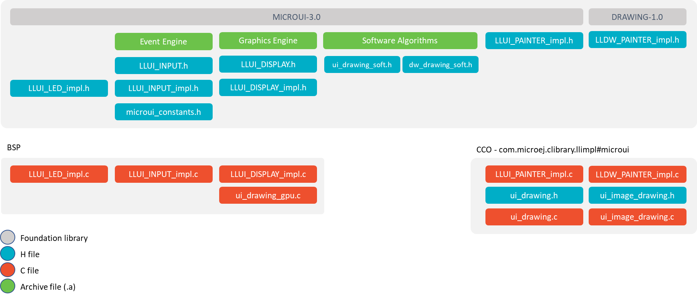

.. _section_ui_low_level:

=====================
Abstraction Layer API
=====================

Principle
=========

The MicroUI implementation for MicroEJ requires an Abstraction Layer implementation. This Abstraction Layer implementation finalizes the MicroUI implementation started with the static initialization step (see :ref:`section_static_init`) for a given VEE Port.

The Abstraction Layer implementation consists in a set of headers files to implement in C to target the hardware drivers. Some functions are mandatory, others are not. Some other headers files are also available to call UI engines internal functions.

For the simulator, some Front Panel interfaces and classes allow to specify the simulated VEE Port characteristics. 

Embedded VEE Port
=================

   MicroUI Embedded Abstraction Layer API

The specification of header files names is:

- Name starts with ``LLUI_``.
- Second part name refers the UI engine: ``DISPLAY``, ``INPUT``, ``LED``.
- Files whose name ends with ``_impl`` list functions to implement over hardware.
- Files whose name has no suffix list internal UI engines functions.

There are some exceptions :

- ``LLUI_PAINTER_impl.h`` and ``LLDW_PAINTER_impl.h`` list a subpart of UI Graphics Engine functions to implement (all MicroUI native drawing methods).
- ``ui_drawing_soft.h`` and ``dw_drawing_soft.h`` list all drawing methods implemented by the Graphics Engine.
- ``microui_constants.h`` is the file generated by the MicroUI Static Initializer (see :ref:`section_static_init`).

The :ref:`MicroUI C module <section_ui_cco>` provides a default implementation of the UI Pack Abstraction Layer API:

- ``LLUI_PAINTER_impl.c`` and ``LLDW_PAINTER_impl.c`` manage the synchronization with the Graphics Engine and redirect all drawings to ``ui_drawing.h`` and ``ui_image_drawing.h``.
- ``ui_drawing.h`` and ``ui_image_drawing.h`` list all drawing methods the VEE Port can implement.
- ``ui_drawing.c`` and ``ui_image_drawing.c`` are the default implementation of ``ui_drawing.h`` and ``ui_image_drawing.h`` that redirects all drawings to ``ui_drawing_soft.h`` and ``dw_drawing_soft.h``.

The BSP has to implement ``LLUI_xxx`` header files and optionally ``ui_drawing.h`` and ``ui_image_drawing.h`` (to draw using a GPU and/or to draw in a :ref:`custom BufferedImage <section_buffered_image>`).

All header files and their aims are described in next UI engines chapters:  :ref:`LED<section_leds_llapi>`, :ref:`Input<section_input_llapi>` and :ref:`Display<section_display_llapi>`.

Simulator
=========

   MicroUI Simulator Abstraction Layer API

In the simulator the three UI engines are grouped in a mock called Front Panel. The Front Panel comes with a set of classes and interfaces which are the equivalent of headers file (``*.h``) of Embedded VEE Port.

The specification of class names is:

- Package are the same than the MicroUI library (`ej.microui.display`_, `ej.microui.event`_, `ej.microui.led`_).
- Name start with ``LLUI``.
- The second part of the name refers the UI engine: ``Display``, ``Input``, ``Led``.
- Files whose name ends with ``Impl`` list methods to implement like in the embedded VEE Port.
- Files whose name has no suffix list internal UI engine functions.

There are some exceptions :

- ``LLUIPainter.java`` and ``LLDWPainter.java`` list a subpart of UI Graphics Engine functions (all MicroUI native drawing methods).
- ``UIDrawing.java`` and ``DWDrawing.java`` list all drawing methods the VEE Port can implement (and already implemented by the Graphics Engine).
- ``EventXXX`` list methods to create input events compatible with MicroUI implementation.

All files and their aims are described in :ref:`section_ui_simulation`. 

.. _ej.microui.display: https://repository.microej.com/javadoc/microej_5.x/apis/ej/microui/display/package-summary.html
.. _ej.microui.event: https://repository.microej.com/javadoc/microej_5.x/apis/ej/microui/event/package-summary.html
.. _ej.microui.led: https://repository.microej.com/javadoc/microej_5.x/apis/ej/microui/led/package-summary.html

..
   | Copyright 2008-2023, MicroEJ Corp. Content in this space is free 
   for read and redistribute. Except if otherwise stated, modification 
   is subject to MicroEJ Corp prior approval.
   | MicroEJ is a trademark of MicroEJ Corp. All other trademarks and 
   copyrights are the property of their respective owners.
