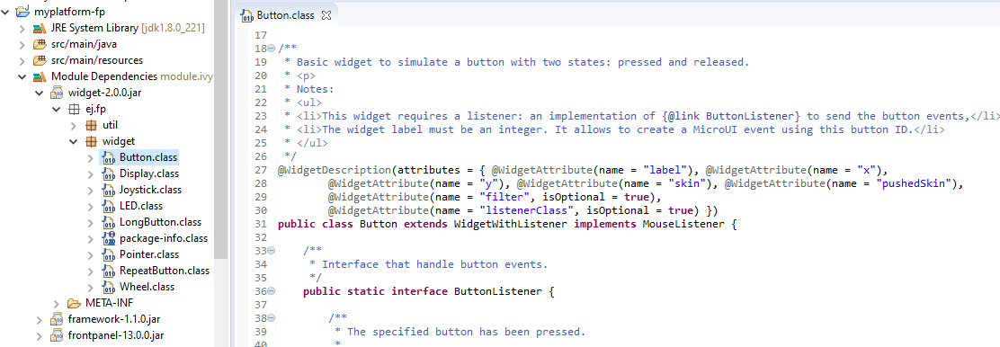

.. include:: uiReplaces.rst

.. _section_ui_simulation:

==========
Simulation
==========

Principle
=========

The graphical user interface uses the Front Panel mock (see :ref:`section_frontpanel`) and some extensions (widgets) to simulate the user interactions. It is the equivalent of the three embedded modules (Display, Input and LED) of the MicroEJ Platform (see :ref:`section_microui`).

The Front Panel enhances the development environment by allowing User Interface  applications to be designed and tested on the computer rather than on the target device (which may not yet be built). The mock interacts with the user's computer in two ways: 

-  output: LEDs, graphical displays
-  input: buttons, joystick, touch, haptic sensors

.. note:: This chapter completes the notions described in :ref:`section_frontpanel` chapter. 

Module Dependencies
===================

The Front Panel project is a regular MicroEJ Module project. Its module.ivy file should look like this example:

.. code-block:: xml

   <ivy-module version="2.0" xmlns:ea="http://www.easyant.org" xmlns:ej="https://developer.microej.com" ej:version="2.0.0"> 
   <info organisation="com.mycompany" module="examplePanel" status="integration" revision="1.0.0"/>      

      <configurations defaultconfmapping="default->default;provided->provided">
         <conf name="default" visibility="public" description="Runtime dependencies to other artifacts"/>
         <conf name="provided" visibility="public" description="Compile-time dependencies to APIs provided by the platform"/>
      </configurations>

      <dependencies>
         <dependency org="ej.tool.frontpanel" name="widget" rev="1.0.0"/>
      </dependencies>
   </ivy-module>

It depends at least on the Front Panel framework. This framework contains the Front Panel core classes. The dependencies can be reduced to:

.. code-block:: xml

   <dependencies>
      <dependency org="ej.tool.frontpanel" name="framework" rev="1.1.0"/>
   </dependencies>

To be compatible with Display module's Graphics Engine, the project must depend on an extension of Front Panel framework. This extension provides some interfaces and classes the Front Panel is using to target simulated display and input devices. The extension does not provide any widgets. It is the equivalent of the embedded Abstraction Layer APIs. It fetches by transitivity the Front Panel framework, so the Front Panel framework dependency does not need to be specified explicitly: 

.. code-block:: xml

   <dependencies>
      <dependency org="com.microej.pack.ui" name="ui-pack" rev="[UI Pack version]">
         <artifact name="frontpanel" type="jar"/>
      </dependency>
   </dependencies>

.. warning:: This extension is built for each UI pack version. By consequence, a Front Panel project is done for a platform built with the same UI pack. When the UI pack mismatch, some errors may occur during the Front Panel project export step, during the platform build, and/or during the application runtime. The current pack version is |UIPACKVERSION|.

The Front Panel extension does not provide any widgets. Some compatible widgets are available in a third library. The life cycle of this library is different than the UI pack's one. New widgets can be added to simulate new kind of displays, input devices, etc. This extension fetches by transitivity the Front Panel extension, so this extension dependency does not need to be specified explicitly: 

.. code-block:: xml

   <dependencies>
      <dependency org="ej.tool.frontpanel" name="widget" rev="2.0.0"/>
   </dependencies>

.. warning:: The minimal version ``2.0.0`` is required to be compatible with UI pack 13.0.0 and higher. By default, when creating a new Front Panel project, the widget dependency version is ``1.0.0``.

Source code for widgets is available by expanding the library from the project view.

   Front Panel Widgets

MicroUI Implementation
======================

As described :ref:`here<section_ui_low_level>`, the Front Panel uses an equivalent of embedded side's header files that implement MicroUI native methods.

.. figure:: images/ui_llapi_sim.*
   :alt: MicroUI Abstraction Layer
   :width: 100.0%
   :align: center

This set of classes and interfaces is available in the module `com.microej.pack.ui#ui-pack`_.
It offers the same capacity to override some built-in drawing algorithms (internal Graphics Engine drawing algorithms), to add some custom drawing algorithms, to manipulate the MicroUI concepts (GraphicsContext, Image, etc.) in the Front Panel project, etc.

* The interface ``ej.microui.display.LLUIDisplay`` represents the MicroUI Graphics Engine (MicroUI framework).
  It provides methods to map MicroUI byte arrays in MicroUI Graphics Context objects, manipulate MicroUI colors, clip, etc.
  An instance of this framework is available via the field ``Instance``. 
* The interface ``ej.microui.display.LLUIDisplayImpl`` all methods required by MicroUI implementation to be compatible with the MicroUI Display class implementation.
  See :ref:`section_ui_simulation_display`.
* The class ``ej.microui.display.LLUIPainter`` implements all MicroUI drawing natives.
  It defines some interfaces and classes to manipulate the MicroUI concepts (GraphicsContext, Image, etc.) in the Front Panel project.
  Like the embedded side, this class manages the synchronization with the Graphics Engine and delegates the drawing to the interface ``ej.microui.display.UIDrawing``. 
* The interface ``ej.microui.display.UIDrawing`` defines all the drawing methods available in MicroUI.
  The default implementation of the methods involving images calls the matching method in the ``ej.microui.display.UIImageDrawing``.
  The default implementation of the other methods reports the error that the drawing is not done.
* The interface ``ej.microui.display.UIImageDrawing`` defines all the methods that draw an image.
  The default implementation of the methods reports the error that the drawing is not done.
* The class ``ej.microui.display.DisplayDrawer`` implements ``ej.microui.display.UIDrawing`` that draws using the Graphics Engine software algorithms.
* The classes in the package ``ej.drawing`` implement the native of the MicroUI extended library: `Drawing`_
* The classes in the package ``ej.microui.event`` manage the input events, see :ref:`section_ui_simulation_input`.
* The classes in the package ``ej.microui.led`` manage the LEDs.

.. _com.microej.pack.ui#ui-pack: https://repository.microej.com/modules/com/microej/pack/ui/ui-pack/
.. _Drawing: https://repository.microej.com/modules/ej/api/drawing/

.. _section_ui_simulation_display:

Widget Display
==============

The widget Display implements the interface ``ej.microui.display.LLUIDisplayImpl`` to be compatible with the implementation of the MicroUI class `Display`_.

.. _Display: https://repository.microej.com/javadoc/microej_5.x/apis/ej/microui/display/Display.html

Features
--------

* Simple or double buffering (default value): ``doubleBufferFeature=true|false``.
* :ref:`LCD refresh rate<section_ui_simulation_refreshrate>`: simulates the time between two visible frames on the hardware device.
* :ref:`LCD flush time<section_ui_simulation_flushtime>`: simulates the time to send the frame content to the hardware device.
* Backlight (enabled by default): ``backlightFeature=true|false``.
* :ref:`Non-rectangular displays<section_ui_simulation_nonrectangulardisplay>`: ``filter="xxx.png"``. Some displays can have another appearance (for instance: circular).
* :ref:`Standard<display_pixel_structure_standard>` pixel formats.
* :ref:`Driver-specific<display_pixel_structure_driver>` pixel formats: ``extensionClass="xxx"``. This class must be added in the Front Panel project and implement the interface ``ej.fp.widget.Display.DisplayExtension``.

.. _section_ui_simulation_refreshrate:

Refresh Rate
------------

Usually a LCD is cadenced around 50-60Hz.
That means the LCD can display a new frame every 16-20ms.
By default this widget displays a new frame as soon as possible. 
It can be configured to reduce this time to simulate the hardware device.

In the widget declaration, set the attribute ``refreshRate="xxx"`` with a value in Hertz.
A zero or negative value disables the feature.

.. note:: This feature is only available when double buffering mode is enabled.
   
The application can substitute the platform's value by setting the property ``-Dej.fp.widget.display.refreshRate=xxx`` in the application launcher.

.. _section_ui_simulation_flushtime:

Flush Time
----------
 
On a hardware device, the time to send the frame data from the back buffer memory to the LCD is not null. 
According to the hardware device technology, this time varies between 3-4 ms to 10-15ms. 
In SPI mode, this time may be higher, around 50ms, even more.
By default this widget copies the content of back buffer as faster as possible.
It can be configured to reduce this time to simulate the hardware device.

In the widget declaration, set the attribute ``flushTime="xxx"`` with a value in milliseconds.
A zero or negative value disables the feature.

.. note:: This feature is only available when double buffering mode is enabled.
   
The application can substitute the platform's value by setting the property ``-Dej.fp.widget.display.flushTime=xxx`` in the application launcher.

.. _section_ui_simulation_nonrectangulardisplay:

Non-rectangular Display
-----------------------

The Front Panel can simulate using a filter (see :ref:`section_frontpanel_widget`). 
This filter defines the pixels inside and outside the whole display area. 
The filter image must have the same size as the rectangular display area. 
A display pixel at a given position will not be rendered if the pixel at the same position in the mask is fully transparent.

.. note:: Usually the touch panel over the display uses the same filter to reduce the touch panel area. 

Example of non-rectangular display and touch:

.. code-block:: xml

   <ej.fp.widget.Display x="41" y="33" width="392" height="392" filter="mask_392.png" />
   <ej.fp.widget.Pointer x="41" y="33" width="392" height="392" filter="mask_392.png" touch="true"/>

.. _section_ui_simulation_input:

Inputs Extensions
=================

The input device widgets (button, joystick, touch, etc.) require a listener to know how to react on input events (press, release, move, etc.). The aim of this listener is to generate an event compatible with MicroUI `Event Generator`_. Thereby, a button press action can become a MicroUI `Buttons`_ press event or a `Command`_ event or anything else. 

A MicroUI `Event Generator`_ is known by its name. This name is fixed during the MicroUI static initialization (see :ref:`section_static_init`). To generate an event to a specific event generator, the widget has to use the event generator name as identifier. 

A Front Panel widget can:

* Force the behavior of an input action: the associated MicroUI `Event Generator`_ type is hardcoded (`Buttons`_, `Pointer`_, etc.), the event is hardcoded (for instance: widget button press action may be hardcoded on event generator `Buttons`_ and on the event `pressed`). Only the event generator name (identifier) should be editable by the Front Panel extension project.
* Propose a default behavior of an input action: contrary to first point, the Front Panel extension project is able to change the default behavior. For instance a joystick can simulate a MicroUI `Pointer`_.
* Do nothing: the widget requires the Front Panel extension project to give a listener. This listener will receive all widgets action (press, release, etc.) and will have to react on it. The action should be converted on a MicroUI `Event Generator`_ event or might be dropped.

This choice of behavior is widget dependant. Please refer to the widget documentation to have more information about the chosen behavior.

.. _Event Generator: https://repository.microej.com/javadoc/microej_5.x/apis/ej/microui/event/EventGenerator.html
.. _Buttons: https://repository.microej.com/javadoc/microej_5.x/apis/ej/microui/event/generator/Buttons.html
.. _Command: https://repository.microej.com/javadoc/microej_5.x/apis/ej/microui/event/generator/Command.html
.. _Pointer: https://repository.microej.com/javadoc/microej_5.x/apis/ej/microui/event/generator/Pointer.html

Heap Simulation
===============

Graphics Engine is using two dedicated heaps: for the images (see :ref:`section_image_loader_memory` ) and the external fonts (see :ref:`section_font_loader_memory`). Front Panel partly simulates the heaps usage.

* Images heap: Front Panel simulates the heap usage when the application is creating a `BufferedImage`_, when it loads and decodes an image (PNG, BMP, etc.) which is not a raw resource and when it converts an image in MicroEJ format in another MicroEJ format. However it does not simulate the external image copy in heap (see :ref:`section_image_external_memory`).
* External fonts heap: Front Panel does not simulate this heap (see :ref:`section_font_loader_memory`). There is no rendering limitation when application is using a font which is located outside CPU addresses ranges.

.. _BufferedImage: https://repository.microej.com/javadoc/microej_5.x/apis/ej/microui/display/BufferedImage.html#

.. _fp_ui_decoder:

Image Decoders
==============

Front Panel uses its own internal image decoders when the associated modules have been selected (see :ref:`internal image decoders<image_external_decoder>`). Some additional decoders can be added like the C-side for the embedded platform (see :ref:`external image decoders<image_external_decoder>`).  Front Panel uses the Java AWT `ImageIO`_ API to load the encoded images. 

.. _ImageIO: https://docs.oracle.com/javase/7/docs/api/javax/imageio/ImageIO.html

Generic Image Decoders
----------------------

The Java AWT `ImageIO`_  class holds a limited list of additional decoders.
To be compliant with the embedded side, these decoders are disabled by default.
To add an additional decoder, specify the property ``hardwareImageDecoders.list`` in Front Panel configuration properties file (see :ref:`fp_ui_installation`) with one or several property values:

.. table:: Front Panel Additional Image Decoders

   +-----------------------------------------------------+-----------------+
   | Type                                                | Property value  |
   +=====================================================+=================+
   | Graphics Interchange Format (GIF)                   | gif             |
   +-----------------------------------------------------+-----------------+
   | Joint Photographic Experts Group (JPEG)             | jpeg or jpg     |
   +-----------------------------------------------------+-----------------+
   | Portable Network Graphics (PNG)                     | png             |
   +-----------------------------------------------------+-----------------+
   | Windows bitmap (BMP)                                | bmp             |
   +-----------------------------------------------------+-----------------+

The decoders list is comma (*,*) separated. Example:

::

   hardwareImageDecoders.list=jpg,bmp

Custom Image Decoders
---------------------

Additionally, the Java AWT `ImageIO`_  class offers the possibility to add some custom image decoders by using the service ``javax.imageio.spi.ImageReaderSpi``.

Since UI Pack 13.2.0, Front Panel automatically includes new image decoders (new ImageIO services, see the method ``LLUIDisplayImpl.decode()``), compiled in JAR files that follow this convention:

1. The JAR contains the service declaration ``/META-INF/services/javax.imageio.spi.ImageReaderSpi``,
2. The JAR filename's prefix is `imageio-`,
3. The JAR location is the platform configuration project's ``dropins/tools/`` directory.

.. note:: The same JAR is used by the Front Panel and by the :ref:`Image Generator <section_image_generator_imageio>`.

Drawings
========

Front Panel is designed to modify the default behavior for performing :ref:`drawings <section_drawings_sim>`.

Image Rendering
===============

Front Panel is designed to add the support of :ref:`custom images <section_image_renderer_sim>`.

Buffered Image
==============

Front Panel is designed to add the support of :ref:`MicroUI BufferedImage <section_bufferedimage_sim>` with a format different than the display format. 

Classpath
=========

A standard mock is running on the same JVM than the HIL Engine (see :ref:`mock` chapter). It shares the same classpath.
When the application is not using the MicroUI library (i.e., it is not an UI application, whether the platform holds the MicroEJ Graphics Engine or not), the Front Panel mock runs a standard mock.
When the application is using the MicroUI library, the Front Panel UI mock runs on the same JVM than the MicroEJ Simulator. 
In this case, the other mocks don't share the same classpath than the Front Panel mock.
As a consequence, an other mock than the Front Panel mock can not send input events to MicroUI, the object created in the standard mocks's class loader are not available in the Front Panel UI's class loader (and vice versa), etc.

Since the UI Pack 13.2.0, it is possible to force to run the Front Panel UI mock in the same classpath than the HIL Engine by adding the property ``-Dej.fp.hil=true`` in the application JRE tab. 
Note that this option only works when the version of the MicroEJ Architecture used to build the Platform is 7.17.0 or higher.     

Dependencies
============

-  MicroUI module (see :ref:`section_microui`),

-  Display module (see :ref:`section_display`): This module gives
   the characteristics of the graphical display that are useful for
   configuring the Front Panel.

.. _fp_ui_installation:

Installation
============

Front Panel is an additional module for MicroUI library. When the
MicroUI module is installed, install this module in order to be able to
simulate UI drawings on the Simulator. See :ref:`fp_installation` to install the module.

The properties file can additional properties:
   
-  ``hardwareImageDecoders.list`` [optional, default value is ""
   (*empty*)]: Defines the available list of additional image decoders
   provided by the hardware (see :ref:`fp_ui_decoder`). Use comma (',') to specify several decoders among this list: bmp, jpg, jpeg, gif, png. If empty or unspecified,
   no image decoder is added.

Use
===

Launch a MicroUI application on the Simulator to run the Front Panel.

..
   | Copyright 2008-2023, MicroEJ Corp. Content in this space is free 
   for read and redistribute. Except if otherwise stated, modification 
   is subject to MicroEJ Corp prior approval.
   | MicroEJ is a trademark of MicroEJ Corp. All other trademarks and 
   copyrights are the property of their respective owners.
