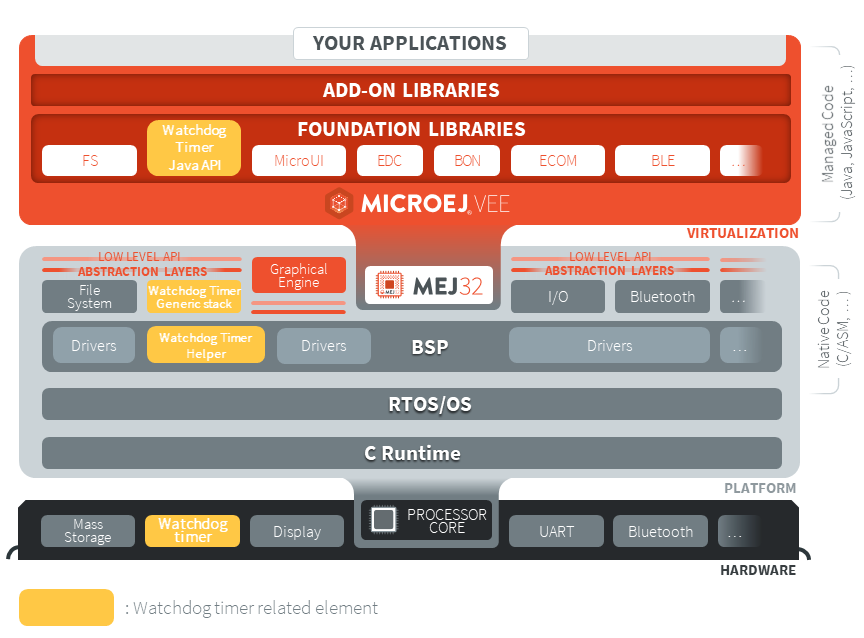
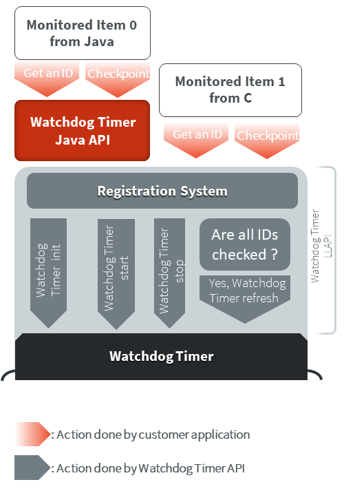
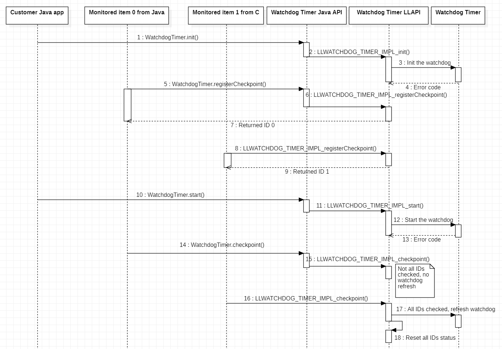

===============
Watchdog Timer
===============

Overview
========

The WatchdogTimer Foundation Library provides a way to handle hardware watchdog timer.
A watchdog is particularly useful if you want to monitor different items of your
software system during the runtime. The figure below shows watchdog elements at each level of 
a MicroEJ project:

Principle
=========

The Watchdog Timer API is in **two parts**, the first part drives the **watchdog timer** itself.
The second part of the API implements a **checkpoint registration system** linked to the watchdog timer.

The checkpoint registration system allows the user to add checkpoints monitored by the hardware watchdog timer.
Each checkpoint registered by the Watchdog Timer API must attest their activity before the watchdog
timeout, otherwise a **hardware reset** is performed. 
The high level diagram below summarizes interactions between the user application, 
the Watchdog Timer API and the Watchdog timer.

The particularity of this library is that it can be either used in Java, in C inside the BSP
or even both of them. The use of this library in the BSP in C is relevant when the user needs
to monitor an item of the software system which is outside of the MicroEJ Virtual Machine. 
The sequence diagram below shows a standard use of the Watchdog API in Java and in C.

Mock Implementation
===================

When you run your Application on the Simulator, the watchdog timer must be emulated. 
To do so, a Java Timer Task is used which emulates the watchdog timer.

The Mock implementation does not perform a hardware reset when the false watchdog timer triggers.

Dependencies
============

- This library needs to be used with the Watchdog Timer Generic C implementation developed for this purpose,
  its module name is ``watchdog-timer-generic``.

- ``LLWATCHDOG_TIMER_impl.h`` implemented by the Watchdog Timer C implementation (see :ref:`LLWATCHDOG_TIMER-API-SECTION`).

- ``watchdog_timer_helper.h`` implementation needed by the Watchdog Timer C implementation (see :ref:`LLWATCHDOG_TIMER-API-SECTION`).

Installation
============

Watchdog Timer is an API composed of a ``Pack`` module and a C component module.
You need both of them in your Platform to install the API.

In the Platform configuration project, the one with ``-configuration`` extension, add
the dependency to the two required modules in the file ``module.ivy``:

::

	<dependency org="com.microej.pack.watchdog-timer" name="watchdog-timer-pack" rev="2.0.1" />
	<dependency org="com.microej.clibrary.llimpl" name="watchdog-timer-generic" rev="3.0.1"/>

The Platform must be rebuilt (:ref:`platform_build`).

Then, you have to implement functions that match the ``LLWATCHDOG_TIMER_IMPL_*_action`` pattern
which is required by the Watchdog C implementation.

Use in an Application
=====================

The `WatchdogTimer API Module`_ must be added to the :ref:`module.ivy <mmm_module_description>` of the MicroEJ 
Application project in order to allow access to the Watchdog library.

::

	<dependency org="ej.api" name="watchdog-timer" rev="2.0.0"/>

.. _WatchdogTimer API Module: https://repository.microej.com/modules/ej/api/watchdog-timer/

Code example in Java
====================

Here is an example that summarizes all features in a simple use case.
The checkpoint is performed in a TimerTask scheduled to run every 5 seconds.
To use TimerTask in your Java application, add the following `BON API`_ dependency:

::

	<dependency org="ej.api" name="bon" rev="1.4.0" />

Then, you can use this example code:

.. code:: java

	// Test a simple watchdog timer use case
	public static void main(String[] args) {

		if (WatchdogTimer.isResetCause()) {
			System.out.println("Watchdog timer triggered the last board reset!"); //$NON-NLS-1$
		} else {
			System.out.println("Watchdog timer DID NOT triggered the last board reset!"); //$NON-NLS-1$
		}

		WatchdogTimer.init();
		System.out.println("Watchdog timer initialized to trigger after " + WatchdogTimer.getWatchdogTimeoutMs() + " ms."); //$NON-NLS-1$

		TimerTask checkpointTask = new TimerTask() {

			private final int checkpointId = WatchdogTimer.registerCheckpoint();

			@Override
			public void run() {
				// We attest our task activity using the checkpoint method.
				// Since this is our only checkpoint registered, the watchdog timer is refreshed.
				WatchdogTimer.checkpoint(this.checkpointId); 
				System.out.println("Task performed watchdog checkpoint with the ID " + this.checkpointId); //$NON-NLS-1$
			}
		};

		// We schedule our task to be executed every 5 seconds.
		Timer timer = new Timer();
		final int DELAY = 0;
		final int PERIOD = 5000; // We assume that the watchdog timeout period is higher than 5000 milliseconds.
		timer.schedule(checkpointTask, DELAY, PERIOD);

		// Everything is ready, we launch the watchdog
		WatchdogTimer.start();
		System.out.println("Watchdog started!");

		// Let the checkpointTask runs for a minute.

		final int WAIT_A_MINUTE = 60000; // 60 000 milliseconds to wait a minute
		try {
			Thread.sleep(WAIT_A_MINUTE);
		} catch (InterruptedException e) {
			// TODO Auto-generated catch block
			e.printStackTrace();
		}

		// Our program is finished. Now we stop the checkpointTask and the watchdog.
		timer.cancel();
		WatchdogTimer.stop(); // This method also unregisters all checkpoints.
		System.out.println("Monitored task stopped and Watchdog timer stopped.");
	}

.. _BON API: https://repository.microej.com/modules/ej/api/bon/

Use in C inside the BSP
=======================

Once the Platform is configured to use the Watchdog Timer API as explained in ``Installation``
section, you can use functions defined in ``LLWATCHDOG_TIMER_impl.h``.

Note that compared to the Java API, you have to get error codes returned by functions
to check if the function is executed correctly since you have no access to
exceptions generated for the Java.

The Watchdog Timer Low Level API provides a set of functions with the same usage as in Java.
Here is the list of the watchdog Low Level API functions:

.. code:: c

	LLWATCHDOG_TIMER_IMPL_init()                      // refer to ej.hal.WatchdogTimer.init()
	LLWATCHDOG_TIMER_IMPL_start()                     // refer to ej.hal.WatchdogTimer.start()
	LLWATCHDOG_TIMER_IMPL_stop()                      // refer to ej.hal.WatchdogTimer.stop()
	LLWATCHDOG_TIMER_IMPL_registerCheckpoint()        // refer to ej.hal.WatchdogTimer.registerCheckpoint()
	LLWATCHDOG_TIMER_IMPL_unregisterCheckpoint()      // refer to ej.hal.WatchdogTimer.unregisterCheckpoint()
	LLWATCHDOG_TIMER_IMPL_checkpoint()                // refer to ej.hal.WatchdogTimer.checkpoint()
	LLWATCHDOG_TIMER_IMPL_isResetCause()              // refer to ej.hal.WatchdogTimer.isResetCause()
	LLWATCHDOG_TIMER_IMPL_getWatchdogTimeoutMs()      // refer to ej.hal.WatchdogTimer.getWatchdogTimeoutMs()

There is an additional function in ``LLWATCHDOG_TIMER_impl.h`` compared to the Java API.
This is ``LLWATCHDOG_TIMER_IMPL_refresh``, because a low level implementation of this function
is required for the library. However, the user does not need and should not use this function on his own.

Code example in C
=================

Here is an example that summarizes main features in a simple use case.
The checkpoint is performed in a FreeRTOS task scheduled to attest its activity to the watchdog every 5 seconds.

.. code:: C
		
	#include <stdio.h>
	#include <stdint.h>

	#include "FreeRTOS.h"
	#include "task.h"
	#include "queue.h"
	#include "semphr.h"

	#include "LLWATCHDOG_TIMER_impl.h"

	#define MONITORED_TASK_STACK_SIZE 1024
	#define TASK_SLEEP_TIME_MS 5000 // We sleep for 5 seconds, assuming that the watchdog timeout is higher.

	/*-----------------------------------------------------------*/

	static void my_monitored_task( void *pvParameters ){
		// We get an ID from watchdog registration system for this new checkpoint
		int32_t checkpoint_id = LLWATCHDOG_TIMER_IMPL_registerCheckpoint();

		for(;;){
			vTaskDelay( TASK_SLEEP_TIME_MS / portTICK_PERIOD_MS);
			// Since this is our only checkpoint registered, the watchdog timer is refreshed.
			LLWATCHDOG_TIMER_IMPL_checkpoint(checkpoint_id); 
			printf("MonitoredTask with ID = %d did watchdog checkpoint!\n", checkpoint_id);
		}
	}

	/*-----------------------------------------------------------*/

	int main( void ){
		xTaskHandle handle_monitored_task;

		/* Check if last reset was done by the Watchdog timer. */
		if(LLWATCHDOG_TIMER_IMPL_isResetCause()){
			printf("Watchdog timer triggered the last reset, we stop the program now! \n");
			return -1;
		}

		/* Setup the Watchdog Timer*/
		if(WATCHDOG_TIMER_ERROR == LLWATCHDOG_TIMER_IMPL_init()){
			printf("Failed to init watchdog timer in main. \n");
		} else{
			printf("Watchdog timer initialized to trigger after %d ms \n", LLWATCHDOG_TIMER_IMPL_getWatchdogTimeoutMs());
		}

		/* Start the Watchdog Timer*/
		if(WATCHDOG_TIMER_ERROR == LLWATCHDOG_TIMER_IMPL_start()){
			printf("Failed to start watchdog timer in main. \n");
		} else{
			printf("Watchdog started!\n");
		}

		/* Create the monitored task. */
		xTaskCreate( my_monitored_task, "MonitoredTask", MONITORED_TASK_STACK_SIZE, NULL, tskIDLE_PRIORITY, &handle_monitored_task);

		/* Start the scheduler. */
		printf("Starting scheduler...\n");
		vTaskStartScheduler();

		return 0;
	}

..
	| Copyright 2021-2022, MicroEJ Corp. Content in this space is free 
	for read and redistribute. Except if otherwise stated, modification 
	is subject to MicroEJ Corp prior approval.
	| MicroEJ is a trademark of MicroEJ Corp. All other trademarks and 
	copyrights are the property of their respective owners.
