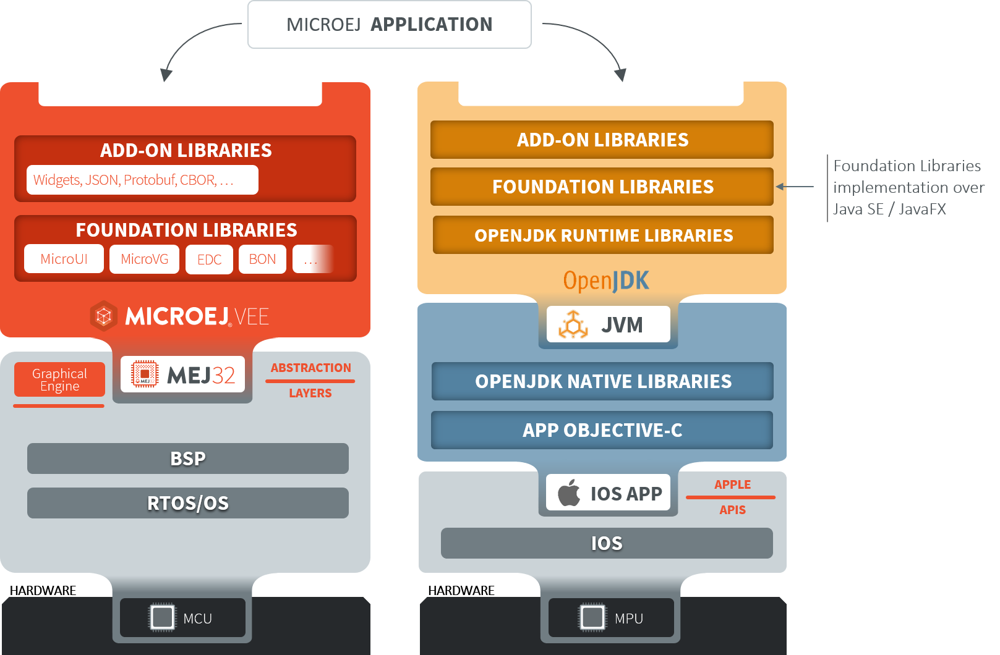

.. _ios_compatibility_kit:

iOS Compatibility Kit
=====================

MicroEJ provides a set of tools and libraries to run applications powered by MicroEJ on iOS.
This allows for the same application to be developed, simulated, tested, and executed on MicroEJ VEE and iOS alike.

Thanks to the iOS Compatibility Kit, watch faces can be developed once and deployed on both a smartwatch (MicroEJ VEE) and its companion smartphone app (iOS), enabling consistent functionality and appearance across both devices.
This provides a good user experience for the user while minimizing code duplication and maintenance for the developer.

Software Architecture
---------------------

The iOS Compatibility Kit provides a JDK which can be used to compile and run Java code on iOS.
The code of the MicroEJ Application and of the libraries it depends on is executed on a Java VM started by the iOS app.

The JDK runtime includes JavaFX to be able to display Applications which use :ref:`section_app_microui` or :ref:`section_app_microvg`.

    Software Architecture

Workflow
--------

The iOS app can be developed and built on Xcode as a regular iOS application.
To run a MicroEJ Application, the Xcode project is configured to embed:

- the runtime libraries of the JDK (JARs and native libraries),
- the implementation of the MicroEJ Foundation Libraries compiled against Java SE and JavaFX APIs,
- the code and resources of the MicroEJ Application and of the Add-On Libraries that it depends on.

Evaluation
----------

The iOS Compatibility Kit is available on demand. You can contact :ref:`MicroEJ Support<get_support>` to evaluate this solution.

..
   | Copyright 2008-2024, MicroEJ Corp. Content in this space is free 
   for read and redistribute. Except if otherwise stated, modification 
   is subject to MicroEJ Corp prior approval.
   | MicroEJ is a trademark of MicroEJ Corp. All other trademarks and 
   copyrights are the property of their respective owners.
