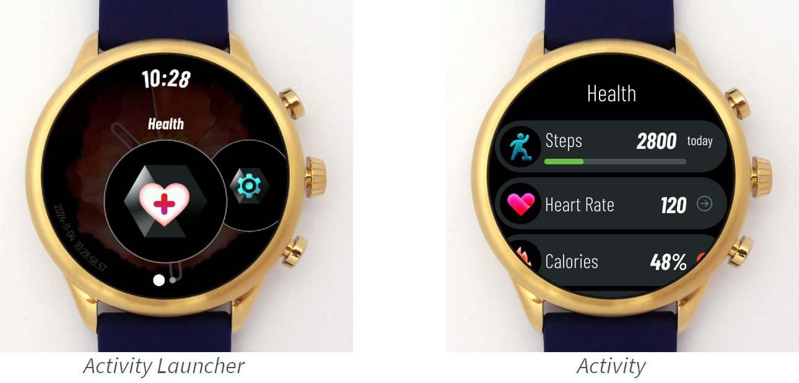
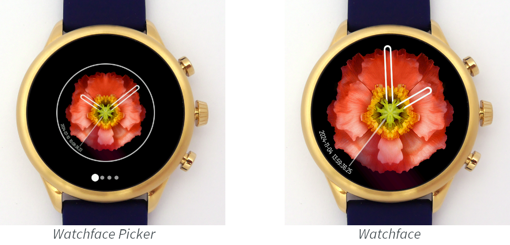
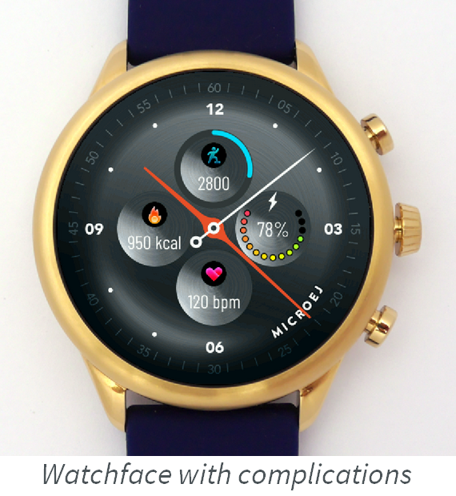

.. _vee_wear_sdk:

VEE Wear SDK
============

The VEE Wear SDK allows developers to build a VEE Wear Kernel executable and develop VEE Wear Apps.

The SDK contains the following components:

- the source code of the VEE Wear Kernel
- the source code of common VEE Wear Apps (health, settings, etc.)
- the VEE Wear Framework library

.. note::

	The source code is available on demand. You can contact :ref:`MicroEJ Support <get_support>` to evaluate VEE Wear.

.. _vee_wear_kernel:

VEE Wear Kernel
---------------

The VEE Wear Kernel is the core Application running on the wearable device.
It manages the lifecycle of VEE Wear Apps.

The Kernel is board agnostic and can be fully customized to any hardware.
It must be built from its source code (:ref:`available on demand <get_support>`) with the VEE Port corresponding to the target hardware.
The build generates an executable file and a Virtual Device which must be provided to app developers so that they can build their Apps.

The VEE Wear Kernel Application requires the following amount of memory:

- RAM: around 400KB (mainly for Java heap and buffered images)
- ROM: from 250KB to 1MB for each App (mainly for its images)

The Kernel provides the following APIs to the Apps:

.. list-table::
   :widths: 20 10
   :header-rows: 1

   * - Library
     - Version
   * - EDC
     - `1.3 <https://repository.microej.com/javadoc/microej_5.x/libraries/edc-1.3-api/>`__
   * - BON
     - `1.4 <https://repository.microej.com/javadoc/microej_5.x/libraries/bon-1.4-api/>`__
   * - Trace
     - `1.1 <https://repository.microej.com/javadoc/microej_5.x/libraries/trace-1.1-api/>`__
   * - FS
     - `2.1 <https://repository.microej.com/javadoc/microej_5.x/libraries/fs-2.1-api/>`__
   * - MicroUI
     - `3.1 <https://repository.microej.com/javadoc/microej_5.x/libraries/microui-3.1-api/>`__
   * - Drawing
     - `1.0 <https://repository.microej.com/javadoc/microej_5.x/libraries/drawing-1.0-api/>`__
   * - MicroVG
     - `1.2 <https://repository.microej.com/javadoc/microej_5.x/libraries/microvg-1.2-api/>`__
   * - Audio
     - `1.0 <https://repository.microej.com/javadoc/microej_5.x/libraries/audio-1.0-api/>`__
   * - Bluetooth
     - `2.2 <https://repository.microej.com/javadoc/microej_5.x/libraries/bluetooth-2.2-api/>`__
   * - VEE Wear Framework
     - `0.9 <https://repository.microej.com/javadoc/wear-framework/0.9.1/>`__

.. _vee_wear_framework:

VEE Wear Framework Library
--------------------------

The VEE Wear Framework library allows VEE Wear Apps to communicate with the Kernel and with other Apps.

The library provides interfaces to services that are implemented by the Kernel:

.. list-table::
   :header-rows: 1

   * - Service
     - Provided Features
   * - `ComponentService`_
     - register App components
   * - `DeviceService`_
     - get device information
   * - `ExternalResourceService`_
     - create and delete external resources
   * - `FontService`_
     - get fonts
   * - `HealthService`_
     - get health information
   * - `NavigationService`_
     - navigate across the UI
   * - `TimeService`_
     - get time information

The `KernelServiceProvider`_ class provides static methods to get an instance of every service.
It also provides a shared instance of `Timer`_, which can be used by any App to schedule tasks without creating an additional thread.

The library also provides interfaces to components that are implemented by the Apps:

.. list-table::
   :header-rows: 1

   * - Component
     - Provided Features
   * - `Activity`_
     - user interface that can be shown in the Activity Launcher
   * - `Watchface`_
     - user interface that can be shown in the Watchface Picker
   * - `ComplicationDataSource`_
     - data that can be displayed on watchface complications

Using `ComponentService <https://repository.microej.com/javadoc/wear-framework/0.9.1/com/microej/wear/framework/services/ComponentService.html>`_, Apps can register their own components into the Kernel.
Once a component is registered, its lifecycle is managed by the Kernel: the Kernel will call the methods of the component when the user navigates in the relevant menus of the watch.

To use the VEE Wear Framework, add the following line to the project build file:

.. code-block:: kotlin

	implementation("com.microej.library.wear:wear-framework:0.9.1")

VEE Wear Apps
-------------

Apps are the cornerstone of VEE Wear: they provide exciting and unique features that make a smartwatch unforgettable.
With VEE Wear, Apps can be deployed over USB or Bluetooth and installed dynamically on the device.
Partial software update allows manufacturers to provide new features and bug fixes without having to validate and deploy an entire firmware.

Creating an App
~~~~~~~~~~~~~~~

To create an App project, follow these steps:

- :ref:`Create an SDK 6 Application project <sdk_6_create_project>`.
- Open the ``build.gradle.kts`` file.
- Add a dependency to the VEE Wear Framework library: add ``implementation("com.microej.library.wear:wear-framework:0.9.1")`` in the ``dependencies`` block.

Implementing the Entry Point
~~~~~~~~~~~~~~~~~~~~~~~~~~~~

The entry point of an App contains the code that will be called by the Kernel when the App is installed and uninstalled.
The name of the entry point class must be :ref:`declared <sdk_6_create_project_configure_application>` in the ``build.gradle.kts`` file.
The class should implement the `FeatureEntryPoint`_ interface.

The entry point can perform any operation, such as registering components, adding Bluetooth services or running timer tasks.
However, the entry point is not the place to show a UI: this should be done by the Activities or Watchfaces registered by the App.

.. note::

	Apps can use any library, as long as it doesn't require a Foundation Library that is not provided by the Kernel.

Implementing an Activity
~~~~~~~~~~~~~~~~~~~~~~~~

An Activity is a user interface which is shown by the Activity Launcher:

To implement an Activity, implement the `Activity`_ interface and its methods:

- `getName() <https://repository.microej.com/javadoc/wear-framework/0.9.1/com/microej/wear/framework/components/Activity.html#getName()>`__ should return the name of the Activity. This is the name that is visible in the Activity Launcher.
- `renderIcon() <https://repository.microej.com/javadoc/wear-framework/0.9.1/com/microej/wear/framework/components/Activity.html#renderIcon(ej.microui.display.GraphicsContext,int,int,int)>`__ should render the icon of the Activity in the given region. This is the icon that is visible in the Activity Launcher.
- `show() <https://repository.microej.com/javadoc/wear-framework/0.9.1/com/microej/wear/framework/components/Activity.html#show()>`__ should show the fullscreen UI of the Activity. The implementation can call `Display.requestShow()`_ or `Desktop.requestShow()`_ to show its UI and handle events. Make sure to handle events so that the user can exit the Activity.

Once the Activity is implemented, make sure it is registered in the Kernel by calling `ComponentService.registerActivity()`_. This method is usually called in the entry point of the App.

Implementing a Watchface
~~~~~~~~~~~~~~~~~~~~~~~~

A Watchface is a user interface which can be shown by the Watchface Picker.

To implement a Watchface, implement the `Watchface`_ interface and its methods:

- `renderPreview() <https://repository.microej.com/javadoc/wear-framework/0.9.1/com/microej/wear/framework/components/Watchface.html#renderPreview(ej.microui.display.GraphicsContext,int,int,int)>`__ should render a preview of the UI in the given region. This is the preview that is visible in the Watchface Picker.
- `show() <https://repository.microej.com/javadoc/wear-framework/0.9.1/com/microej/wear/framework/components/Watchface.html#show()>`__ should show the fullscreen UI of the Watchface. The implementation can call `Display.requestShow()`_ or `Desktop.requestShow()`_ to show its UI and handle events. Make sure to handle events so that the user can exit the Watchface. The UI can use the `ComponentService.getComplicationDataSources()`_ API to render complications that show data from third-party Apps.

Once the Wathface is implemented, make sure it is registered in the Kernel by calling `ComponentService.registerWatchface()`_. This method is usually called in the entry point of the App.

Implementing a Complication Data Source
~~~~~~~~~~~~~~~~~~~~~~~~~~~~~~~~~~~~~~~

A Complication Data Source provides data which can be displayed on a watchface complication.
Complication Data Sources can provide a text, an icon and a progress value.
Watchfaces can render complications the way they want using the data provided by the source.

To implement a Complication Data Source, implement the `ComplicationDataSource`_ interface and its methods:

- `hasText() <https://repository.microej.com/javadoc/wear-framework/0.9.1/com/microej/wear/framework/components/ComplicationDataSource.html#hasText()>`__, `hasIcon() <https://repository.microej.com/javadoc/wear-framework/0.9.1/com/microej/wear/framework/components/ComplicationDataSource.html#hasIcon()>`__ and `hasProgress() <https://repository.microej.com/javadoc/wear-framework/0.9.1/com/microej/wear/framework/components/ComplicationDataSource.html#hasProgress()>`__ should return whether the source provides the associated information.
- `getText() <https://repository.microej.com/javadoc/wear-framework/0.9.1/com/microej/wear/framework/components/ComplicationDataSource.html#getText()>`__ and `getProgress() <https://repository.microej.com/javadoc/wear-framework/0.9.1/com/microej/wear/framework/components/ComplicationDataSource.html#getProgress()>`__ should return the associated information.
- `renderIcon() <https://repository.microej.com/javadoc/wear-framework/0.9.1/com/microej/wear/framework/components/ComplicationDataSource.html#renderIcon(ej.microui.display.GraphicsContext,int,int,int,int)>`__ should render the icon in the given region.

Once the Complication Data Source is implemented, make sure it is registered in the Kernel by calling `ComponentService.registerComplicationDataSource()`_. This method is usually called in the entry point of the App.

Building an App
~~~~~~~~~~~~~~~

Selecting the Kernel
^^^^^^^^^^^^^^^^^^^^

To be able to build your App, you must add a dependency to the :ref:`VEE Wear Kernel <vee_wear_kernel>` by following these steps:

- Open the ``build.gradle.kts`` file.
- Define the path to the VEE Wear SDK on your machine: add ``val veeWearSdk = "/path/to/VEE-Wear-SDK"``
- Add a dependency to the VEE Wear Kernel: add 	``microejVee(files("$veeWearSdk/Virtual-Device", "$veeWearSdk/kernel.out"))`` in the ``dependencies`` block.

Building the App
^^^^^^^^^^^^^^^^

Once the project is configured, the App can be built like any MicroEJ Application:

- To test an App on simulator, launch the ``runOnSimulator`` Gradle task.
- To build an App, launch the ``buildFeature`` Gradle task. You can then install the App by deploying the ``build/feature/application/application.fo`` Feature file to the watch over USB or Bluetooth.

.. _Timer: https://repository.microej.com/javadoc/microej_5.x/apis/ej/bon/Timer.html
.. _FeatureEntryPoint: https://repository.microej.com/javadoc/microej_5.x/apis/ej/kf/FeatureEntryPoint.html
.. _Activity: https://repository.microej.com/javadoc/wear-framework/0.9.1/com/microej/wear/framework/components/Activity.html
.. _Watchface: https://repository.microej.com/javadoc/wear-framework/0.9.1/com/microej/wear/framework/components/Watchface.html
.. _ComplicationDataSource: https://repository.microej.com/javadoc/wear-framework/0.9.1/com/microej/wear/framework/components/ComplicationDataSource.html
.. _KernelServiceProvider: https://repository.microej.com/javadoc/wear-framework/0.9.1/com/microej/wear/framework/KernelServiceProvider.html
.. _ComponentService: https://repository.microej.com/javadoc/wear-framework/0.9.1/com/microej/wear/framework/services/ComponentService.html
.. _DeviceService: https://repository.microej.com/javadoc/wear-framework/0.9.1/com/microej/wear/framework/services/DeviceService.html
.. _ExternalResourceService: https://repository.microej.com/javadoc/wear-framework/0.9.1/com/microej/wear/framework/services/ExternalResourceService.html
.. _FontService: https://repository.microej.com/javadoc/wear-framework/0.9.1/com/microej/wear/framework/services/FontService.html
.. _HealthService: https://repository.microej.com/javadoc/wear-framework/0.9.1/com/microej/wear/framework/services/HealthService.html
.. _NavigationService: https://repository.microej.com/javadoc/wear-framework/0.9.1/com/microej/wear/framework/services/NavigationService.html
.. _TimeService: https://repository.microej.com/javadoc/wear-framework/0.9.1/com/microej/wear/framework/services/TimeService.html

.. _Display.requestShow(): https://repository.microej.com/javadoc/microej_5.x/apis/ej/microui/display/Display.html#requestShow-ej.microui.display.Displayable-
.. _Desktop.requestShow(): https://repository.microej.com/javadoc/microej_5.x/apis/ej/mwt/Desktop.html#requestShow--
.. _ComponentService.getComplicationDataSources(): https://repository.microej.com/javadoc/wear-framework/0.9.1/com/microej/wear/framework/services/ComponentService.html#getComplicationDataSources()
.. _ComponentService.registerActivity(): https://repository.microej.com/javadoc/wear-framework/0.9.1/com/microej/wear/framework/services/ComponentService.html#registerActivity(com.microej.wear.framework.components.Activity)
.. _ComponentService.registerWatchface(): https://repository.microej.com/javadoc/wear-framework/0.9.1/com/microej/wear/framework/services/ComponentService.html#registerWatchface(com.microej.wear.framework.components.Watchface)
.. _ComponentService.registerComplicationDataSource(): https://repository.microej.com/javadoc/wear-framework/0.9.1/com/microej/wear/framework/services/ComponentService.html#registerComplicationDataSource(com.microej.wear.framework.components.ComplicationDataSource)

..
   | Copyright 2008-2024, MicroEJ Corp. Content in this space is free 
   for read and redistribute. Except if otherwise stated, modification 
   is subject to MicroEJ Corp prior approval.
   | MicroEJ is a trademark of MicroEJ Corp. All other trademarks and 
   copyrights are the property of their respective owners.
