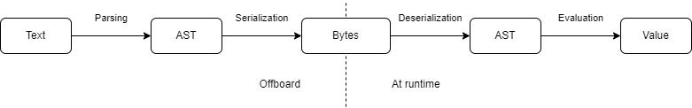

.. _veescript:

VEE Script
==========

Introduction
------------

VEE Script is a scripting language supported on MICROEJ VEE.

Its syntax is a subset of JavaScript.
This subset includes most expressions but excludes statements and blocks.

The strengths of VEE Script are its low footprint, its optimized performance, its customizable semantics and its ability to evaluate expressions depending on the runtime context.

To have the best runtime performance, expressions are preprocessed offboard.
During this phase, expressions are parsed, converted into `ASTs <https://en.wikipedia.org/wiki/Abstract_syntax_tree>`_ and serialized into a binary file.
At runtime, the ASTs are deserialized from the binary file and the expressions can be evaluated efficiently.

    Preprocessing and Interpretation Flow

VEE Script can be used for various use cases, including the design and rendering of dynamic GUIs and real-time information displays.
For instance, VEE Script is currently used in the VEE Wear Kernel to design and render watchfaces.

Tags and Functions
------------------

VEE Script introduces tags and functions, which can be evaluated to different values depending on the runtime context.
For example, a "*current time*" tag or a "*generate random value*" function would return a different value every time they are interpreted.

Moreover, tags and functions semantics are defined by the product.
This allows every product to define its own `DSL <https://en.wikipedia.org/wiki/Domain-specific_language>`_, specific to the type of device and to its unique features.
For example, a smartwatch could introduce a tag for battery level while a washing machine could introduce a tag for remaining cycle time.

Examples
--------

For example, the following script could be used to display the heart rate:

.. code-block:: javascript

	product.evaluateTag('heart_rate') + ' BPM'

And the following script could be used to animate the position of a widget:

.. code-block:: javascript

	100 * product.applyFunction('sin', product.evaluateTag('current_time') / 1000 * 3.14)

Expression Types
----------------

VEE Script supports the following expression types:

- literal
- unary operation (+, -)
- binary operation (\*, /, %, +, -, <, >, <=, >=, ==, !=, &&, ||)
- conditional (?:)
- tag evaluation
- function application

Value Types
-----------

Once an expression is evaluated, its value has one of the following types:

- boolean
- number
- string

Language Syntax
---------------

The scripting language is a subset of JavaScript.
Its syntax and semantics are specified by `ECMAScript 5.1 <https://262.ecma-international.org/5.1/>`_.

The following table summarizes the grammar rules of the language:

.. list-table::
	:widths: auto
	:header-rows: 1

	*	- Grammar Rule
		- Example
		- Expression Type
	*	- *<boolean>*
		- *true*
		- Boolean literal
	*	- *<number>*
		- *3.5*
		- Number literal
	*	- *'<string>'*
		- *'hello world'*
		- String literal
	*	- *<operator> <expression>*
		- *-10*
		- Unary operation
	*	- *<expression> <operator> <expression>*
		- *1 + 2*
		- Binary operation
	*	- *<expression> ? <expression> : <expression>*
		- *2 > 1 ? 5 : 10*
		- Conditional
	*	- *product.evaluateTag('<tag>')*
		- *product.evaluateTag('battery')*
		- Tag evaluation
	*	- *product.applyFunction('<function>', [expressions])*
		- *product.applyFunction('sqrt', 9)*
		- Function application
	*	- *product.constants.<constant>*
		- *product.constants.pi*
		- Literal

Language Configuration
----------------------

Since the semantics of the language depend on the product, the expression parser and interpreter must be configured.

The following information must be supplied to the parser:

- the name and value of every constant
- the name of every tag
- the name of every function

The following information must be supplied to the interpreter:

- the semantics of every tag
- the semantics of every function

Evaluation
----------

The VEE Script parser and interpreter are available on demand.
You can contact :ref:`MicroEJ Support<get_support>` to evaluate this solution.

..
   | Copyright 2008-2024, MicroEJ Corp. Content in this space is free 
   for read and redistribute. Except if otherwise stated, modification 
   is subject to MicroEJ Corp prior approval.
   | MicroEJ is a trademark of MicroEJ Corp. All other trademarks and 
   copyrights are the property of their respective owners.
