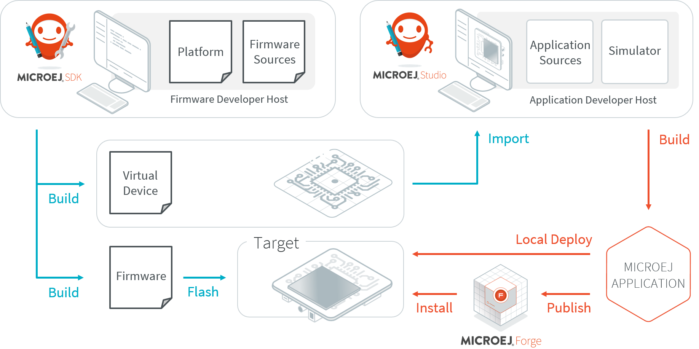

MicroEJ Overview
################

.. _section.microej.studio:

MicroEJ Editions
================

MicroEJ offers a comprehensive toolset to build the embedded software of
a device. The toolset covers two levels in device software development:

-  MicroEJ SDK for device firmware development

-  MicroEJ Studio for application development

The firmware will generally be produced by the device OEM, it includes
all device drivers and a specific set of MicroEJ functionalities useful
for application developers targeting this device.

   MicroEJ Development Tools Overview

Using the MicroEJ SDK tool, a firmware developer will produce two
versions of the MicroEJ binary, each one able to run applications
created with the MicroEJ Studio tool:

-  A MicroEJ Firmware binary to be flashed on OEM devices;

-  A Virtual Device which will be used as a device simulator by
   application developers.

Using the MicroEJ Studio tool, an application developer will be able to:

-  Import Virtual Devices matching his target hardware in order to
   develop and test applications on the simulator;

-  Deploy the application locally on an hardware device equipped with
   the MicroEJ firmware;

-  Package and publish the application on a MicroEJ Forge Instance,
   enabling remote end users to install it on their devices. For more
   information about MicroEJ Forge, please consult
   :http:`https://www.microej.com/product/forge`.

.. _section.firmware:

MicroEJ Firmware
================

.. _section.bootable.binary:

Bootable Binary with Core Services
----------------------------------

A MicroEJ Firmware is a binary software program that can be programmed
into the flash memory of a device. A MicroEJ Firmware includes an
instance of a MicroEJ runtime linked to:

-  underlying native libraries and BSP + RTOS,

-  MicroEJ libraries and application code (C and Java code).

.. figure:: images/firmware.png
   :alt: MicroEJ Firmware Architecture
   :align: center

   MicroEJ Firmware Architecture

.. _section.javadoc:

Specification
-------------

The set of libraries included in the firmware and its dimensioning
limitations (maximum number of simultaneous threads, open connections,
…) are firmware specific. Please refer to
:http:`https://developer.microej.com/5/getting-started-studio.html` for
evaluation firmware release notes.

..
   | Copyright 2008-2020, MicroEJ Corp. Content in this space is free 
   for read and redistribute. Except if otherwise stated, modification 
   is subject to MicroEJ Corp prior approval.
   | MicroEJ is a trademark of MicroEJ Corp. All other trademarks and 
   copyrights are the property of their respective owners.
