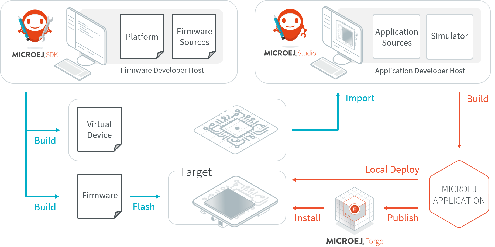
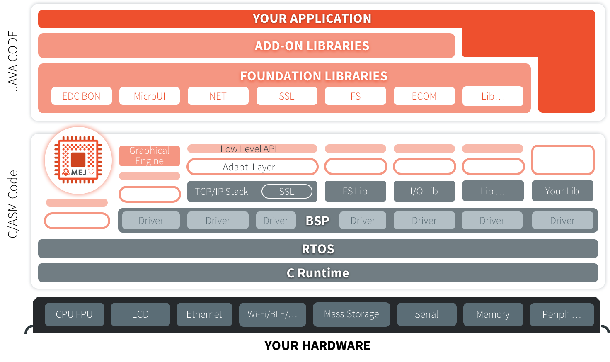
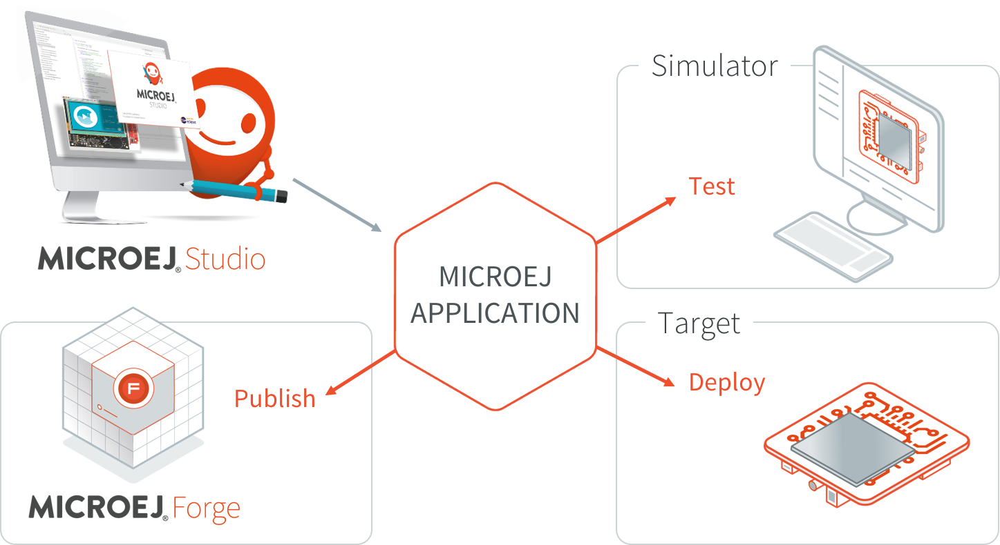
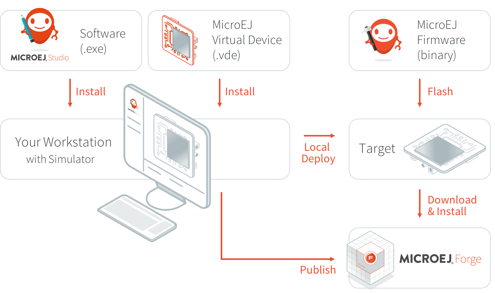

MicroEJ Overview
################

.. _section.microej.studio:

MicroEJ Editions
================

MicroEJ offers a comprehensive toolset to build the embedded software of
a device. The toolset covers two levels in device software development:

-  MicroEJ SDK for device firmware development

-  MicroEJ Studio for application development

The firmware will generally be produced by the device OEM, it includes
all device drivers and a specific set of MicroEJ functionalities useful
for application developers targeting this device.

   MicroEJ Development Tools Overview

Using the MicroEJ SDK tool, a firmware developer will produce two
versions of the MicroEJ binary, each one able to run applications
created with the MicroEJ Studio tool:

-  A MicroEJ Firmware binary to be flashed on OEM devices;

-  A Virtual Device which will be used as a device simulator by
   application developers.

Using the MicroEJ Studio tool, an application developer will be able to:

-  Import Virtual Devices matching his target hardware in order to
   develop and test applications on the simulator;

-  Deploy the application locally on an hardware device equipped with
   the MicroEJ Firmware;

-  Package and publish the application on a MicroEJ Forge Instance,
   enabling remote end users to install it on their devices. For more
   information about MicroEJ Forge, please consult
   :http:`https://www.microej.com/product/forge`.

.. _section.firmware:

MicroEJ Firmware
================

.. _section.bootable.binary:

Bootable Binary with Core Services
----------------------------------

A MicroEJ Firmware is a binary software program that can be programmed
into the flash memory of a device. A MicroEJ Firmware includes an
instance of a MicroEJ runtime linked to:

-  underlying native libraries and BSP + RTOS,

-  MicroEJ libraries and application code (C and Java code).

   MicroEJ Firmware Architecture

.. _section.javadoc:

Specification
-------------

The set of libraries included in the firmware and its dimensioning
limitations (maximum number of simultaneous threads, open connections,
…) are firmware specific. Please refer to
:http:`https://developer.microej.com/5/getting-started-studio.html` for
evaluation firmware release notes.

Introducing MicroEJ SDK
=======================

MicroEJ SDK provides tools based on Eclipse to develop software
applications for MicroEJ-ready devices. MicroEJ SDK allows application
developers to write MicroEJ applications and run them on a virtual
(simulated) or real device.

This document is a step-by-step introduction to application development
with MicroEJ SDK. The purpose of MicroEJ SDK is to develop for targeted
MCU/MPU computers (IoT, wearable, etc.) and it is therefore a
cross-development tool.

Unlike standard low-level cross-development tools, MicroEJ SDK offers
unique services like hardware simulation and local deployment to the
target hardware.

Application development is based on the following elements:

-  MicroEJ SDK, the integrated development environment for writing
   applications. It is based on Eclipse and is relies on the integrated
   Java compiler (JDT). It also provides a dependency manager for
   managing MicroEJ Libraries (see :ref:`section.ivy.dependency.manager`).
   The current version of MicroEJ SDK is built on top of Eclipse Oxygen
   (:http:`https://www.eclipse.org/oxygen/`).

-  MicroEJ Platform, a software package including the resources and
   tools required for building and testing an application for a specific
   MicroEJ-ready device. MicroEJ platforms are imported into MicroEJ SDK
   within a local folder called MicroEJ Platforms repository. Once a
   MicroEJ Platform is imported, an application can be launched and
   tested on simulator. It also provides a means to locally deploy the
   application on a MicroEJ-ready device.

-  MicroEJ-ready device, an hardware device that will be programmed with
   a MicroEJ Firmware. A MicroEJ Firmware is a binary instance of
   MicroEJ runtime for a target hardware board.

Starting from scratch, the steps to go through the whole process are
detailed in the following sections of this chapter :

-  Download and install a MicroEJ Platform

-  Build and run your first application on simulator

-  Build and run your first application on target hardware

Introducing MicroEJ Studio and Virtual Devices
==============================================

MicroEJ Studio provides tools based on Eclipse to develop software
applications for MicroEJ-ready devices. MicroEJ Studio allows
application developers to write MicroEJ applications, run them on a
virtual (simulated) or real device, and publish them to a MicroEJ Forge
instance.

This document is an introduction to application development with MicroEJ
Studio. The purpose of MicroEJ Studio is to develop for targeted MCU/MPU
computers (IoT, wearable, etc.) and it is therefore a cross-development
tool.

Unlike standard low-level cross-development tools, MicroEJ Studio offers
unique services like hardware simulation, deployment to the target
hardware and final publication to a MicroEJ Forge instance.

Application development is based on the following elements:

-  MicroEJ Studio, the integrated development environment for writing
   applications. It is based on Eclipse and relies on the integrated
   Java compiler (JDT). It also provides a dependency manager for
   managing MicroEJ Libraries (see :ref:`section.ivy.dependency.manager`).
   The current version of MicroEJ Studio is built on top of Eclipse Oxygen
   (:http:`https://www.eclipse.org/oxygen/`).

-  MicroEJ Virtual Device, a software package including the resources
   and tools required for building and testing an application for a
   specific MicroEJ-ready device. A Virtual Device will simulate all
   capabilities of the corresponding hardware board:

   -  Computation and Memory,

   -  Communication channels (e.g. Network, USB ...),

   -  Display,

   -  User interaction.

   Virtual Devices are imported into MicroEJ Studio within a local
   folder called MicroEJ Repository. Once a Virtual Device is imported,
   an application can be launched and tested on Simulator. It also
   provides a mean to locally deploy the application on a MicroEJ-ready
   device.

-  MicroEJ-ready device, a hardware device that has been previously
   programmed with a MicroEJ Firmware. A MicroEJ Firmware is a binary
   instance of MicroEJ runtime for a target hardware board.
   MicroEJ-ready devices are built using MicroEJ SDK. MicroEJ Virtual
   Devices and MicroEJ Firmwares share the same version (there is a 1:1
   mapping).

The following figure gives an overview of MicroEJ Studio possibilities:

   MicroEJ Application Development Overview

Perform Online Getting Started
==============================

MicroEJ Studio Getting Started is available on
:http:`https://developer.microej.com/5/getting-started-studio.html`.

Starting from scratch, the steps to go through the whole process are:

#. Setup a board and test a MicroEJ Firmware:

   -  Select between one of the available boards;

   -  Download and install a MicroEJ Firmware on the target hardware;

   -  Deploy and run a MicroEJ demo on board.

#. Setup and learn to use development tools:

   -  Download and install MicroEJ Studio;

   -  Download and install the corresponding Virtual Device for the
      target hardware;

   -  Download, build and run your first application on Simulator;

   -  Build and run your first application on target hardware.

The following figure gives an overview of the MicroEJ software
components required for both host computer and target hardware:

   MicroEJ Studio Development Imported Elements

..
   | Copyright 2008-2020, MicroEJ Corp. Content in this space is free 
   for read and redistribute. Except if otherwise stated, modification 
   is subject to MicroEJ Corp prior approval.
   | MicroEJ is a trademark of MicroEJ Corp. All other trademarks and 
   copyrights are the property of their respective owners.
