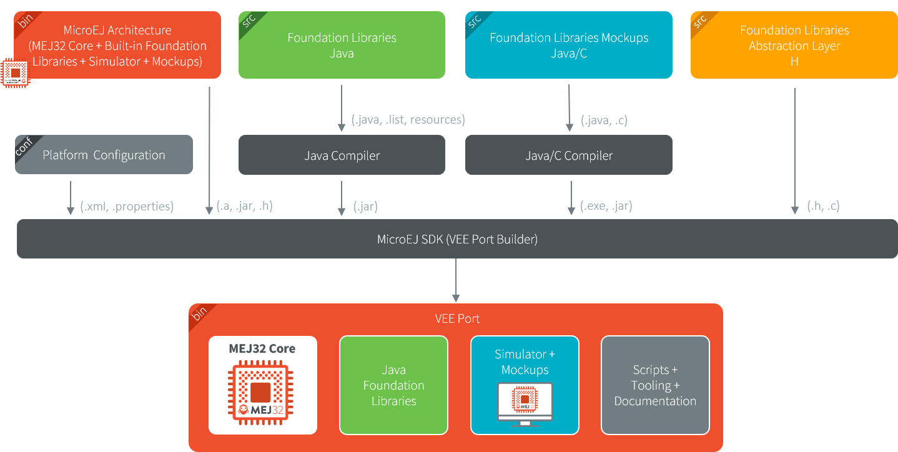
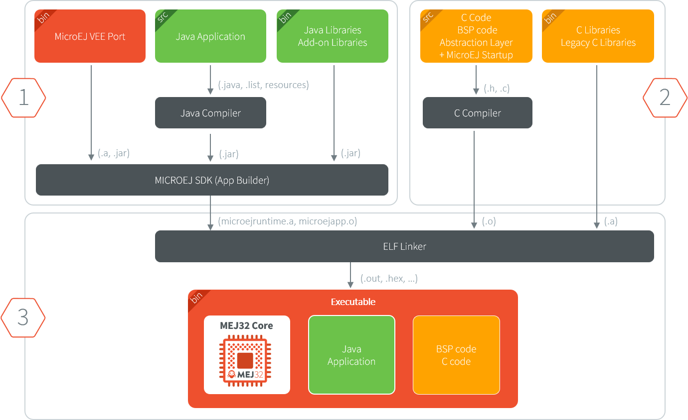

.. _executableBuildWorkflow:

Detailed Executable Build Workflow
==================================

An Executable is built from several input resources and tools.
Each component has dependencies and requirements that must be
carefully respected in order to build an Executable.

This document describes the components, their dependencies and the
process involved in the build of an Executable.

Good knowledge of the :ref:`chapter-glossary` is required.

The Components
--------------

As depicted in the following image, several resources and tools are
used to build an Executable.

.. image:: images/qa_resources-v3.PNG
    :scale: 70
    :align: center

Architecture
~~~~~~~~~~~~

A :ref:`MicroEJ Architecture <architecture_overview>` contains the runtime port to a target
instruction set (ISA), a C compiler (CC) and Foundation Libraries.

Architectures are distributed in two versions:

* :ref:`Evaluation Architectures <evaluation_license>`: license with runtime limitations (explained in the :ref:`Application Developer Guide <limitations>`).

* :ref:`Production Architectures <production_license>`: license suitable for production.

A selection of supported embedded Architectures can be found here:
`<https://developer.microej.com/mej32-embedded-runtime-architectures/>`_

The Architecture is either provided from:

* :ref:`MicroEJ Central Repository <central_repository>`, for Evaluation Architectures only.

* :ref:`MicroEJ Support team <get_support>` or your MicroEJ sales representative, for Production Architectures only.

.. note::
  
  Ask MicroEJ sales or support team if the requested architecture is not listed as available.

VEE Port Sources
~~~~~~~~~~~~~~~~

A VEE Port is an implementation of :ref:`vee` for a target device, it includes:

* the Architecture and :ref:`pack_overview`,
* the Abstraction Layers implementations,
* the :ref:`Simulator <simulator_principle>` and its associated :ref:`Mocks <mock>`,
* a C Board Support Package (BSP) with C drivers and an optional RTOS.

The VEE Port sources contain the following projects:

* ``<veeport>-configuration``: The VEE Port Configuration project.
* ``<veeport>-bsp``: The C code for the board-specific files
  (drivers).
* ``<veeport>-fp``: Front Panel mockup for the simulator.

Follow the :ref:`sdk_6_getting_started` to learn how to import an existing VEE Port,
and :ref:`new_platform_creation` to learn how to create a VEE Port project.

Depending on the project's requirements, the VEE Port can
be connected in various ways to the BSP; see :ref:`bsp_connection` for
more information on how to do it.

Application
~~~~~~~~~~~

An Application is a software program that runs on a MICROEJ VEE, it is
written in Managed Code (Java, Javascript, managed-C, etc.).

An Application project can:

1. either run on:

  * the Simulator (computer desktop),
  * a device (actual embedded hardware).

2. be configured to:

  * use Foundation and Add-On Libraries (GUI, Networking, Filesystem, etc.),
  * adapt to the device requirements (e.g. heap size configuration),
  * etc.

To run on a device, the application is compiled and optimized for a
specific VEE Port.  It generates a ``microejapp.o`` (native
object code) linked with the ``<veeport>-bsp`` project.

Refer to the :ref:`sdk_6_user_guide` for more information on how to
create/import and run an Application.

Refer to :ref:`application-developer-guide` for more information on how to develop and configure an Application.

C Toolchain (GCC, KEIL, IAR, …)
~~~~~~~~~~~~~~~~~~~~~~~~~~~~~~~

The C Toolchain is used to compile and link the following files into the final executable
(binary, hex, elf, … that will be programmed on the hardware):

  * the ``microejapp.o`` (application),
  * the ``microejruntime.lib`` or ``microejruntime.a`` (MICROEJ VEE runtime),
  * the BSP C files (C application files and Board Support Package).

Module Repository
~~~~~~~~~~~~~~~~~

A Module Repository provides modules required to build
VEE Ports and Applications.

By default, MICROEJ SDK is configured to import modules from online repositories hosted by MicroEJ Corp.:
* :ref:`central_repository`
* :ref:`developer_repository`

Optionally, an Offline Repository can be used to extend online repositories (``.zip``).
See :ref:`module_repositories` for more information.

Dependencies Between Components
~~~~~~~~~~~~~~~~~~~~~~~~~~~~~~~

* An Architecture targets a specific instruction set (ISA) and
  a specific C compiler (CC).

  * The C toolchain used for the Architecture must be the same
    as the one used to compile and link the BSP project.

* A VEE Port consists of the aggregation of both an Architecture and a BSP with a C toolchain.

  * Changing either the Architecture or the C toolchain
    results in a change of the VEE Port.

* An Application is independent of the Architecture.

  * It can run on any VEE Port as long the VEE Port provides the required APIs.

  * To run an Application on a new device, create a new
    VEE Port for this device with the exact
    same features. The Application will not require any change.

How to Build
------------

The process of building an Executable is two-fold:

1. Build a VEE Port,
2. Compile/link the application and BSP using the C toolchain.

.. note::

   The Application will also run on the Simulator using the mocks provided by the VEE Port.

Build a VEE Port
~~~~~~~~~~~~~~~~

The next schema presents the components and process to build a VEE Port.

Build an Executable
~~~~~~~~~~~~~~~~~~~

The next schema presents the build flow of a Mono-Sandbox
Executable (previously known as a MicroEJ Single-app Firmware). The steps
are:

1. Build the Application using the SDK (generates a ``microejapp.o`` file).

2. Compile the BSP C sources using the C toolchain (generates ``.o`` files).

3. Link the BSP files (``.o``), the Application (``microejapp.o``) and
   the VEE Port runtime library (``microejruntime.a``) using the C toolchain to produce the
   final executable (ELF or binary, for example ``application.out``).

See :ref:`bsp_connection` for more information on how to connect a VEE Port to a BSP.

Dependencies Between Processes
~~~~~~~~~~~~~~~~~~~~~~~~~~~~~~

* Rebuild the VEE Port:

  * When the Architecture (``.xpf``) changes.

  * When a :ref:`Pack <pack_overview>` provided by MicroEJ (``.xpfp``) changes.

  * When a Foundation Library changes, either when

    * The public API (``.java`` or ``.h``) changes.

    * The front-panel or mock implementation (``.java``) changes.

* Rebuild of the VEE Port is not required:

  * When the implementation (``.c``) of a Foundation Library changes.

  * When the BSP (``.c``) changes.

  * When the Application changes.

* Rebuild the Application:

  * When its code changes.

  * When the VEE Port changes.

* Rebuild the BSP:

  * When its code changes.

  * When the VEE Port changes.

* Rebuild the Executable:

  * When the Application (``microejapp.o``) changes.

  * When the BSP (``*.o``) changes.

  * When the VEE Port (``microejruntime.a``) changes.

..
   | Copyright 2021-2024, MicroEJ Corp. Content in this space is free 
   for read and redistribute. Except if otherwise stated, modification 
   is subject to MicroEJ Corp prior approval.
   | MicroEJ is a trademark of MicroEJ Corp. All other trademarks and 
   copyrights are the property of their respective owners.