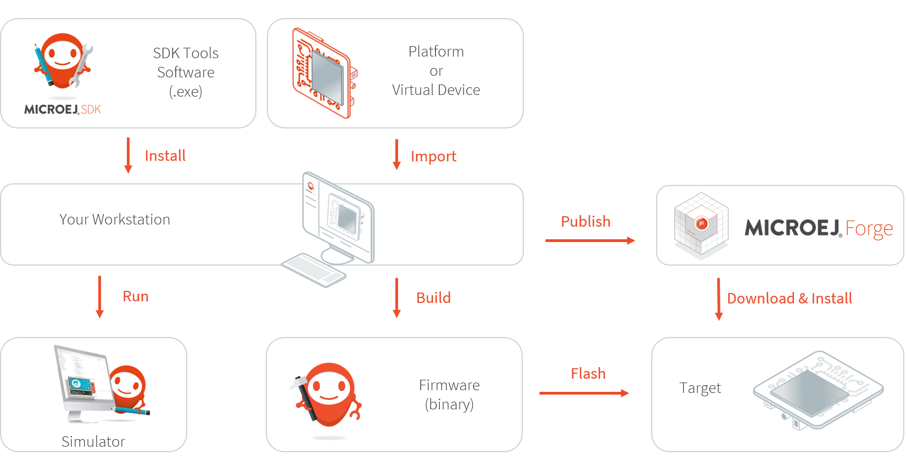

Getting Started
===============

MicroEJ Studio Getting Started is available on
`<https://developer.microej.com/5/getting-started-studio.html>`_.

Starting from scratch, the steps to go through the whole process are:

#. Setup a board and test a MicroEJ Firmware:

   -  Select between one of the available boards;

   -  Download and install a MicroEJ Firmware on the target hardware;

   -  Deploy and run a MicroEJ demo on board.

#. Setup and learn to use development tools:

   -  Download and install MicroEJ Studio;

   -  Download and install the corresponding Virtual Device for the
      target hardware;

   -  Download, build and run your first application on Simulator;

   -  Build and run your first application on target hardware.

The following figure gives an overview of the MicroEJ software
components required for both host computer and target hardware:

   MicroEJ Studio Development Imported Elements

..
   | Copyright 2008-2022, MicroEJ Corp. Content in this space is free 
   for read and redistribute. Except if otherwise stated, modification 
   is subject to MicroEJ Corp prior approval.
   | MicroEJ is a trademark of MicroEJ Corp. All other trademarks and 
   copyrights are the property of their respective owners.
