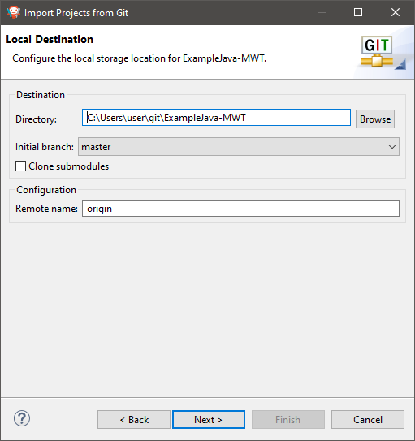

.. _github:

GitHub Repositories
===================

A large number of examples, libraries, demos and tools are shared on MicroEJ GitHub account: https://github.com/MicroEJ. 

Most of these GitHub repositories contain projects ready to be imported in MicroEJ SDK.

Repository Import
-----------------

This section explains the steps to import a Github repository in MicroEJ SDK, illustrated with the `MWT Examples repository <https://github.com/MicroEJ/ExampleJava-MWT>`_.

.. note::

   MicroEJ SDK Distribution includes the `Eclipse plugin for Git <https://www.eclipse.org/egit/>`_.

First, from the GitHub page, copy the repository URI (HTTP address) from the dedicated field in the right menu (highlighted in red):

In MicroEJ SDK, to clone and import the project from the remote Git repository into the MicroEJ workspace, select :guilabel:`File` > :guilabel:`Import` > :guilabel:`Git` > :guilabel:`Projects from Git` wizard.

Click :guilabel:`Next`, select :guilabel:`Clone URI`, click :guilabel:`Next` and paste the remote repository address in the :guilabel:`URI` field. For this repository, the address is `<https://github.com/MicroEJ/ExampleJava-MWT.git>`_. If the HTTP address is a valid repository, the other fields are filed automatically. 

Click :guilabel:`Next`, select the ``master`` branch, click :guilabel:`Next` and accept the proposed `Local Destination` by clicking :guilabel:`Next` once again.

Click :guilabel:`Next` once more and finally :guilabel:`Finish`. The ``Package Explorer`` view now contains the imported projects.

If you want to import projects from another (GitHub) repository, you simply have to do the same procedure using the Git URL of the desired repository.

MicroEJ GitHub Badges
---------------------

MicroEJ GitHub Badges are badges embedded in a README at the root of the
repository. They allow to provide the compatibilities of the repository at a
quick glance. Three types are currently used Architecture, SDK and UI badges.
The color of the badge has the following meaning:

- Green means a current supported version: |badge-green|
- Orange means a still supported version that will be deprecated in the future: |badge-orange|
- Gray means a deprecated version: |badge-grey|

..
   | Copyright 2008-2020, MicroEJ Corp. Content in this space is free 
   for read and redistribute. Except if otherwise stated, modification 
   is subject to MicroEJ Corp prior approval.
   | MicroEJ is a trademark of MicroEJ Corp. All other trademarks and 
   copyrights are the property of their respective owners.
