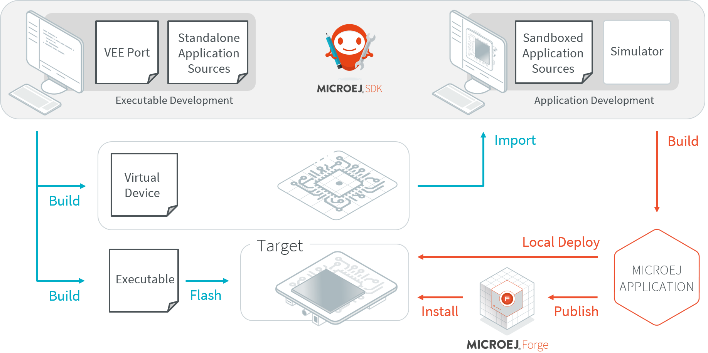

.. _overview:

Overview
========

What is MicroEJ?
----------------

MicroEJ (pronounced “micro-EDGE”) is a software vendor of cost-driven solutions for embedded and IoT devices.

The MicroEJ solution is made up of two products:

- MICROEJ VEE (Virtual Execution Environment) is an application container for resource-constrained embedded devices running on microcontrollers or microprocessors. 
  It allows devices to run multiple and mixed managed code (Java, JavaScript, ...) and C software applications.
- MICROEJ SDK allows developers to develop applications in Managed Code and deploy them to resource-constrained devices, such as microcontrollers.

.. _vee:

MICROEJ VEE
-----------

MICROEJ VEE provides a fully configurable set of services that can be expanded, including but not limited to:

- a secure multi-application framework,
- a GUI framework (includes widgets),
- a network framework with security (SSL/TLS, HTTPS, REST, MQTT, ...),
- a storage framework (file system),
- a Java Cryptography Architecture (JCA) implementation.

.. figure:: images/vee.png
   :alt: MICROEJ VEE Overview
   :align: center
   :scale: 80%

   MICROEJ VEE Overview

For more information about our Supported Processor Architectures, visit the `Supported Hardware <https://developer.microej.com/supported-hardware/>`_ page.

MICROEJ SDK
-----------

MICROEJ SDK offers a comprehensive toolset to build the software for embedded devices.

The SDK covers two levels in device software development:

-  Device integration and porting (adapting MICROEJ VEE to run on the target device).
-  Application development.

Using the SDK, an application developer is able to:

-  Develop and test applications on the Simulator.
-  Deploy the application locally on the device.
-  Package and publish the application on a repository or an application store,
   enabling remote end users to install it on their devices.

The SDK produces two versions of the application build:

- An Executable binary to be deployed on the device. It includes MICROEJ VEE, 
  all device drivers and a specific set of functionalities useful
  for application developers targeting this device.

- A Virtual Device which is used as a device simulator by
  application developers, acting as a bridge to other stakeholders, including marketing teams, translators, and project managers.

   SDK Workflow Overview

The following diagram outlines the SDK content. Please refer to the :ref:`sdk_6_user_guide` chapter for more details on the SDK and its usage.

.. figure:: images/sdk_overview.png
   :alt: SDK Ecosystem Overview
   :align: center
   :scale: 80%

   SDK Ecosystem Overview

.. _executableBuildWorkflow:

Executable Build Workflow
-------------------------

An Executable is built from several input resources and tools.
Each component has dependencies and requirements that must be
carefully respected in order to build an Executable.

.. image:: images/qa_resources-v3.PNG
    :scale: 70
    :align: center

..
   | Copyright 2008-2024, MicroEJ Corp. Content in this space is free 
   for read and redistribute. Except if otherwise stated, modification 
   is subject to MicroEJ Corp prior approval.
   | MicroEJ is a trademark of MicroEJ Corp. All other trademarks and 
   copyrights are the property of their respective owners.
