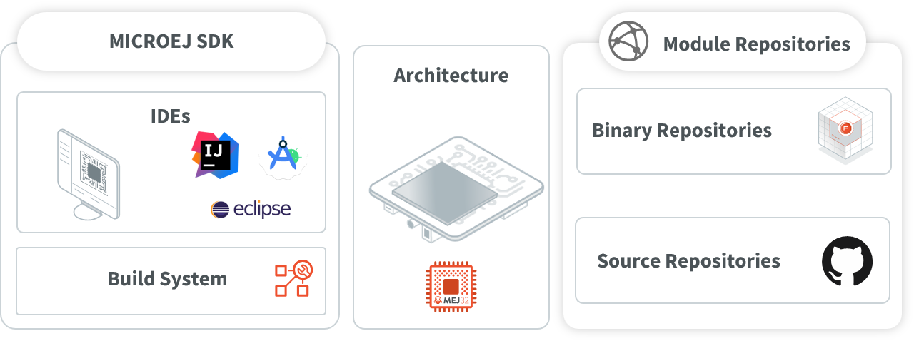

.. _overview:

Introduction
============

What is MicroEJ?
----------------

MicroEJ (pronounced “micro-EDGE”) is a software vendor of cost-driven solutions for embedded and IoT devices.

MICROEJ SDK allows developers to develop applications in Managed Code and deploy them to resource-constrained devices, such as microcontrollers.

.. _vee:

MICROEJ VEE
-----------

MicroEJ VEE (Virtual Execution Environment) is an application container for resource-constrained embedded devices running on microcontrollers or microprocessors. 
It allows devices to run multiple and mixed managed code (Java, JavaScript, ...) and C software applications.

MicroEJ VEE provides a fully configurable set of services that can be expanded, including:

- a secure multi-application framework,
- a GUI framework (includes widgets),
- a network connection with security (SSL/TLS, HTTPS, REST, MQTT, ...),
- a storage framework (file system)
- a Java Cryptography Architecture (JCA) implementation.

   MICROEJ VEE Overview

For more information about our Supported Processor Architectures, visit the `Supported Hardware <https://developer.microej.com/supported-hardware/>`_ page.

MICROEJ SDK
-----------

MICROEJ SDK offers a comprehensive toolset to build the embedded software of
a device. The SDK covers two levels in device software development:

-  Device Firmware development
-  Application development

The firmware will generally be produced by the device OEM, it includes
all device drivers and a specific set of MicroEJ functionalities useful
for application developers targeting this device.

.. figure:: images/toolchain.png
   :alt: SDK Workflow Overview
   :scale: 55%
   :align: center

   SDK Workflow Overview

Using the SDK, a firmware developer will produce two
versions of the MicroEJ binary, each one able to run applications:

-  An Executable binary to be flashed on OEM devices;

-  A Virtual Device which will be used as a device simulator by
   application developers.

Using the SDK, an application developer will be able to:

-  Import Virtual Devices matching his target hardware in order to
   develop and test applications on the Simulator;

-  Deploy the application locally on a hardware device equipped with
   the Firmware;

-  Package and publish the application on a MicroEJ Forge Instance,
   enabling remote end users to install it on their devices. For more
   information about MicroEJ Forge, please consult
   `<https://www.microej.com/product/forge>`_.

The following diagram outlines the SDK content. Please refer to the :ref:`sdk_6_user_guide` chapter for more details on the SDK and its usage.

   SDK Components Overview

Executable Build Workflow
-------------------------

An Executable is built from several input resources and tools.
Each component has dependencies and requirements that must be
carefully respected in order to build an Executable.

.. image:: images/qa_resources-v3.PNG
    :scale: 70
    :align: center

For more information about the build process of an Executable, refer to the :ref:`executableBuildWorkflow` documentation. 

.. toctree::
   :hidden:
  
   executableBuildWorkflow

..
   | Copyright 2008-2024, MicroEJ Corp. Content in this space is free 
   for read and redistribute. Except if otherwise stated, modification 
   is subject to MicroEJ Corp prior approval.
   | MicroEJ is a trademark of MicroEJ Corp. All other trademarks and 
   copyrights are the property of their respective owners.
