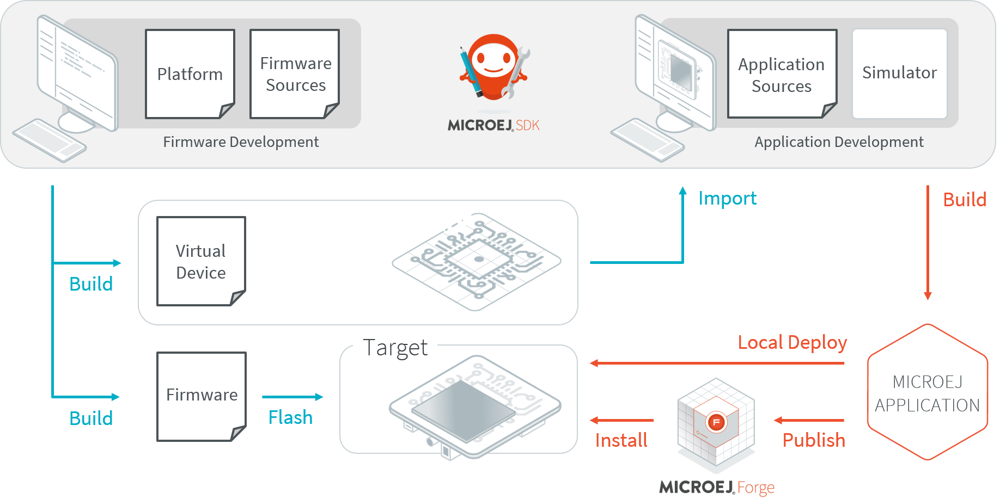
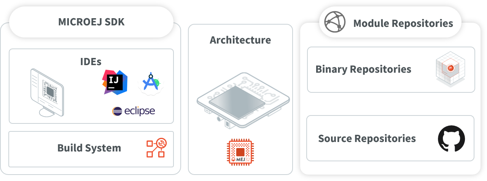

MICROEJ SDK
===========

MICROEJ SDK offers a comprehensive toolset to build the embedded software of
a device. The SDK covers two levels in device software development:

-  Device Firmware development
-  Application development

The firmware will generally be produced by the device OEM, it includes
all device drivers and a specific set of MicroEJ functionalities useful
for application developers targeting this device.

   SDK Workflow Overview

Using the SDK, a firmware developer will produce two
versions of the MicroEJ binary, each one able to run applications:

-  A Firmware binary to be flashed on OEM devices;

-  A Virtual Device which will be used as a device simulator by
   application developers.

Using the SDK, an application developer will be able to:

-  Import Virtual Devices matching his target hardware in order to
   develop and test applications on the Simulator;

-  Deploy the application locally on an hardware device equipped with
   the Firmware;

-  Package and publish the application on a MicroEJ Forge Instance,
   enabling remote end users to install it on their devices. For more
   information about MicroEJ Forge, please consult
   `<https://www.microej.com/product/forge>`_.

The following diagram outlines the SDK content. Please refer to the :ref:`sdk_user_guide` chapter for more details ont the SDK and its usage.

   SDK Components Overview

..
   | Copyright 2008-2022, MicroEJ Corp. Content in this space is free 
   for read and redistribute. Except if otherwise stated, modification 
   is subject to MicroEJ Corp prior approval.
   | MicroEJ is a trademark of MicroEJ Corp. All other trademarks and 
   copyrights are the property of their respective owners.