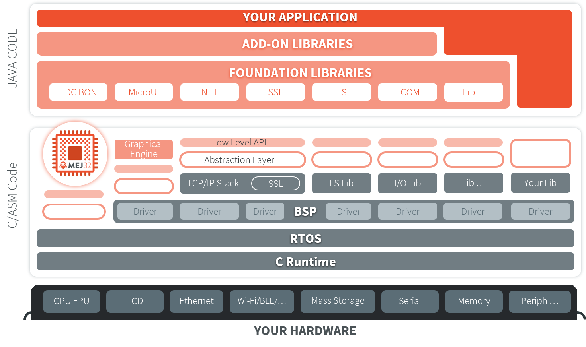

.. _section.firmware:

MICROEJ VEE
===========

MicroEJ VEE (Virtual Execution Environment) is an applications container for resource-constrained embedded devices running on microcontrollers or microprocessors. 
It allows devices to run multiple and mixed managed code (Java, JavaScript) and C software applications.

MicroEJ VEE provides a fully configurable set of services that can be expanded, including:

- a secure multi-application framework,
- a GUI framework (includes widgets),
- a network connection with security (SSL/TLS, HTTPS, REST, MQTT, ...),
- a storage framework (file system)
- a Java Cryptography Architecture (JCA) implementation.

   MICROEJ VEE Overview

..
   | Copyright 2008-2022, MicroEJ Corp. Content in this space is free 
   for read and redistribute. Except if otherwise stated, modification 
   is subject to MicroEJ Corp prior approval.
   | MicroEJ is a trademark of MicroEJ Corp. All other trademarks and 
   copyrights are the property of their respective owners.
